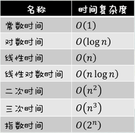

| 排序方法     | 时间复杂度(平均) | 时间复杂度(最坏) | 时间复杂度(最好) | 空间复杂度 | 稳定性 | 复杂性 |
| ------------ | ---------------- | ---------------- | ---------------- | ---------- | ------ | ------ |
| 直接插入排序 | O(n^2^)          | O(n^2^)          | O(n)             | O(1)       | 稳定   | 简单   |
| 希尔排序     | O(nlog~2~n)      | O(n^2^)          | O(n^1.3^)        | O(1)       | 不稳定 | 较复杂 |
| 直接选择排序 | O(n^2^)          | O(n^2^)          | O(n^2^)          | O(1)       | 不稳定 | 简单   |
| 堆排序       | O(nlog~2~n)      | O(nlog~2~n)      | O(nlog~2~n)      | O(1)       | 不稳定 | 较复杂 |
| 冒泡排序     | O(n^2^)          | O(n^2^)          | O(n)             | O(1)       | 稳定   | 简单   |
| 快速排序     | O(nlog~2~n)      | O(n^2^)          | O(nlog~2~n)      | O(nlog2n)  | 不稳定 | 较复杂 |
| 归并排序     | O(nlog~2~n)      | O(nlog~2~n)      | O(nlog~2~n)      | O(n)       | 稳定   | 较复杂 |
| 基数排序     | O(d(n+r))        | O(d(n+r))        | O(d(n+r))        | O(n+r)     | 稳定   | 较复杂 |



# 直接插入排序(插入排序)

思路: 遍历元素, 将当前元素插入到合适的位置

```js
function insertSort(arr) {
    let j;
    let current;
    for (let i = 1; i < arr.length; i++) {
        current = arr[i];
        j = i - 1;
        while (j >= 0 && arr[j] > current) {
            // 和前面的元素对比
            arr[j + 1] = arr[j];
            j--;
        }
        arr[j + 1] = current;
    }
    return arr;
}
```

# 希尔排序(插入排序)

# 简单选择排序(选择排序)

思想: 不断遍历后面的项目, 找到最小的项目, 替换前面的项目

```js
function selectionSort(arr) {
    let minIndex;
    for (let i = 0; i < arr.length; i++) {
        minIndex = i;
        for (let j = i + 1; j < arr.length; j++) {
            if (arr[j] < arr[minIndex]) {
                minIndex = j;
            }
        }
        [arr[i], arr[minIndex]] = [arr[minIndex], arr[i]];
    }
    return arr;
}
```

# 堆排序(选择排序)

# 冒泡排序(交换排序)

思想: 当前项与后一项比较, 较大的换到后面

-   每一轮可将尚未排序的最大项 放到末尾, 即完成了 1 个数的排序；所以只需 `n - 1` 轮, 即可完成排序
-   元素不需要跟自己比较, 且每轮完成 1 个数的排序, 所以当前轮需要遍历 `n - 1 - 已经遍历的轮数` 个元素

```js
function bubbleSort(arr) {
    for (let i = 0; i < arr.length - 1; i++) {
        // 遍历 n-1 轮
        let isSorted = true; // 默认是排序好的
        for (let j = 0; j < arr.length - 1 - i; j++) {
            // 遍历 n-1-i 个元素
            if (arr[j] > arr[j + 1]) {
                // 如果 [当前项] > [后一项]
                [arr[j], arr[j + 1]] = [arr[j + 1], arr[j]]; // 交换元素
                isSorted = false; // 有元素交换, 就说明没有排序好
            }
        }
        if (isSorted) break;
    }
    return arr;
}
```

> #### 时间复杂度

-   最坏情况: `n - 1` 轮, 每轮都需要交换元素 → (n-1) + (n-2) + … + 1 = n \* (n-1) / 2 → O(n^2^)
-   最好情况: `1` 轮, 遍历 `n - 1` 个元素 → O(n)
-   平均情况: O(n^2^)

# 快速排序(交换排序)

## 基本思想

1. 选择一个基准元素
2. 通过一趟排序将待排序的元素分割成两部分, 其中一部分记录的元素值比基准元素值小, 另一部分记录的元素值比基准值大. 此时基准元素在其排好序后的正确位置
3. 然后分别对这两部分记录用同样的方法继续进行排序, 直到整个序列有序

```js
function quickSort(arr) {
    if (arr.length == 0 || arr.length == 1) {
        return arr;
    }

    let index = Math.floor(arr.length / 2);
    let curItem = arr.splice(index, 1);
    let leftArr = [],
        rightArr = [];

    arr.forEach((item) => {
        if (item <= curItem) {
            leftArr.push(item);
        } else {
            rightArr.push(item);
        }
    });

    return [...quickSort(leftArr), ...curItem, ...quickSort(rightArr)];
}

console.log(quickSort(arr));
```

-   快速排序通常被认为在同数量级的排序方法中平均性能最好的, 时间复杂度 `O(nlog2n)`
-   但若初始序列按关键码有序或基本有序时, 快排序反而蜕化为冒泡排序
-   为改进, 通常以 "三者取中法" 来选取基准记录, 即将排序区间的两个端点与中点三个记录关键码居中的调整为支点记录
-   快速排序是一个不稳定的排序方法

# 归并排序

两两排序, 之后再拿排序好的两组进行两两排序, 直到所有元素都排列完成

# 基数排序
