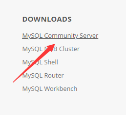
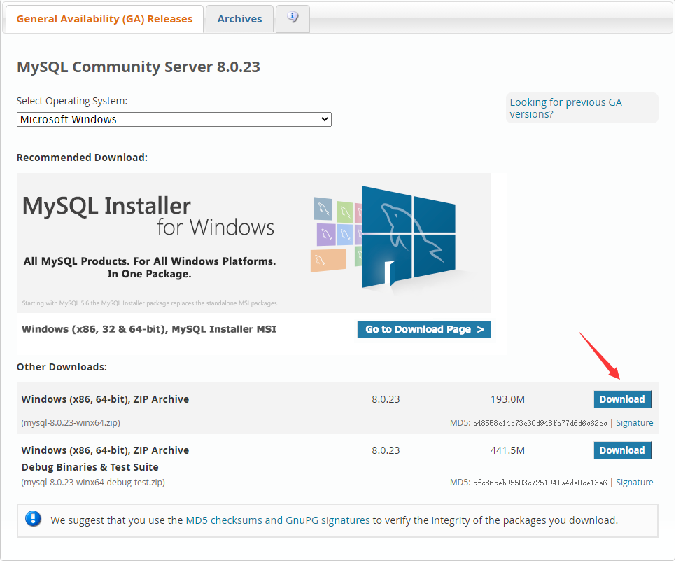
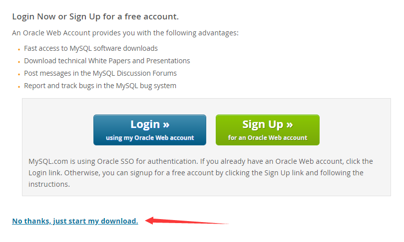
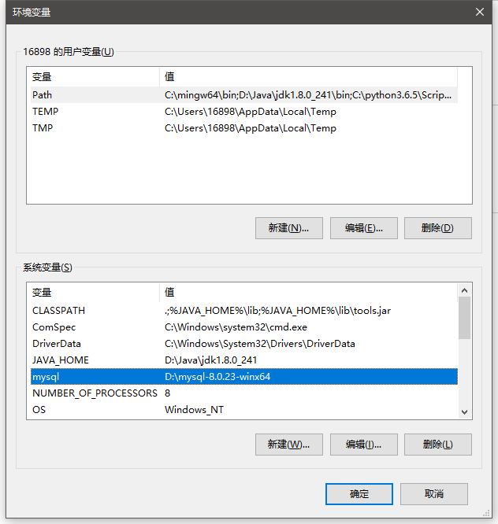
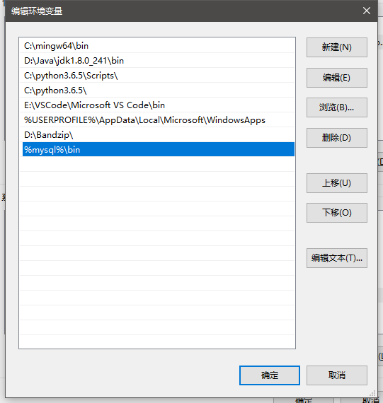

# 下载免安装版 MySQL

1. 打开 MySQL 官网, 拉到最下面选择 MySQL Community Server



2. 下载这个压缩版



3. 选择 No thanks 直接开始下载



4. 下载到指定目录后, 解压

<br><br>

# 配置 MySQL

1.  创建 data 文件夹, 用于存放 mysql 数据

2.  创建 my.ini 并配置

```ini
[mysqld]
# 设置 3306 端口
port=3306
# 设置 mysql 的安装目录  ---是你的文件路径---
basedir=D:\mysql-8.0.35-winx64
# 设置 mysql 数据库的数据的存放目录 ---是你的文件路径data文件夹自行创建---
datadir=D:\mysql-8.0.35-winx64\data
# 允许最大连接数
max_connections=200
# 允许连接失败的次数
max_connect_errors=10
# 服务端使用的字符集默认为 utf8mb4
character-set-server=utf8mb4
# 创建新表时将使用的默认存储引擎
default-storage-engine=INNODB
# 默认使用 "caching_sha2_password" 插件认证
authentication_policy=caching_sha2_password

[mysql]
# 设置 mysql 客户端默认字符集
default-character-set=utf8mb4

[client]
# 设置 mysql 客户端连接服务端时默认使用的端口
port=3306
default-character-set=utf8mb4
```

3.  **以管理员身份运行** cmd

进入 mysql.exe 所在目录:

```bash
C:\Windows\System32> cd D:\mysql-8.0.35-winx64\bin
C:\Windows\System32> D:
```

安装 mysql 服务:

```bash
D:\mysql-8.0.35-winx64\bin> mysqld --install
Service successfully installed.
```

初始化 mysql 服务, 获取原始密码:

```bash
D:\mysql-8.0.35-winx64\bin>mysqld --initialize --console
... [Note] [MY-010454] [Server] A temporary password is generated for root@localhost: xTL0-RQhGir1
```

启动 mysql 服务:

```bash
D:\mysql-8.0.35-winx64\bin>net start mysql
MySQL 服务正在启动 .
MySQL 服务已经启动成功.
```

使用原始密码登录 mysql 服务:

```bash
D:\mysql-8.0.35-winx64\bin>mysql -u root -p
Enter password: ************
Welcome to the MySQL monitor.  Commands end with ; or \g.
......

mysql>
```

修改密码, 这里我将密码设置为 000930:

```sql
mysql> alter user 'root'@'localhost' identified by '000930';
Query OK, 0 rows affected (0.00 sec)
```

退出数据库, 再次登陆验证新密码:

```sql
mysql> \q
Bye
```

```sql
D:\mysql-8.0.35-winx64\bin>mysql -u root -p
Enter password: ******
Welcome to the MySQL monitor.  Commands end with ; or \g.
......

mysql>
```

4.  配置环境变量

新建一个系统变量:



把新建的 mysql 变量添加到 Path 路径变量中:



<br><br>

# 命令参考

1. 安装服务: `mysqld --install`
2. 初始化: `mysqld --initialize --console`
3. 开启服务 (windows): `net start mysql`
4. 关闭服务 (windows): `net stop mysql`
5. 登陆 MySQL: `mysql -u root -p`
6. 修改密码: `alter user 'root'@'localhost' identified by 'your-password';`

<br><br>

# SQL

SQL - Structured Query Language (结构化查询语言), 用于操作 RDBMS - Relational Data Base Management System (关系型数据库管理系统). 当前的关系型数据库都支持 SQL, 也就是说 可以通过 SQL 语言操作 oracle,sql server,mysql 等关系型数据库

-   SQL 代码不区分大小写
-   每行以英文分号 `;` 结尾
-   标识符为特殊字符时, 需要使用 `` 包裹

<br>

**系统数据库**: MySQL 自带的数据库, 一般我们不会操作它们

1. information_schema: 主要存储系统的信息, 如用户信息,权限信息...
2. performance_schema: 主要存储数据库服务器性能参数
3. mysql: 主要存储系统的用户权限信息
4. sys: 系统数据库

<br>

**用户数据库**: 开发者自己创建并使用的数据库

<br>
