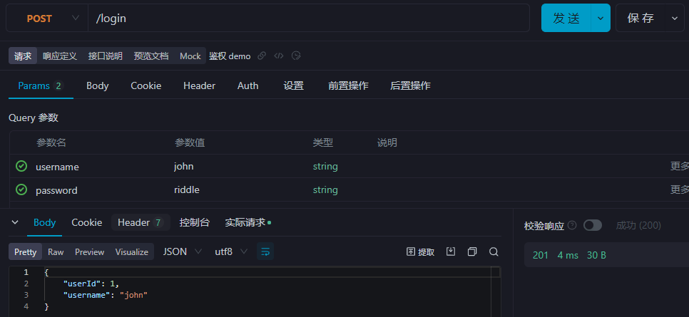
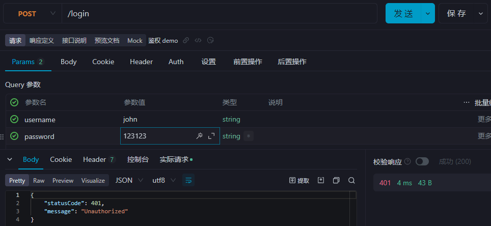
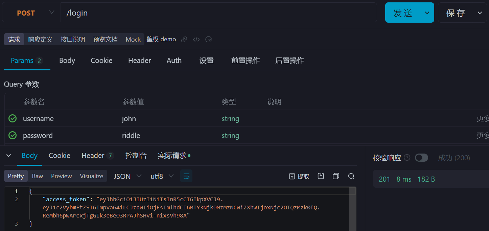
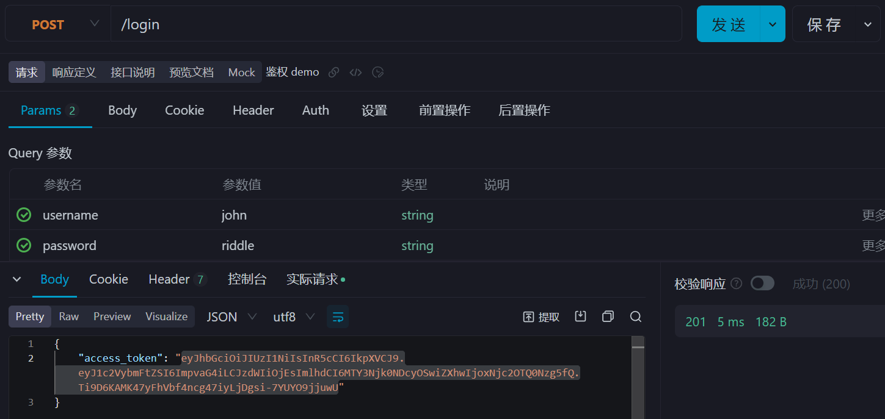
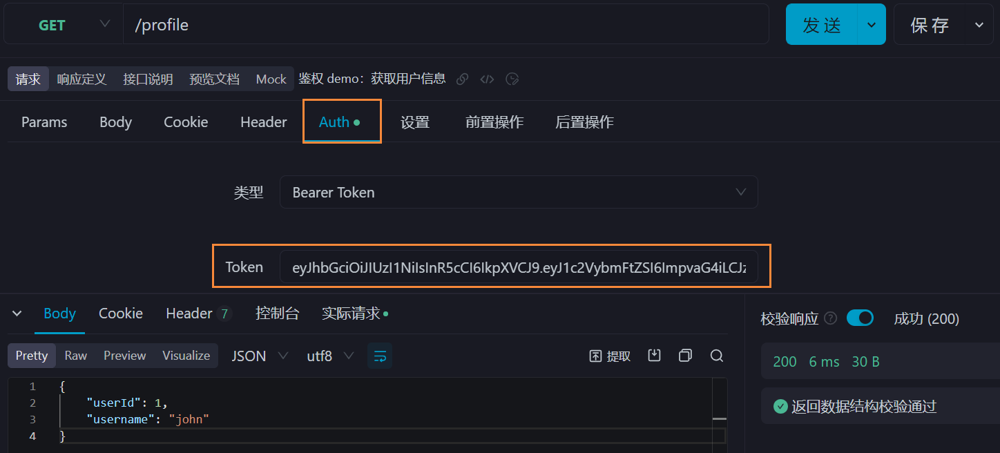
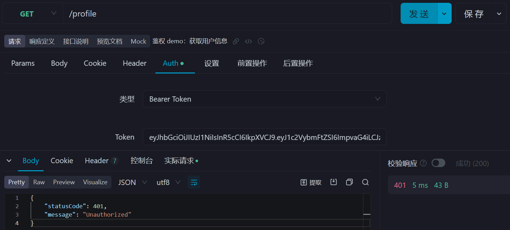

<br>

[Passport](https://www.passportjs.org/) 是一个 NodeJS 鉴权库

JWT 认证的交互流程：浏览器发起请求，服务端对用户名和密码进行验证。如果身份验证通过，服务端会基于用户信息生成 token 字符串，并将其响应给浏览器。浏览器会将 token 字符串存储起来。往后的每次请求，浏览器都会以请求头的形式带上 token 字符串。服务端收到请求后，会解析 token 字符串。如果 token 验证通过，则正常返回数据，否则抛出错误。

<br><br>

# 搭建项目

1. `nest g module auth` `nest g service auth`
2. `nest g module users` `nest g service users`

<br>

**UserModule**

编写 UsersService：

```typescript
import { Injectable } from '@nestjs/common';

interface User {
    userId: number;
    username: string;
    password: string;
}

@Injectable()
export class UsersService {
    private readonly users: User[];

    constructor() {
        // 这里把用户列表写死了. 在真正的应用程序中, 用户列表应该从数据库获取
        this.users = [
            {
                userId: 1,
                username: 'john',
                password: 'riddle',
            },
            {
                userId: 2,
                username: 'chris',
                password: 'secret',
            },
            {
                userId: 3,
                username: 'maria',
                password: 'guess',
            },
        ];
    }

    async findOne(username: string) {
        return this.users.find((user) => user.username === username);
    }
}
```

在 UsersModule 中，将 UsersService 导出，供其他模块使用：

```typescript
import { Module } from '@nestjs/common';
import { UsersService } from './users.service';

@Module({
    providers: [UsersService],
    exports: [UsersService], // 导出 UsersService
})
export class UsersModule {}
```

<br>

**AuthModule**

在 AuthModule 中导入 UserModule：

```typescript
import { Module } from '@nestjs/common';
import { UsersModule } from 'src/users/users.module';
import { AuthService } from './auth.service';

@Module({
    imports: [UsersModule], // 导入 UsersModule
    providers: [AuthService],
})
export class AuthModule {}
```

编写 AuthService：

```typescript
import { Injectable } from '@nestjs/common';
import { UsersService } from 'src/users/users.service';

@Injectable()
export class AuthService {
    constructor(private readonly usersService: UsersService) {}

    /* 检查用户是否已存在 + 校验密码 */
    async validateUser(username: string, pwd: string) {
        const user = await this.usersService.findOne(username); // 获取用户
        if (user && user.password === pwd) {
            const { password, ...result } = user; // 剔除 password
            return result; // 返回用户信息
        }
        return null; // 用户不存在 / 密码错误
    }
}
```

在实际项目中，应该使用封装了加密单向哈希算法的库对密码进行加密，然后在数据库中存储加密后的密码。在检验密码时，对输入的密码也进行加密处理，然后再与数据库中存储的加密后的密码进行比较即可。

<br><br>

# 本地策略

1. `npm i @nestjs/passport passport passport-local`
2. `npm i -D @types/passport-local`

<br>

在 auth 目录下编写本地策略的配置文件 local.strategy.ts

```typescript
import { Strategy } from 'passport-local';
import { PassportStrategy } from '@nestjs/passport';
import { Injectable, UnauthorizedException } from '@nestjs/common';
import { AuthService } from './auth.service';

@Injectable() // 通过 PassportStrategy 使用 local 策略
export class LocalStrategy extends PassportStrategy(Strategy) {
    constructor(private readonly authService: AuthService) {
        super();
    }

    async validate(username: string, password: string) {
        const user = await this.authService.validateUser(username, password);
        if (!user) {
            throw new UnauthorizedException(); // 返回 '未授权' 错误 (401)
        }
        return user; // 返回用户信息
    }
}
```

-   对于每个策略，Passport 都会使用与策略对应的参数调用 verify 函数 (使用 @nestjs/Passport 中的 `validate()` 方法实现)。
-   对于本地策略，Passport 需要一个具有以下签名的 `validate` 方法：`validate(username: string, password: string): any`

如果找到了用户并且凭据有效，则返回该用户；如果没有找到用户或凭据已失效，则抛出异常。

<br>

配置 AuthModule 来使用刚才定义的 Passport 特性：

```typescript
import { Module } from '@nestjs/common';
import { PassportModule } from '@nestjs/passport/dist';
import { UsersModule } from 'src/users/users.module';
import { AuthService } from './auth.service';
import { LocalStrategy } from './local.strategy';

@Module({
    imports: [UsersModule, PassportModule], // 引入 PassportModule
    providers: [AuthService, LocalStrategy], // 注册 LocalStrategy
})
export class AuthModule {}
```

<br><br>

# 登录路由

现在就可以实现一个简单的 /login 路由，并应用内置的守卫来启动 Passport-local 流

```typescript
import { Controller, Req, Post, UseGuards } from '@nestjs/common';
import { AuthGuard } from '@nestjs/passport/dist/auth.guard';
import { Request } from 'express';

@Controller()
export class AppController {
    @UseGuards(AuthGuard('local')) // 启用本地策略
    @Post('login')
    async getHello(@Req() request: Request) {
        // Passport 会根据 validate() 方法的返回值创建一个 user 对象
        // 并以 req.user 的形式分配给请求对象
        return request.user;
    }
}
```





<br>

除了 `@UseGuards(AuthGuard('local'))`，也可以使用自己创建的守卫：

```ts
import { Injectable } from '@nestjs/common';
import { AuthGuard } from '@nestjs/passport';

@Injectable()
export class LocalAuthGuard extends AuthGuard('local') {} // 继承 AuthGuard('local')
```

```ts
import { Controller, Req, Post, UseGuards } from '@nestjs/common';
import { Request } from 'express';
import { LocalAuthGuard } from './auth/local-auth.guard';

@Controller()
export class AppController {
    @UseGuards(LocalAuthGuard) // 使用自己创建的守卫
    @Post('login')
    async getHello(@Req() request: Request) {
        return request.user;
    }
}
```

<br><br>

# JWT 策略

**获取 token**

1. `npm i @nestjs/jwt passport-jwt`
2. `npm i @types/passport-jwt -D`

`@nest/jwt` 是一个实用程序包，可以帮助 JWT 操作；`passport-jwt` 包是实现 JWT 策略的 Passport 包

<br>

在 AuthModule 中引入 JwtModule：

```typescript
import { Module } from '@nestjs/common';
import { JwtModule } from '@nestjs/jwt';
import { PassportModule } from '@nestjs/passport/dist';
import { UsersModule } from 'src/users/users.module';
import { AuthService } from './auth.service';
import { LocalStrategy } from './local.strategy';

@Module({
    imports: [UsersModule, PassportModule, JwtModule], // 引入 JwtModule
    providers: [AuthService, LocalStrategy],
})
export class AuthModule {}
```

<br>

编写 AuthService，添加 `login()` 方法：

```typescript
import { Injectable } from '@nestjs/common';
import { JwtService } from '@nestjs/jwt/dist';
import { UsersService } from 'src/users/users.service';

@Injectable()
export class AuthService {
    constructor(
        private readonly usersService: UsersService,
        private readonly jwtService: JwtService
    ) {}

    async validateUser(username: string, pwd: string) {
        const user = await this.usersService.findOne(username);
        if (user && user.password === pwd) {
            const { password, ...result } = user;
            return result;
        }
        return null;
    }

    async login(user: any) {
        const payload = { username: user.username, sub: user.userId };
        return {
            // 使用 jwtService.sign() 基于 payload 生成 token 字符串
            access_token: this.jwtService.sign(payload),
        };
    }
}
```

<br>

配置 token 签名密文：

```typescript
export const jwtConstants = {
    secret: 'secretKey', // token 签名密文 (密钥)
};
```

不要公开此密钥。在生产系统中，您必须使用适当的措施来保护这个密钥，比如机密库、环境变量或配置服务。

<br>

更新 auth.module.ts，对 JwtModule 进行配置，并导出 AuthService：

```typescript
import { Module } from '@nestjs/common';
import { JwtModule } from '@nestjs/jwt';
import { PassportModule } from '@nestjs/passport/dist';
import { UsersModule } from 'src/users/users.module';
import { AuthService } from './auth.service';
import { jwtConstants } from './constants';
import { LocalStrategy } from './local.strategy';

@Module({
    imports: [
        UsersModule,
        PassportModule,
        /* 配置 JwtModule */
        JwtModule.register({
            secret: jwtConstants.secret, // 使用 token 签名密文
            signOptions: { expiresIn: '60s' }, // 设置 token 的有效期
        }),
    ],
    providers: [AuthService, LocalStrategy],
    exports: [AuthService], // 导出 AuthService
})
export class AuthModule {}
```

有关 Nest JwtModule 的更多信息请参见 [GitHub - @nestjs/jwt](https://github.com/nestjs/jwt/blob/master/README.md)

有关可用配置选项的更多信息请参见 [GitHub - node-jsonwebtoken](https://github.com/auth0/node-jsonwebtoken#usage)

<br>

更新 /login 路由，返回 JWT：

```typescript
import { Controller, Req, Post, UseGuards } from '@nestjs/common';
import { Request } from 'express';
import { AuthGuard } from '@nestjs/passport/dist/auth.guard';
import { AuthService } from './auth/auth.service';

@Controller()
export class AppController {
    constructor(private readonly authService: AuthService) {} // 依赖注入

    @UseGuards(AuthGuard('local'))
    @Post('login')
    async getHello(@Req() request: Request) {
        return this.authService.login(request.user); // 调用 login 方法
    }
}
```



<br>

**检验 token**

在 auth 目录下编写本地策略的配置文件 jwt.strategy.ts

```typescript
import { ExtractJwt, Strategy } from 'passport-jwt';
import { PassportStrategy } from '@nestjs/passport';
import { Injectable } from '@nestjs/common';
import { jwtConstants } from './constants';

@Injectable()
export class JwtStrategy extends PassportStrategy(Strategy) {
    constructor() {
        super({
            jwtFromRequest: ExtractJwt.fromAuthHeaderAsBearerToken(),
            ignoreExpiration: false,
            secretOrKey: jwtConstants.secret,
        });
    }

    async validate(payload: any) {
        return { userId: payload.sub, username: payload.username };
    }
}
```

JWT 策略需要一些初始化，我们可以在[这里](https://github.com/mikenicholson/passport-jwt#configure-strategy)阅读关于可用选项的更多信息。在上例中，这些选项是:

-   `jwtFromRequest`：提供从请求中提取 JWT 的方法
-   `ignoreExpiration`：默认为 `false`，表示由 Passport 模块来检查 JWT 是否已过期。如果请求携带了一个过期的 JWT，该请求将会被拒绝，并响应 401
-   `secretOrkey`：用于生成密钥的签名。可用的其他选项：如 pemo 编码的公钥，可能更适合于生产应用程序 (有关更多信息，请参见[此处](https://github.com/mikenicholson/passport-jwt#extracting-the-jwt-from-the-request))。如前所述，不要把这个密钥公开。

<br>

对于 JWT 策略，Passport 会先验证 token 字符串，并将其还原成用户信息。然后调用 `validate()` 方法，还原出来的用户信息会作为参数传入该方法。上例中，`validate()` 的逻辑很简单：只是返回一个包含 `userId` 和 `username` 属性的对象。Passport 会基于 `validate()` 方法的返回值构建一个 user 对象，并将其作为属性附加到请求对象上。

<br>

在 AuthModule 中添加 JwtStrategy 作为提供者：

```typescript
import { Module } from '@nestjs/common';
import { JwtModule } from '@nestjs/jwt';
import { PassportModule } from '@nestjs/passport/dist';
import { UsersModule } from 'src/users/users.module';
import { AuthService } from './auth.service';
import { jwtConstants } from './constants';
import { JwtStrategy } from './jwt.strategy';
import { LocalStrategy } from './local.strategy';

@Module({
    imports: [
        UsersModule,
        PassportModule,
        JwtModule.register({
            secret: jwtConstants.secret,
            signOptions: { expiresIn: '60s' },
        }),
    ],
    providers: [AuthService, LocalStrategy, JwtStrategy], // 注册 JwtStrategy
    exports: [AuthService],
})
export class AuthModule {}
```

通过导入 JWT 签名时使用的相同密钥，我们可以确保 Passport 执行的验证阶段和 AuthService 执行的签名阶段使用公共密钥。

<br>

更新 app.controller.ts 文件，使用 JWT 鉴权：

```typescript
import { Controller, Req, Post, UseGuards, Get } from '@nestjs/common';
import { Request } from 'express';
import { AuthGuard } from '@nestjs/passport/dist/auth.guard';
import { AuthService } from './auth/auth.service';

@Controller()
export class AppController {
    constructor(private readonly authService: AuthService) {}

    @UseGuards(AuthGuard('local'))
    @Post('login')
    async getHello(@Req() request: Request) {
        return this.authService.login(request.user);
    }

    @UseGuards(AuthGuard('jwt')) // 使用 JWT 鉴权
    @Get('profile')
    getProfile(@Req() request: Request) {
        return request.user; // 返回用户信息
    }
}
```

当我们请求 GET /profile 路由时，保护程序将自动调用我们的 passport-jwt 自定义配置逻辑，验证 JWT ，并将用户属性分配给请求对象。







注意，在 AuthModule 中，我们将 JWT 配置为 60 秒过期。如果您在验证之后等待 60 秒再尝试 GET /profile 请求，您将收到 401 未授权响应。这是因为 Passport 会自动检查 JWT 的过期时间，从而省去了在应用程序中这样做的麻烦。

<br><br>

# 默认策略

在 AppController 中，使用 `@UseGuards(AuthGuard(XXX))` 装饰器需要传递策略的名称 `XXX`。我们可以声明一个默认策略，就不必再传入名称了。

```typescript
import { Module } from '@nestjs/common';
import { JwtModule } from '@nestjs/jwt';
import { PassportModule } from '@nestjs/passport/dist';
import { UsersModule } from 'src/users/users.module';
import { AuthService } from './auth.service';
import { jwtConstants } from './constants';
import { JwtStrategy } from './jwt.strategy';
import { LocalStrategy } from './local.strategy';

@Module({
    imports: [
        UsersModule,
        PassportModule.register({ defaultStrategy: 'jwt' }), // 配置默认策略
        JwtModule.register({
            secret: jwtConstants.secret,
            signOptions: { expiresIn: '60s' },
        }),
    ],
    providers: [AuthService, LocalStrategy, JwtStrategy],
    exports: [AuthService],
})
export class AuthModule {}
```

<br><br>
