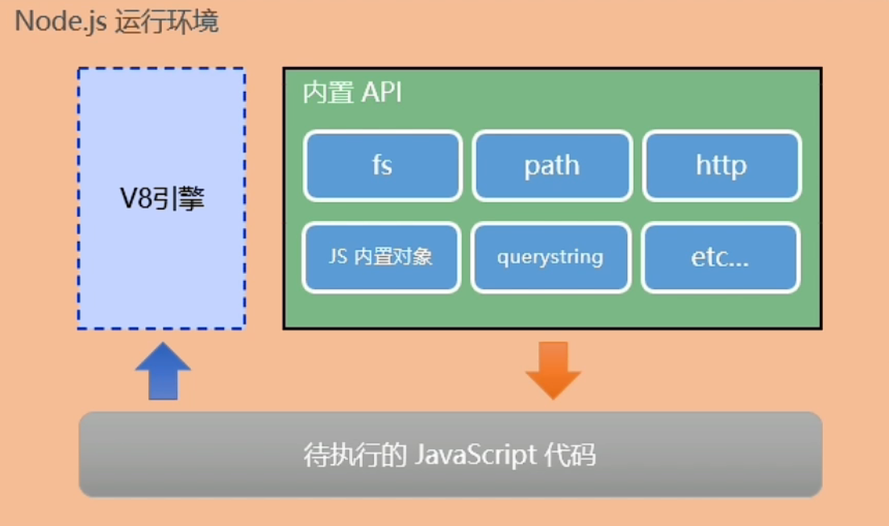
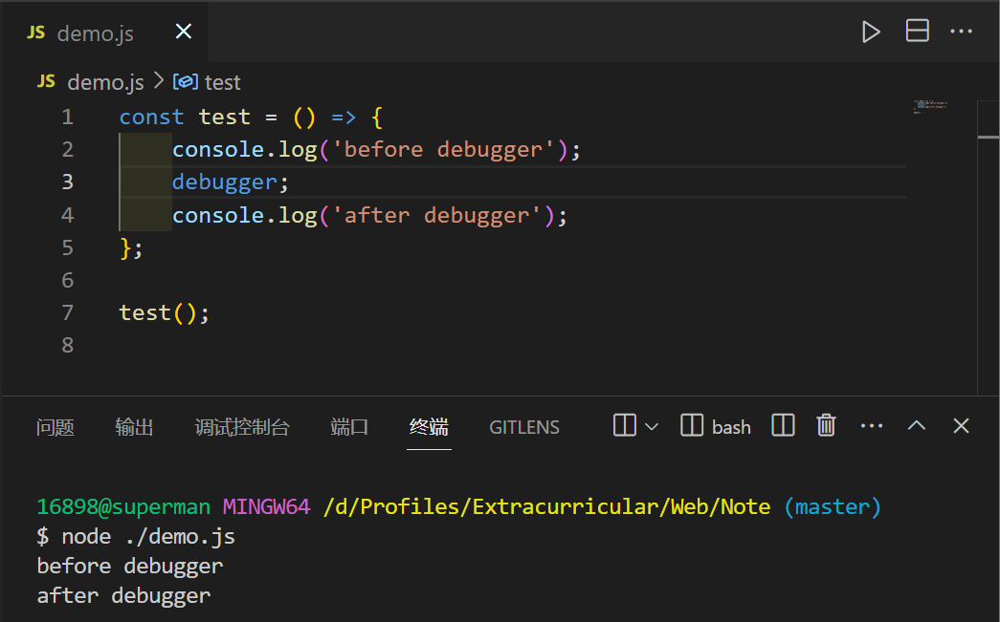
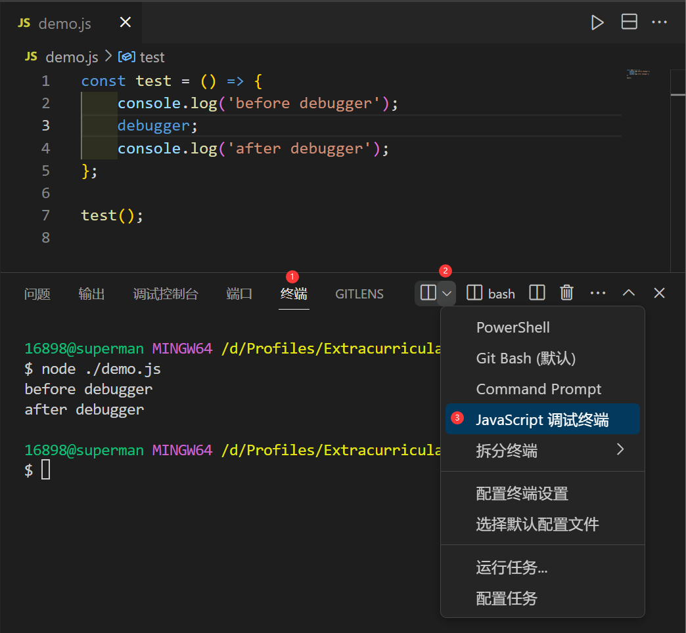
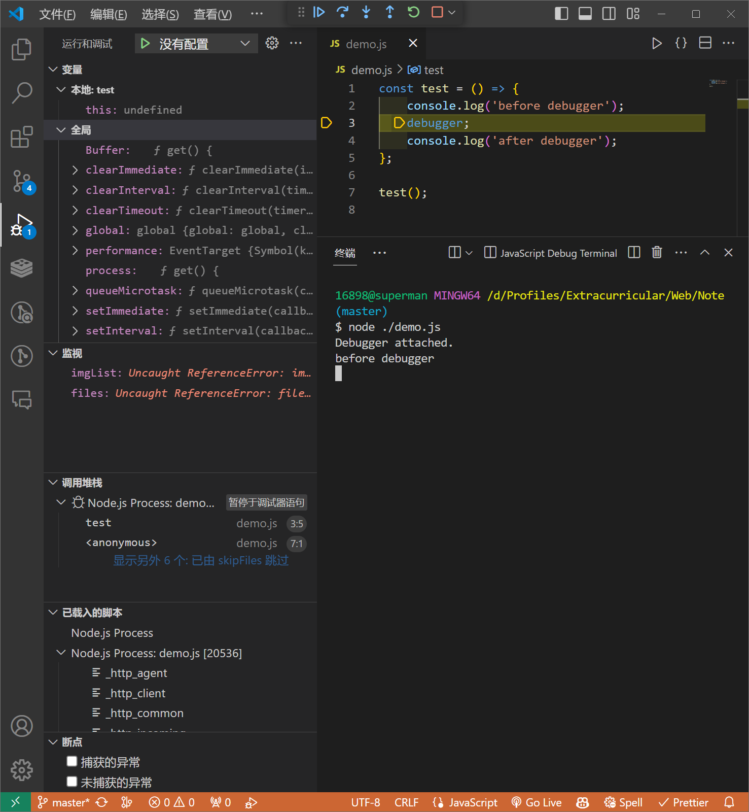
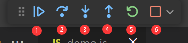
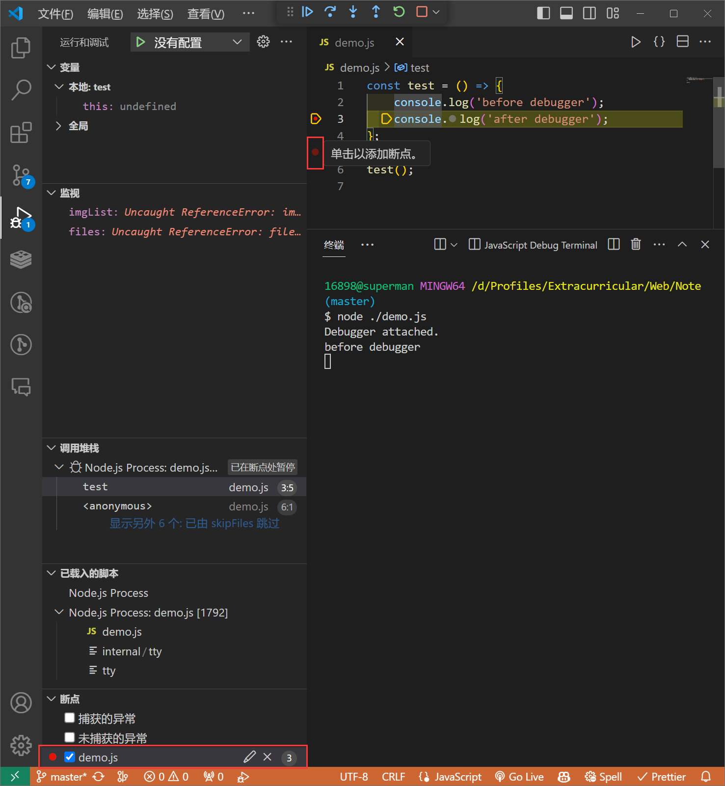

# Node 简介

-   Node 是一个基于 V8 引擎的 JS 运行环境.
-   Node 中无法使用 DOM、BOM 等浏览器内置 API, 但可以使用 ECMAScript 和 Node 内置的 API.
-   Node 的内置对象: `String` `Number` `Boolean` `Math` `Date` `RegExp` `Function` `Object` `Array`...



<br>

作用 - 搭建服务器:

-   传统的服务器都是多线程的: 每进来一个请求, 就创建一个线程去处理
-   Node 服务器是单线程的, 但是在后台拥有一个 I/O 线程池

<br><br>

# DOS 命令

**常用指令: **

-   `dir`: 列出当前目录下的文件(夹)
-   `cd`: 进入到指定的目录
-   `md`: 创建文件夹
-   `rd`: 删除文件夹
-   `cls`: 清屏
-   `cd > 1.txt`: 创建文件
-   `del 1.txt`: 删除文件

<br>

**快捷键: **

1. `↑` 上一条命令
2. `tab` 命令补全

<br>

**目录: **

-   `.`: 当前目录
-   `..`: 上一级目录

<br>

当我们在命令行窗口 [打开一个文件] / [调用一个程序] 时, 系统会先在当前目录下寻找文件程序（这里是 node.exe）
· 如果找到了, 则直接打开；
· 如果没有找到, 则到环境变量 path 的路径下依次寻找, 直至找到为止；
· 如果最后都没找到, 则报错.

<br><br>

# 安装

-   到 node 官网下载, 傻瓜式安装即可
-   安装完成后, 可在命令行窗口输入 `node -v` 查看版本, 以确定是否安装成功

<br>

**node 的使用: **

1. 在命令行中, **输入 `node`, 进入 node 环境**, 即可执行 JS 语句
2. 按 CTRL + C 可以退出 node 环境

<br>

**执行指定的 JS 文件: **

1. 在命令行窗口中, `cd` 到 JS 文件所在的目录
2. 输入 `node 文件名` 执行文件

```js
// demo.js
console.log("Hello Node.js");
```

```
E:\study>node demo.js
Hello Node.js
```

<br>

**VSCode 运行 node: **

-   安装 code runner 插件, 重启 VSCode 后, 即可直接运行 JS 代码
-   快捷键: 运行 `Ctrl + Alt + N`、停止运行 `Ctrl + Alt + M`

<br><br>

# nvm

nvm（Node Version Manager, Node 版本管理器）

<br>

## 安装

需要先卸载已安装的 Node, 再安装 nvm

1.  直接运行 nvm-setup.exe
2.  选择 nvm 安装路径
3.  选择 Node 安装路径
4.  确认安装

<br>

## 常用命令

1.  `nvm -v`: 查看 nvm 版本
2.  `nvm install <版本号>`: 安装指定版本的 Node
    注意: 这里可能会报错 "无权限安装", 以管理员身份运行即可
3.  `nvm uninstall <版本号>`: 卸载指定版本的 Node
4.  `nvm use <版本号>`: 使用指定版本的 Node
5.  `nvm ls`: 查看已安装的 Node；为 `nvm list` 的简写
    `nvm ls available`: 查看可安装的 Node
6.  `nvm on`: 开启 Node 版本管理
7.  `nvm off`: 关闭 Node 版本管理

<br><br>

# Node 调试

正常运行:



<br>

使用 VSCode 的【JS 调试终端】运行:

1.  打开【JS 调试终端】:



2.  运行代码:



<br>

其中



① 继续运行、② 下一步、③ 进入当前函数（用于正在调用其他函数的情况）、④ 跳出当前函数、⑤ 重新运行、⑥ 停止运行

<br>

除了使用 `debugger`, 还可以直接在 VSCode 中点击指定行以打断点:



<br><br>

# Node 模块查找逻辑

## 路径查找

```js
require("./a");
```

1.  找 ./a 文件: 存在该文件则结束；不存在该文件则往下走
2.  找 ./a.js 文件: 存在该文件则结束；不存在该文件则往下走
3.  找 ./a.json 文件: 存在该文件则结束；不存在该文件则往下走
4.  找 ./a 文件夹: 存在该文件夹则往下走；不存在该文件夹则**报错并结束**
5.  找 ./a 文件夹下的 package.json 文件: 存在该文件则往下走；不存在该文件则往 8 走
6.  找 package.json 文件里头的 main 字段: 正确配置了该字段则往下走；没有配置该字段 / 该字段配置有误则往 8 走
7.  找 main 字段指定的 .js 文件: 存在该文件则结束；不存在该文件则往 8 走
8.  找 ./a 文件夹下的 index.js 文件: 存在该文件则结束；不存在该文件则往下走
9.  找 ./a 文件夹下的 index.json 文件: 存在该文件则结束；不存在该文件则**报错并结束**

<br>

## 模块名查找

```js
require("a");
```

1.  找内置模块 a: 存在该内置模块则结束；不存在该内置模块则往下走
2.  找第三方模块 a: 存在异常则往下走；不存在异常则结束
    1.  找当前目录下的 node_modules 目录: 存在该目录则往下走；不存在该目录则**抛出异常**
    2.  在 node_modules 目录下按 `require("./a")` 查找:
        1.  找 ./a 文件: 存在该文件则结束；不存在该文件则往下走
        2.  找 ./a.js 文件: 存在该文件则结束；不存在该文件则往下走
        3.  找 ./a.json 文件: 存在该文件则结束；不存在该文件则往下走
        4.  找 ./a 文件夹: 存在该文件夹则往下走；不存在该文件夹则**抛出异常**
        5.  找 ./a 文件夹下的 package.json 文件: 存在该文件则往下走；不存在该文件则往 8 走
        6.  找 package.json 文件里头的 main 字段: 正确配置了该字段则往下走；没有配置该字段 / 该字段配置有误则往 8 走
        7.  找 main 字段指定的 .js 文件: 存在该文件则结束；不存在该文件则往 8 走
        8.  找 ./a 文件夹下的 index.js 文件: 存在该文件则结束；不存在该文件则往下走
        9.  找 ./a 文件夹下的 index.json 文件: 存在该文件则结束；不存在该文件则**抛出异常**
3.  到上一层目录, 重复 2 操作... 直至系统根目录
4.  到系统根目录, 重复 2 操作: 存在异常则**报错并结束**；不存在异常则结束

<br>
