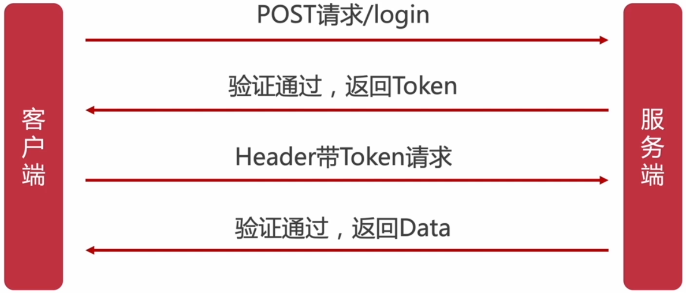
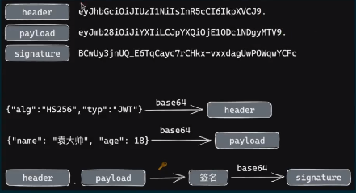
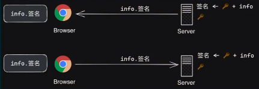

# Session 认证机制

浏览器第 1 次请求服务器时, 服务器会建立一个 session 对象, 用于**存储用户信息**
随后 服务器向浏览器返回一个用于身份认证的字段 —— session-key, 浏览器拿到 session-key 后会将其存储在 cookie 中

当浏览器再次请求服务器时, 会**自动**将当前域名下所有未过期的 cookie (当然也就包括 session-key) 以 [请求头] 的形式发送给服务器, 服务器通过 session-key 找到对应的 session 对象, 即可**验证用户身份**、获取对应的数据、执行对应的操作

可知, 用户数据都是存储在服务端的, 浏览器存储的 cookie 只是用户数据对应的 id → session-key

<br>

## 优缺点

优点: ① 原理比较简单； ② 用户信息都存储在服务端, 可以快速封禁某个用户

缺点: ① session 认证机制需要配合 cookie 才能实现, 由于 **cookie 默认不支持跨域访问**, 所以, 当涉及前端跨域请求后端接口时, 需要做额外的配置, 才能实现跨域 session 认证； ② 如果在特定时间有大量用户访问服务器的话, 服务器就要存储大量用户数据, 占用服务器内存, 硬件成本高； 如果使用多台服务器, 则服务器之间存储的用户数据需要共享； 如果使用数据库存储用户数据, 要是数据库奔溃, 会影响到所有的服务器获取用户数据

<br>

## 服务端配置 session

-   在服务端 (node.js) 中, 可通过插件 express-session 操作

1. `npm i express-session`
2. 引入、注册中间件 express-session:

```js
app.use(
    session({
        secret: "string key", // 服务端 session 签名
        name: "connect.sid", // 生成客户端 cookie 的名字;  默认为 'connect.sid'
        /* 配置 cookie */
        cookie: {
            maxAge: 1000 * 60 * 60 * 24 * 3, // 有效期为 3 天
        },
        rolling: true, // 每次请求时强行更新 cookie, 这将重置 cookie 的过期时间; 默认为 false
        // resave: true, // 强制保存 session, 即使它没变化;  默认为 true
        // saveUninitialized: true, // 强制将未初始化的 session 存储;  默认为 true
    })
);
```

3. 配置好 express-session 后, 即可通过 `req.session` 获取、配置 session 啦

```js
console.log(req.session); // 获取 session

console.log(req.session); // 获取 session
req.session.key = value; // 添加 session 属性
req.session.key = null; // 删除 session 属性

req.session.cookie; // cookie
req.session.id; // session 的唯一标识;  只读;  req.sessionId 的别名;

req.session.destory((err) => {}); // 清空 session - 一般在退出登陆时执行
```

> #### 配合 MongoDB 配置 session

1. `npm i express-session connect-mongo`
2. 引入需要的模块:

```js
const session = require("express-session");
const MongoStore = require("connect-mongo");
```

3. 配置中间件:

```js
app.use(
    session({
        // ...
        store: MongoStore.create({
            mongoUrl: "mongodb://localhost:27017/node",
        }), // 存入 MongoDB
    })
);
```

<br><br>

# JWT 认证机制

JWT - JSON Web Token, 是目前最流行的跨域认证方法.

1. 浏览器向服务器发起登录请求
2. 服务器对账号密码进行校验, 验证通过后, 就会对用户信息进行加密处理生成 token 字符串. 随后 服务器响应浏览器时会带上 token 字符串, 浏览器拿到 token 字符串后会将其存储在 storage 中
3. 随后浏览器每次请求服务器时, 都会将 token 字符串存放在 [请求头] 的 `Authorization` 字段中
4. 这些携带着 token 字符串的请求被发送到服务器后, 服务器会对该 token 字符串进行解密, 还原用户信息, 检查用户信息是否有效. 验证通过后, 再响应数据给浏览器.



可知, 用户数据是存储在浏览器的, 服务器存储的只有加解密所需的 JWT 签名密文.

Authorization 请求头的写法如下:

```js
Authorization: Bearer <token> // 前缀 Bearer 不能少, 为固定写法
```

<br>

## 优缺点

优点: ① 信息都存储在浏览器, 可以减轻服务器负担；② 因为伪造的请求没有携带有效的 token, 所以可以有效防止 CSRF （Cross-site request forgery, 跨站点请求伪造）

缺点: ① 若 token 被黑客截获, 在 token 失效之前, 黑客可以使用 token 为所欲为；② payload 不宜过大, 会增加请求的数据量

我们可以对通信的信道进行加密, 防止黑客截取 token. <br>
还可以使用 SSL 证书, 如此 就算黑客拦截到了 token, 没有 SSL 证书, 也没有办法获取到加密后的数据.

<br>

## JWT 的组成部分

JWT 由 3 部分组成: `Header.Payload.Signature`

-   Header: token 的配置信息经过 base64 编码得到. token 的配置信息包括 token 的加密方式、token 的类型…

-   Payload: 用户信息经过 base64 编码得到.

-   Signature: Header & Payload 使用 [JWT 签名密文] 加密, 再经过 base64 编码得到.



<br>

## 服务端配置 JWT



1. `npm i jsonwebtoken express-jwt`
   jsonwebtoken - 用于将 [key-value 形式的用户信息] 转成 [token 字符串]
   express-jwt - 用于将 [token 字符串] 解析还原成 [JSON 对象]
2. 导入 jsonwebtoken、express-jwt

```js
const jwt = require("jsonwebtoken");
const expressJWT = require("express-jwt");
```

3. 定义 secret 密钥: 为了保证 token 的安全性, 我们需要定义一个用于 [加密]、[解密] 的 secret 密钥
   ① 生成 token 时, 需要使用 secret 密钥对用户信息进行加密, 最终得到加密好的 token 字符串
   ② 把 token 字符串解析还原成 JSON 对象时, 需要使用 secret 密钥进行解密

```js
const secretKey = "superman token"; // 可以是任意字符串, 越复杂安全性越好
```

4. 登陆成功后, 生成 token:
   调用 jsonwebtoken 依赖包提供的 `sign` 方法, 将用户的信息加密成 token 字符串, 响应给客户端

```js
app.post("/api/login", (req, res) => {
    // ...
    res.send({
        status: 200,
        message: "login success!",
        // 调用 sign 方法, 生成 token 字符串
        token: "Bearer " + jwt.sign(
            { ...userInfo, password: "" }, // Payload - 用户信息, 剔除 [密码] 等敏感信息
            secretKey, // 密钥
            { algorithm: "HS256", expiresIn: "30s" } // Header - 配置信息: 加解密算法、有效期 (s-秒、h-小时)...
        );
    });
});
```

5. 将 token 字符串还原为 JSON 对象
   客户端每次访问那些**有权限的**接口时, 都需要配置 [请求头中的 **Authorization** 字段], 将 token 字符串发送到服务器进行身份认证
   此时, 服务器可以通过 express-jwt 这个中间件, 自动将客户端发送过来的 token 字符串解析还原成 JSON 对象
   被还原的用户信息对象, 会被挂载到 `req.user` / `req.auth` 上

```js
// 使用 app.use() 注册中间件
app.use(expressJWT({ secret: secretKey }).unless({ path: [/^\/api\//] }));
// expressJWT({ secret: secretKey }) - 解析 token 的中间件
// .unless({ path: [/^\/api\//] }) - 指定不需要访问权限的接口
```

6. 配置完 express-jwt 后, 即可通过 `req.user` / `req.auth` 获取解析后的用户信息
   注意: 千万不要把密码等敏感信息加密到 token 中！

```js
app.get("/admin/get-info", (req, res) => {
    console.log(req.user);
    res.send({
        status: 200,
        message: "获取用户信息成功！",
        data: req.user, // 将用户信息发送给客户端
    });
});
```

7. 捕获解析 token 失败后产生的错误:
   当使用 express-jwt 解析 token 字符串时, 如果客户端发送过来的 token 字符串 [过期] / [不合法], 会产生一个解析失败的错误
   可以通过 express 的**错误中间件**, 捕获、处理这个错误

```js
app.use((err, req, res, next) => {
    // token 解析失败导致的错误
    if (err.name === "UnauthorizedError") return res.send({ status: 401, message: "身份认证失败！" });
    // 其他原因导致的错误
    res.send({ status: 500, message: "未知的错误" });
});
```

<br><br>

# Oauth

优点: 开放、安全、简单、权限指定
缺点: 需要增加授权服务器、增加网络请求

<br>
