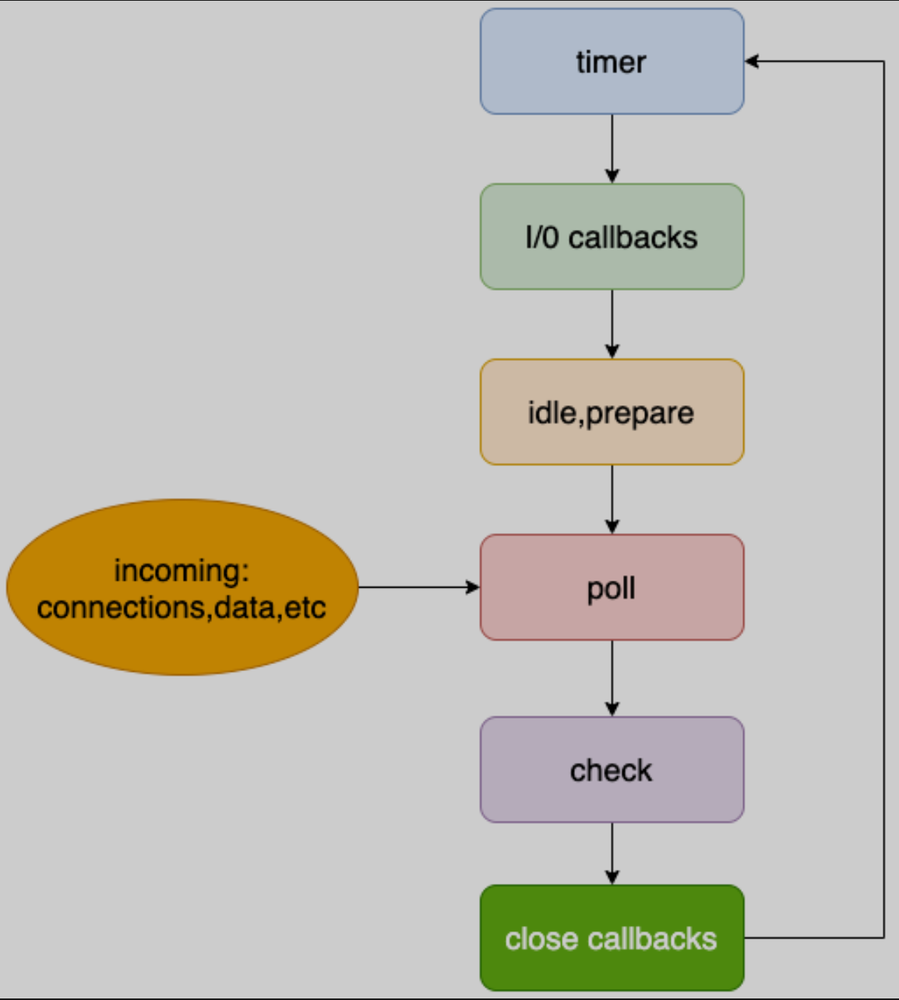

# Node 中的异步 API

1. 定时器: `setTimeout`、`setInterval`
2. I/O 操作: 文件读写、数据库操作、网络请求...
3. Node 独有的 API: `process.nextTick`、`setImmediate`

<br><br>

# 事件循环的流程

Node 的事件循环分为 6 个阶段, 这 6 个阶段会按顺序反复运行. 运行到某个阶段时, 会从该阶段对应的回调队列中取出函数执行. 当队列为空或者执行的回调函数数量达到系统设定的阈值, 就会进入下一阶段.



1. **timer 阶段**: 处理 `setTimeout`、`setInterval` 的回调
2. I/O callbacks 阶段
3. idle、prepare 阶段
4. **poll 阶段**: 除 timer、check 意外, 绝大部分的回调都会放入该队列, 比如: 文件的读取、处理用户请求的回调；事件循环空闲时, 会在此阶段暂停, 以等待新的回调加入, 再结束该阶段 进入下一阶段.
5. **check 阶段**: 处理 `setImmediate` 的回调
6. close callbacks 阶段

<br>

**demo1**:

```js
console.log("脚本开始");

setTimeout(() => {
    console.log("定时器");
}, 10);

console.log("脚本结束");
```

-   输出结果: `'脚本开始'` - `'脚本结束'` - `'定时器'`；
-   运行流程:
    1. 主线程从上往下执行代码, 遇到异步代码则开启新线程执行, 然后主线程继续往下执行. 同步代码执行结束后, 开始事件循环
    2. 执行到 timer 阶段: 此时定时器还在执行中, 所以 timer 队列中还没有回调, 事件循环继续往下执行；执行到 poll 阶段: poll 队列也为空. 此时事件循环会先查看 check 队列和 timer 队列是否为空, 如果非空, 则继续往下执行, 如果为空, 则会在 poll 阶段暂停事件循环, 等待新的回调加入, 再恢复执行
    3. 定时器执行完毕, 其回调加入到 timer 队列中. 事件循环继续执行, 执行到 check 阶段, check 队列为空, 事件循环继续往下执行；执行到 timer 阶段, timer 队列非空, 执行 timer 队列的回调, 输出 `'定时器'`

<br>

**demo2**:

```js
console.log("脚本开始");

setTimeout(() => {
    console.log("定时器");
}, 10);

// I/O 操作: 读取文件内容. 假设耗时 20ms
fs.readFile("demo.txt", (_, data) => {
    console.log(data);
});

console.log("脚本结束");
```

-   输出结果: `'脚本开始'` - `'脚本结束'` - `'定时器'` - `data`
-   运行流程:
    1. 主线程从上往下执行代码, 遇到异步代码则开启新线程执行, 然后主线程继续往下执行. 同步代码执行结束后, 开始事件循环
    2. 执行到 timer 阶段: 此时定时器还在执行中, 所以 timer 队列为空；执行到 poll 阶段: 此时 I/O 操作也还在执行中, poll 队列也为空. 事件循环在 poll 阶段暂停
    3. 10ms 后定时器执行完毕, 回调加入 timer 队列, 事件循环继续执行, 输出 `'定时器'`；事件循环执行到 poll 阶段并在此处暂停
    4. 20ms 后 I/O 操作执行完毕, 回调加入 poll 队列, 事件循环继续执行, 输出 `data`

<br>

**demo3**:

`setImmediate`: 在效果上与 `setTimeout` 设置 0ms 类似；这里说的是类似, 有两点需要注意一下: ① Node 中 `setTimeout` 的时间最小为 1ms；② `setImmediate` 的回调会被**直接添加**到 check 阶段的任务队列中.

```js
console.log("脚本开始");

setTimeout(() => {
    console.log("定时器");
}, 10);

fs.readFile("demo.txt", (_, data) => {
    console.log(data);
});

setImmediate(() => {
    console.log("setImmediate");
});

console.log("脚本结束");
```

-   输出结果: `'脚本开始'` - `'脚本结束'` - `'setImmediate'` - `'定时器'` - `data`
-   运行流程:
    1. 主线程从上往下执行代码, 遇到异步代码则开启新线程执行, 然后主线程继续往下执行. 同步代码执行结束后, 开始事件循环
    2. 执行到 timer 阶段: 此时定时器还在执行中, 所以 timer 队列为空；执行到 poll 阶段: 此时 I/O 操作也还在执行中, poll 队列也为空. 事件循环查看 check 队列和 timer 队列是否为空, 发现 check 队列中有 `setImmediate` 的回调, 事件循环继续往下执行；执行到 check 阶段: 取出 check 队列的回调执行, 输出 `'setImmediate'`；事件循环继续往下执行, 并暂停在 poll 阶段
    3. 10ms 后定时器执行完毕, 回调加入 timer 队列, 事件循环继续执行, 输出 `'定时器'`；事件循环执行到 poll 阶段并在此处暂停
    4. 20ms 后 I/O 操作执行完毕, 回调加入 poll 队列, 事件循环继续执行, 输出 `data`

<br>

**demo4**:

```js
setTimeout(() => {
    console.log("定时器");
}, 0);

setImmediate(() => {
    console.log("setImmediate");
});
```

-   输出结果: `'定时器'` - `'setImmediate'` / `'setImmediate'` - `'定时器'` 都有可能
-   注意: Node 中 `setTimeout` 的最小定时为 1ms
-   情况 ①, 事件循环开始后定时器才执行完:
    1. 执行到 timer 阶段: 此时定时器还在执行中, 所以 timer 队列为空；执行到 poll 阶段: poll 队列也为空. 事件循环查看 check 队列和 timer 队列是否为空, 发现 check 队列中有 `setImmediate` 的回调, 事件循环继续往下执行；执行到 check 阶段: 取出 check 队列的回调执行, 输出 `'setImmediate'`；事件循环继续往下执行, 并暂停在 poll 阶段
    2. 1ms 后定时器执行完毕, 回调加入 timer 队列, 事件循环继续执行, 输出 `'定时器'`
-   情况 ②, 定时器已经执行完了事件循环才开始:
    1. 执行到 timer 阶段: 发现 timer 队列中有定时器的回调, 执行并出输出 `'定时器'`. 事件循环继续往下执行；执行到 poll 阶段: poll 队列为空. 事件循环查看 check 队列和 timer 队列是否为空, 发现 check 队列中有 `setImmediate` 的回调, 事件循环继续往下执行；执行到 check 阶段: 取出 check 队列的回调执行, 输出 `'setImmediate'`

如果想确保两者的执行顺序, 可以将这两个操作放到 I/O 操作的回调中:

```js
fs.readFile("demo.txt", () => {
    setTimeout(() => {
        console.log("定时器");
    }, 0);

    setImmediate(() => {
        console.log("setImmediate");
    });
});
```

I/O 操作的回调在 poll 阶段被执行, setTiimdiate 的回调立即进入 check 队列, setTimeout 在计时结束后将回调加入 timer 队列.
此时, 输出的顺序就一定是 `'setImmediate'` - `'定时器'`

<br><br>

# 微任务队列

-   常见的宏任务: `setTimeout`、`setInterval`、`setImmediate`、`script`(整体代码)、I/O 操作...
    常见的微任务: `process.nextTick()`、`new Promise().then catch finally`...
-   微任务比宏任务的优先级高, 所以会在每次准备执行宏任务时 先清空微任务队列
-   微任务中, nextTick 的优先级较高, 会先执行

```js
setTimeout(() => {
    console.log("timeout");
}, 0);

Promise.resolve().then(() => {
    console.log("promise");
});

process.nextTick(() => {
    console.log("nextTick");
});
```

输出结果: `nextTick` - `promise` - `timeout`；每执行一个宏任务之前, 都会先清空当前的微任务队列.

<br>
