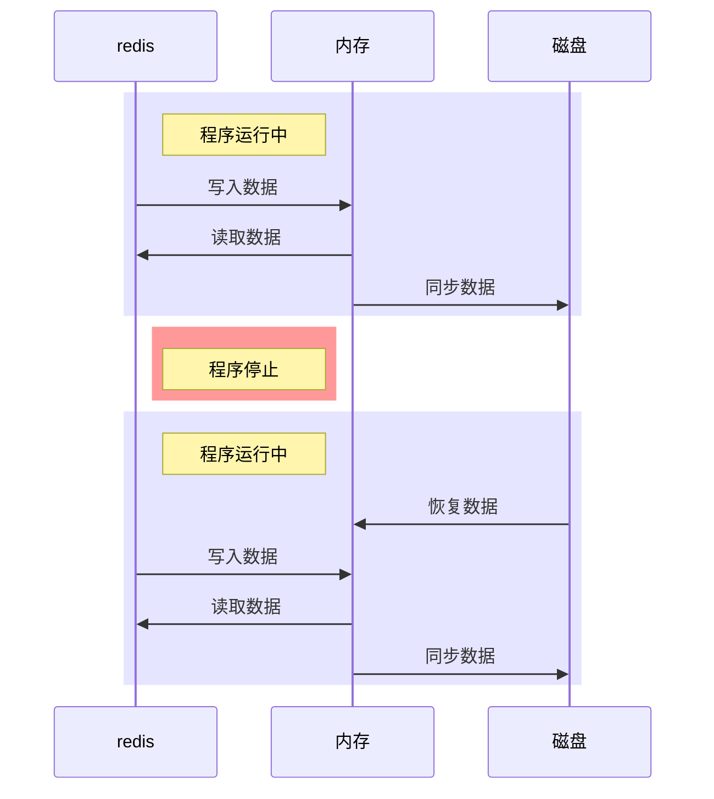
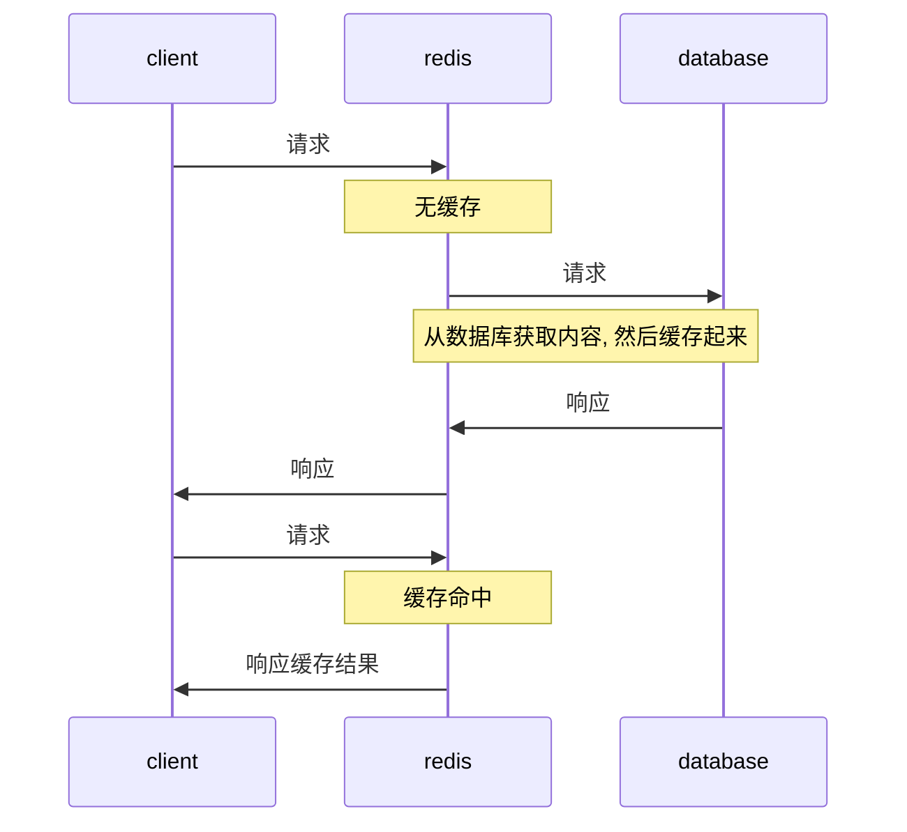
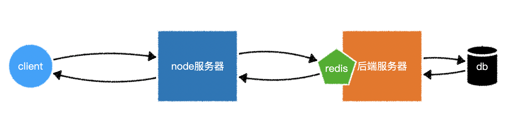
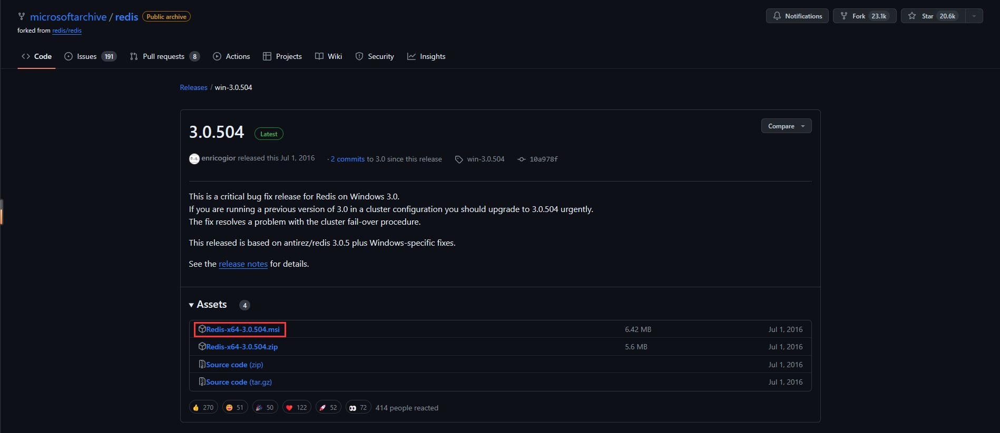
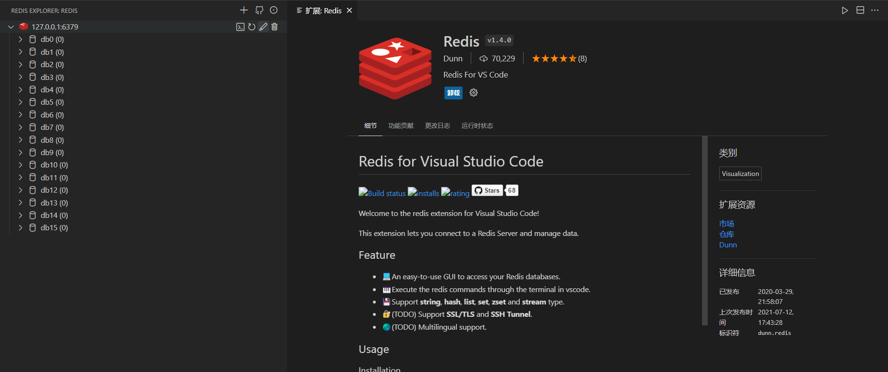

# Redis 简介

官网: https://redis.io/

Redis 是一个键值对数据库, 属于 nosql 数据库的一种.

键值对中的值可以是字符串 String,哈希 Hash,列表 List,集合 Set,有序集合 Sorted Sets.

有别于其他数据库, Redis 对数据的操作是在内存中完成的. 因此, Redis 有着超高的读写效率, 但会耗费大量内存. 往往会搭建 Redis 集群来解决内存不足的问题.

尽管对数据的操作在内存中完成, 但 Redis 仍然提供了持久化的功能. 在默认情况下, 它使用异步的方式将数据写入硬盘, 以便重启之后从硬盘中回复数据到内存.



<br>

基于 Redis 的这种特点, 我们通常用它缓存数据.



<br>

常用服务器结构:



<br><br>

# 安装 Redis

## Windows

访问 https://github.com/microsoftarchive/redis/releases 选择版本进行下载 - 勾选 [配置到环境变量] - 无脑下一步/安装



命令行执行: `redis-cli -v` 查看已安装的 Redis 版本, 能成功查看就表示安装成功啦~

<br>

## Mac

```shell
brew install redis # 安装 redis
brew services start redis # 启动 redis
brew services stop redis # 停止 redis
brew services restart redis # 重启 redis
```

<br><br>

# 可视化工具

VSCode 插件 `Redis`



<br>
