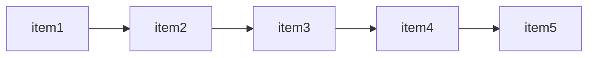

# 进入 Redis 命令交互

无认证模式:

```python
redis-cli # 域名默认为 127.0.0.1    端口号默认为 6379
```

可以使用参数指定域名和端口号:

```python
redis-cli -h 127.0.0.1 -p 6379
```

<br>

带认证模式:

```python
# 设置认证密码
redis-cli # 进入 Redis 命令交互
config set requirepass 123123123 # 设置认证密码
config get requirepass # 获取认证密码
config set requirepass "" # 删除认证密码

# 使用认证密码进入
redis-cli -h 127.0.0.1 -p 6379 # 进入 Redis 命令交互
auth 123123123 # 认证密码
```

> 删除密码后, 需要到任务管理器中重启 Redis 服务才会生效.

<br>

退出 Redis 命令交互: `ctrl + D` / `ctrl + C` / 使用 `quit` 命令

<br><br>

# 常用 Redis 命令

## 通用

```shell
keys <pattern> # 获取满足条件的 key;  `keys *` 获取所有的 key

exists <key1 key2 ...> # 确认指定的多个 key 有几个是存在的, 能得到一个数字

dbsize # 获取 key 的数量

type <key> # 获取指定 key 的类型;  如果该 key 不存在, 则得到 none

ttl <key> # 获取指定 key 的过期时间, -1 表示永不过期(默认), -2 表示 key 不存在

expire <key> <seconds> # 设置指定 key 的过期时间, 单位秒;  到期会自动删除该 key

rename <oldkey> <newkey> # 重命名指定的 key

del <key> # 删除指定的 key
```

<br>

默认情况下, Redis 会创建 16 个数据库 (0~15 号), 并会使用 0 号数据库存储键值对. 我们可以使用不同的数据库存储不同业务/应用的缓存. 不同的数据库之间相互独立, 因此可能会出现重复的键.

```shell
select <index> # 通过编号选择数据库

flushdb # 删除当前数据库的所有 key

flushall # 删除所有数据库的所有 key
```

<br>

## String

```shell
set key value EX 10 # 设置键值对;  `EX 10` 表示 10s 后过期, 默认为 -1, 表示永不过期

get <key> # 获取某个键的值

mget <key1 key2 ...> # 获取多个 key 的值

incr <key> # 将某个键的值自增 1, 前提条件是该键的值必须是数字

incrby <key> <number> # 将某个键的值自增指定的数量, 前提条件是该键的值必须是数字

decr <key> # 将某个键的值自减 1, 前提条件是该键的值必须是数字

decrby <key> <number> # 将某个键的值自减指定的数量, 前提条件是该键的值必须是数字
```

<br>

## List

Redis 中的 List 是一种从左到右的链表结构, 左边是链表的头, 右边是链表的尾:



```shell
rpush <key> <value> # 向指定的 key 对应的链表尾部加入一个值

lpush <key> <value> # 向指定的 key 对应的链表头部加入一个值

llen <key> # 获取指定的 key 对应的链表长度

lrange <key> <start> <end> # 获取链表指定范围的值

lindex <key> <index> # 获取链表指定下标的值

lset <key> <index> <value> # 设置链表指定下标的值

lrem <key> <count> <value> # 删除链表中值为 value 的项, 删除 count 个

lpop <key> # 删除链表的首元素

rpop <key> # 删除链表的尾元素
```

<br>

## Hash

Hash 类型相当于把 Redis 的某个值设置为对象

```shell
hset <key> <field> <value> # 设置对象 key 的属性

hget <key> <field> # 获取对象 key 的属性值

hkeys <key> # 获取对象 key 中所有的键

hvals <key> # 获取对象 key 中所有的值

hgetall <key> # 获取对象 key 中所有的键值对

hexists <key> <field> # 检查对象 key 中是否存在指定字段

hdel <key> <field> # 删除对象 key 中的指定字段

hlen <key> # 获取对象 key 中的字段数量
```

<br>
