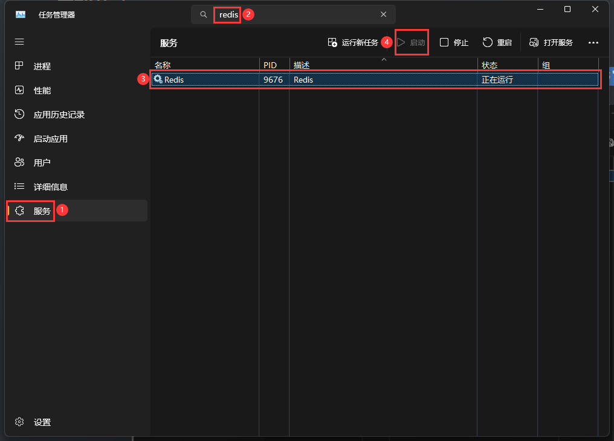

# 配置环境

## 下载 Redis

**Windows**

访问 https://github.com/microsoftarchive/redis/releases 选择版本进行下载 - 勾选 [配置到环境变量] - 无脑下一步并安装


命令行执行：`redis-cli -v` 查看已安装的 Redis 版本，能成功查看就表示安装成功啦~

<br>

**Mac**

```shell
brew install redis # 安装 redis
brew services start redis # 启动 redis
brew services stop redis # 停止 redis
brew services restart redis # 重启 redis
```

<br>

## 启动 Redis

打开任务管理器，找到 Redis 服务，点击启动即可



<br><br>

# 配置 EggJS 项目

1. 安装依赖

```bash
pnpm i egg-redis
```

<br>

2. 配置插件

```js
// config/plugin.js
exports.redis = {
    enable: true,
    package: 'egg-redis',
};
```

```js
// config/config.default.js
exports.redis = {
    client: {
        port: 6379, // Redis port
        host: '127.0.0.1', // Redis host
        password: '',
        db: 0,
    },
};
```

<br>

3.  扩展 helper

```js
// app/extend/helper.js
module.exports = {
    // 生成 redis 锁的控制器; val 为随机数, 防止解锁时误删其他请求的锁
    redisLockController(key, val = Math.random(), ttl = 5 * 60) {
        const app = this.app;
        return {
            // 上锁
            async lock() {
                // 使用 set 命令上锁并设置过期时间, 保证原子性
                const lockResult = await app.redis.set(
                    key,
                    val,
                    'EX',
                    ttl,
                    'NX'
                );
                return lockResult === 'OK';
            },
            // 解锁
            async unlock() {
                // 使用 lua 脚本校验锁并解锁, 保证原子性
                const script = `
					if redis.call('get', KEYS[1]) == ARGV[1] then
						return redis.call('del', KEYS[1])
					else
						return 0
					end
				`;
                // 使用 eval 命令执行 lua 脚本
                const unlockResult = await app.redis.eval(script, 1, key, val);
                return unlockResult === 1;
            },
        };
    },
};
```

<br>

4.  使用 redis 上锁

```js
// app/controller/home.js
const { Controller } = require('egg');

module.exports = class HomeController extends Controller {
    async index() {
        const { id = 0 } = this.ctx.query;
        const result = await this.service.home.index(id);
        this.ctx.body = result;
    }
};
```

```js
// app/service/home.js
const { Service } = require('egg');

module.exports = class HomeService extends Service {
    async index(id) {
        // 从 header 中获取 region 参数
        const region = this.ctx.get('region') || 'default';
        // 生成锁的 key
        const lockKey = `lock:${region}:${id}`;
        // 获取锁的控制器
        const { lock, unlock } = this.ctx.helper.redisLockController(lockKey);
        // 上锁
        const lockResult = await lock();
        // 上锁失败
        if (!lockResult) return { code: 500, msg: 'lock failed' };
        // 上锁成功, 执行业务逻辑
        let result;
        try {
            const sqlResult = await this.mockSql(id);
            result = { code: 200, msg: 'success', data: sqlResult };
        } catch (err) {
            this.ctx.logger.error(err);
            result = { code: 500, msg: err.message };
        }
        // 解锁
        await unlock();
        // 返回结果
        return result;
    }

    // 模拟数据库查询
    async mockSql(id) {
        // 2s 后返回结果
        return new Promise((resolve) => {
            setTimeout(() => {
                resolve({ id, time: Date.now() });
            }, 2000);
        });
    }
};
```

<br>

**Multi Clients**：

```js
// config/config.default.js
exports.redis = {
    clients: {
        // 配置各个 client
        instance: {
            port: 6379,
            host: '127.0.0.1',
            password: '',
            db: 0,
        },
        // ...
    },
};
```

```js
// app/extend/helper.js
module.exports = {
    redisLockController(key, val = Math.random().toFixed(6), ttl = 5 * 60) {
        const app = this.app;
        return {
            // 上锁
            async lock() {
                // 使用指定 client
                const lockResult = await app.redis
                    .get('instance')
                    .set(key, val, 'EX', ttl, 'NX');
                return lockResult === 'OK';
            },
            // 解锁
            async unlock() {
                const script = `
					if redis.call('get', KEYS[1]) == ARGV[1] then
						return redis.call('del', KEYS[1])
					else
						return 0
					end
				`;
                // 使用指定 client
                const unlockResult = await app.redis
                    .get('instance')
                    .eval(script, 1, key, val);
                return unlockResult === 1;
            },
        };
    },
};
```

<br><br>

# 模拟抢锁

开两个浏览器访问 `http://localhost:7001` 即可模拟抢锁的场景

<br>
