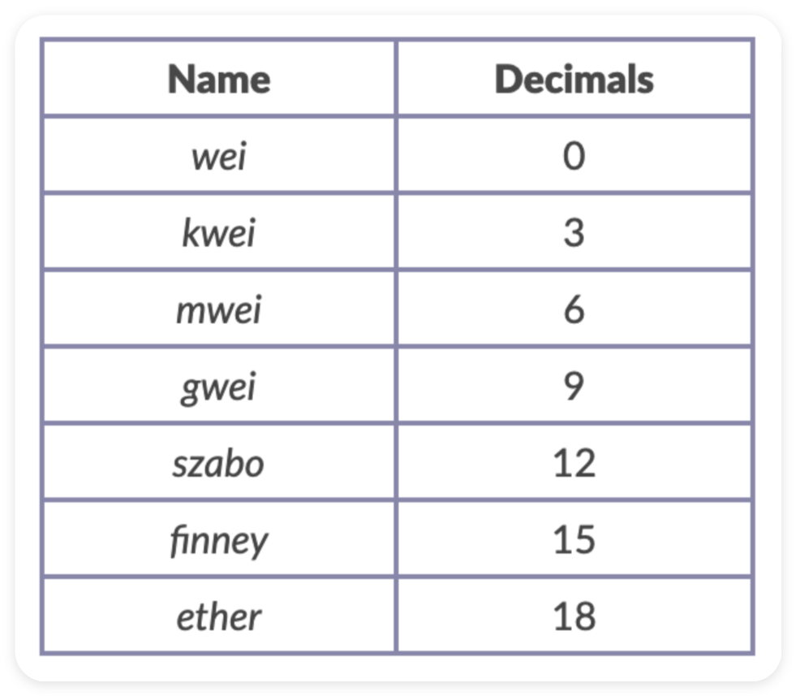

# EthersJS

EthersJS 是一个用于与以太坊区块链交互的 JS 库。

与更早出现的 Web3JS 相比，EthersJS 具有以下优势：

1. 体积更小：Web3JS (590.6 kB) - EthersJS (116.5 kB)

2. 安全性更高：Web3JS 假设用户会在本地部署以太坊节点，并由该节点管理私钥和网络连接状态 (实际情况并非如此) ；EthersJS 则通过 Provider 类管理网络连接状态，通过 Wallet 类管理密钥，既安全又灵活。

3. 原生支持 ENS：EthersJS 原生支持 ENS (Ethereum Name Service，以太坊名称服务)

**demo**：查询以太坊创始人 Vitalik Buterin 的 ETH 余额

```shell
pnpm i ethers
```

```js
import { ethers } from "ethers";

// 创建一个默认的以太坊主网提供者 provider
const provider = ethers.getDefaultProvider();

const main = async () => {
    // 通过 provider 获取指定 ENS (vitalik.eth) 的以太坊余额
    const balance = await provider.getBalance("vitalik.eth");
    // 将获取到的余额从 wei 单位转换为 ether 单位, 并输出到控制台
    console.log(`Vitalik 的以太坊地址余额: ${ethers.utils.formatEther(balance)} ether`);
};

main();
```

<br><br>

# Unit Conversion



EthersJS 使用 JS ES2020 的 BigInt 类安全处理超出 JS 最大安全整数的值。

others → BigInt:

```js
// 十进制字符串
const value1 = ethers.BigNumber.from("100");
console.log(value1); // BigNumber { _hex: '0x64' }

// 十进制数值, 需 < 2^53
const value2 = ethers.BigNumber.from(100);
console.log(value2); // BigNumber { _hex: '0x64' }

// 十六进制字符串
const value3 = ethers.BigNumber.from("0x64");
console.log(value3); // BigNumber { _hex: '0x64' }

// 十六进制数值
const value4 = ethers.BigNumber.from(0x64);
console.log(value4); // BigNumber { _hex: '0x64' }

// BigInt
const value5 = ethers.BigNumber.from(100n);
console.log(value5); // BigNumber { _hex: '0x64' }
```

BigInt 支持数学运算：

```js
const oneGwei = ethers.BigNumber.from("1000000000");

// 加法
const add = oneGwei.add(oneGwei);
console.log(`add: ${add}`);

// 减法
const sub = oneGwei.sub(oneGwei);
console.log(`sub: ${sub}`);

// 乘法
const mul = oneGwei.mul(oneGwei);
console.log(`mul: ${mul}`);

// 除法
const div = oneGwei.div(oneGwei);
console.log(`div: ${div}`);

// 取余
const mod = oneGwei.mod(oneGwei);
console.log(`mod: ${mod}`);

// 绝对值
const abs = oneGwei.abs();
console.log(`abs: ${abs}`);
```

BigInt 支持比较运算：

```js
const oneGwei = ethers.BigNumber.from("1000000000");

// 等于
const eq = oneGwei.eq(oneGwei);
console.log(`eq: ${eq}`);

// 大于
const gt = oneGwei.gt(oneGwei);
console.log(`gt: ${gt}`);

// 大于等于
const gte = oneGwei.gte(oneGwei);
console.log(`gte: ${gte}`);

// 小于
const lt = oneGwei.lt(oneGwei);
console.log(`lt: ${lt}`);

// 小于等于
const lte = oneGwei.lte(oneGwei);
console.log(`lte: ${lte}`);
```

钱包界面的余额以 ether 为单位、gas 价格以 gwei 为单位，但是在发送交易时，两者都必须转换成以 wei 为单位。EthersJS 提供了一些功能函数，方便这类转换：

-   `formatUnits(变量, 位数/单位)`：小单位转大单位 (wei → ether)，在显示余额时很有用
-   `parseUnits(变量, 位数/单位)`：大单位转小单位 (ether → wei)，在发送交易时很有用

```js
const oneGwei = ethers.BigNumber.from("1000000000");

console.log(ethers.utils.formatUnits(oneGwei, "gwei"));
// '1.0'
console.log(ethers.utils.formatUnits(oneGwei, 9));
// '1.0'

console.log(ethers.utils.formatUnits(oneGwei, "ether"));
// '0.000000001'
console.log(ethers.utils.formatUnits(oneGwei, 18));
// '0.000000001'
console.log(ethers.utils.formatUnits(oneGwei)); // 默认
// '0.000000001'

console.log(ethers.utils.formatEther(oneGwei)); // formatEther === 默认的 formatUnits
// '0.000000001'
```

```js
console.log(ethers.utils.parseUnits("1.0", "gwei"));
// BigNumber { _hex: '0x3b9aca00' }
console.log(ethers.utils.parseUnits("1.0", 9));
// BigNumber { _hex: '0x3b9aca00' }

console.log(ethers.utils.parseUnits("1.0", "ether"));
// BigNumber { _hex: '0x0de0b6b3a7640000' }
console.log(ethers.utils.parseUnits("1.0", 18));
// BigNumber { _hex: '0x0de0b6b3a7640000' }
console.log(ethers.utils.parseUnits("1.0")); // 默认
// BigNumber { _hex: '0x0de0b6b3a7640000' }

console.log(ethers.utils.parseEther("1.0")); // parseEther === 默认的 parseUnits
// BigNumber { _hex: '0x0de0b6b3a7640000' }
```

<br><br>

# Provider

Provider 是 EthersJS 中用于连接以太坊网络的抽象类，提供对区块链的只读访问。

EthersJS 内置了一些公共 RPC (Remote Procedure Call，远程过程调用)，方便用户连接以太坊。但 EthersJS 内置的 RPC 访问速度有限制，仅供测试使用。在生产环境中，建议申请个人 RPC，例如 [Infura](https://app.infura.io/) 或 [Alchemy](https://dashboard.alchemy.com/) 。

**连接节点**：

除了之前提到的默认提供者 defaultProvider，EthersJS 中最常用的提供者是 JsonRpcProvider，它允许用户连接到特定节点。

我们可以在节点服务商的网站 (如 Infura 或 Alchemy) 注册并创建 API Key，也还可以在 [Chainlist](https://chainlist.org/) 找到各个链的公开节点。

这里，我们以 Chainlist 上面的公开节点为例。以下是分别连接到 ETH 主网和 ETH Sepolia 测试网的 provider 创建示例：

```js
// 使用以太坊主网的 RPC 创建 provider
const ETH_MAINNET_RPC_URL = "https://rpc.ankr.com/eth";
const mainnetProvider = new ethers.providers.JsonRpcProvider(ETH_MAINNET_RPC_URL);

// 使用以太坊 Sepolia 测试网的 RPC 创建 provider
const SEPOLIA_TESTNET_RPC_URL = "https://rpc.sepolia.org";
const sepoliaProvider = new ethers.providers.JsonRpcProvider(SEPOLIA_TESTNET_RPC_URL);
```

**利用 provider 读取链上数据**：

1. getBalance：查询指定地址的 ETH 余额 (测试网目前不支持 ENS，只能用地址查询)：

```js
const mainnetBalance = await mainnetProvider.getBalance(`vitalik.eth`);
console.log(`Vitalik 在主网的余额: ${ethers.utils.formatEther(mainnetBalance)} ether`);

const sepoliaBalance = await sepoliaProvider.getBalance(`0xd8dA6BF26964aF9D7eEd9e03E53415D37aA96045`);
console.log(`Vitalik 在 Sepolia 测试网的余额: ${ethers.utils.formatEther(sepoliaBalance)} ether`);
```

2. getNetwork：查询当前连接的网络信息：

```js
const mainnetNetwork = await mainnetProvider.getNetwork();
console.log(`主网的网络信息: ${JSON.stringify(mainnetNetwork, null, 4)}`);
// { "name": "homestead", "chainId": 1, "ensAddress": "0x00000000000C2E074eC69A0dFb2997BA6C7d2e1e" }

const sepoliaNetwork = await sepoliaProvider.getNetwork();
console.log(`Sepolia 测试网的网络信息: ${JSON.stringify(sepoliaNetwork, null, 4)}`);
// { "name": "sepolia", "chainId": 11155111, "ensAddress": null }
```

3. getBlockNumber：查询当前区块高度

```js
const mainnetBlockNumber = await mainnetProvider.getBlockNumber();
console.log(`主网当前的区块高度: ${mainnetBlockNumber}`);

const sepoliaBlockNumber = await sepoliaProvider.getBlockNumber();
console.log(`Sepolia 测试网当前的区块高度: ${sepoliaBlockNumber}`);
```

4. getTransactionCount：查询指定地址的交易次数

```js
const mainnetTransactionCount = await mainnetProvider.getTransactionCount(`vitalik.eth`);
console.log(`Vitalik 在主网的交易次数: ${mainnetTransactionCount}`);

const sepoliaTransactionCount = await sepoliaProvider.getTransactionCount(`0xd8dA6BF26964aF9D7eEd9e03E53415D37aA96045`);
console.log(`Vitalik 在 Sepolia 测试网的交易次数: ${sepoliaTransactionCount}`);
```

5. getFeeData：查询当前建议的 gas 费用数据

```js
const mainnetFeeData = await mainnetProvider.getFeeData();
console.log(`主网当前建议的 gas 费用数据: ${JSON.stringify(mainnetFeeData, null, 4)}`);
// { "lastBaseFeePerGas": ..., "maxFeePerGas": ..., "maxPriorityFeePerGas": ..., "gasPrice": ... }

const sepoliaFeeData = await sepoliaProvider.getFeeData();
console.log(`Sepolia 测试网当前建议的 gas 费用数据: ${JSON.stringify(sepoliaFeeData, null, 4)}`);
// { "lastBaseFeePerGas": ..., "maxFeePerGas": ..., "maxPriorityFeePerGas": ..., "gasPrice": ... }
```

6. getBlock：查询指定区块的信息

```js
const mainnetBlock = await mainnetProvider.getBlock(0);
console.log(`主网区块 0 的信息: ${JSON.stringify(mainnetBlock, null, 4)}`);
// { "hash": ..., "gasLimit": ..., "gasUsed": ..., "baseFeePerGas": ..., ... }

const sepoliaBlock = await sepoliaProvider.getBlock(0);
console.log(`Sepolia 测试网区块 0 的信息: ${JSON.stringify(sepoliaBlock, null, 4)}`);
// { "hash": ..., "gasLimit": ..., "gasUsed": ..., "baseFeePerGas": ..., ... }
```

7. getCode：查询指定地址的合约字节码

```js
// 本例使用主网 WETH 合约的地址
const mainnetCode = await mainnetProvider.getCode(`0xc778417e063141139fce010982780140aa0cd5ab`);
console.log(`主网 WETH 合约的字节码: ${mainnetCode}`);
```

<br><br>

# Signer & Wallet

在 EthersJS 中，Signer 类是以太坊账户的抽象，用于对消息和交易进行签名，并将签名的交易发送到以太坊网络，从而更改区块链状态。Signer 类是一个抽象类，不能直接实例化，我们需要使用它的子类：Wallet 类。

Wallet 类继承了 Signer 类，并且开发者可以像包含私钥的外部拥有帐户 (EOA) 一样，用它对交易和消息进行签名。

**代码示例**：

1. 创建 Provider 实例

```js
import { ethers } from "ethers";

const infuraKey = "infuraKey...";
const provider = new ethers.providers.JsonRpcProvider(`https://sepolia.infura.io/v3/${infuraKey}`);
```

2. 创建 Wallet 实例

方法 1：创建随机的 wallet 对象：利用 `ethers.Wallet.createRandom()` 创建带有随机私钥的 wallet 对象。该私钥由加密安全的熵源生成，如果当前环境没有安全的熵源，则会引发错误。

方法 2：用私钥创建 wallet 对象：利用 `ethers.Wallet(privateKey, provider)` 创建 wallet 对象。

方法 3：用助记词创建 wallet 对象：利用 `ethers.Wallet.fromPhrase(phrase)` 创建 wallet 对象。

方法 4：用 JSON 文件创建 wallet 对象：利用 `ethers.Wallet.fromEncryptedJson(keystoreJson)` 解密一个 JSON 钱包文件创建钱包实例，JSON 文件即 keystore 文件，通常来自 Geth、Parity 等钱包。

```js
// 创建随机的 wallet 对象
const wallet1 = ethers.Wallet.createRandom();

// 通过私钥创建 wallet 对象;  这种方法创建的钱包获取不到助记词
const privateKey = "钱包账户的私钥...";
const wallet2 = new ethers.Wallet(privateKey, provider);

// 通过助记词创建 wallet 对象
const phrase = wallet1.mnemonic.phrase; // 获取 wallet1 的助记词
const wallet3 = ethers.Wallet.fromMnemonic(phrase);
```

3. 获取钱包地址

```js
// 方式 1
console.log(`wallet1 address: ${wallet1.address}`);
console.log(`wallet2 address: ${wallet2.address}`);
console.log(`wallet3 address: ${wallet3.address}`);

// 方式 2
console.log(`wallet1 address: ${await wallet1.getAddress()}`);
console.log(`wallet2 address: ${await wallet2.getAddress()}`);
console.log(`wallet3 address: ${await wallet3.getAddress()}`);
```

4. 获取助记词信息

```js
console.log(`wallet1 mnemonic: ${JSON.stringify(wallet1.mnemonic, null, 4)}`);
// { "phrase": ..., "path": ..., "locale": ... }

console.log(`wallet2 mnemonic: ${JSON.stringify(wallet2.mnemonic, null, 4)}`);
// null

console.log(`wallet3 mnemonic: ${JSON.stringify(wallet3.mnemonic, null, 4)}`);
// { "phrase": ..., "path": ..., "locale": ... }
```

5. 获取私钥

```js
console.log(`wallet1 private key: ${wallet1.privateKey}`);
console.log(`wallet2 private key: ${wallet2.privateKey}`);
console.log(`wallet3 private key: ${wallet3.privateKey}`);
```

6. 获取钱包在链上的交互次数

```js
// 方式 1
console.log(`wallet1 nonce: ${await provider.getTransactionCount(wallet1.address)}`);
console.log(`wallet2 nonce: ${await provider.getTransactionCount(wallet2.address)}`);
console.log(`wallet3 nonce: ${await provider.getTransactionCount(wallet3.address)}`);

// 方式 2
console.log(`wallet1 nonce: ${await wallet1.connect(provider).getTransactionCount()}`);
console.log(`wallet2 nonce: ${await wallet2.getTransactionCount()}`);
console.log(`wallet3 nonce: ${await wallet3.connect(provider).getTransactionCount()}`);
```

7. 发送 ETH

用 wallet2 给 wallet1 发送 0.001 ether，并打印交易前后的钱包余额。如果钱包没钱, 可以去水龙头领一些 ( eg：[Chainlink Faucets](https://faucets.chain.link/) ) 。

```js
// 查询余额: 方式 1
console.log("wallet1:", await provider.getBalance(wallet1.address));
console.log("wallet2:", await provider.getBalance(wallet2.address));

// 转账: wallet2 -> wallet1
const tx = {
    to: wallet1.address, // 接收地址
    value: ethers.utils.parseEther("0.001"), // 转账金额
};
const txResponse = await wallet2.sendTransaction(tx);
await txResponse.wait(); // 等待链上交易确认
console.log("txResponse:", JSON.stringify(txResponse, null, 4));
// { "type": 2, "gasPrice": null, "gasLimit": ..., "to": ..., "value": ..., "hash": ..., ... }

// 查询余额: 方式 2
console.log("wallet1:", await wallet1.connect(provider).getBalance());
console.log("wallet2:", await wallet2.getBalance());
```

<br><br>
