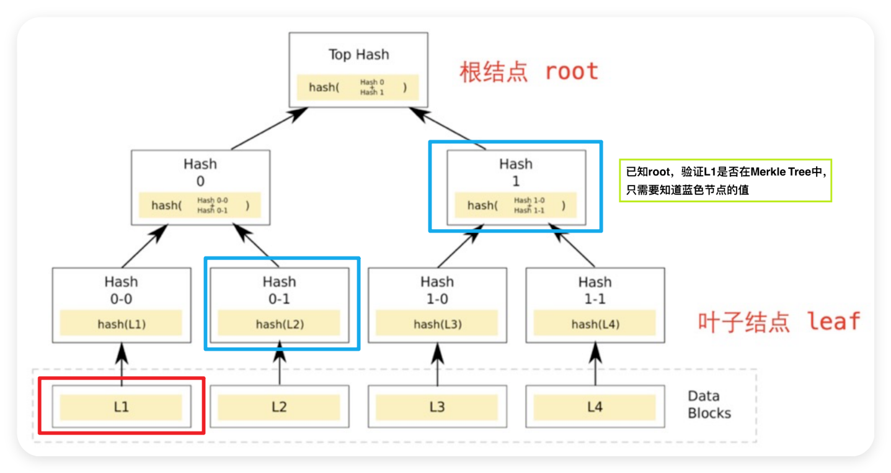

# 基于 Merkle 树的完整性校验

## 概述

Merkle 树的结构与哈希列表类似, 但其相邻节点会合并计算生成一个新的哈希值作为上一层的节点. 如果这一层是奇数个节点, 则最后一个节点的哈希值直接上升至上一层. 通过这种方式, 最终会获得一个根节点和所有内部节点.

<br>

# 过程

① 树的构建:

1. 计算每个叶子节点 (即原始数据块) 的哈希值.

2. 将相邻的哈希值两两合并, 再次计算哈希值, 生成新的父节点.

3. 如果某一层节点数为奇数, 则直接将最后一个节点的哈希值上升至上一层.

4. 重复此过程, 直到生成单一的根节点.

② 下载与校验:

1. 在 P2P 网络下载之前, 先从可信节点获取文件的 Merkle 树根节点.

2. 从其他不可信节点获取 Merkle 树的子节点.

3. 不同于哈希列表, Merkle 树允许下载和验证单独的分支. 如果某个分支节点损坏, 只需重新下载该分支节点.

4. 当文件较大时, Merkle 树的效率显著高于哈希列表, 因为它可以快速定位并校验特定数据块的完整性.

这种结构确保了在数据传输过程中, 每个数据块的完整性和正确性, 显著提高了文件下载的效率和可靠性.

Merkle 树多指完全二叉树, 也可以是完全多叉树.

<br><br>

# Merkle Tree

Merkle Tree, 也叫默克尔树或哈希树, 是区块链的底层加密技术. Merkle Tree 是一种自下而上构建的加密树, 每个叶子节点对应数据的哈希值, 每个非叶子节点是其两个子节点哈希值的组合.

Merkle Tree 允许对大型数据结构的内容进行有效和安全的验证 (Merkle Proof). 对于有 N 个叶子节点的 Merkle Tree, 在已知根节点 hash 的情况下, 验证某个数据是否有效 (属于 Merkle Tree 叶子结点) 只需要 ceil(log₂N) 个节点的 hash 数据 (这些 hash 数据也叫 proof). 如果数据或 proof 有误, 则无法还原出根节点的 hash.

在下面的例子中, 叶子数据 L1 的 Merkle proof 为 Hash 0-1 和 Hash 1. 知道这两个 hash, 就能验证 L1 是否在 Merkle Tree 的叶子节点中.

1. 通过叶子数据 L1 计算出 Hash 0-0

2. Hash 0-0 和 Hash 0-1 (已知) 可以联合计算出 Hash 0

3. Hash 0 和 Hash 1 (已知) 可以联合计算出根节点的 hash



<br><br>

# 生成 Merkle Tree

我们可以利用 [网页](https://lab.miguelmota.com/merkletreejs/example/) 或者 JS 库 [merkletreejs](https://github.com/merkletreejs/merkletreejs) 来生成 Merkle Tree.

这里我们用网页来生成下述 4 个地址作为叶子结点数据的 Merkle Tree:

```
[
    "0x5B38Da6a701c568545dCfcB03FcB875f56beddC4",
    "0xAb8483F64d9C6d1EcF9b849Ae677dD3315835cb2",
    "0x4B20993Bc481177ec7E8f571ceCaE8A9e22C02db",
    "0x78731D3Ca6b7E34aC0F824c42a7cC18A495cabaB" // 网页上操作的话, 这里不要有逗号!!! 否则结果会不一样!!!
]
```

在菜单里选上 Keccak-256,hashLeaves 和 sortPairs 选项, 然后点击 Compute, Merkle Tree 就生成好啦. Merkle Tree 展开为:

```
└─ eeefd63003e0e702cb41cd0043015a6e26ddb38073cc6ffeb0ba3e808ba8c097
   ├─ 9d997719c0a5b5f6db9b8ac69a988be57cf324cb9fffd51dc2c37544bb520d65
   │  ├─ 5931b4ed56ace4c46b68524cb5bcbf4195f1bbaacbe5228fbd090546c88dd229
   │  └─ 999bf57501565dbd2fdcea36efa2b9aef8340a8901e3459f4a4c926275d36cdb
   └─ 4726e4102af77216b09ccd94f40daa10531c87c4d60bba7f3b3faf5ff9f19b3c
      ├─ 04a10bfd00977f54cc3450c9b25c9b3a502a089eba0097ba35fc33c4ea5fcb54
      └─ dfbe3e504ac4e35541bebad4d0e7574668e16fefa26cd4172f93e18b59ce9486
```

<br><br>

# Merkle Proof

通过网站, 我们可以得到 "地址[0]" `0x5B38Da6a701c568545dCfcB03FcB875f56beddC4` 的 proof 如下:

```
[
    "0x999bf57501565dbd2fdcea36efa2b9aef8340a8901e3459f4a4c926275d36cdb",
    "0x4726e4102af77216b09ccd94f40daa10531c87c4d60bba7f3b3faf5ff9f19b3c"
]
```

编写 MerkleProof 库:

```solidity
library MerkleProof {
    // 通过 proof 验证 leaf 是否属于根为 root 的 Merkle Tree; 如果是, 则返回 true
    function verify(
        bytes32[] memory proof,
        bytes32 root,
        bytes32 leaf
    ) internal pure returns (bool) {
        return processProof(proof, leaf) == root;
    }

    // 通过 proof 和 leaf 计算出 Merkle Tree 的 root
    function processProof(
        bytes32[] memory proof,
        bytes32 leaf
    ) internal pure returns (bytes32) {
        bytes32 computedHash = leaf;
        for (uint256 i = 0; i < proof.length; i++) {
            computedHash = _hashPair(computedHash, proof[i]);
        }
        return computedHash;
    }

    // 用 keccak256 函数计算非根节点对应的两个子节点的哈希 (排序后)
    function _hashPair(bytes32 a, bytes32 b) private pure returns (bytes32) {
        return
            a < b
                ? keccak256(abi.encodePacked(a, b))
                : keccak256(abi.encodePacked(b, a));
    }
}
```

以 `"地址[0]" 对应的 hash`,`root`,`"地址[0]" 对应的 proof` 作为参数调用 verify 函数, 将返回 true. 因为 "地址[0]" 对应的 hash 在根为 root 的 Merkle Tree 中, 且 proof 正确. 如果改变了其中任意一个值, 都将返回 false.

<br><br>

# 利用 Merkle Tree 发放 NFT 白名单

一份拥有 800 个地址的白名单, 更新一次所需的 gas fee 很容易超过 1 个 ETH. 而在做 Merkle Tree 验证时, leaf 和 proof 可以存在后端, 链上仅需存储一个 root 的值, 非常节省 gas, 项目方经常用它来发放白名单. 很多 ERC721 标准的 NFT 和 ERC20 标准代币的白名单/空投都是利用 Merkle Tree 发出的, 比如 optimism 的空投.

这里, 我们介绍如何利用 MerkleTree 合约来发放 NFT 白名单:

```solidity
import "@openzeppelin/contracts/token/ERC721/ERC721.sol";

contract MerkleTree is ERC721 {
    bytes32 public immutable root; // Merkle Tree 的根 hash
    mapping(address => bool) public mintedAddress; // 记录已经 mint 的地址

    // 构造函数, 初始化 NFT 合集的名称,代号,Merkle Tree 的根 hash
    constructor(bytes32 merkleRoot) ERC721("MerkleTree", "MT") {
        root = merkleRoot;
    }

    // Merkle Tree 验证, 调用 MerkleProof 库的 verify 函数
    function _verify(
        bytes32 leaf,
        bytes32[] memory proof
    ) internal view returns (bool) {
        return MerkleProof.verify(proof, root, leaf);
    }

    // 计算 Merkle Tree 叶子的 hash
    function _leaf(address account) internal pure returns (bytes32) {
        return keccak256(abi.encodePacked(account));
    }

    // 利用 Merkle Tree 验证地址并完成 mint
    function mint(
        address account, // 白名单地址
        uint256 tokenId,
        bytes32[] calldata proof
    ) external {
        // 验证 address 是否在白名单中
        require(_verify(_leaf(account), proof), "Invalid merkle proof");
        // 地址没有 mint 过
        require(!mintedAddress[account], "Already minted!");
        // mint
        _mint(account, tokenId);
        // 记录 mint 过的地址
        mintedAddress[account] = true;
    }
}
```

我们使用上例的 4 个地址作为白名单并生成 Merkle Tree.

1. 部署 MerkleTree 合约, 参数为 "Merkle Tree 的根 hash": `0xeeefd63003e0e702cb41cd0043015a6e26ddb38073cc6ffeb0ba3e808ba8c097` (从网页上复制)

2. 运行 mint 函数给 "地址[0]" 铸造 NFT, 3 个参数分别为: `0x5B38Da6a701c568545dCfcB03FcB875f56beddC4`,`0`,`["0x999bf57501565dbd2fdcea36efa2b9aef8340a8901e3459f4a4c926275d36cdb", "0x4726e4102af77216b09ccd94f40daa10531c87c4d60bba7f3b3faf5ff9f19b3c"]`

3. 用 ownerOf 函数验证 tokenId 为 0 的 NFT 已经铸造给了 "地址[0]" `0x5B38Da6a701c568545dCfcB03FcB875f56beddC4`

<br><br>
