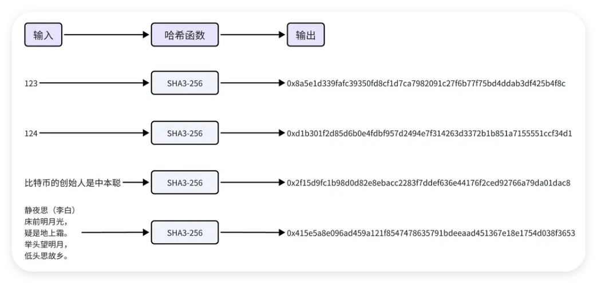
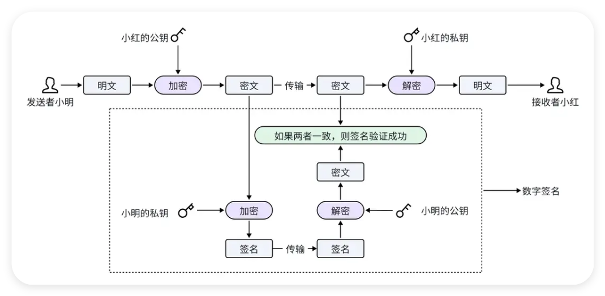
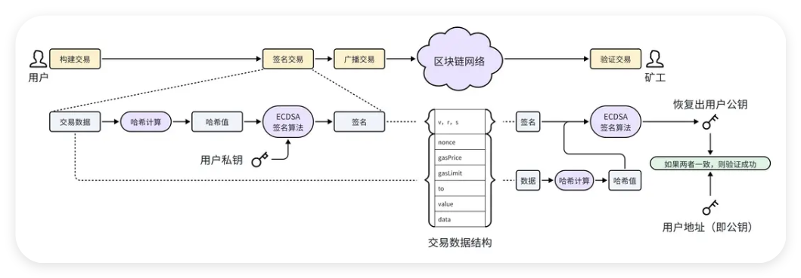
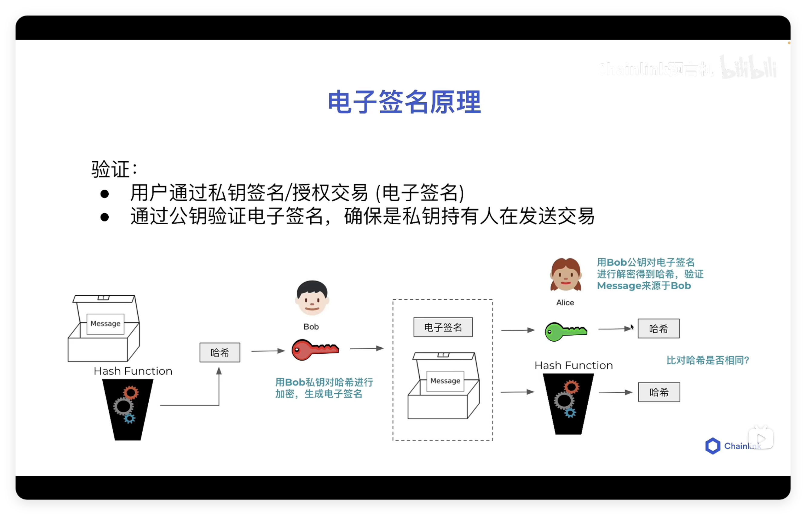

# 哈希函数和区块链链接

哈希函数的概念可以追溯到 20 世纪 50 年代, 当时它主要用于数据结构中, 如哈希表, 用来快速定位和检索数据. 后来哈希函数经历了一系列的发展, 旧的标准不断被更安全的新标准所替代: MD4 -> MD5 -> SHA0 -> SHA1 -> SHA2 -> SHA3. 目前最先进的标准是 SHA3, SHA3 基于 Keccak 算法, 由比利时密码学家设计, 并在 2015 年成为 NIST 的标准.

哈希函数, 也称为散列函数. 它将任意长度的输入 ( 通常称为 "消息" ) , 通过数学算法转换成固定长度的字符串, 这个输出通常称为哈希值,散列值,消息摘要或者数字指纹. 下图以 SHA3-256 哈希函数来展示, 无论输入什么, 输出都是一个长度为 64 的十六进制字符串.



哈希算法的特征:

1. 正向快速: 无论输入的长度有多大, 都能够快速计算出哈希值.

2. 逆向困难: 通过哈希值, 无法在有限时间内逆向推出输入.

3. 输入敏感: 输入的微小变化, 会导致输出的显著变化.

4. 避免碰撞: 很难找到两个不同的输入, 使得输出的哈希值一致 ( 即发生碰撞 ) .

5. 不可预测: 通过输入无法预测输出, 所以挖矿时随机数 nonce 只能从 1 开始累加.

区块链中的应用:

-   确保交易数据的完整性和不可篡改性. 每笔交易的哈希值都是独一无二的, 任何细微的数据变化都会导致哈希值的巨大变化, 使得网络参与者能够迅速发现交易数据被篡改的行为.

-   将各个区块串联起来形成区块链, 每个区块包含前一个区块的哈希值, 从而确保了链上数据的连贯性和不可逆性.

-   用于构建 Merkle 树以高效验证数据.

-   实施工作量证明机制来增强区块链的安全性, 通过解决计算难题来限制新区块的生成速度.

<br><br>

# 数字签名



第一步: 计算签名. 小明先使用自己的私钥对消息密文进行加密, 得到消息密文的签名, 再将签名附加到消息密文中一起传输, 发送给小红.

第二步: 恢复签名. 小红收到消息密文和签名之后, 使用公开获得的小明的公钥对签名进行解密, 得到消息密文.

第三步: 验证签名. 小红将收到的密文和解密签名恢复出来的密文进行对比, 如果两者一致, 则签名验证成功, 说明收到的信件确实是小明发出的, 同时还能证明信件在传输过程中没有被修改.

> 因为公私钥加密算法执行比较慢, 如果消息比较大, 签名过程会消耗很长时间. 所以在实际应用中, 一般先计算消息的哈希值, 再计算哈希值的签名, 这样可以减少签名耗时. ( 无论消息内容有多少, 计算的哈希值都是固定长度的 )

<br><br>

# 交易验证

在以太坊中, 数字签名技术用于交易验证, 确保交易的真实性、完整性. 交易验证主要有如下几步:

1. 用户签名交易. 用户将交易数据准备好后, 先计算出交易数据的哈希值, 再使用椭圆曲线签名算法 ( ECDSA ) 对哈希值进行签名, 将签名值 ( v, r, s ) 附加到交易数据中进行广播.

2. 矿工验证交易. 矿工接收到一笔交易之后, 同样, 先计算出交易数据 ( 不含签名 ) 的哈希值, 再使用椭圆曲线签名算法 ( ECDSA ) , 从签名和哈希值中恢复出用户公钥. 最后将恢复出的公钥与用户钱包地址做对比, 如果两者一致, 则交易验证成功.



对于初学者来说, 为了方便理解, 可以简单的认为用户钱包地址就是公钥. 但是请注意, 实际上两者并不相等, 用户钱包地址是由公钥先经过哈希计算, 再取末尾 20 个字节而来的.

<br><br>

# 钱包地址的生成过程

> 助记词 → 主密钥 → n 子密钥; 子密钥 (私钥) → 公钥; 公钥 → 地址

下面介绍一下钱包地址生成过程中, 涉及的几个关键步骤:

第一步: 生成种子. 种子是一个随机生成的数字序列, 是后续的起点. 种子可以由系统生成的随机数或用户提供的熵 ( 比如随机移动鼠标产生的数据 ) 来产生.

第二步: 生成助记词. 助记词是将种子转换成的一系列方便记忆的单词. 在以太坊中, 有一个固定的 2048 个单词的单词库, 首先将种子分割成多个二进制数据片段, 每一个片段对应单词库中的一个单词, 最终形成一串单词序列, 即助记词.

第三步: 生成私钥. 私钥是控制钱包地址的密钥. 使用上一步的种子, 通过 HMAC-SHA512 算法进行计算, 可以得到私钥.

第四步: 生成公钥. 有了私钥之后, 通过椭圆曲线加密算法 ( ECDSA ) , 我们可以计算出对应的公钥.

第五步: 生成地址. 最后一步是生成钱包地址. 首先使用 Keccak-256 哈希函数计算公钥的哈希值, 然后取哈希值的最后 20 个字节, 就是一个以太坊钱包地址.

<br><br>

# 信息传输



发送方 A:

1. 计算消息 message 的哈希值 H: `hash(message) = H`

2. 私钥 privateKey ➕ 哈希值 H 🟰 签名 signature: `signature = sign(H, privateKey)`

3. 将消息 message 和签名 signature 发送给 B

接收方 B:

1. 计算消息 message 的哈希值 H1: `hash(message) = H1`

2. 公钥 publicKey ➕ 签名 signature 🟰 H2: `H2 = verify(signature, publicKey)`

3. 比较 H1 和 H2, 如果相等 则说明消息未被篡改且确实来自 A

<br><br>

# Keccak256 函数

```solidity
contract HashFunc {
    function hash(
        string memory _testString,
        uint _testUint
    ) public pure returns (bytes32) {
    	// 先对数据进行编码, 再用 keccak256 加密
        return keccak256(abi.encodePacked(_testString, _testUint));
    }
}
```

encodePacked 方法可以对多个参数进行编码, 并压缩编码后的结果, 节省 gas. 但某些情况下会导致哈希碰撞 (哈希冲突).

为了避免哈希碰撞, 可以使用 encode 方法, 它不会压缩编码结果, 但会消耗更多 gas.

```solidity
contract HashFunc {
    function hash(
        string memory _testString,
        uint _testUint
    ) public pure returns (bytes32) {
        // 使用 encode 方法避免哈希碰撞
        return keccak256(abi.encode(_testString, _testUint));
    }
}
```

除了使用 encode 方法, 还可以在 encodePacked 的入参之间插入一个参数, 这样也能避免哈希碰撞.

```solidity
contract HashFunc {
    function hash(
        string memory _string1,
        uint _uint, // 用来避免哈希碰撞的参数
        string memory _string2
    ) public pure returns (bytes32) {
        // 在 encodePacked 的入参之间再插入一个参数, 避免哈希碰撞
        return keccak256(abi.encodePacked(_string1, _uint, _string2));
    }
}
```

<br><br>

# 签名与验证

```solidity
contract VerifySig {
    // 将一个 65 字节长的签名拆分成 r,s,v 三个部分
    function split(
        bytes memory _signature
    ) internal pure returns (bytes32 r, bytes32 s, uint8 v) {
        require(_signature.length == 65, "invalid signature length");
        assembly {
            // 从 _signature 的第 32 字节开始加载 32 字节的数据, 并将其赋值给 r
            // `从 _signature 的第 32 字节开始` 是因为前 32 字节是 _signature 的长度信息, 从 32 字节开始才是真正的签名数据
            r := mload(add(_signature, 32))
            // 从 _signature 的第 64 字节开始加载 32 字节的数据, 并将其赋值给 s
            s := mload(add(_signature, 64))
            // 从 _signature 的第 96 字节开始加载 32 字节的数据, 并取其第 1 个字节给 v
            v := byte(0, mload(add(_signature, 96)))
            // 在以太坊中, 签名通过椭圆曲线数字签名算法 (ECDSA, Elliptic Curve Digital Signature Algorithm) 创建
            // 其中 r s 是签名的一部分, v 是签名的恢复因子 (为 27 / 28), 用于恢复签名者的公钥
        }
    }

    // 计算给定消息的哈希值
    function getMessageHash(
        string memory _message
    ) public pure returns (bytes32) {
        return keccak256(abi.encodePacked(_message));
    }

    // 生成一个符合以太坊签名标准的消息哈希值
    function getEthSignedMessageHash(
        bytes32 _messageHash
    ) public pure returns (bytes32) {
        return
            keccak256(
                abi.encodePacked(
                    "\x19Ethereum Signed Message:\n32",
                    // 这是一个固定的前缀, 用于防止签名重用攻击
                    // 这个前缀告诉以太坊客户端这是一个签名消息, 而不是交易或其他数据
                    // \x19 表示消息的长度;  32 表示消息哈希的长度为 32 字节
                    _messageHash
                )
            );
    }

    // 从签名中恢复出签名者的地址
    function recover(
        bytes32 _ethSignedMessageHash,
        bytes memory _signature
    ) public pure returns (address) {
        (bytes32 r, bytes32 s, uint8 v) = split(_signature);
        return ecrecover(_ethSignedMessageHash, v, r, s);
    }

    // 验证消息的有效性 (签名者是否正确,消息是否被篡改)
    function verify(
        address _signer,
        string memory _message,
        bytes memory _signature
    ) public pure returns (bool) {
        bytes32 messageHash = getMessageHash(_message);
        bytes32 ethSignedMessageHash = getEthSignedMessageHash(messageHash);
        return recover(ethSignedMessageHash, _signature) == _signer;
    }
}
```

**部署合约并测试**:

模拟发送方 A:

1. 将要发送的消息作为参数传入 getMessageHash 方法, 得到消息的哈希值 H, 这里以字符串 "hello" 为例

2. F12 打开控制台, 执行 `ethereum.enable()`; 查看 Promise, 若为 fulfilled 状态则说明 MetaMask 已连接, 可查看 Promise 结果得到 MetaMask 的账号地址 (需要先安装 MetaMask 插件并登录)

3. 执行 `ethereum.request({ method: "personal_sign", params: [步骤 2 得到的 MetaMask 账号地址, 步骤 1 得到的哈希值 H] })`, 会弹出签名框, 点击 sign 进行签名; 查看 Promise, 若为 fulfilled 状态则说明签名成功, 可查看 Promise 结果得到签名 signature

4. 假设 A 将步骤 3 得到的签名 signature 和消息 "hello" 发送给了 B

模拟接收方 B:

1. 将收到的消息 "hello" 作为参数传入 getMessageHash 方法, 得到消息的哈希值

2. 将步骤 1 得到的哈希值作为参数传入 getEthSignedMessageHash 方法, 得到符合以太坊签名标准的消息哈希值 H1

3. 将步骤 2 得到的消息哈希值和收到的签名 signature 作为参数传入 recover 方法, 得到签名者的地址; 比对是否为 A 步骤 2 得到的 MetaMask 账号地址, 如果不一致 则说明信息被篡改 / 消息不是来自 A

步骤 1 2 3 即为 verify 方法的逻辑, 可直接调用 verify 方法进行验证

<br><br>

# 访问控制

```solidity
contract AccessControl {
    // 定义两个角色
    bytes32 public constant ROLE_ADMIN =
        keccak256(abi.encodePacked("ROLE_ADMIN"));
    bytes32 public constant ROLE_USER =
        keccak256(abi.encodePacked("ROLE_USER"));

    // 定义一个双重映射, 用于管理 "角色 - 用户 - 权限"
    mapping(bytes32 => mapping(address => bool)) public roles;

    // 分配权限
    function _grantRole(bytes32 _role, address _account) internal {
        roles[_role][_account] = true;
    }

    // 撤销权限
    function _revokeRole(bytes32 _role, address _account) internal {
        roles[_role][_account] = false;
    }

    // 构造函数
    constructor() {
        _grantRole(ROLE_ADMIN, msg.sender);
    }

    // 函数装饰器, 限制函数仅管理员能调用
    modifier onlyAdmin() {
        require(
            roles[ROLE_ADMIN][msg.sender],
            "AccessControl: sender must be an admin to perform this action"
        );
        _;
    }

    // 分配权限 (外部使用, 仅管理员能调用)
    function grantUserRole(address _account) public onlyAdmin {
        _grantRole(ROLE_USER, _account);
    }

    // 撤销权限 (外部使用, 仅管理员能调用)
    function revokeUserRole(address _account) public onlyAdmin {
        _revokeRole(ROLE_USER, _account);
    }
}
```

1. 部署合约, 部署者将成为管理员

2. 获取编辑器地址和 ROLE_ADMIN 的哈希值, 填入 roles 中查看权限, 此处应为 true

3. 更新编辑器地址, 获取新的编辑器地址和 ROLE_USER 的哈希值, 填入 roles 中查看权限, 此处应为 false

4. 传入新的编辑器地址, 使用管理员地址调用 grantUserRole 方法, 授权新的编辑器地址为 ROLE_USER

5. 获取新的编辑器地址和 ROLE_USER 的哈希值, 填入 roles 中查看权限, 此处应为 true

6. 传入新的编辑器地址, 使用管理员地址调用 revokeUserRole 方法, 取消新的编辑器地址的 ROLE_USER 权限

7. 获取新的编辑器地址和 ROLE_USER 的哈希值, 填入 roles 中查看权限, 此处应为 false

8. 不使用管理员地址调用 grantUserRole 方法, 会报错

<br><br>
