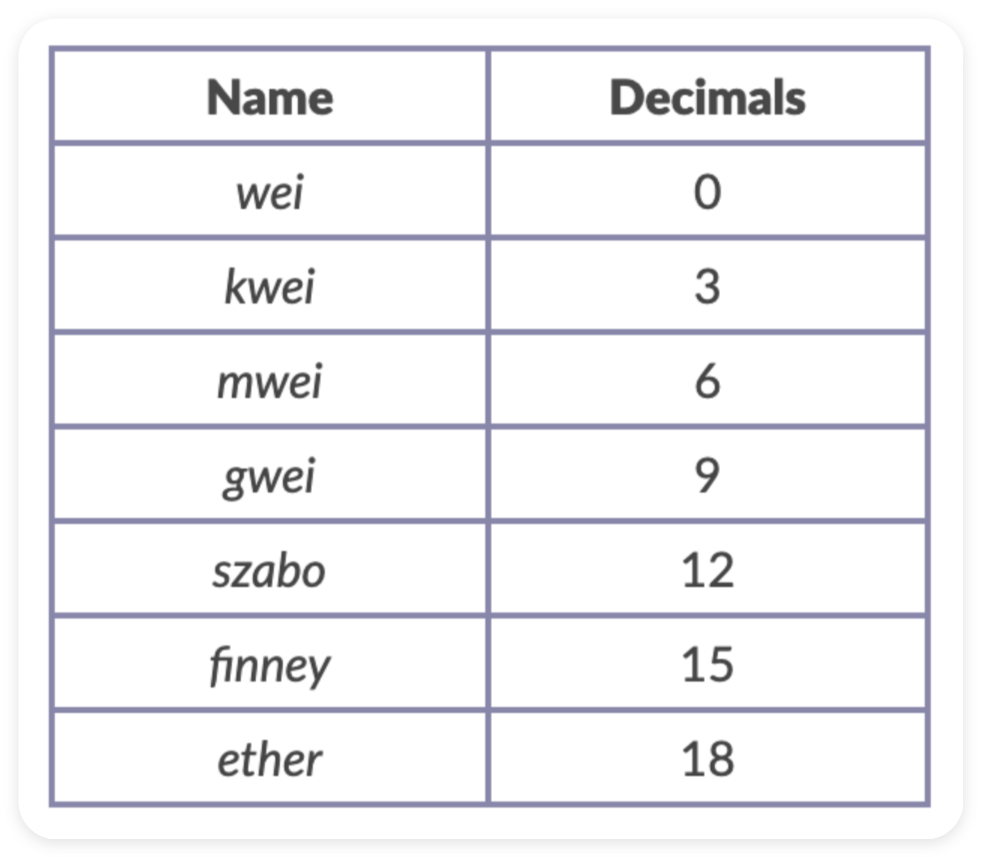

# EthersJS

EthersJS 是一个用于与以太坊区块链交互的 JS 库.

与更早出现的 Web3JS 相比, EthersJS 具有以下优势:

1. 体积更小: Web3JS (590.6 KB) - EthersJS (116.5 KB)

2. 安全性更高: Web3JS 假设用户会在本地部署以太坊节点, 并由该节点管理私钥和网络连接状态 (实际情况并非如此) ; EthersJS 则通过 Provider 类管理网络连接状态, 通过 Wallet 类管理密钥, 既安全又灵活.

3. 原生支持 ENS (Ethereum Name Service, 以太坊名称服务)

**demo**: 查询以太坊创始人 Vitalik Buterin 的 ETH 余额

```shell
pnpm i ethers@6
```

```js
import { ethers } from "ethers";

// 创建一个默认的以太坊主网提供者 provider
const provider = ethers.getDefaultProvider();

const main = async () => {
    // 通过 provider 获取指定 ENS (vitalik.eth) 的以太坊余额
    const balance = await provider.getBalance("vitalik.eth");
    // 将获取到的余额从 wei 单位转换为 ether 单位, 并输出到控制台
    console.log(`Vitalik 的以太坊地址余额: ${ethers.formatEther(balance)} ether`);
};

main();
```

<br><br>

# Unit Conversion



EthersJS 使用 JS ES2020 的 BigInt 类安全处理超出 JS 最大安全整数的值.

others → BigInt:

```js
// 十进制字符串
const value1 = ethers.getBigInt("100");
console.log(value1); // 100n

// 十进制数值, 需 < 2^53
const value2 = ethers.getBigInt(100);
console.log(value2); // 100n

// 十六进制字符串
const value3 = ethers.getBigInt("0x64");
console.log(value3); // 100n

// 十六进制数值
const value4 = ethers.getBigInt(0x64);
console.log(value4); // 100n

// BigInt
const value5 = ethers.getBigInt(100n);
console.log(value5); // 100n
```

BigInt 支持数学运算:

```js
const value = ethers.getBigInt("100");

// 加法
const sum = value + 1n;
console.log(`sum: ${sum}`); // 101

// 减法
const diff = value - 1n;
console.log(`diff: ${diff}`); // 99

// 乘法
const mul = value * 2n;
console.log(`mul: ${mul}`); // 200

// 除法
const div = value / 2n;
console.log(`div: ${div}`); // 50

// 取模
const mod = value % 2n;
console.log(`mod: ${mod}`); // 0
```

BigInt 支持比较运算:

```js
const value = ethers.getBigInt("100");

// 等于
const eq = value === 100n;
console.log(`eq: ${eq}`); // true

// 大于
const gt = value > 100n;
console.log(`gt: ${gt}`); // false

// 小于
const lt = value < 100n;
console.log(`lt: ${lt}`); // false

// 大于等于
const gte = value >= 100n;
console.log(`gte: ${gte}`); // true

// 小于等于
const lte = value <= 100n;
console.log(`lte: ${lte}`); // true
```

钱包界面的余额单位为 ether,gas 价格单位为 gwei, 但是在交易时, 两者都必须转换成单位 wei. EthersJS 提供了一些功能函数, 方便这类转换:

-   `formatUnits(变量, 位数/单位)`: 小单位 → 大单位 (eg: wei → ether), 在显示余额时很有用
-   `parseUnits(变量, 位数/单位)`: 大单位 → 小单位 (eg: ether → wei), 在发送交易时很有用

```js
const oneGwei = ethers.getBigInt("1000000000");

console.log(ethers.formatUnits(oneGwei, "gwei"));
// '1.0'
console.log(ethers.formatUnits(oneGwei, 9));
// '1.0'

console.log(ethers.formatUnits(oneGwei, "ether"));
// '0.000000001'
console.log(ethers.formatUnits(oneGwei, 18));
// '0.000000001'
console.log(ethers.formatUnits(oneGwei)); // 默认
// '0.000000001'

console.log(ethers.formatEther(oneGwei)); // formatEther === 默认的 formatUnits
// '0.000000001'
```

```js
const oneEther = "1.0";

console.log(ethers.parseUnits(oneEther, "gwei"));
// 1000000000n
console.log(ethers.parseUnits(oneEther, 9));
// 1000000000n

console.log(ethers.parseUnits(oneEther, "ether"));
// 1000000000000000000n
console.log(ethers.parseUnits(oneEther, 18));
// 1000000000000000000n
console.log(ethers.parseUnits(oneEther)); // 默认
// 1000000000000000000n

console.log(ethers.parseEther(oneEther)); // parseEther === 默认的 parseUnits
// 1000000000000000000n
```

<br><br>

# Provider

Provider 是 EthersJS 中用于连接以太坊网络的抽象类, 提供对区块链的只读访问.

EthersJS 内置了一些公共 RPC (Remote Procedure Call, 远程过程调用), 方便用户连接以太坊. 但 EthersJS 内置的 RPC 速度较慢, 仅供测试使用. 在生产环境中, 建议申请个人 RPC, 例如 [Infura](https://app.infura.io/) 或 [Alchemy](https://dashboard.alchemy.com/) .

**连接节点**:

除了之前提到的默认提供者 defaultProvider, EthersJS 中最常用的提供者是 JsonRpcProvider, 它允许用户连接特定节点.

我们可以在节点服务商的网站 (如 Infura 或 Alchemy) 注册并创建 API Key, 也还可以在 [Chainlist](https://chainlist.org/) 找到各个链的公开节点.

这里, 我们以 Chainlist 上面的公开节点为例. 以下是分别连接到 ETH 主网和 ETH Sepolia 测试网的 provider 创建示例:

```js
// 使用以太坊主网的 RPC 创建 provider
const ETH_MAINNET_RPC_URL = "https://rpc.ankr.com/eth";
const mainnetProvider = new ethers.JsonRpcProvider(ETH_MAINNET_RPC_URL);

// 使用以太坊 Sepolia 测试网的 RPC 创建 provider
const SEPOLIA_TESTNET_RPC_URL = "https://rpc.sepolia.org";
const sepoliaProvider = new ethers.JsonRpcProvider(SEPOLIA_TESTNET_RPC_URL);
```

**利用 provider 读取链上数据**:

1. getBalance: 查询指定地址的 ETH 余额 (测试网目前不支持 ENS, 只能用地址查询):

```js
const mainnetBalance = await mainnetProvider.getBalance(`vitalik.eth`);
console.log(`Vitalik 在主网的余额: ${ethers.formatEther(mainnetBalance)} ether`);

const sepoliaBalance = await sepoliaProvider.getBalance(`0xd8dA6BF26964aF9D7eEd9e03E53415D37aA96045`);
console.log(`Vitalik 在 Sepolia 测试网的余额: ${ethers.formatEther(sepoliaBalance)} ether`);
```

2. getNetwork: 查询当前连接的网络信息:

```js
const mainnetNetwork = await mainnetProvider.getNetwork();
console.log(`主网的网络信息: ${JSON.stringify(mainnetNetwork, null, 4)}`);
// { "name": "homestead", "chainId": 1 }

const sepoliaNetwork = await sepoliaProvider.getNetwork();
console.log(`Sepolia 测试网的网络信息: ${JSON.stringify(sepoliaNetwork, null, 4)}`);
// { "name": "sepolia", "chainId": 11155111 }
```

3. getBlockNumber: 查询当前区块高度

```js
const mainnetBlockNumber = await mainnetProvider.getBlockNumber();
console.log(`主网当前的区块高度: ${mainnetBlockNumber}`);

const sepoliaBlockNumber = await sepoliaProvider.getBlockNumber();
console.log(`Sepolia 测试网当前的区块高度: ${sepoliaBlockNumber}`);
```

4. getBlock: 查询指定区块的信息

```js
const mainnetBlock = await mainnetProvider.getBlock(0);
console.log(`主网区块 0 的信息: ${JSON.stringify(mainnetBlock, null, 4)}`);
// { "_type": "Block", "difficulty": ..., "gasLimit": "5000", "gasUsed": "0", "hash": ..., ... }

const sepoliaBlock = await sepoliaProvider.getBlock(0);
console.log(`Sepolia 测试网区块 0 的信息: ${JSON.stringify(sepoliaBlock, null, 4)}`);
// { "_type": "Block", "difficulty": ..., "gasLimit": "30000000", "gasUsed": "0", "hash": ..., ... }
```

5. getTransactionCount: 查询指定地址的交易次数

```js
const mainnetTransactionCount = await mainnetProvider.getTransactionCount(`vitalik.eth`);
console.log(`Vitalik 在主网的交易次数: ${mainnetTransactionCount}`);

const sepoliaTransactionCount = await sepoliaProvider.getTransactionCount(`0xd8dA6BF26964aF9D7eEd9e03E53415D37aA96045`);
console.log(`Vitalik 在 Sepolia 测试网的交易次数: ${sepoliaTransactionCount}`);
```

6. getFeeData: 查询当前建议的 gas 费用数据

```js
const mainnetFeeData = await mainnetProvider.getFeeData();
console.log(`主网当前建议的 gas 费用数据: ${JSON.stringify(mainnetFeeData, null, 4)}`);
// { "_type": "FeeData", "gasPrice": ..., "maxFeePerGas": ..., "maxPriorityFeePerGas": ... }

const sepoliaFeeData = await sepoliaProvider.getFeeData();
console.log(`Sepolia 测试网当前建议的 gas 费用数据: ${JSON.stringify(sepoliaFeeData, null, 4)}`);
// { "_type": "FeeData", "gasPrice": ..., "maxFeePerGas": ..., "maxPriorityFeePerGas": ... }
```

7. getCode: 查询指定地址的合约字节码

```js
// 本例使用主网 WETH 合约的地址
const mainnetCode = await mainnetProvider.getCode(`0xc778417e063141139fce010982780140aa0cd5ab`);
console.log(`主网 WETH 合约的字节码: ${mainnetCode}`);
```

<br><br>

# Signer & Wallet

在 EthersJS 中, Signer 类是以太坊账户的抽象, 用于对消息和交易进行签名, 并将签名的交易发送到以太坊网络, 从而更改区块链状态. Signer 类是一个抽象类, 不能直接实例化, 我们需要使用它的子类: Wallet.

Wallet 继承 Signer, 并且开发者可以像包含私钥的外部拥有帐户 (EOA) 一样, 用它对交易和消息进行签名.

**代码示例**:

1. 创建 Provider 实例

```js
const infuraKey = "infuraKey...";
const provider = new ethers.JsonRpcProvider(`https://sepolia.infura.io/v3/${infuraKey}`);
```

2. 创建 Wallet 实例

方法 1 - `ethers.Wallet.createRandom()`, 创建带有随机私钥的 wallet 对象; 该私钥由加密安全的熵源生成, 如果当前环境没有安全的熵源, 则会抛出错误.

方法 2 - `new ethers.Wallet(privateKey, provider)`

方法 3 - `ethers.Wallet.fromPhrase(phrase)`

方法 4 - `ethers.Wallet.fromEncryptedJson(keystoreJson)`, 解密 JSON 钱包文件并创建 wallet 对象; JSON 文件即 keystore 文件, 通常来自 Geth,Parity 等钱包.

```js
// 创建随机的 wallet 对象
const wallet1 = ethers.Wallet.createRandom();

// 通过私钥创建 wallet 对象; 这种方法创建的钱包获取不到助记词
const privateKey = "your-private-key";
const wallet2 = new ethers.Wallet(privateKey, provider);

// 通过助记词创建 wallet 对象
const phrase = wallet1.mnemonic.phrase; // 获取 wallet1 的助记词
const wallet3 = ethers.Wallet.fromPhrase(phrase);
```

3. 获取钱包地址

```js
// 方式 1
console.log(`wallet1 address: ${wallet1.address}`);
console.log(`wallet2 address: ${wallet2.address}`);
console.log(`wallet3 address: ${wallet3.address}`);

// 方式 2
console.log(`wallet1 address: ${await wallet1.getAddress()}`);
console.log(`wallet2 address: ${await wallet2.getAddress()}`);
console.log(`wallet3 address: ${await wallet3.getAddress()}`);
```

4. 获取助记词信息

```js
console.log(`wallet1 mnemonic: ${JSON.stringify(wallet1.mnemonic, null, 4)}`);
// { "phrase": ..., "password": ..., "wordlist": ..., "entropy": ... }

console.log(`wallet2 mnemonic: ${JSON.stringify(wallet2.mnemonic, null, 4)}`);
// undefined

console.log(`wallet3 mnemonic: ${JSON.stringify(wallet3.mnemonic, null, 4)}`);
// { "phrase": ..., "password": ..., "wordlist": ..., "entropy": ... }
```

5. 获取私钥

```js
console.log(`wallet1 private key: ${wallet1.privateKey}`);
console.log(`wallet2 private key: ${wallet2.privateKey}`);
console.log(`wallet3 private key: ${wallet3.privateKey}`);
```

6. 获取钱包在链上的交互次数

```js
console.log(`wallet1 nonce: ${await provider.getTransactionCount(wallet1.address)}`);
console.log(`wallet2 nonce: ${await provider.getTransactionCount(wallet2.address)}`);
console.log(`wallet3 nonce: ${await provider.getTransactionCount(wallet3.address)}`);
```

7. 发送 ETH

用 wallet2 给 wallet1 发送 0.005 ether, 并打印交易前后的钱包余额. 如果钱包没钱, 可以去水龙头领一些 ( eg: [Chainlink Faucets](https://faucets.chain.link/) ) .

```js
// 查询余额
const balance1 = await provider.getBalance(wallet1.address);
const balance2 = await provider.getBalance(wallet2.address);
console.log(`wallet1 balance: ${ethers.formatEther(balance1)} ether`);
console.log(`wallet2 balance: ${ethers.formatEther(balance2)} ether`);

// 转账: wallet2 -> wallet1
const txResponse = await wallet2.sendTransaction({
    to: wallet1.address, // 接收地址
    value: ethers.parseEther("0.005"), // 转账金额
});
await txResponse.wait(); // 等待链上交易确认
console.log("txResponse:", JSON.stringify(txResponse, null, 4));
// { "_type": "TransactionResponse", "signature": ..., "to": ..., "value": ..., ... }

// 查询余额
const balance3 = await provider.getBalance(wallet1.address);
const balance4 = await provider.getBalance(wallet2.address);
console.log(`wallet1 balance: ${ethers.formatEther(balance3)} ether`);
console.log(`wallet2 balance: ${ethers.formatEther(balance4)} ether`);
```

<br><br>
