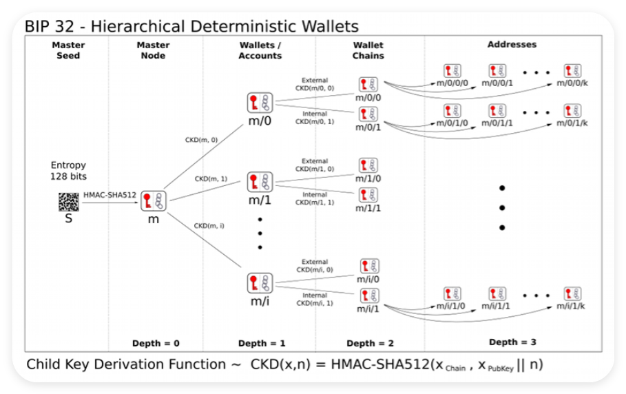

# HD Wallet

HD Wallet (Hierarchical Deterministic Wallet, 多层确定性钱包) 是一种数字钱包技术, 通常用于管理加密货币的数字密钥. 通过它, 用户可以从一个随机种子生成多个密钥对, 更加便利、安全. 要理解 HD 钱包, 我们需要了解 3 个关键的比特币改进提案 (BIP) : BIP32、BIP39、BIP44 .

<br><br>

# BIP32

在 BIP32 推出之前, 用户需要记录一堆私钥才能管理很多钱包. BIP32 提出可以用一个随机种子衍生多个私钥, 更方便地管理多个钱包. 钱包的地址由衍生路径决定, 例如 "m/0/0/1" .



<br><br>

# BIP44

BIP44 为 BIP32 的衍生路径提供了一套通用规范. 这一套规范包含六级, 每级之间用 "/" 分割:

```
m / purpose' / coin_type' / account' / change / address_index
```

1.  `m`: 固定为 `m`

2.  `purpose`: 固定为 `44`

3.  `coin_type`: 代币类型, 比特币主网为 0、比特币测试网为 1、以太坊主网为 60

4.  `account`: 账户索引, 从 0 开始

5.  `change`: 外部链为 0, 内部链为 1；一般填 0

6.  `address_index`: 地址索引, 从 0 开始

eg. `m/44'/60'/0'/0/0` 为以太坊的默认衍生路径.

<br><br>

# BIP39

BIP39 让用户能以一些人类可记忆的助记词的方式保管私钥, 而不是一串 16 进制的数字:

```
// 私钥
0x813f8f0a4df26f6455814fdd07dd2ab2d0e2d13f4d2f3c66e7fd9e3856060f89

// 助记词
air organ twist rule prison symptom jazz cheap rather dizzy verb glare jeans orbit weapon universe require tired sing casino business anxiety seminar hunt
```

<br><br>

# 批量生成钱包

EthersJS 提供了 HDNodeWallet 类, 方便开发者使用 HD 钱包. 下面我们利用它从一个助记词批量生成 3 个钱包.

1. 创建 baseWallet 钱包变量

```js
// 通过 32 字节的随机数生成随机助记词
const mnemonic = ethers.Mnemonic.entropyToPhrase(ethers.randomBytes(32));
console.log(`助记词: ${mnemonic}`);

// 创建 HD 基钱包; 基路径: "m / purpose' / coin_type' / account' / change"
const basePath = "44'/60'/0'/0";
const baseWallet = ethers.HDNodeWallet.fromPhrase(mnemonic, basePath);
console.log(`基钱包: ${JSON.stringify(baseWallet, null, 4)}`);
// { "address": "0x...", "publicKey": "0x...", "mnemonic": ..., "path": "m/44'/60'/0'/0/0", ...  }
```

2. 从基础钱包派生 3 个子钱包

```js
const numWallet = 3;

// 派生路径: 基路径 + "/ address_index"
// 我们只需要提供最后一位 address_index 的字符串格式, 就可以从 baseWallet 派生出新钱包
let wallets = [];
for (let i = 0; i < numWallet; i++) {
    // V5 写法:
    // let hdNodeNew = baseWallet.derivePath(basePath + "/" + i.toString());
    // let baseWalletNew = new ethers.Wallet(hdNodeNew.privateKey);

    // V6 写法:
    let baseWalletNew = baseWallet.derivePath(i.toString());

    console.log(`第 ${i + 1} 个钱包地址:  ${baseWalletNew.address}`);
    wallets.push(baseWalletNew);
}
console.log(`派生出 ${numWallet} 个钱包: ${JSON.stringify(wallets, null, 4)}`);
// [ { "address": "0x...", "publicKey": "0x...", "mnemonic": ..., "path": "m/44'/60'/0'/0/0/0", ...  }, ... ]
```

3. 保存钱包为加密 JSON & 从加密 JSON 中读取钱包

```js
const wallet = ethers.Wallet.fromPhrase(mnemonic);
console.log(`通过助记词创建钱包: ${JSON.stringify(wallet, null, 4)}`);
// { "address": "0x...", "publicKey": "0x...", "mnemonic": ..., "path": "m/44'/60'/0'/0/0", ...  }

const pwd = "password"; // 加密 JSON 用的密码, 可以更改成别的
const json = await wallet.encrypt(pwd);
const jsonObj = JSON.parse(json);
console.log(`钱包的加密 JSON: ${JSON.stringify(jsonObj, null, 4)}`);
// { "address": ..., "publicKey": ..., "mnemonic": ..., "path": "m/44'/60'/0'/0/0", ...  }

const walletFromJson = await ethers.Wallet.fromEncryptedJson(json, pwd);
console.log(`从加密 JSON 中读取钱包: ${JSON.stringify(walletFromJson, null, 4)}`);
// { "address": "0x...", "publicKey": "0x...", "mnemonic": ..., "path": "m/44'/60'/0'/0/0", ...  }
```

<br><br>
