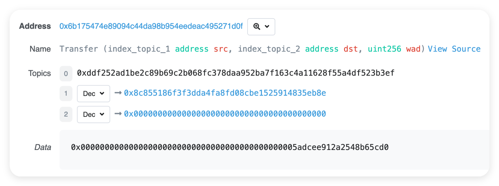

# 函数

Solidity 函数的定义格式如下:

```
function
函数名(参数类型1 参数名名称1, ...)
{internal|external|public|private}
[pure|view|payable]
[returns (返回值类型1 [返回值名称1], ...)] {
    // 函数体
}
```

<br><br>

# 构造函数

构造函数仅在合约部署时调用一次, 主要用于初始化状态变量.

```solidity
contract Demo {
    address public owner;
    uint public num;

    constructor(uint _num) {
        owner = msg.sender;
        num = _num;
    }
}
```

在 Solidity 中, 构造函数的可见性默认是 `public`. 这意味着任何人都可以调用这个构造函数来创建合约的实例.

有几种常见的情况可能需要改变构造函数的可见性：

1. 如果您希望合约只能在当前合约所在的文件内部被创建实例, 而不允许外部合约或用户直接创建, 就可以把构造函数的可见性设置为 `internal`.

2. 当您的合约是作为一个基础合约, 被其他继承它的合约使用, 并且不希望被随意在外部创建实例时, 就适合这样设置.

3. 当您的合约创建过程涉及一些复杂的内部逻辑和权限控制, 只有特定的内部函数或合约能够正确处理创建过程, 这时也可以把可见性设为 `internal`, 以保证合约创建的安全性和正确性.

4. 如果您的合约是一个库合约 (Library Contract) , 通常也会把构造函数设为 `internal`, 因为库合约一般不是用来直接创建实例的.

<br><br>

# 使用键值输入调用函数

键值输入允许你在调用函数时指定参数的名称, 而不是仅仅按顺序提供参数值. 这在参数较多或参数顺序容易混淆的情况下特别有用.

```solidity
contract Demo {
    // 定义一个函数, 接受两个参数
    function setValues(uint key, uint value) public pure returns (uint, uint) {
        return (key, value);
    }

    function callSetValues() public pure returns (uint, uint) {
        // 使用键值输入调用 setValues 函数
        return setValues({value: 42, key: 7});
    }
}
```

<br><br>

# 函数输出

1.  单输出:

```solidity
contract Demo {
    function getSingleNumber() public pure returns (uint) {
        return 42;
    }
}
```

2.  多输出:

```solidity
contract Demo {
    function getMultipleNumbers()
        public
        pure
        returns (uint, uint, uint[3] memory)
    {
        return (1, 2, [3, uint(4), 5]);
        // [3, 4, 5] 默认被视为 uint8[3]; 要创建 uint 数组, 需要至少一个元素显式转换 uint
    }
}
```

3.  命名输出:

```solidity
contract Demo {
    function getNamedNumbers1() public pure returns (uint first, uint second) {
        first = 3;
        second = 4;
    }

    // 相当于

    function getNamedNumbers2() public pure returns (uint, uint) {
        uint first;
        uint second;
        first = 3;
        second = 4;
        return (first, second);
    }
}
```

当然啦, 即使使用了命名输出, 也仍可在函数体中使用 return 显式返回, 且 return 的返回值优先级更高.

-   获取函数返回值:

```solidity
contract Demo {
    // ...

    function callFunctions()
        public
        pure
        returns (uint, uint, uint, uint[3] memory, uint)
    {
        uint singleNumber = getSingleNumber(); // 获取单个返回值
        (uint a, uint b, uint[3] memory c) = getMultipleNumbers(); // 获取多个返回值
        (, uint y) = getNamedNumbers1(); // 获取多个返回值的一部分
        return (singleNumber, a, b, c, y);
    }
}
```

<br><br>

# 流程控制

if-else:

```solidity
function testIf(uint a, uint b) public pure returns (uint) {
    if (a > b) {
        return a;
    } else {
        return b;
    }
}
```

三元运算符:

```solidity
function testTernary(uint a, uint b) public pure returns (uint) {
    return a > b ? a : b;
}
```

注意: Solidity 不支持 switch-case 语句

<br>

for 循环:

```solidity
function forLoop() public pure returns (uint) {
    uint sum = 0;
    for (uint i = 0; i < 10; i++) {
        if (i == 3) continue;
        if (i == 5) break;
        sum += i;
    }
    return sum;
}
```

while 循环:

```solidity
function whileLoop() public pure returns (uint) {
    uint sum = 0;
    uint i = 0;
    while (i < 10) {
        if (i == 3) {
            i++;
            continue;
        }
        if (i == 5) break;
        sum += i;
        i++;
    }
    return sum;
}
```

do while 循环:

```solidity
function doWhileLoop() public pure returns (uint) {
    uint sum = 0;
    uint i = 0;
    do {
        if (i == 3) { i++; continue; }
        if (i == 5) break;
        sum += i;
        i++;
    } while (i < 10);
    return sum;
}
```

关键字 continue,break 也可以在 Solidity 中使用.

<br><br>

# 函数重载

Solidity 允许函数重载, 即名字相同但输入参数类型/数量不同的函数可以同时存在.

```solidity
contract Demo {
    function saySomething() public pure returns (string memory) {
        return "Nothing";
    }

    function saySomething(
        string memory something
    ) public pure returns (string memory) {
        return something;
    }
}
```

重载函数在编译后会变成不同的函数选择器.

如果出现多个匹配的重载函数, 则会报错.

```solidity
contract Demo {
    uint public x;

    function f(uint8 _in) public pure returns (uint8 out) {
        out = _in;
    }

    function f(uint _in) public pure returns (uint out) {
        out = _in;
    }
}
```

在上面的例子中, 如果调用 `f(42)`, 编译器会报错. 因为 42 既可以匹配 `f(uint8)` 也可以匹配 `f(uint)` .

<br><br>

# Event

Event (事件) 是 EVM 上日志的抽象.

用途: ① 记录交易日志, 辅助调试和监控; ② 允许应用程序 (如 EthersJS) 通过 RPC 接口订阅和监听.

特点: 事件是 EVM 上比较经济的数据存储方式, 每个事件消耗约 2,000 gas; 相比之下, 链上存储一个新变量至少需要 20,000 gas .

```solidity
contract Demo {
    event Transfer(address indexed from, address indexed to, uint value); // 定义事件

    function transfer(address _to, uint _value) public {
        emit Transfer(msg.sender, _to, _value); // 释放事件
    }
}
```

EVM 用日志 (Log) 来存储事件, 每条日志记录都包含 [主题 topics] 和 [数据 data] 两部分.



**topics**:

日志的第 1 部分是 topics 数组, 用于描述事件. 长度不能超过 4 . 第 1 个元素是事件的签名 (哈希) . 上例 Transfer 事件的哈希就是:

```solidity
keccak256("Transfer(address,address,uint256)")
// 0xddf252ad1be2c89b69c2b068fc378daa952ba7f163c4a11628f55a4df523b3ef
```

除了事件哈希, topics 还可以包含至多 3 个 indexed 参数, 形如 Transfer 事件中的 from 和 to .

indexed 参数可以理解为事件的 "键", 便于检索.

每个 indexed 参数的大小为 256 比特, 如果参数太大 (如字符串) , 会自动计算哈希再存储.

**data**:

存储非 indexed 参数, 可以理解为事件的 "值". data 部分的变量不能直接检索, 但可以存储任意大小的数据, 适合存储复杂的数据结构 (如数组和字符串) . data 部分的变量在存储上消耗的 gas 比 topics 少.

<br><br>
