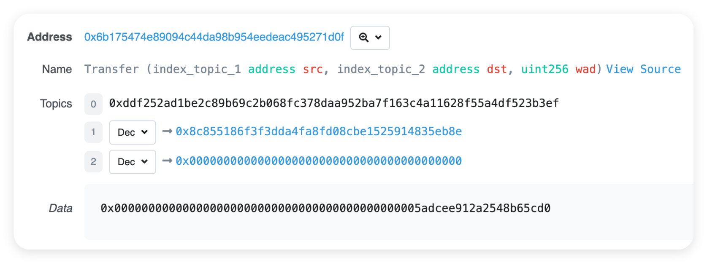

# Event

Event (事件) 是 EVM 上日志的抽象。

用途：① 记录交易日志，辅助调试和监控； ② 允许应用程序 (如 EthersJS) 通过 RPC 接口订阅和监听。

特点：事件是 EVM 上比较经济的数据存储方式，每个事件消耗约 2,000 gas；相比之下，链上存储一个新变量至少需要 20,000 gas 。

```solidity
contract Demo {
    event Transfer(address indexed from, address indexed to, uint value); // 定义事件

    function transfer(address _to, uint _value) public {
        emit Transfer(msg.sender, _to, _value); // 释放事件
    }
}
```

EVM 用日志 (Log) 来存储事件，每条日志记录都包含 [主题 topics] 和 [数据 data] 两部分。



**topics**：

日志的第 1 部分是 topics 数组，用于描述事件。长度不能超过 4 。第 1 个元素是事件的签名（哈希）。上例 Transfer 事件的哈希就是：

```solidity
keccak256("Transfer(address,address,uint256)")
// 0xddf252ad1be2c89b69c2b068fc378daa952ba7f163c4a11628f55a4df523b3ef
```

除了事件哈希，topics 还可以包含至多 3 个 indexed 参数，形如 Transfer 事件中的 from 和 to 。

indexed 参数可以理解为事件的 "键"，便于检索。

每个 indexed 参数的大小为 256 比特，如果参数太大（如字符串），会自动计算哈希再存储。

**data**：

存储非 indexed 参数，可以理解为事件的 "值"。data 部分的变量不能直接检索，但可以存储任意大小的数据，适合存储复杂的数据结构（如数组和字符串）。data 部分的变量在存储上消耗的 gas 比 topics 少。

<br><br>

# Library

库（Library）用于定义常用的功能函数，能在多个合约中复用。

1.  库不能定义状态变量

2.  库不能继承其他合约，也不能被其他合约继承

3.  库不能接收以太币

4.  推荐使用 internal 修饰 Library 的方法

使用方式 1：

```solidity
library Math {
    function max(uint a, uint b) internal pure returns (uint) {
        return a >= b ? a : b;
    }
}

contract Test {
    function test() public pure returns (uint) {
        return Math.max(1, 2); // 通过库名 Math 调用里面的方法 max
    }
}
```

使用方式 2：

```solidity
library ArrayLib {
    function findIndex(
        uint[] memory arr,
        uint value
    ) internal pure returns (int) {
        for (uint i = 0; i < arr.length; i++) {
            if (arr[i] == value) {
                return int(i);
            }
        }
        return -1;
    }
}

contract Test {
    using ArrayLib for uint[]; // 通过库名 ArrayLib 增强类型 uint[]

    uint[] public arr = [1, 2, 3, 4, 5];

    function findIndex(uint value) public view returns (int) {
        return arr.findIndex(value); // uint[] 类型的变量可直接调用 ArrayLib 里面的方法 findIndex
    }
}
```

<br><br>

# 流程控制

if-else：

```solidity
function testIf(uint a, uint b) public pure returns (uint) {
    if (a > b) {
        return a;
    } else {
        return b;
    }
}
```

三元运算符：

```solidity
function testTernary(uint a, uint b) public pure returns (uint) {
    return a > b ? a : b;
}
```

注意：Solidity 不支持 switch-case 语句

<br>

for 循环：

```solidity
function forLoop() public pure returns (uint) {
    uint sum = 0;
    for (uint i = 0; i < 10; i++) {
        if (i == 3) continue;
        if (i == 5) break;
        sum += i;
    }
    return sum;
}
```

while 循环：

```solidity
function whileLoop() public pure returns (uint) {
    uint sum = 0;
    uint i = 0;
    while (i < 10) {
        if (i == 3) {
            i++;
            continue;
        }
        if (i == 5) break;
        sum += i;
        i++;
    }
    return sum;
}
```

do while 循环：

```solidity
function doWhileLoop() public pure returns (uint) {
    uint sum = 0;
    uint i = 0;
    do {
        if (i == 3) { i++; continue; }
        if (i == 5) break;
        sum += i;
        i++;
    } while (i < 10);
    return sum;
}
```

关键字 continue、break 也可以在 Solidity 中使用。

<br><br>

# Gas Golf

Gas Golf 表示一些优化智能合约的手段，以减少 gas 消耗。

gas 是执行交易和智能合约所需的计算资源的度量单位。通过优化代码，可以显著降低交易成本，提高合约效率。

以下是一些常见的 gas 优化技巧：

1. **使用 calldata 代替 memory**

calldata 表示只读的数据位置，适用于函数参数。

```solidity
function example(uint[] calldata nums) external {
    // 使用 calldata 代替 memory
}
```

2. **使用前置递增运算符**

在循环中，使用 `++i` 代替 `i++` 可以节省 gas 。

```solidity
for (uint i = 0; i < nums.length; ++i) {
    // 使用 ++i 代替 i++
}
```

3. **短路求值**

在逻辑运算中，使用短路求值可以避免不必要的计算，从而节省 gas 。

```solidity
if (condition1 && condition2) {
    // 如果 condition1 为 false，则不会计算 condition2
}
```

4. **使用 unchecked 块**

Solidity 0.8.0 之后，会自动检查数学运算是否溢出。这提高了代码安全性，但也增加了 gas 消耗。如果你确定不会溢出且想节省 gas，可以使用 `unchecked` 跳过检查：

```solidity
function checkedAdd(uint8 a, uint8 b) public pure returns (uint8) {
    return a + b; // 如果 a + b 溢出, 会抛出异常并回滚
}

function uncheckedAdd(uint8 a, uint8 b) public pure returns (uint8) {
    unchecked {
        return a + b; // 如果 a + b 溢出, 会截断结果并返回
    }
}
```

5. **将常访问的值缓存到内存中**

```solidity
uint[] public nums;

function example() external view {
    uint[] memory _nums = nums; // 1️⃣ 缓存常访问的状态变量
    uint len = _nums.length; // 2️⃣ 缓存数组长度
    for (uint i = 0; i < nums.length; i++) {
        uint num = nums[i]; // 3️⃣ 存储尝访问的数组元素
    }
}
```

**demo**：

```solidity
// 未优化的代码
function sumIfEvenAndLessThan99(uint[] memory nums) external {
    for (uint i = 0; i < nums.length; i++) {
        bool isEven = nums[i] % 2 == 0;
        bool isLessThan99 = nums[i] < 99;
        if (isEven && isLessThan99) {
            total += nums[i];
        }
    }
}

// 优化后的代码
function sumIfEvenAndLessThan99(uint[] calldata nums) external {
    uint _total = total;
    uint len = nums.length;
    for (uint i = 0; i < len;) {
        uint num = nums[i];
        if (num % 2 == 0 && num < 99) {
            _total += num;
        }
        unchecked {
            ++i;
        }
    }
    total = _total;
}
```

<br><br>
