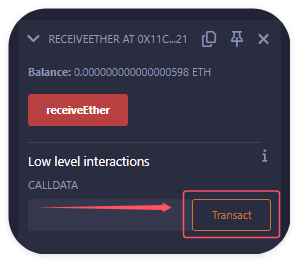

# payable 修饰符

以下函数需要使用 payable 修饰: ① 需要接收以太币的函数; ② 需要使用 `msg.value` / `callvalue()` 且可被外部访问的函数.

```solidity
contract Demo {
    // 使用 payable 修饰构造函数, 使合约可以在部署时接收以太币
    constructor() payable {
        require(msg.value > 0, "Must send some Ether");
    }

    // 使用 payable 修饰函数, 使合约可以在调用此函数时接收以太币
    function receiveEther() external payable {
        require(msg.value > 0, "Must send some Ether");
    }

    // 提现函数, 将合约中的以太币发送给调用者
    function withdraw() external {
        uint amount = address(this).balance;
        require(amount > 0, "No Ether to withdraw");
        payable(msg.sender).transfer(amount);
    }

    // 获取合约的以太币余额
    function getBalance() external view returns (uint) {
        return address(this).balance;
    }
}
```

1.  设置以太币的数量, 部署 Demo 合约

2.  调用 getBalance 函数, 查看合约的以太币余额

3.  设置以太币的数量, 调用 receiveEther 函数

4.  调用 getBalance 函数, 查看合约的以太币余额

5.  调用 withdraw 函数, 将合约中的以太币发送给调用者

6.  再次调用 getBalance 函数, 查看合约的以太币余额

<br><br>

# receive & fallback 方法

receive & fallback 是一种特殊的函数. Solidity 0.8 之前, 它们不需要 `function` 关键字、没有参数、也没有返回值.

特性:

-   receive & fallback 函数必须声明为 `external`, 表示只能通过外部调用来触发.
-   receive 必须使用 `payable` 修饰符; fallback 可以使用 `payable` 修饰符.

receive & fallback 的区别:

-   receive: 专门用于处理没有附加数据的以太币转账.
-   fallback: 用于处理所有其他情况, 包括调用不存在的函数或接收带有附加数据的以太币转账. fallback 函数还可以用于代理合约 (proxy contract) .

```solidity
contract Demo {
    event Log(string message, address sender, uint value, bytes data);

    // 定义 receive 方法
    receive() external payable {
        emit Log("receive", msg.sender, msg.value, "");
    }

    // 定义 fallback 方法
    fallback() external payable {
        emit Log("fallback", msg.sender, msg.value, msg.data);
    }
}
```

receive / fallback 函数建议保持简单, 因为使用 send 和 transfer 方法发送 ETH 时, gas 限制为 2300. 如果 receive / fallback 函数过于复杂, 可能会触发 Out of Gas 错误. 使用 call 方法可以自定义 gas, 从而执行更复杂的逻辑.

**0.8 之后, fallback 方法可以有参数和返回值**:

```solidity
contract FallbackInputAndOutput {
    address public immutable target;

    constructor(address _target) {
        target = _target;
    }

    receive() external payable {}

    fallback(bytes calldata _data) external payable returns (bytes memory) {
        (bool success, bytes memory result) = target.call{value: msg.value}(
            _data
        );
        require(success, "Call failed");
        return result;
    }
}

contract Counter {
    uint public count;

    function increment() public returns (uint) {
        return ++count;
    }
}

contract TestFallback {
    event Log(string message, bytes data);

    function test(address _fallback, bytes calldata _data) public {
        (bool success, bytes memory result) = _fallback.call(_data);
        require(success, "Call failed");
        emit Log("Result", result);
    }

    function getCount() public pure returns (bytes memory) {
        return abi.encodeCall(Counter.increment, ());
    }
}
```

1. 部署 Counter 合约

2. 传入 Counter 合约的地址, 部署 FallbackInputAndOutput 合约

3. 部署 TestFallback 合约

4. 调用 TestFallback 合约的 getCount 函数, 获取 Counter 合约的 increment 方法的调用数据

5. 传入 FallbackInputAndOutput 合约的地址和 Counter 合约的 increment 方法的调用数据, 调用 TestFallback 合约的 test 函数

6. 查看 Log 事件, 可以看到 Counter 合约的 increment 方法的返回值 (为 bytes 形式)

7. 查看 Counter 合约的 count 值, 可以看到 count 值加 1 了

<br><br>

# 以太币的发送与接收

接收以太币的 3 种形式:

1. 编写 payable receive / fallback 方法, 以支持直接传入以太币

2. 用 payable 修饰 constructor 方法, 以支持在部署时传入以太币

3. 用 payable 修饰其他方法, 以支持在调用方法时传入以太币

```solidity
contract ReceiveEther {
    event Received(address, uint, uint);

    // 接收部署时传入的以太币
    constructor() payable {
        // 打印部署者的地址、接收的以太币数量、剩余的 gas
        emit Received(msg.sender, msg.value, gasleft());
    }

    // 接收直接传入的以太币
    receive() external payable {
        // 打印传输者的地址、接收的以太币数量、剩余的 gas
        emit Received(msg.sender, msg.value, gasleft());
    }

    // 接收调用方法时传入的以太币
    function receiveEther() external payable {
        // 打印调用者的地址、接收的以太币数量、剩余的 gas
        emit Received(msg.sender, msg.value, gasleft());
    }
}
```

1. 设置以太币的数量, 部署 ReceiveEther 合约; 查看事件, 可以看到接收的以太币数量

2. 设置以太币的数量, 调用 receiveEther 函数; 查看事件, 可以看到接收的以太币数量

3. 设置以太币的数量, 点击 Transact 按钮直接发送以太币给 ReceiveEther 合约; 查看事件, 可以看到接收的以太币数量



<br>

用 payable 修饰的 address 变量有 3 个方法发送以太币:

1.  transfer: 有 2300 gas 的限制; 如果转账失败, 会回滚交易

2.  send: 有 2300 gas 的限制; 如果转账失败, 不会回滚交易, 而是返回 `false`

3.  call: 默认没有 gas 限制, 可以指定 gas 上限; 如果转账失败, 不会回滚交易, 而是返回 `false`

上述 3 种方法在转账失败时都会退还剩余的 gas ~

```solidity
contract SendEther {
    // 使用 transfer 发送以太币
    function sendEtherViaTransfer(address payable recipient) external payable {
        recipient.transfer(msg.value);
    }

    // 使用 send 发送以太币
    function sendEtherViaSend(address payable recipient) external payable {
        bool success = recipient.send(msg.value);
        require(success, "Send failed");
    }

    // 使用 call 发送以太币 (推荐)
    function sendEtherViaCall(address payable recipient) external payable {
        (bool success, ) = recipient.call{
            value: msg.value // 设置以太币下限, 这里设置为 msg.value
        }("");
        require(success, "Call failed");
    }
}
```

1. 部署 SendEther 合约

2. 设置以太币的数量, 传入 ReceiveEther 合约的地址, 调用 SendEther 合约的 sendEtherViaTransfer 函数; 可以看到 ReceiveEther 合约的以太币余额变化

3. 设置以太币的数量, 传入 ReceiveEther 合约的地址, 调用 SendEther 合约的 sendEtherViaSend 函数; 可以看到 ReceiveEther 合约的以太币余额变化

4. 设置以太币的数量, 传入 ReceiveEther 合约的地址, 调用 SendEther 合约的 sendEtherViaCall 函数; 可以看到 ReceiveEther 合约的以太币余额变化

<br><br>
