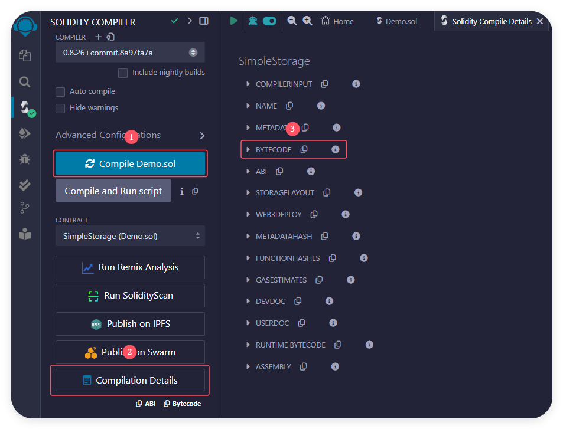

# OpCode

OpCode (操作码) 是以太坊虚拟机 (EVM) 中的低级指令集. 每个 OpCode 代表一个特定的操作, 以下是一些常见的 OpCode:

-   `PUSH1`: 将 1 个字节的数据推入堆栈
-   `ADD`: 从堆栈中弹出两个值相加, 并将结果推入堆栈
-   `MSTORE`: 从指定的内存地址写入指定数据 (会分配 32 字节内存)
-   `RETURN`: 从指定的内存地址读取指定字节的数据, 并返回给调用者

注意: 操作码与 16 进制的数值 (以 `0x` 开头) 打交道~ 十六进制前面有 `0x` 不是强制性的, 因为 EVM 会将任何数值都视为十六进制

**demo1**:

```
PUSH1 0x60
PUSH1 0x40
MSTORE
```

1. `PUSH1 0x60`: 将 `0x60` 推入堆栈
2. `PUSH1 0x40`: 将 `0x40` 推入堆栈
3. `MSTORE`: 从内存地址 `0x40` 写入数据 `0x60`

**demo2**:

```
PUSH1 0x60
PUSH1 0x40
RETURN
```

1. `PUSH1 0x60`: 将 `0x60` 推入堆栈
2. `PUSH1 0x40`: 将 `0x40` 推入堆栈
3. `RETURN`: 从内存地址 `0x40` 读取 `0x60` 字节数据, 并返回给调用者

<br><br>

# ByteCode

ByteCode (字节码) 是智能合约编译后的低级表示形式, 由一系列 OpCode 组成, 由 EVM 执行.

当你编写 Solidity 代码并使用编译器进行编译时, 编译器会将 Solidity 代码转换为 EVM 可以理解的字节码. 例如:

```solidity
contract SimpleStorage {
    uint256 storedData;

    function set(uint256 x) public {
        storedData = x;
    }

    function get() public view returns (uint256) {
        return storedData;
    }
}
```



```
{
	"functionDebugData": {},
	"generatedSources": [],
	"linkReferences": {},
	"object": "6080604052348015600e575f80fd5b506101438061001c5f395ff3fe608060405234801561000f575f80fd5b5060043610610034575f3560e01c806360fe47b1146100385780636d4ce63c14610054575b5f80fd5b610052600480360381019061004d91906100ba565b610072565b005b61005c61007b565b60405161006991906100f4565b60405180910390f35b805f8190555050565b5f8054905090565b5f80fd5b5f819050919050565b61009981610087565b81146100a3575f80fd5b50565b5f813590506100b481610090565b92915050565b5f602082840312156100cf576100ce610083565b5b5f6100dc848285016100a6565b91505092915050565b6100ee81610087565b82525050565b5f6020820190506101075f8301846100e5565b9291505056fea2646970667358221220901ec7979b19319942ea8ece43d01e0a876cb16f2299244955bc96deb5f3ecb764736f6c634300081a0033",
	"opcodes": "PUSH1 0x80 PUSH1 0x40 MSTORE CALLVALUE DUP1 ISZERO PUSH1 0xE JUMPI PUSH0 DUP1 REVERT JUMPDEST POP PUSH2 0x143 DUP1 PUSH2 0x1C PUSH0 CODECOPY PUSH0 RETURN INVALID PUSH1 0x80 PUSH1 0x40 MSTORE CALLVALUE DUP1 ISZERO PUSH2 0xF JUMPI PUSH0 DUP1 REVERT JUMPDEST POP PUSH1 0x4 CALLDATASIZE LT PUSH2 0x34 JUMPI PUSH0 CALLDATALOAD PUSH1 0xE0 SHR DUP1 PUSH4 0x60FE47B1 EQ PUSH2 0x38 JUMPI DUP1 PUSH4 0x6D4CE63C EQ PUSH2 0x54 JUMPI JUMPDEST PUSH0 DUP1 REVERT JUMPDEST PUSH2 0x52 PUSH1 0x4 DUP1 CALLDATASIZE SUB DUP2 ADD SWAP1 PUSH2 0x4D SWAP2 SWAP1 PUSH2 0xBA JUMP JUMPDEST PUSH2 0x72 JUMP JUMPDEST STOP JUMPDEST PUSH2 0x5C PUSH2 0x7B JUMP JUMPDEST PUSH1 0x40 MLOAD PUSH2 0x69 SWAP2 SWAP1 PUSH2 0xF4 JUMP JUMPDEST PUSH1 0x40 MLOAD DUP1 SWAP2 SUB SWAP1 RETURN JUMPDEST DUP1 PUSH0 DUP2 SWAP1 SSTORE POP POP JUMP JUMPDEST PUSH0 DUP1 SLOAD SWAP1 POP SWAP1 JUMP JUMPDEST PUSH0 DUP1 REVERT JUMPDEST PUSH0 DUP2 SWAP1 POP SWAP2 SWAP1 POP JUMP JUMPDEST PUSH2 0x99 DUP2 PUSH2 0x87 JUMP JUMPDEST DUP2 EQ PUSH2 0xA3 JUMPI PUSH0 DUP1 REVERT JUMPDEST POP JUMP JUMPDEST PUSH0 DUP2 CALLDATALOAD SWAP1 POP PUSH2 0xB4 DUP2 PUSH2 0x90 JUMP JUMPDEST SWAP3 SWAP2 POP POP JUMP JUMPDEST PUSH0 PUSH1 0x20 DUP3 DUP5 SUB SLT ISZERO PUSH2 0xCF JUMPI PUSH2 0xCE PUSH2 0x83 JUMP JUMPDEST JUMPDEST PUSH0 PUSH2 0xDC DUP5 DUP3 DUP6 ADD PUSH2 0xA6 JUMP JUMPDEST SWAP2 POP POP SWAP3 SWAP2 POP POP JUMP JUMPDEST PUSH2 0xEE DUP2 PUSH2 0x87 JUMP JUMPDEST DUP3 MSTORE POP POP JUMP JUMPDEST PUSH0 PUSH1 0x20 DUP3 ADD SWAP1 POP PUSH2 0x107 PUSH0 DUP4 ADD DUP5 PUSH2 0xE5 JUMP JUMPDEST SWAP3 SWAP2 POP POP JUMP INVALID LOG2 PUSH5 0x6970667358 0x22 SLT KECCAK256 SWAP1 0x1E 0xC7 SWAP8 SWAP12 NOT BALANCE SWAP10 TIMESTAMP 0xEA DUP15 0xCE NUMBER 0xD0 0x1E EXP DUP8 PUSH13 0xB16F2299244955BC96DEB5F3EC 0xB7 PUSH5 0x736F6C6343 STOP ADDMOD BYTE STOP CALLER ",
	"sourceMap": "57:203:0:-:0;;;;;;;;;;;;;;;;;;;"
}
```

这里的 16 进制字符串 `object` 就是字节码 ByteCode,`opcodes` 是字节码的 OpCode 表现形式, 描述了合约的执行步骤 ~

<br>

**合约工作流程**:

字节码 ByteCode = 创建字节码 Creation ByteCode + 运行字节码 Runtime ByteCode

1. 部署合约: EVM 会执行 Creation ByteCode,生成 Runtime ByteCode 并将其存储在区块链上
2. 调用合约: EVM 会执行存储在区块链上的 Runtime ByteCode

<br>

**Creation ByteCode**:

Creation ByteCode 是在部署合约时执行的代码. 它包含了合约的构造函数和初始化代码. Creation ByteCode 的主要任务是:

1. 执行构造函数, 初始化合约状态

2. 生成 Runtime ByteCode, 并将其存储到区块链上

假设我们有一个简单的合约:

```solidity
contract SimpleStorage {
    uint256 public storedData;

    constructor(uint256 _data) {
        storedData = _data;
    }
}
```

在部署这个合约时, Creation ByteCode 会执行构造函数, 将 `_data` 存储到 `storedData` 中. 然后, 它会生成并返回 Runtime ByteCode.

<br>

**Runtime ByteCode**:

Runtime ByteCode 是合约在区块链上存储并执行的代码. 它不包含构造函数逻辑, 只包含合约的实际功能代码. Runtime ByteCode 是合约在调用时执行的代码.

对于上面的 `SimpleStorage` 合约, Runtime ByteCode 只包含 `storedData` 的 getter 函数逻辑, 而不包含构造函数的逻辑.

<br>

**DEMO**:

1.  手撸 Runtime ByteCode:

```
PUSH1 0x2a // 将 1 个字节的数据 42 推入堆栈
PUSH1  0 // 将 1 个字节的数据 0 推入堆栈
MSTORE // 从内存地址 0 写入指定数据 42 (会分配 32 字节内存)

PUSH1 0x20 // 将 1 个字节的数据 32 推入堆栈
PUSH1 0 // 将 1 个字节的数据 0 推入堆栈
RETURN // 从内存地址 0 读取 32 byte 数据, 并返回给调用者
```

该 Runtime ByteCode 在字节码中表示为 `602a60005260206000f3`

2.  手撸 Creation ByteCode:

```
PUSH10 0x602a60005260206000f3 // 将 1 个字节的数据 0x602a60005260206000f3 推入堆栈
PUSH1 0 // 将 1 个字节的数据 0 推入堆栈
MSTORE // 从内存地址 0 写入指定数据 0x602a60005260206000f3 (会分配 32 字节内存)
// 0x00000000000000000000000000000000000000000000602a60005260206000f3

PUSH1 0x0a // 将 1 个字节的数据 10 推入堆栈
PUSH1 0x16 // 将 1 个字节的数据 22 推入堆栈
RETURN // 从内存地址 22 读取 10 byte 数据, 并返回给调用者
// 602a60005260206000f3
```

该 Creation ByteCode 在字节码中表示为 `69602a60005260206000f3600052600a6016f3`

3.  编写工厂合约, 通过 Creation ByteCode 创建,部署新合约:

```solidity
contract Factory {
    event Log(address addr);

    function deploy() external {
        bytes memory bytecode = hex"69602a60005260206000f3600052600a6016f3";
        address addr;
        assembly {
            addr := create(0, add(bytecode, 0x20), 0x13)
        }
        require(addr != address(0), "deploy failed");
        emit Log(addr);
    }
}

interface IContract {
    function getMeaningOfLife() external view returns (uint);
}
```

① 部署 Factory 合约; ② 执行 deploy 方法, 创建,部署新合约; ③ 从 Log 中获取新合约地址; ④ 通过地址将新合约作为 IContract 添加到 Remix 中; ⑤ 执行 IContract 的 getMeaningOfLife 方法, 可以看到返回值为 42

<br><br>

# Yul & Assembly

Yul 是一种中间语言, 可编译成不同后端的字节码. Yul 可以独立使用, 也可以通过 `assembly { ... }` 嵌入 Solidity 代码中, 作为 "内联汇编" 使用. "内联汇编" 允许开发者直接与 EVM 交互, 能直接操作内存,存储和堆栈, 适用于性能优化和复杂操作.

Yul 的语法相对简单, 主要包括以下几种操作:

1. 变量声明: 使用 `let` 关键字声明变量

```solidity
assembly {
    let x := 100 // 声明变量 x, 并赋值为 100
}
```

2. 数学运算: 使用 `add`,`sub`,`mul`,`div` 等操作码进行数学运算

```solidity
assembly {
    let result := mul(10, 10) // result = 10 * 10 = 100
}
```

3. 内存操作: 使用 `mstore` 和 `mload` 操作码进行内存读写

```solidity
assembly {
    mstore(0x80, 100) // 在内存位置 0x80 上存入数据 100 (会分配 32 字节内存)
    let loadedData := mload(0x80) // 从内存位置 0x80 加载数据 (会读取 32 字节数据)
}
```

4. 返回数据: 使用 `return` 操作码返回数据

```solidity
assembly {
    return(0x80, 32) // 返回存储在 0x80 位置的 32 字节数据
}
```

5. 比较运算: 使用 `eq`,`lt`,`gt` 等操作码进行比较运算

```solidity
assembly {
    let isEqual := eq(10, 10) // isEqual = 10 == 10;  成立则为 1, 否则为 0
}
```

6. 控制流: 使用 `if`,`else`,`switch` 等操作码进行控制流操作

```solidity
assembly {
    if eq(10, 10) {
        // 条件成立时执行
    } else {
        // 条件不成立时执行
    }
}
```

7. 循环: 使用 `for`,`while` 等操作码进行循环操作

```solidity
assembly {
    for { let i := 0 } lt(i, 10) { i := add(i, 1) } {
        // 循环体
    }
}
```

<br><br>
