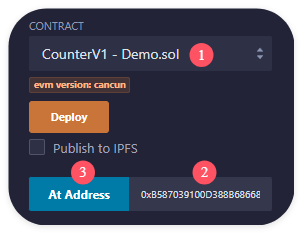

# 使用 delegatecall 实现代理合约

现有 CounterV1 合约:

```solidity
contract CounterV1 {
    uint public count;

    function inc() external {
        count += 1;
    }
}
```

编写代理合约 BuggyProxy:

```solidity
contract BuggyProxy {
    address public implementation;
    address public immutable admin;

    constructor() {
        admin = msg.sender;
    }

    function _delegate() private {
        (bool success, ) = implementation.delegatecall(msg.data);
        require(success, "delegatecall failed");
    }

    fallback() external {
        _delegate();
    }

    receive() external payable {
        _delegate();
    }

    function upgradeTo(address _implementation) external {
        require(msg.sender == admin, "admin only");
        implementation = _implementation;
    }
}
```

1. 部署 CounterV1 合约,BuggyProxy 合约

2. 传入 CounterV1 合约的地址, 调用 BuggyProxy 合约的 upgradeTo 方法

3. 查看 BuggyProxy 合约的 implementation 值, 可以看到其变为 CounterV1 合约的地址

4. 复制 BuggyProxy 合约的地址, 作为 CounterV1 合约添加到 Remix 中



5. 调用新 CounterV1 合约的 inc 方法

6. 查看新 CounterV1 合约的 count 值, 发现其未发生变化

7. 查看 BuggyProxy 合约的 implementation 值, 却发现被修改了

<br><br>

# 处理存储槽问题

问题原因: CounterV1 合约的第一个存储槽为 count, 而 BuggyProxy 合约的第一个存储槽为 implementation, 导致 BuggyProxy 合约调用 CounterV1 合约的 inc 方法时, 修改的是 BuggyProxy 合约的 implementation 值.

解决方法: 使 CounterV1 的存储槽与 BuggyProxy 的存储槽保持一致. 修改 CounterV1 合约:

```solidity
contract CounterV1 {
    address public implementation;
    address public immutable admin;
    uint public count;

    function inc() external {
        count += 1;
    }
}
```

现在我们重新执行步骤 1-5, 发现: 虽然 BuggyProxy 合约的 implementation 值没有被修改了, 但新 CounterV1 合约的 count 值仍然未发生变化.

<br><br>

# 处理实现合约的函数返回值

问题原因: BuggyProxy 合约的 fallback 函数没有对 delegatecall 的返回值进行处理.

解决方法: 修改 BuggyProxy 合约, 重写 \_delegate 函数:

```solidity
contract BuggyProxy {
    address public implementation;
    address public immutable admin;

    constructor() {
        admin = msg.sender;
    }

    function _delegate(address _implementation) private {
        assembly {
            // `calldatacopy(t, f, s)`
            //   - copy `s` bytes from calldata at position `f` to mem at position `t`
            // `calldatasize()` - Get size of calldata
            calldatacopy(0, 0, calldatasize())

            // `delegatecall(g, a, in, insize, out, outsize)`
            //   - call contract at address `a` with input mem[`in`, `in` + `insize`]
            //   - providing `g` gas
            //   - output mem[`out`, `out` + `outsize`]
            //   - returning 0 on error (eg. out-of-gas) and 1 on success
            let result := delegatecall(
                gas(),
                _implementation,
                0,
                calldatasize(),
                0,
                0
            )

            // `returndatacopy(t, f, s)`
            //   - copy `s` bytes from returndata at position `f` to mem at position `t`
            // `returndatasize()` - Get size of returndata
            returndatacopy(0, 0, returndatasize())

            switch result
            case 0 {
                // `revert(p, s)`
                //   - stop execution and revert state changes, return data mem[`p`, `p` + `s`]
                revert(0, returndatasize())
            }
            default {
                // `return(p, s)`
                //   - stop execution and return data mem[`p`, `p` + `s`]
                return(0, returndatasize())
            }
        }
    }

    fallback() external {
        _delegate(implementation);
    }

    receive() external payable {
        _delegate(implementation);
    }

    function upgradeTo(address _implementation) external {
        require(msg.sender == admin, "admin only");
        implementation = _implementation;
    }
}
```

现在我们重新执行步骤 1-5, 发现: 新 CounterV1 合约的 count 值发生了变化啦！

<br>

# 升级合约

现在我们进行合约升级:

1. 编写 CounterV2 合约:

```solidity
contract CounterV2 {
    address public implementation;
    address public immutable admin;
    uint public count;

    function inc() external {
        count += 1;
    }

    function dec() external {
        count -= 1;
    }
}
```

2. 部署 CounterV2 合约

3. 传入 CounterV2 合约的地址, 调用 BuggyProxy 合约的 upgradeTo 方法

4. 查看 BuggyProxy 合约的 implementation 值, 可以看到其变为 CounterV2 合约的地址

5. 复制 BuggyProxy 合约的地址, 作为 CounterV2 合约添加到 Remix 中

6. 查看新 CounterV2 合约的 count 值, 为升级前的 count 值

7. 调用新 CounterV2 合约的 inc / dec 方法

8. 查看新 CounterV2 合约的 count 值, 可以看到其能够正常变化

升级成功！

<br><br>

# 使用 library 处理存储槽

可以发现, 为了确保状态变量能被正确修改, 我们在实现合约中添加了状态变量, 使实现合约的存储槽与代理合约的存储槽保持一致, 但实现合约其实并不需要这些状态变量. 我们可以将这些状态变量抽出来.

编写存储槽库 StorageSlot:

```solidity
library StorageSlot {
    // 定义一个结构体 AddressSlot, 用于存储一个地址类型的值
    struct AddressSlot {
        address value;
    }

    // 在 Solidity 中, 存储槽是一个长为 2^256 的数组, 每个存储槽的大小为 32 字节
    // 定义函数 getAddressSlot 用于获取指定存储槽中的 AddressSlot 结构体
    // 参数 slot 是一个 bytes32 类型的值, 表示存储槽的位置
    // 返回值 r 是一个 AddressSlot 类型的存储引用
    function getAddressSlot(
        bytes32 slot
    ) internal pure returns (AddressSlot storage r) {
        // 使用内联汇编将存储槽位置赋值给返回值 r 的 slot 属性
        assembly {
            r.slot := slot
        }
    }
}

contract Test {
    // 定义一个常量 SLOT 作为存储槽的位置
    bytes32 private constant SLOT = keccak256("TEST_SLOT");

    // 定义函数 getSlot, 用于获取存储槽中的地址值
    function getSlot() public view returns (address) {
        // 获取存储槽中的结构体 AddressSlot 的 value 属性
        return StorageSlot.getAddressSlot(SLOT).value;
    }

    // 定义函数 setSlot, 用于设置存储槽中的地址值
    function setSlot(address _value) public {
        // 设置存储槽中的结构体 AddressSlot 的 value 属性
        StorageSlot.getAddressSlot(SLOT).value = _value;
    }
}
```

1. 部署 Test 合约

2. 调用 Test 合约的 getSlot 方法, 查看存储槽中的地址值, 为 0x0000000000000000000000000000000000000000

3. 传入 Test 合约的地址, 调用 Test 合约的 setSlot 方法

4. 调用 Test 合约的 getSlot 方法, 查看存储槽中的地址值, 为传入的地址值

OK, 我们可以将合约中的状态变量抽出来, 使用存储槽库 StorageSlot 来管理存储槽.

1. 删除 CounterV1,CounterV2 合约中无关的状态变量

```solidity
contract CounterV1 {
    uint public count;

    function inc() external {
        count += 1;
    }
}

contract CounterV2 {
    uint public count;

    function inc() external {
        count += 1;
    }

    function dec() external {
        count -= 1;
    }
}
```

2. 编写代理合约 Proxy (使用存储槽库 StorageSlot 改造后的 BuggyProxy 合约) :

```solidity
contract Proxy {
    bytes32 public constant IMPLEMENTATION_SLOT =
        bytes32(uint(keccak256("eip1967.proxy.implementation")) - 1);
    bytes32 public constant ADMIN_SLOT =
        bytes32(uint(keccak256("eip1967.proxy.admin")) - 1);

    constructor() {
        _setAdmin(msg.sender);
    }

    function _delegate(address _implementation) private {
        assembly {
            calldatacopy(0, 0, calldatasize())

            let result := delegatecall(
                gas(),
                _implementation,
                0,
                calldatasize(),
                0,
                0
            )

            returndatacopy(0, 0, returndatasize())

            switch result
            case 0 {
                revert(0, returndatasize())
            }
            default {
                return(0, returndatasize())
            }
        }
    }

    fallback() external {
        _delegate(_getImplementation());
    }

    receive() external payable {
        _delegate(_getImplementation());
    }

    function upgradeTo(address _implementation) external {
        require(msg.sender == _getAdmin(), "not admin");
        _setImplementation(_implementation);
    }

    function _getAdmin() private view returns (address) {
        return StorageSlot.getAddressSlot(ADMIN_SLOT).value;
    }

    function _setAdmin(address _newAdmin) private {
        require(_newAdmin != address(0), "zero address");
        StorageSlot.getAddressSlot(ADMIN_SLOT).value = _newAdmin;
    }

    function _getImplementation() private view returns (address) {
        return StorageSlot.getAddressSlot(IMPLEMENTATION_SLOT).value;
    }

    function _setImplementation(address _newImplementation) private {
        // 保证 _newImplementation 是一个合约地址, 而不是用户钱包地址
        require(_newImplementation.code.length > 0, "no code at address");
        StorageSlot
            .getAddressSlot(IMPLEMENTATION_SLOT)
            .value = _newImplementation;
    }

    function admin() external view returns (address) {
        return _getAdmin();
    }

    function implementation() external view returns (address) {
        return _getImplementation();
    }
}
```

1. 部署 Proxy 合约

2. 查看 Proxy 合约的 implementation 值为 0x0000000000000000000000000000000000000000,admin 值为编辑器地址

3. 部署 CounterV1 合约

4. 传入 CounterV1 合约的地址, 调用 Proxy 合约的 upgradeTo 方法

5. 查看 Proxy 合约的 implementation 值为 CounterV1 合约的地址

6. 复制 Proxy 合约的地址, 作为 CounterV1 合约添加到 Remix 中

7. 调用新 CounterV1 合约的 inc 方法

8. 查看新 CounterV1 合约的 count 值, 可以看到其能够正常变化

9. 部署 CounterV2 合约

10. 传入 CounterV2 合约的地址, 调用 Proxy 合约的 upgradeTo 方法

11. 查看 Proxy 合约的 implementation 值为 CounterV2 合约的地址

12. 复制 Proxy 合约的地址, 作为 CounterV2 合约添加到 Remix 中

13. 调用新 CounterV2 合约的 inc / dec 方法

14. 查看新 CounterV2 合约的 count 值, 可以看到其能够正常变化

OK, 我们使用存储槽库 StorageSlot 改造了代理合约, 实现了透明可升级代理~

<br><br>

# 处理同名方法问题 Ⅰ

我们修改 CounterV1 合约:

```solidity
contract CounterV1 {
    uint public count;

    function inc() external {
        count += 1;
    }

    function admin() external pure returns (address) {
        return address(1);
    }

    function implementation() external pure returns (address) {
        return address(2);
    }
}
```

1. 部署 CounterV1 合约

2. 调用 CounterV1 合约的 admin,implementation 方法, 查看返回值, 分别为 0x0000000000000000000000000000000000000001,0x0000000000000000000000000000000000000002

3. 部署 Proxy 合约

4. 传入 CounterV1 合约的地址, 调用 Proxy 合约的 upgradeTo 方法

5. 查看 Proxy 合约的 implementation 值为 CounterV1 合约的地址

6. 复制 Proxy 合约的地址, 作为 CounterV1 合约添加到 Remix 中

7. 调用新 CounterV1 合约的 admin,implementation 方法, 查看返回值, 分别为 Proxy 合约的地址,CounterV1 合约的地址

可以看到, CounterV1 合约的 admin,implementation 方法被代理合约 Proxy 合约覆盖了.

解决方法: 通过修饰器来区分操作人是否为 admin, 以此来调用实现合约的方法.

修改 Proxy 合约:

```solidity
contract Proxy {
    bytes32 private constant IMPLEMENTATION_SLOT =
        bytes32(uint(keccak256("eip1967.proxy.implementation")) - 1);
    bytes32 private constant ADMIN_SLOT =
        bytes32(uint(keccak256("eip1967.proxy.admin")) - 1);

    constructor() {
        _setAdmin(msg.sender);
    }

    // 核心逻辑: 编写 ifAdmin 修饰器, 用于区分合约的管理员和普通用户操作
    modifier ifAdmin() {
        if (msg.sender == _getAdmin()) {
            _;
        } else {
            _fallback();
        }
    }

    fallback() external {
        // 调用私有函数 _fallback
        _fallback();
    }

    receive() external payable {
        // 调用私有函数 _fallback
        _fallback();
    }

    // 定义一个私有函数 _fallback
    function _fallback() private {
        _delegate(_getImplementation());
    }

    function _delegate(address _implementation) private {
        assembly {
            calldatacopy(0, 0, calldatasize())

            let result := delegatecall(
                gas(),
                _implementation,
                0,
                calldatasize(),
                0,
                0
            )

            returndatacopy(0, 0, returndatasize())

            switch result
            case 0 {
                revert(0, returndatasize())
            }
            default {
                return(0, returndatasize())
            }
        }
    }

    // 使用 ifAdmin 修饰器
    function upgradeTo(address _implementation) external ifAdmin {
        _setImplementation(_implementation);
    }

    function _getAdmin() private view returns (address) {
        return StorageSlot.getAddressSlot(ADMIN_SLOT).value;
    }

    function _setAdmin(address _newAdmin) private {
        require(_newAdmin != address(0), "zero address");
        StorageSlot.getAddressSlot(ADMIN_SLOT).value = _newAdmin;
    }

    function _getImplementation() private view returns (address) {
        return StorageSlot.getAddressSlot(IMPLEMENTATION_SLOT).value;
    }

    function _setImplementation(address _newImplementation) private {
        require(_newImplementation.code.length > 0, "no code at address");
        StorageSlot
            .getAddressSlot(IMPLEMENTATION_SLOT)
            .value = _newImplementation;
    }

    // 使用 ifAdmin 修饰器
    function admin() external ifAdmin returns (address) {
        return _getAdmin();
    }

    // 使用 ifAdmin 修饰器
    function implementation() external ifAdmin returns (address) {
        return _getImplementation();
    }
}
```

1. 部署 CounterV1 合约

2. 调用 CounterV1 合约的 admin,implementation 方法, 查看返回值, 分别为 0x0000000000000000000000000000000000000001,0x0000000000000000000000000000000000000002

3. 部署 Proxy 合约

4. 传入 CounterV1 合约的地址, 调用 Proxy 合约的 upgradeTo 方法

5. 查看 Proxy 合约的 implementation 值为 CounterV1 合约的地址

6. 复制 Proxy 合约的地址, 作为 CounterV1 合约添加到 Remix 中

7. 切换编辑器地址, 测试非 admin 调用 admin,implementation 方法, 查看返回值, 分别为 0x0000000000000000000000000000000000000001,0x0000000000000000000000000000000000000002

8. 切换回 admin 地址, 测试 admin 调用 admin,implementation 方法, 查看返回值, 分别为 Proxy 合约的地址,CounterV1 合约的地址

OK, 我们通过修饰器来区分操作人是否为 admin, 解决了同名方法问题啦~

<br><br>

# 处理同名方法问题 Ⅱ

聪明如你一定发现了问题, 如果 admin 地址想调用实现合约的方法呢？

解决方法: 添加一个 ProxyAdmin 合约, 用于管理 Proxy 合约的升级操作.

1. 为 Proxy 合约添加一个 changeAdmin 方法, 用于修改管理员地址:

```solidity
    // 编写函数修改管理员地址
    function changeAdmin(address _newAdmin) external ifAdmin {
        _setAdmin(_newAdmin);
    }
```

2. 为 CounterV2 合约添加 admin,implementation 方法:

```solidity
    function admin() external pure returns (address) {
        return address(3);
    }

    function implementation() external pure returns (address) {
        return address(4);
    }
```

3. 编写 ProxyAdmin 合约:

```solidity
contract ProxyAdmin {
    address public owner;

    constructor() {
        owner = msg.sender;
    }

    modifier onlyOwner() {
        require(msg.sender == owner, "not owner");
        _;
    }

    function getProxyAdmin(address _proxy) external view returns (address) {
        (bool success, bytes memory data) = _proxy.staticcall(
            abi.encodeCall(Proxy.admin, ())
        );
        require(success, "getProxyAdmin failed");
        return abi.decode(data, (address));
    }

    function getProxyImplementation(
        address _proxy
    ) external view returns (address) {
        (bool success, bytes memory data) = _proxy.staticcall(
            abi.encodeCall(Proxy.implementation, ())
        );
        require(success, "getProxyImplementation failed");
        return abi.decode(data, (address));
    }

    function changeProxyAdmin(
        address payable _proxy,
        address _newAdmin
    ) external onlyOwner {
        Proxy(_proxy).changeAdmin(_newAdmin);
    }

    function upgrade(
        address payable _proxy,
        address _implementation
    ) external onlyOwner {
        Proxy(_proxy).upgradeTo(_implementation);
    }
}
```

1. 部署 CounterV1,CounterV2,Proxy,ProxyAdmin 合约

2. 传入 CounterV1 合约的地址, 调用 Proxy 合约的 upgradeTo 方法

3. 传入 ProxyAdmin 合约的地址, 调用 Proxy 合约的 changeAdmin 方法, 修改管理员地址

4. 传入 Proxy 合约的地址, 调用 ProxyAdmin 合约的 getProxyAdmin,getProxyImplementation 方法, 查看返回值, 分别为 ProxyAdmin 合约的地址,CounterV1 合约的地址

5. 复制 Proxy 合约的地址, 作为 CounterV1 合约添加到 Remix 中

6. 测试新 CounterV1 合约的 inc 方法, 查看 count 值, 可以看到其能够正常变化

7. 查看新 CounterV1 合约的 admin,implementation 方法, 查看返回值, 分别为 0x0000000000000000000000000000000000000001,0x0000000000000000000000000000000000000002

现在, admin 地址也可以调用实现合约的方法啦~ 下面展示如何使用 ProxyAdmin 合约升级合约:

1. 传入 Proxy 合约的地址,CounterV2 合约的地址, 调用 ProxyAdmin 合约的 upgrade 方法

2. 复制 Proxy 合约的地址, 作为 CounterV2 合约添加到 Remix 中

3. 查看新 CounterV2 合约的 count 值, 为升级前的 count 值

4. 测试新 CounterV2 合约的 inc / dec 方法, 查看 count 值, 可以看到其能够正常变化

5. 查看新 CounterV2 合约的 admin,implementation 方法, 查看返回值, 分别为 0x0000000000000000000000000000000000000003,0x0000000000000000000000000000000000000004

OK, 我们通过 ProxyAdmin 合约, 实现了管理员地址的修改和合约的升级操作~

<br><br>
