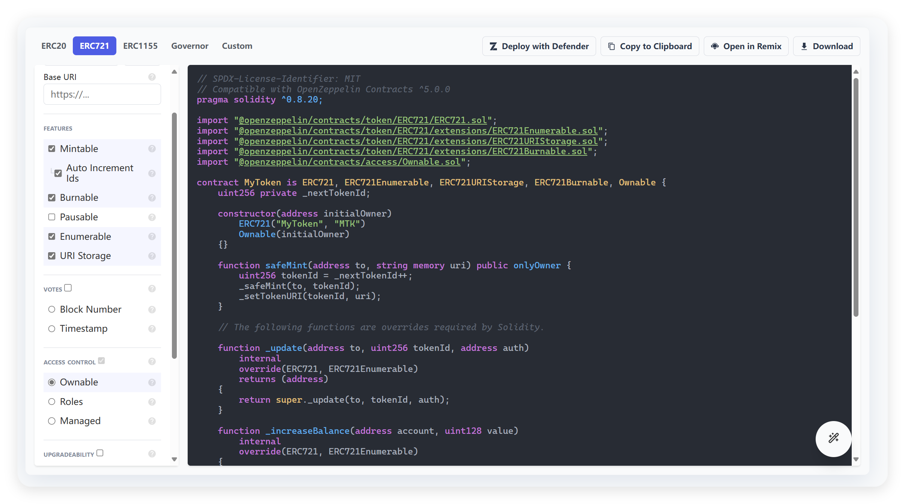
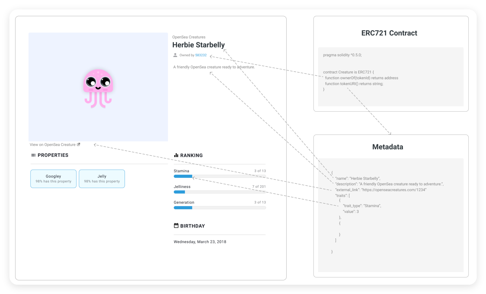
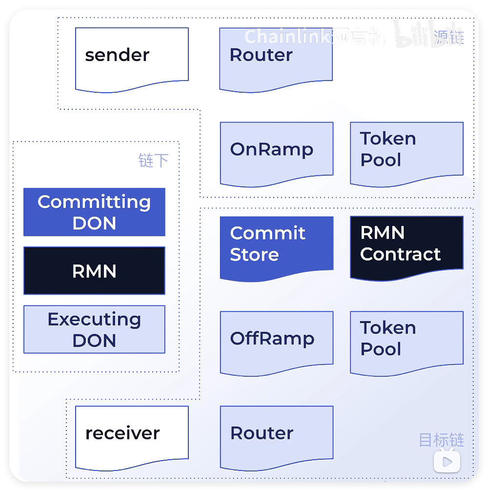
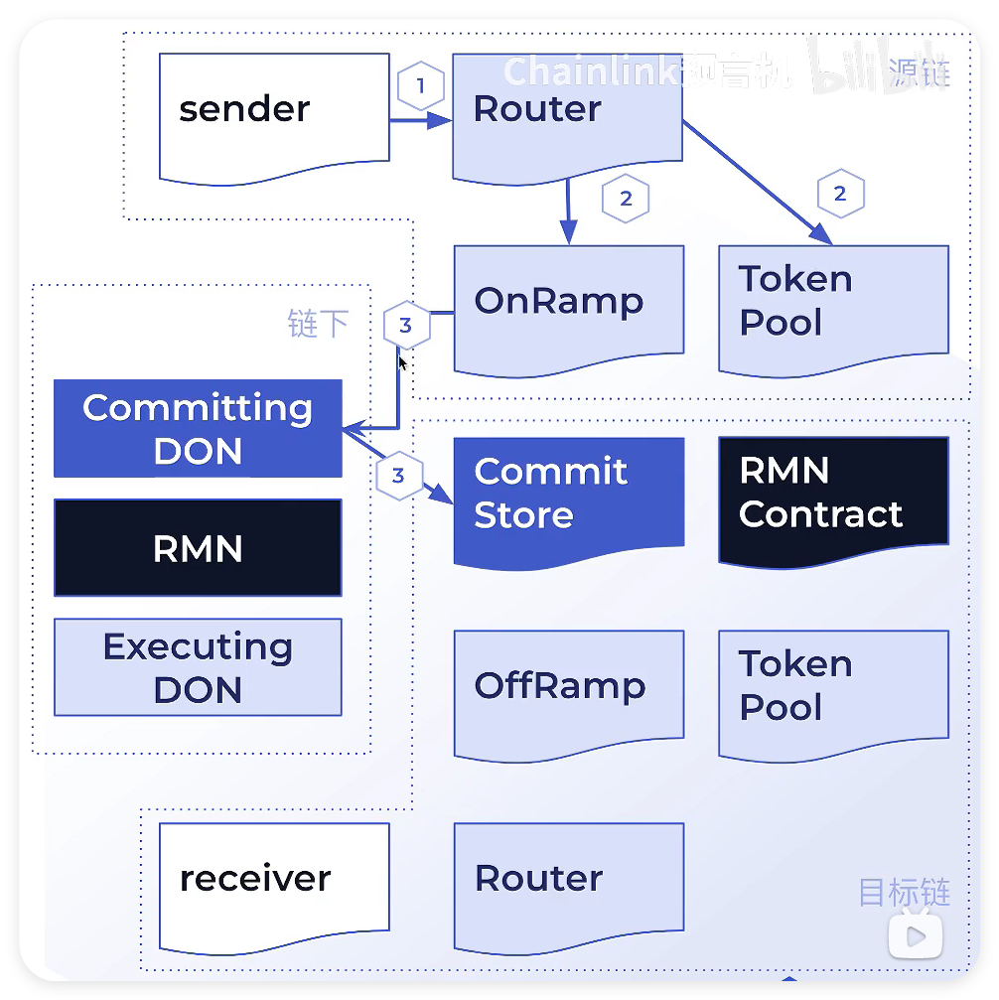
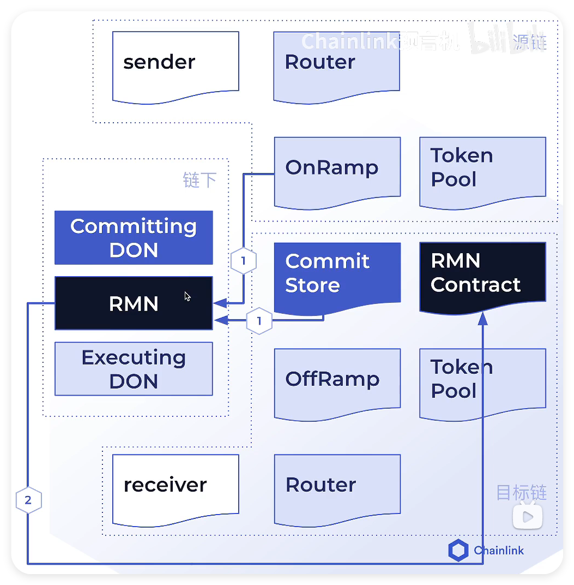
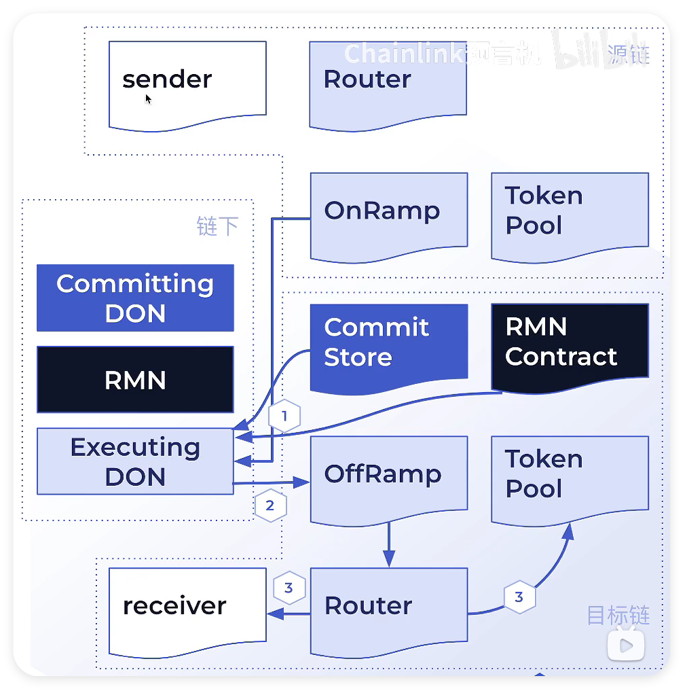
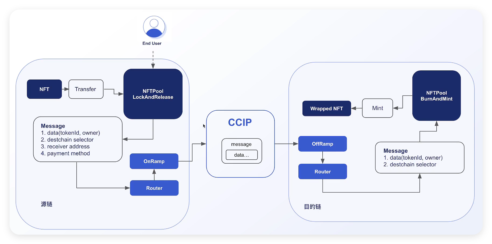

# 铸造 NFT

1.  到 [OpenZeppelin Contracts Wizard](https://wizard.openzeppelin.com/#erc721) 快速生成 ERC721 合约, 并进行调整:



```solidity
// SPDX-License-Identifier: MIT
// Compatible with OpenZeppelin Contracts ^5.0.0
pragma solidity ^0.8.20;

import "@openzeppelin/contracts/token/ERC721/ERC721.sol";
import "@openzeppelin/contracts/token/ERC721/extensions/ERC721Enumerable.sol";
import "@openzeppelin/contracts/token/ERC721/extensions/ERC721URIStorage.sol";
import "@openzeppelin/contracts/token/ERC721/extensions/ERC721Burnable.sol";
import "@openzeppelin/contracts/access/Ownable.sol";

contract MyToken is
    ERC721,
    ERC721Enumerable,
    ERC721URIStorage,
    ERC721Burnable,
    Ownable
{
    uint256 private _nextTokenId;

    constructor(
        string memory name,
        string memory symbol
    ) ERC721(name, symbol) Ownable(msg.sender) {}

    function safeMint(address to, string memory uri) public onlyOwner {
        uint256 tokenId = _nextTokenId++;
        _safeMint(to, tokenId);
        _setTokenURI(tokenId, uri);
    }

    // The following functions are overrides required by Solidity.

    function _update(
        address to,
        uint256 tokenId,
        address auth
    ) internal override(ERC721, ERC721Enumerable) returns (address) {
        return super._update(to, tokenId, auth);
    }

    function _increaseBalance(
        address account,
        uint128 value
    ) internal override(ERC721, ERC721Enumerable) {
        super._increaseBalance(account, value);
    }

    function tokenURI(
        uint256 tokenId
    ) public view override(ERC721, ERC721URIStorage) returns (string memory) {
        return super.tokenURI(tokenId);
    }

    function supportsInterface(
        bytes4 interfaceId
    )
        public
        view
        override(ERC721, ERC721Enumerable, ERC721URIStorage)
        returns (bool)
    {
        return super.supportsInterface(interfaceId);
    }
}
```

2.  到 [Metadata Standards (opensea.io)](https://docs.opensea.io/docs/metadata-standards) 观察 NFT 的 MetaData



3.  到 [Filebase | IPFS Made Easy](https://console.filebase.com/buckets) 上传 MetaData (图片, JSON 文件)

```
{
    "description": "Loki is a horizontally-scalable, highly-available, multi-tenant log agg",
    "external_url": "https://openseacreatures.io/3",
    "image": "https://ipfs.filebase.io/ipfs/0mVsPg1aNWYar6MtLTW2tgWwgcXWkk8LG76LB11eQhRjgk",
    "name": "Loki",
    "attributes": [
        {
            "trait_type": "Temperature",
            "value": "Average"
        },
        {
            "trait_type": "Breed",
            "value": "Shiba Inu"
        }
    ]
}
```

4.  到 Remix 铸造 NFT
    1.  MetaMask 连接 Sepolia 测试网
    2.  找到 Remix 的 Deploy 面板, Environment 选择 Injected Provider - MetaMask
    3.  传入 "name" 和 "symbol", 部署合约
    4.  传入 "钱包地址" 和步骤 3 中 JSON 文件的 "IPFS Gateway URL", 调用 `safeMint` 方法铸造 NFT.
        ( JSON 文件的 "IPFS Gateway URL" 形如 `https://ipfs.filebase.io/ipfs/QmfMsLX4nxpVffX76tGFfo5Y1XAunXamBow8c1aFNPR6iP`, 可简写为 `ipfs://QmfMsLX4nxpVffX76tGFfo5Y1XAunXamBow8c1aFNPR6iP` )
5.  到 [Sepolia - Collection | OpenSea](https://opensea.io/collection/sepolia) 查看铸造的 NFT

<br><br>

# 跨链

-   token 跨链: 将 token 从一条链转移到另一条链的智能合约地址
-   可编程的 token 跨链: 将 token 及其相关的指令 (如何操作这个 token) 从一条链发送给另一条链的智能合约
-   任意信息跨链:将任意信息 (字节) 从一条链转移给到另一条链的智能合约

<br>

## CCIP 主要组件

-   3 个领域: 源链 (Source Chain), 目的链 (Destination Chain), 链下部分 (Off Chain).
-   Sender 和 Receiver 由用户自己开发. Sender: EOA / 智能合约; Receiver: EOA / 智能合约, 合约要实现 ccipReceive 功能.
-   其他的组件由 Chainlink 开发并部署.
-   跨链消息: 转移 token; 发送任意消息; 转移 token 并发送数据



<br>

## 流程

步骤 1 - **Commit**: Committing DON

-   发送跨链消息
-   路由这条消息
-   Committing DON 将信息提交给目的链的 commit store 合约
-   commit store 存储: 信息; 信息所在交易的默克尔树证明



步骤 2 - **Bless**: RMN (风险管理网络)

-   RMN 等待 Committing DON 提交 commitment 到 Commit Store, 同时通过 OnRamp 合约通过默克尔树证明重建 RootHash
-   比较两个 RootHash, 如果比对成功, RMN 给 RMN 合约发送交易, bless 对应的 commitment



步骤 3 - **Execute**: Executing DON

-   Executing DON 由很多个运行着 OCR2 算法的预言机节点构成
-   Executing DON 等待数据被发送到 Commit Store 并被 RMN bless
-   给 OffRamp 发送交易执行存储在 commit store 中的数据
-   OffRamp 调用目的链的 Router 合约, 执行交易



<br>

## 通证跨链 Burn & Mint

-   跨链过程: token 在源链上被 burn, 然后在目标链被 mint.
-   适用场景: token 在多跳链上都原生部署, 并且 CCIP 可以调用 mint 和 burn 函数.

<br>

## 通证跨链 Lock & Mint

-   跨链过程: token 被锁在源链的池子中, 然后它的包装/合成/衍生资产在目的链上被 mint; token 在目的链上被 burn, 然后在源链上被 unlock.
-   使用案例: 只在一条链上发行 token; 带有编码约束的代币 (supply / burn / mint).

<br>

## NFT 跨链



<br>

## Wrapped NFT

创建 WrappedMyToken.sol:

```solidity
// SPDX-License-Identifier: MIT
pragma solidity ^0.8.20;

import {MyToken} from "./MyToken.sol";

contract WrappedMyToken is MyToken {
    constructor(
        string memory name,
        string memory symbol
    ) MyToken(name, symbol) {}

    function mintTokenWithSpecificTokenId(
        address to,
        uint256 tokenId
    ) public onlyOwner {
        _safeMint(to, tokenId);
    }
}
```

<br>

## NFT Pool

编写 NFTPoolLockAndRelease.sol: 到 [发送任意数据（Arbitrary Data） | Chainlink 文档](https://docs.chain.link/ccip/tutorials/send-arbitrary-data) 复制 demo 并修改.

```solidity
// SPDX-License-Identifier: MIT
pragma solidity ^0.8.19;

import {IRouterClient} from "@chainlink/contracts-ccip/src/v0.8/ccip/interfaces/IRouterClient.sol";
import {OwnerIsCreator} from "@chainlink/contracts-ccip/src/v0.8/shared/access/OwnerIsCreator.sol";
import {Client} from "@chainlink/contracts-ccip/src/v0.8/ccip/libraries/Client.sol";
import {CCIPReceiver} from "@chainlink/contracts-ccip/src/v0.8/ccip/applications/CCIPReceiver.sol";
import {IERC20} from "@chainlink/contracts-ccip/src/v0.8/vendor/openzeppelin-solidity/v4.8.3/contracts/token/ERC20/IERC20.sol";
import {SafeERC20} from "@chainlink/contracts-ccip/src/v0.8/vendor/openzeppelin-solidity/v4.8.3/contracts/token/ERC20/utils/SafeERC20.sol";

import {MyToken} from "./MyToken.sol";

/**
 * THIS IS AN EXAMPLE CONTRACT THAT USES HARDCODED VALUES FOR CLARITY.
 * THIS IS AN EXAMPLE CONTRACT THAT USES UN-AUDITED CODE.
 * DO NOT USE THIS CODE IN PRODUCTION.
 */

/// @title - A simple NFTPoolLockAndRelease contract for sending/receving string data across chains.
contract NFTPoolLockAndRelease is CCIPReceiver, OwnerIsCreator {
    using SafeERC20 for IERC20;

    // Custom errors to provide more descriptive revert messages.
    error NotEnoughBalance(uint256 currentBalance, uint256 calculatedFees); // Used to make sure contract has enough balance.
    error NothingToWithdraw(); // Used when trying to withdraw Ether but there's nothing to withdraw.
    error FailedToWithdrawEth(address owner, address target, uint256 value); // Used when the withdrawal of Ether fails.
    error InvalidReceiverAddress(); // Used when the receiver address is 0.

    // Event emitted when a message is sent to another chain.
    event MessageSent(
        bytes32 indexed messageId, // The unique ID of the CCIP message.
        uint64 indexed destinationChainSelector, // The chain selector of the destination chain.
        address receiver, // The address of the receiver on the destination chain.
        bytes data, // The data being sent.
        address feeToken, // the token address used to pay CCIP fees.
        uint256 fees // The fees paid for sending the CCIP message.
    );

    // Event emitted when a token is unlocked.
    event UnlockToken(
        uint256 tokenId, // The ID of the token.
        address newOwner // The address of the new owner.
    );

    bytes32 private s_lastReceivedMessageId; // Store the last received messageId.
    string private s_lastReceivedText; // Store the last received text.

    IERC20 private s_linkToken;

    MyToken public nft; // 定义 NFT 合约

    /// @notice Constructor initializes the contract with the router address.
    /// @param _router The address of the router contract.
    /// @param _link The address of the link contract.
    constructor(
        address _router,
        address _link,
        address nftAddr
    ) CCIPReceiver(_router) {
        s_linkToken = IERC20(_link);
        nft = MyToken(nftAddr); // 初始化 NFT 合约
    }

    /// @dev Modifier that checks the receiver address is not 0.
    /// @param _receiver The receiver address.
    modifier validateReceiver(address _receiver) {
        if (_receiver == address(0)) revert InvalidReceiverAddress();
        _;
    }

    /// @notice Sends data to receiver on the destination chain.
    /// @notice Pay for fees in LINK.
    /// @dev Assumes your contract has sufficient LINK.
    /// @param _destinationChainSelector The identifier (aka selector) for the destination blockchain.
    /// @param _receiver The address of the recipient on the destination blockchain.
    /// @param _data The bytes to be sent.
    /// @return messageId The ID of the CCIP message that was sent.
    function sendMessagePayLINK(
        uint64 _destinationChainSelector,
        address _receiver,
        bytes memory _data
    ) internal returns (bytes32 messageId) {
        // Create an EVM2AnyMessage struct in memory with necessary information for sending a cross-chain message
        Client.EVM2AnyMessage memory evm2AnyMessage = _buildCCIPMessage(
            _receiver,
            _data,
            address(s_linkToken)
        );

        // Initialize a router client instance to interact with cross-chain router
        IRouterClient router = IRouterClient(this.getRouter());

        // Get the fee required to send the CCIP message
        uint256 fees = router.getFee(_destinationChainSelector, evm2AnyMessage);

        if (fees > s_linkToken.balanceOf(address(this)))
            revert NotEnoughBalance(s_linkToken.balanceOf(address(this)), fees);

        // approve the Router to transfer LINK tokens on contract's behalf. It will spend the fees in LINK
        s_linkToken.approve(address(router), fees);

        // Send the CCIP message through the router and store the returned CCIP message ID
        messageId = router.ccipSend(_destinationChainSelector, evm2AnyMessage);

        // Emit an event with message details
        emit MessageSent(
            messageId,
            _destinationChainSelector,
            _receiver,
            _data,
            address(s_linkToken),
            fees
        );

        // Return the CCIP message ID
        return messageId;
    }

    /// handle a received message
    function _ccipReceive(
        Client.Any2EVMMessage memory any2EvmMessage
    ) internal override {
        // 获取 newOwner 和 tokenId
        (uint256 tokenId, address newOwner) = abi.decode(
            any2EvmMessage.data,
            (uint256, address)
        );

        // 转移 NFT 给新的所有者
        nft.transferFrom(address(this), newOwner, tokenId);

        // 触发 UnlockToken 事件
        emit UnlockToken(tokenId, newOwner);
    }

    /// @notice Construct a CCIP message.
    /// @dev This function will create an EVM2AnyMessage struct with all the necessary information for sending a text.
    /// @param _receiver The address of the receiver.
    /// @param _data The bytes data to be sent.
    /// @param _feeTokenAddress The address of the token used for fees. Set address(0) for native gas.
    /// @return Client.EVM2AnyMessage Returns an EVM2AnyMessage struct which contains information for sending a CCIP message.
    function _buildCCIPMessage(
        address _receiver,
        bytes memory _data,
        address _feeTokenAddress
    ) private pure returns (Client.EVM2AnyMessage memory) {
        // Create an EVM2AnyMessage struct in memory with necessary information for sending a cross-chain message
        return
            Client.EVM2AnyMessage({
                receiver: abi.encode(_receiver), // ABI-encoded receiver address
                data: _data,
                tokenAmounts: new Client.EVMTokenAmount[](0), // Empty array as no tokens are transferred
                extraArgs: Client._argsToBytes(
                    // Additional arguments, setting gas limit
                    Client.EVMExtraArgsV1({gasLimit: 200_000})
                ),
                // Set the feeToken to a feeTokenAddress, indicating specific asset will be used for fees
                feeToken: _feeTokenAddress
            });
    }

    /// @notice Fetches the details of the last received message.
    /// @return messageId The ID of the last received message.
    /// @return text The last received text.
    function getLastReceivedMessageDetails()
        external
        view
        returns (bytes32 messageId, string memory text)
    {
        return (s_lastReceivedMessageId, s_lastReceivedText);
    }

    /// @notice Fallback function to allow the contract to receive Ether.
    /// @dev This function has no function body, making it a default function for receiving Ether.
    /// It is automatically called when Ether is sent to the contract without any data.
    receive() external payable {}

    /// @notice Allows the contract owner to withdraw the entire balance of Ether from the contract.
    /// @dev This function reverts if there are no funds to withdraw or if the transfer fails.
    /// It should only be callable by the owner of the contract.
    /// @param _beneficiary The address to which the Ether should be sent.
    function withdraw(address _beneficiary) public onlyOwner {
        // Retrieve the balance of this contract
        uint256 amount = address(this).balance;

        // Revert if there is nothing to withdraw
        if (amount == 0) revert NothingToWithdraw();

        // Attempt to send the funds, capturing the success status and discarding any return data
        (bool sent, ) = _beneficiary.call{value: amount}("");

        // Revert if the send failed, with information about the attempted transfer
        if (!sent) revert FailedToWithdrawEth(msg.sender, _beneficiary, amount);
    }

    /// @notice Allows the owner of the contract to withdraw all tokens of a specific ERC20 token.
    /// @dev This function reverts with a 'NothingToWithdraw' error if there are no tokens to withdraw.
    /// @param _beneficiary The address to which the tokens will be sent.
    /// @param _token The contract address of the ERC20 token to be withdrawn.
    function withdrawToken(
        address _beneficiary,
        address _token
    ) public onlyOwner {
        // Retrieve the balance of this contract
        uint256 amount = IERC20(_token).balanceOf(address(this));

        // Revert if there is nothing to withdraw
        if (amount == 0) revert NothingToWithdraw();

        IERC20(_token).safeTransfer(_beneficiary, amount);
    }

    // 自定义函数

    function lockAndSendNFT(
        uint256 tokenId,
        address newOwner,
        uint64 chainSelector,
        address receiver
    ) public returns (bytes32) {
        // 将 NFT 转移到当前合约地址, 以 lock NFT
        nft.transferFrom(msg.sender, address(this), tokenId);

        // 构建 NFT 信息
        bytes memory payload = abi.encode(tokenId, newOwner);

        // 发送 NFT 到目标链
        return sendMessagePayLINK(chainSelector, receiver, payload);
    }
}
```

编写 NFTPoolBurnAndMint.sol, 复制 NFTPoolLockAndRelease.sol 并稍作修改:

```solidity
// SPDX-License-Identifier: MIT
pragma solidity ^0.8.19;

import {IRouterClient} from "@chainlink/contracts-ccip/src/v0.8/ccip/interfaces/IRouterClient.sol";
import {OwnerIsCreator} from "@chainlink/contracts-ccip/src/v0.8/shared/access/OwnerIsCreator.sol";
import {Client} from "@chainlink/contracts-ccip/src/v0.8/ccip/libraries/Client.sol";
import {CCIPReceiver} from "@chainlink/contracts-ccip/src/v0.8/ccip/applications/CCIPReceiver.sol";
import {IERC20} from "@chainlink/contracts-ccip/src/v0.8/vendor/openzeppelin-solidity/v4.8.3/contracts/token/ERC20/IERC20.sol";
import {SafeERC20} from "@chainlink/contracts-ccip/src/v0.8/vendor/openzeppelin-solidity/v4.8.3/contracts/token/ERC20/utils/SafeERC20.sol";

import {WrappedMyToken} from "./WrappedMyToken.sol";

/**
 * THIS IS AN EXAMPLE CONTRACT THAT USES HARDCODED VALUES FOR CLARITY.
 * THIS IS AN EXAMPLE CONTRACT THAT USES UN-AUDITED CODE.
 * DO NOT USE THIS CODE IN PRODUCTION.
 */

/// @title - A simple NFTPoolBurnAndMint contract for sending/receving string data across chains.
contract NFTPoolBurnAndMint is CCIPReceiver, OwnerIsCreator {
    using SafeERC20 for IERC20;

    // Custom errors to provide more descriptive revert messages.
    error NotEnoughBalance(uint256 currentBalance, uint256 calculatedFees); // Used to make sure contract has enough balance.
    error NothingToWithdraw(); // Used when trying to withdraw Ether but there's nothing to withdraw.
    error FailedToWithdrawEth(address owner, address target, uint256 value); // Used when the withdrawal of Ether fails.
    error InvalidReceiverAddress(); // Used when the receiver address is 0.

    // Event emitted when a message is sent to another chain.
    event MessageSent(
        bytes32 indexed messageId, // The unique ID of the CCIP message.
        uint64 indexed destinationChainSelector, // The chain selector of the destination chain.
        address receiver, // The address of the receiver on the destination chain.
        bytes data, // The data being sent.
        address feeToken, // the token address used to pay CCIP fees.
        uint256 fees // The fees paid for sending the CCIP message.
    );

    // Event emitted when a token is minted.
    event MintToken(
        uint256 tokenId, // The ID of the token.
        address newOwner // The address of the new owner.
    );

    bytes32 private s_lastReceivedMessageId; // Store the last received messageId.
    string private s_lastReceivedText; // Store the last received text.

    IERC20 private s_linkToken;

    WrappedMyToken public wnft; // 定义 NFT 合约

    /// @notice Constructor initializes the contract with the router address.
    /// @param _router The address of the router contract.
    /// @param _link The address of the link contract.
    constructor(
        address _router,
        address _link,
        address wnftAddr
    ) CCIPReceiver(_router) {
        s_linkToken = IERC20(_link);
        wnft = WrappedMyToken(wnftAddr); // 初始化 NFT 合约
    }

    /// @dev Modifier that checks the receiver address is not 0.
    /// @param _receiver The receiver address.
    modifier validateReceiver(address _receiver) {
        if (_receiver == address(0)) revert InvalidReceiverAddress();
        _;
    }

    /// @notice Sends data to receiver on the destination chain.
    /// @notice Pay for fees in LINK.
    /// @dev Assumes your contract has sufficient LINK.
    /// @param _destinationChainSelector The identifier (aka selector) for the destination blockchain.
    /// @param _receiver The address of the recipient on the destination blockchain.
    /// @param _data The bytes to be sent.
    /// @return messageId The ID of the CCIP message that was sent.
    function sendMessagePayLINK(
        uint64 _destinationChainSelector,
        address _receiver,
        bytes memory _data
    ) internal returns (bytes32 messageId) {
        // Create an EVM2AnyMessage struct in memory with necessary information for sending a cross-chain message
        Client.EVM2AnyMessage memory evm2AnyMessage = _buildCCIPMessage(
            _receiver,
            _data,
            address(s_linkToken)
        );

        // Initialize a router client instance to interact with cross-chain router
        IRouterClient router = IRouterClient(this.getRouter());

        // Get the fee required to send the CCIP message
        uint256 fees = router.getFee(_destinationChainSelector, evm2AnyMessage);

        if (fees > s_linkToken.balanceOf(address(this)))
            revert NotEnoughBalance(s_linkToken.balanceOf(address(this)), fees);

        // approve the Router to transfer LINK tokens on contract's behalf. It will spend the fees in LINK
        s_linkToken.approve(address(router), fees);

        // Send the CCIP message through the router and store the returned CCIP message ID
        messageId = router.ccipSend(_destinationChainSelector, evm2AnyMessage);

        // Emit an event with message details
        emit MessageSent(
            messageId,
            _destinationChainSelector,
            _receiver,
            _data,
            address(s_linkToken),
            fees
        );

        // Return the CCIP message ID
        return messageId;
    }

    /// handle a received message
    function _ccipReceive(
        Client.Any2EVMMessage memory any2EvmMessage
    ) internal override {
        // 获取 newOwner 和 tokenId
        (uint256 tokenId, address newOwner) = abi.decode(
            any2EvmMessage.data,
            (uint256, address)
        );

        // 将 NFT mint 给新的 owner
        wnft.mintTokenWithSpecificTokenId(newOwner, tokenId);

        // 触发 MintToken 事件
        emit MintToken(tokenId, newOwner);
    }

    /// @notice Construct a CCIP message.
    /// @dev This function will create an EVM2AnyMessage struct with all the necessary information for sending a text.
    /// @param _receiver The address of the receiver.
    /// @param _data The bytes data to be sent.
    /// @param _feeTokenAddress The address of the token used for fees. Set address(0) for native gas.
    /// @return Client.EVM2AnyMessage Returns an EVM2AnyMessage struct which contains information for sending a CCIP message.
    function _buildCCIPMessage(
        address _receiver,
        bytes memory _data,
        address _feeTokenAddress
    ) private pure returns (Client.EVM2AnyMessage memory) {
        // Create an EVM2AnyMessage struct in memory with necessary information for sending a cross-chain message
        return
            Client.EVM2AnyMessage({
                receiver: abi.encode(_receiver), // ABI-encoded receiver address
                data: _data,
                tokenAmounts: new Client.EVMTokenAmount[](0), // Empty array as no tokens are transferred
                extraArgs: Client._argsToBytes(
                    // Additional arguments, setting gas limit
                    Client.EVMExtraArgsV1({gasLimit: 200_000})
                ),
                // Set the feeToken to a feeTokenAddress, indicating specific asset will be used for fees
                feeToken: _feeTokenAddress
            });
    }

    /// @notice Fetches the details of the last received message.
    /// @return messageId The ID of the last received message.
    /// @return text The last received text.
    function getLastReceivedMessageDetails()
        external
        view
        returns (bytes32 messageId, string memory text)
    {
        return (s_lastReceivedMessageId, s_lastReceivedText);
    }

    /// @notice Fallback function to allow the contract to receive Ether.
    /// @dev This function has no function body, making it a default function for receiving Ether.
    /// It is automatically called when Ether is sent to the contract without any data.
    receive() external payable {}

    /// @notice Allows the contract owner to withdraw the entire balance of Ether from the contract.
    /// @dev This function reverts if there are no funds to withdraw or if the transfer fails.
    /// It should only be callable by the owner of the contract.
    /// @param _beneficiary The address to which the Ether should be sent.
    function withdraw(address _beneficiary) public onlyOwner {
        // Retrieve the balance of this contract
        uint256 amount = address(this).balance;

        // Revert if there is nothing to withdraw
        if (amount == 0) revert NothingToWithdraw();

        // Attempt to send the funds, capturing the success status and discarding any return data
        (bool sent, ) = _beneficiary.call{value: amount}("");

        // Revert if the send failed, with information about the attempted transfer
        if (!sent) revert FailedToWithdrawEth(msg.sender, _beneficiary, amount);
    }

    /// @notice Allows the owner of the contract to withdraw all tokens of a specific ERC20 token.
    /// @dev This function reverts with a 'NothingToWithdraw' error if there are no tokens to withdraw.
    /// @param _beneficiary The address to which the tokens will be sent.
    /// @param _token The contract address of the ERC20 token to be withdrawn.
    function withdrawToken(
        address _beneficiary,
        address _token
    ) public onlyOwner {
        // Retrieve the balance of this contract
        uint256 amount = IERC20(_token).balanceOf(address(this));

        // Revert if there is nothing to withdraw
        if (amount == 0) revert NothingToWithdraw();

        IERC20(_token).safeTransfer(_beneficiary, amount);
    }

    // 自定义函数

    function burnAndSendNFT(
        uint256 tokenId,
        address newOwner,
        uint64 chainSelector,
        address receiver
    ) public returns (bytes32) {
        // 将 NFT 转移到当前合约地址, 以 lock NFT
        wnft.transferFrom(msg.sender, address(this), tokenId);

        // 将 NFT burn 掉
        wnft.burn(tokenId);

        // 构建 NFT 信息
        bytes memory payload = abi.encode(tokenId, newOwner);

        // 发送 NFT 到目标链
        return sendMessagePayLINK(chainSelector, receiver, payload);
    }
}
```

重点关注 lockAndSendNFT 的 `_ccipReceive`, `lockAndSendNFT` 和 burnAndSendNFT 的 `_ccipReceive`, `burnAndSendNFT`.

<br>

## 部署合约

参照 [wighawag/hardhat-deploy: hardhat deployment plugin (github.com)](https://github.com/wighawag/hardhat-deploy#readme) 和 [wighawag/hardhat-deploy-ethers (github.com)](https://github.com/wighawag/hardhat-deploy-ethers#readme) 进行配置:

1.  安装依赖: `pnpm install --save-dev @nomicfoundation/hardhat-ethers ethers hardhat-deploy hardhat-deploy-ethers`
2.  在 hardhat.config.js 新增导入:

```js
require("hardhat-deploy");
require("@nomicfoundation/hardhat-ethers");
require("hardhat-deploy");
require("hardhat-deploy-ethers");
```

3.  配置 hardhat.config.js:

```js
module.exports = {
    // ...
    namedAccounts: {
        firstAccount: {
            default: 0,
        },
    },
    // ...
};
```

4.  编写 deploy/01_deploy_nft.js:

```js
module.exports = async ({ getNamedAccounts, deployments }) => {
    const { firstAccount } = await getNamedAccounts();
    const { deploy, log } = deployments;

    log("Deploying the nft contract");
    await deploy("MyToken", {
        contract: "MyToken",
        from: firstAccount,
        log: true,
        args: ["MyNFT", "MNT"],
    });
    log("MyToken is deployed!");
};

module.exports.tags = ["all", "sourcechain"];
```

5.  编写 02_deploy_lnu_pool.js:

需要先参照 [smartcontractkit/chainlink-local: The Chainlink CCIP Local Simulator, visit documentation by clicking the link below: (github.com)](https://github.com/smartcontractkit/chainlink-local) 配置 chainlink-local

① `pnpm install @chainlink/local -D`

② 编写 CCIPSimulator.sol:

```solidity
// SPDX-License-Identifier: MIT
pragma solidity ^0.8.19;

import "@chainlink/local/src/ccip/CCIPLocalSimulator.sol";
```

③ 编写 helper-hardhat-config.js:

```js
developmentChains = ["hardhat", "localhost"];

const networkConfig = {
    11155111: {
        name: "sepolia",
        router: "0x0BF3dE8c5D3e8A2B34D2BEeB17ABfCeBaf363A59",
        linkToken: "0x779877A7B0D9E8603169DdbD7836e478b4624789",
        companionChainSelector: "16281711391670634445",
    },
    80002: {
        name: "amoy",
        router: "0x9C32fCB86BF0f4a1A8921a9Fe46de3198bb884B2",
        linkToken: "0x0Fd9e8d3aF1aaee056EB9e802c3A762a667b1904",
        companionChainSelector: "16015286601757825753",
    },
};

module.exports = {
    developmentChains,
    networkConfig,
};
```

④ 编写 00_deploy_local_ccip.js:

```js
const { network } = require("hardhat");
const { developmentChains } = require("../helper-hardhat-config");

module.exports = async ({ getNamedAccounts, deployments }) => {
    if (developmentChains.includes(network.name)) {
        const { firstAccount } = await getNamedAccounts();
        const { deploy, log } = deployments;

        log("deploy the CCIP local simulator");
        await deploy("CCIPLocalSimulator", {
            contract: "CCIPLocalSimulator",
            from: firstAccount,
            log: true,
            args: [],
        });
        log("CCIP local simulator deployed!");
    } else {
        log("not in local, skip CCIP local");
    }
};

module.exports.tags = ["all", "test"];
```

⑤ 开始编写 02_deploy_lnu_pool.js:

```js
const { network } = require("hardhat");
const { developmentChains, networkConfig } = require("../helper-hardhat-config");

module.exports = async ({ getNamedAccounts, deployments }) => {
    const { firstAccount } = await getNamedAccounts();
    const { deploy, log } = deployments;

    // get parameters for constructor
    let sourceChainRouter;
    let linkToken;
    if (developmentChains.includes(network.name)) {
        const ccipSimulatorTx = await deployments.get("CCIPLocalSimulator");
        const ccipSimulator = await ethers.getContractAt("CCIPLocalSimulator", ccipSimulatorTx.address);
        const ccipSimulatorConfig = await ccipSimulator.configuration();
        sourceChainRouter = ccipSimulatorConfig.sourceRouter_;
        linkToken = ccipSimulatorConfig.linkToken_;
    } else {
        // get router and linktoken based on network
        sourceChainRouter = networkConfig[network.config.chainId].router;
        linkToken = networkConfig[network.config.chainId].linkToken;
    }
    log(`local environment: sourcechain router: ${sourceChainRouter}, link token: ${linkToken}`);

    const nftTx = await deployments.get("MyToken");
    const nftAddr = nftTx.address;
    log(`NFT address: ${nftAddr}`);

    log("deploying the lmn pool");
    await deploy("NFTPoolLockAndRelease", {
        contract: "NFTPoolLockAndRelease",
        from: firstAccount,
        log: true,
        args: [sourceChainRouter, linkToken, nftAddr],
    });
    log("lmn pool deployed");
};

module.exports.tags = ["all", "sourcechain"];
```

6.  编写 03_deploy_wrapped_nft.js:

```js
module.exports = async ({ getNamedAccounts, deployments }) => {
    const { firstAccount } = await getNamedAccounts();
    const { deploy, log } = deployments;

    log("deploying wrapped NFT on destination chain");
    await deploy("WrappedNFT", {
        contract: "WrappedNFT",
        from: firstAccount,
        log: true,
        args: ["WrappedNFT", "WNFT"],
    });
    log("deployed wrapped nft");
};

module.exports.tags = ["all", "destchain"];
```

7.  编写 04_deploy_mnb_pool.js:

```js
const { network } = require("hardhat");

module.exports = async ({ getNamedAccounts, deployments }) => {
    const { firstAccount } = await getNamedAccounts();
    const { deploy, log } = deployments;
    const { developmentChains, networkConfig } = require("../helper-hardhat-config");

    let router;
    let linkTokenAddr;
    if (developmentChains.includes(network.name)) {
        const ccipSimulatorTx = await deployments.get("CCIPLocalSimulator");
        const ccipSimulator = await ethers.getContractAt("CCIPLocalSimulator", ccipSimulatorTx.address);
        const ccipConfig = await ccipSimulator.configuration();
        router = ccipConfig.destinationRouter_;
        linkTokenAddr = ccipConfig.linkToken_;
    } else {
        router = networkConfig[network.config.chainId].router;
        linkTokenAddr = networkConfig[network.config.chainId].linkToken;
    }

    const wnftTx = await deployments.get("WrappedNFT");
    const wnftAddr = wnftTx.address;

    log(`get the parameters: ${router}, ${linkTokenAddr}, ${wnftAddr}`);
    log("deploying nftPoolBurnAndMint");
    await deploy("NFTPoolBurnAndMint", {
        contract: "NFTPoolBurnAndMint",
        from: firstAccount,
        log: true,
        args: [router, linkTokenAddr, wnftAddr],
    });
    log("nftPoolBurnAndMint deployed");
};

module.exports.tags = ["all", "destchain"];
```
