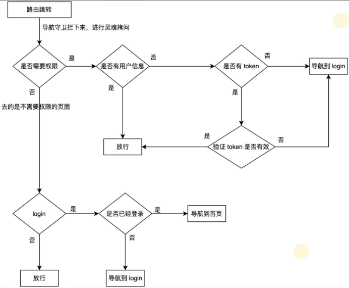

<br>



<br>

```js
import router from "./router";
import store from "./store";
import { Message } from "element-ui";
import getPageTitle from "@/utils/get-page-title";

// 路由前置守卫
router.beforeEach(async (to, from, next) => {
    // 更新页面标题
    document.title = getPageTitle(to.meta.title);

    // 获取本地用户信息
    const hasGetUserInfo = store.getters.user;

    // 判断 to 页面是否需要鉴权
    if (to.meta.auth) {
        // 需要鉴权, 判断是否有用户信息
        if (hasGetUserInfo) {
            next(); // 有用户信息, 直接放行
        } else {
            // 没有用户信息, 看一下是否有 token
            const hasToken = localStorage.getItem("adminToken");
            if (hasToken) {
                // 有 token
                try {
                    // 验证一下 token 的有效性
                    await store.dispatch("user/getInfo");
                    // 获取用户信息成功, 放行
                    next();
                } catch (error) {
                    // token 无效, 需要重新登录
                    await store.dispatch("user/resetToken");
                    Message.error("登录过期, 请重新登录");
                    next(`/login?redirect=${to.path}`);
                }
            } else {
                // 没有 token, 需要重新登录
                next(`/login?redirect=${to.path}`);
            }
        }
    } else {
        // 不需要鉴权
        if (to.path === "/login" && hasGetUserInfo) {
            // 说明你现在是在登录的状态下, 且要去 login 页面, 将其导航到首页
            next({ path: "/" });
        } else {
            next();
        }
    }
});
```

<br>
