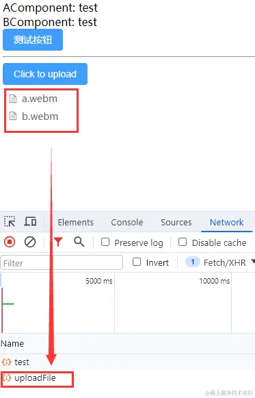

# 破坏异步请求条件

在前一个请求的响应返回（成功或失败）前，限制用户触发请求的交互动作，从而将多个异步请求转换为多个同步请求。例如，在请求过程中增加 Loading、Toast、置灰、防抖等

<br><br>

# 取消过期请求

## XMLHttpRequest

```js
const xhr = new XMLHttpRequest();

xhr.open("GET", "https://xxx");
xhr.send();

xhr.abort(); // 取消请求
```

<br>

## Fetch

```js
const controller = new AbortController();
const signal = controller.signal;

fetch("/xxx", {
    signal,
}).then(function (response) {
    //...
});

controller.abort(); // 取消请求
```

<br>

## Axios

1. 使用 CancelToken.source 工厂方法创建 token

```js
const source = axios.CancelToken.source();

axios
    .get("/xxx", {
        cancelToken: source.token,
    })
    .then(function (response) {
        //...
    });

source.cancel(); // 取消请求
```

2. 使用 CancelToken 构造函数创建 token

```js
const CancelToken = axios.CancelToken;

let cancel;

axios
    .get("/xxx", {
        cancelToken: new CancelToken(function executor(c) {
            cancel = c;
        }),
    })
    .then(function (response) {
        //...
    });

cancel(); // 取消请求
```

另外值得一提的是，在 cancel 时，axios 会在内部调用 `promise.reject()` 与 `xhr.abort()`。所以我们在处理请求错误时，需要判断 error 是否是 cancel 导致的，避免与常规错误一起处理。

```js
axios
    .get("/xxx", {
        cancelToken: source.token,
    })
    .catch(function (err) {
        // isCancel 方法判断错误是否由 cancel 导致
        if (axios.isCancel(err)) {
            console.log("Request canceled", err.message);
        } else {
            // 处理错误
        }
    });
```

但 cancelToken 从 v0.22.0 开始已被 axios 弃用。从 v0.22.0 开始，axios 支持以 fetch API 方式的 AbortController 取消请求

```js
/* 同样, 在处理请求错误时, 也需要判断 error 是否来自 cancel */
const controller = new AbortController();

axios
    .get("/xxx", {
        signal: controller.signal,
    })
    .then(function (response) {
        //...
    });

controller.abort(); // 取消请求
```

<br><br>

# 忽略过期响应

收到响应时，判断返回的数据是否需要，如果不是则忽略。

<br>

## 封装指令式 Promise

> 什么是指令式 Promise？我们普遍使用的 Promise，它的 resolve / reject 只能在 new Promise 内部调用，而指令式 Promise 支持在外部调用。

以 awesome-imperative-promise 这个库为例：

```js
import { createImperativePromise } from "awesome-imperative-promise";

const wrappedPromise = fetch("url");

const { promise, resolve, reject, cancel } =
    createImperativePromise(wrappedPromise);

// will make the returned promise resolved (not the wrapped one)
resolve("some value");

// will make the returned promise reject (not the wrapped one)
reject(new Error(":s"));

// will ensure the returned promise never resolves or reject
cancel();
```

源码中对于 cancel 方法的实现其实就是将 resolve 和 reject 置为 `null`，让 promise 永远无法 resolve / reject，从而达到忽略响应的目的。

基于指令式 promise 我们可以通过手动调用 cancel 方法来忽略过期的响应，但是如果每次都需要手动调用，会导致项目中相同的代码过多，偶尔也可能忘记 cancel。于是我们可以基于指令式 promise 来封装一个自动忽略过期请求的高阶函数 onlyResolvesLast：

```js
import { createImperativePromise } from "awesome-imperative-promise";

function onlyResolvesLast(fn) {
    // 保存上一个请求的 cancel 方法
    let cancelPrevious = null;

    const wrappedFn = (...args) => {
        // 当前请求执行前, 先 cancel 上一个请求
        cancelPrevious && cancelPrevious();
        // 执行当前请求
        const result = fn.apply(this, args);

        // 创建指令式的 promise, 暴露 cancel 方法并保存
        const { promise, cancel } = createImperativePromise(result);
        cancelPrevious = cancel;

        return promise;
    };

    return wrappedFn;
}
```

<br>

## 使用唯一 ID 标识请求

思路：

1. 每次请求时生成一个唯一 ID，用于标识请求。
2. 在请求返回时，判断 id 是否为最新的，如果是则处理数据，否则忽略。

```js
let fetchId = 0; // 保存最新的请求 id

const getInfo = async () => {
    // 发起请求前, 生成新的 id 并保存
    const id = fetchId + 1;
    fetchId = id;

    await fetch("https://xxx");

    // 判断是最新的请求 id 再处理回调
    if (id === fetchId) {
        // 请求处理
    }
};
```

同样地，我们可以再次封装一个通用的高阶函数以减少代码

```js
function onlyResolvesLast(fn) {
    // 保存最新的请求 id
    let id = 0;

    const wrappedFn = (...args) => {
        // 发起请求前，生成新的 id 并保存, 为了避免数字超限可以归零
        const fetchId = id + 1 > 100000 ? 0 : id + 1;
        id = fetchId;

        // 执行请求
        const result = fn.apply(this, args);

        return new Promise((resolve, reject) => {
            // result 可能不是 promise, 需要包装成 promise
            Promise.resolve(result).then(
                (value) => {
                    // 只处理最新一次请求
                    if (fetchId === id) {
                        resolve(value);
                    }
                },
                (error) => {
                    // 只处理最新一次请求
                    if (fetchId === id) {
                        reject(error);
                    }
                }
            );
        });
    };

    return wrappedFn;
}
```

<br><br>

# 共享响应结果

思路：拦截相同请求，对于相同的请求我们先给它挂起，等到最先发出去的请求拿到结果回来之后，把成功或失败的结果共享给后面到来的相同请求。

思路我们已经明确了，但这里有几个需要注意的点：

1. 我们在拿到响应结果后，返回给之前我们挂起的请求时，我们要用到发布订阅模式。

2. 对于挂起的请求，我们需要将它拦截，不能让它执行正常的请求逻辑，所以一定要在请求拦截器中通过 `return Promise.reject()` 来直接中断请求，并做一些特殊的标记，以便于在响应拦截器中进行特殊处理。

```js
import axios from "axios";

const instance = axios.create({ baseURL: "/api/" });

// 发布订阅
class EventEmitter {
    constructor() {
        this.event = {};
    }

    on(type, resCb, rejCb) {
        if (!this.event[type]) {
            this.event[type] = [[resCb, rejCb]];
        } else {
            this.event[type].push([resCb, rejCb]);
        }
    }

    emit(type, res, ansType) {
        if (!this.event[type]) return;
        else {
            this.event[type].forEach((cbArr) => {
                if (ansType === "resolve") {
                    cbArr[0](res);
                } else {
                    cbArr[1](res);
                }
            });
        }
    }
}

// 根据请求生成对应的 key
function generateReqKey(config, hash) {
    const { method, url, params, data } = config;
    return [
        method,
        url,
        JSON.stringify(params),
        JSON.stringify(data),
        hash,
    ].join("&");
}

// 存储已发送但未响应的请求
const pendingRequest = new Set();
// 发布订阅容器
const ev = new EventEmitter();

// 添加请求拦截器
instance.interceptors.request.use(
    async (config) => {
        const hash = location.hash;
        // 生成请求 key
        const reqKey = generateReqKey(config, hash);

        if (pendingRequest.has(reqKey)) {
            // 如果是相同请求, 在这里将请求挂起, 通过发布订阅来为该请求返回结果
            // 这里需注意, 拿到结果后, 无论成功与否, 都需要 return Promise.reject() 来中断这次请求, 否则请求会正常发送至服务器
            let res = null;
            try {
                // 接口成功响应
                res = await new Promise((resolve, reject) => {
                    ev.on(reqKey, resolve, reject);
                });
                return Promise.reject({
                    type: "limitedResSuccess",
                    val: res,
                });
            } catch (limitFunErr) {
                // 接口报错
                return Promise.reject({
                    type: "limitedResError",
                    val: limitFunErr,
                });
            }
        } else {
            // 将请求的 key 保存在 config
            config.pendKey = reqKey;
            pendingRequest.add(reqKey);
        }
        return config;
    },
    (error) => {
        return Promise.reject(error);
    }
);

// 添加响应拦截器
instance.interceptors.response.use(
    (response) => {
        // 将拿到的结果发布给其他相同的接口
        handleSuccessResponse(response);
        return response;
    },
    (error) => {
        return handleErrorResponse(error);
    }
);

// 接口响应成功
function handleSuccessResponse(response) {
    const reqKey = response.config.pendKey;
    if (pendingRequest.has(reqKey)) {
        let x = null;
        try {
            x = JSON.parse(JSON.stringify(response));
        } catch (e) {
            x = response;
        }
        pendingRequest.delete(reqKey);
        ev.emit(reqKey, x, "resolve");
        delete ev.reqKey;
    }
}

// 接口走失败响应
function handleErrorResponse(error) {
    if (error.type && error.type === "limitedResSuccess") {
        return Promise.resolve(error.val);
    } else if (error.type && error.type === "limitedResError") {
        return Promise.reject(error.val);
    } else {
        const reqKey = error.config.pendKey;
        if (pendingRequest.has(reqKey)) {
            let x = null;
            try {
                x = JSON.parse(JSON.stringify(error));
            } catch (e) {
                x = error;
            }
            pendingRequest.delete(reqKey);
            ev.emit(reqKey, x, "reject");
            delete ev.reqKey;
        }
    }
    return Promise.reject(error);
}

export default instance;
```

到这里，这么一通操作下来上面的代码讲道理是万无一失了，但不得不说，线上的情况仍然是复杂多样的。而其中一个比较特殊的情况就是文件上传。



可以看到，我在这里是上传了两个不同的文件的，但只调用了一次上传接口。按理说是两个不同的请求，可为什么会被我们前面写的逻辑给拦截掉一个呢？

我们打印一下请求的 config：


可以看到，请求体 data 中的数据是 FormData 类型，而我们在生成请求 key 的时候，是通过 JSON.stringify 方法进行操作的，而对于 FormData 类型的数据执行该函数得到的只有 {}。所以，对于文件上传，尽管我们上传了不同的文件，但它们所发出的请求生成的 key 都是一样的，这么一来就触发了我们前面的拦截机制。

那么我们接下来我们只需要在我们原来的拦截逻辑中判断一下请求体的数据类型即可，如果含有 FormData 类型的数据，我们就直接放行不再关注这个请求就是了。

```js
function isFileUploadApi(config) {
    return Object.prototype.toString.call(config.data) === "[object FormData]";
}
```

<br>
