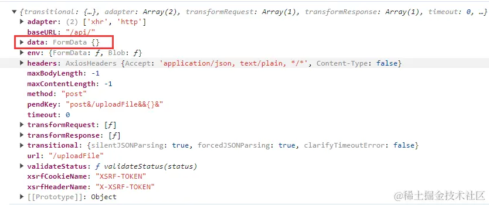

<br>

思路：拦截相同请求，对于相同的请求我们先给它挂起，等到最先发出去的请求拿到结果回来之后，把成功或失败的结果共享给后面到来的相同请求。

思路我们已经明确了，但这里有几个需要注意的点：

1. 我们在拿到响应结果后，返回给之前我们挂起的请求时，我们要用到发布订阅模式。

2. 对于挂起的请求，我们需要将它拦截，不能让它执行正常的请求逻辑，所以一定要在请求拦截器中通过 `return Promise.reject()` 来直接中断请求，并做一些特殊的标记，以便于在响应拦截器中进行特殊处理。

```js
import axios from "axios";

const instance = axios.create({ baseURL: "/api/" });

// 发布订阅
class EventEmitter {
    constructor() {
        this.event = {};
    }

    on(type, resCb, rejCb) {
        if (!this.event[type]) {
            this.event[type] = [[resCb, rejCb]];
        } else {
            this.event[type].push([resCb, rejCb]);
        }
    }

    emit(type, res, ansType) {
        if (!this.event[type]) return;
        else {
            this.event[type].forEach((cbArr) => {
                if (ansType === "resolve") {
                    cbArr[0](res);
                } else {
                    cbArr[1](res);
                }
            });
        }
    }
}

// 根据请求生成对应的 key
function generateReqKey(config, hash) {
    const { method, url, params, data } = config;
    return [
        method,
        url,
        JSON.stringify(params),
        JSON.stringify(data),
        hash,
    ].join("&");
}

// 存储已发送但未响应的请求
const pendingRequest = new Set();
// 发布订阅容器
const ev = new EventEmitter();

// 添加请求拦截器
instance.interceptors.request.use(
    async (config) => {
        const hash = location.hash;
        // 生成请求 key
        const reqKey = generateReqKey(config, hash);

        if (pendingRequest.has(reqKey)) {
            // 如果是相同请求, 在这里将请求挂起, 通过发布订阅来为该请求返回结果
            // 这里需注意, 拿到结果后, 无论成功与否, 都需要 return Promise.reject() 来中断这次请求, 否则请求会正常发送至服务器
            let res = null;
            try {
                // 接口成功响应
                res = await new Promise((resolve, reject) => {
                    ev.on(reqKey, resolve, reject);
                });
                return Promise.reject({
                    type: "limitedResSuccess",
                    val: res,
                });
            } catch (limitFunErr) {
                // 接口报错
                return Promise.reject({
                    type: "limitedResError",
                    val: limitFunErr,
                });
            }
        } else {
            // 将请求的 key 保存在 config
            config.pendKey = reqKey;
            pendingRequest.add(reqKey);
        }
        return config;
    },
    (error) => {
        return Promise.reject(error);
    }
);

// 添加响应拦截器
instance.interceptors.response.use(
    (response) => {
        // 将拿到的结果发布给其他相同的接口
        handleSuccessResponse(response);
        return response;
    },
    (error) => {
        return handleErrorResponse(error);
    }
);

// 接口响应成功
function handleSuccessResponse(response) {
    const reqKey = response.config.pendKey;
    if (pendingRequest.has(reqKey)) {
        let x = null;
        try {
            x = JSON.parse(JSON.stringify(response));
        } catch (e) {
            x = response;
        }
        pendingRequest.delete(reqKey);
        ev.emit(reqKey, x, "resolve");
        delete ev.reqKey;
    }
}

// 接口走失败响应
function handleErrorResponse(error) {
    if (error.type && error.type === "limitedResSuccess") {
        return Promise.resolve(error.val);
    } else if (error.type && error.type === "limitedResError") {
        return Promise.reject(error.val);
    } else {
        const reqKey = error.config.pendKey;
        if (pendingRequest.has(reqKey)) {
            let x = null;
            try {
                x = JSON.parse(JSON.stringify(error));
            } catch (e) {
                x = error;
            }
            pendingRequest.delete(reqKey);
            ev.emit(reqKey, x, "reject");
            delete ev.reqKey;
        }
    }
    return Promise.reject(error);
}

export default instance;
```

到这里，这么一通操作下来上面的代码讲道理是万无一失了，但不得不说，线上的情况仍然是复杂多样的。而其中一个比较特殊的情况就是文件上传。


可以看到，我在这里是上传了两个不同的文件的，但只调用了一次上传接口。按理说是两个不同的请求，可为什么会被我们前面写的逻辑给拦截掉一个呢？

我们打印一下请求的 config：



可以看到，请求体 data 中的数据是 FormData 类型，而我们在生成请求 key 的时候，是通过 JSON.stringify 方法进行操作的，而对于 FormData 类型的数据执行该函数得到的只有 {}。所以，对于文件上传，尽管我们上传了不同的文件，但它们所发出的请求生成的 key 都是一样的，这么一来就触发了我们前面的拦截机制。

那么我们接下来我们只需要在我们原来的拦截逻辑中判断一下请求体的数据类型即可，如果含有 FormData 类型的数据，我们就直接放行不再关注这个请求就是了。

```js
function isFileUploadApi(config) {
    return Object.prototype.toString.call(config.data) === "[object FormData]";
}
```

<br>
