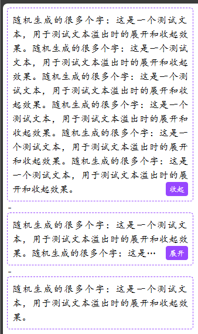

# 用 MutationObserver 监听元素渲染

元素监听最官方的方式是 MutationObserver，这个 API 天生就是为了 dom 变化检测而生的。

MutationObserver 的功能非常强大，几乎能监听到 dom 的所有变化，包括上面提到的元素渲染成功。

但是，正是因为过于强大，所以它的 api 就变得极其繁琐，下面是 MDN 里的一段例子：

```js
// 选择需要观察变动的节点
const targetNode = document.getElementById("some-id");

// 观察器的配置 (需要观察什么变动)
const config = { attributes: true, childList: true, subtree: true };

// 当观察到变动时执行的回调函数
const callback = function (mutationsList, observer) {
    for (let mutation of mutationsList) {
        if (mutation.type === "childList") {
            console.log("A child node has been added or removed.");
        } else if (mutation.type === "attributes") {
            console.log(
                `The ${mutation.attributeName} attribute was modified.`
            );
        }
    }
};

// 创建一个观察器实例并传入回调函数
const observer = new MutationObserver(callback);

// 以上述配置开始观察目标节点
observer.observe(targetNode, config);

// 之后，可停止观察
observer.disconnect();
```

那么，有没有一些简洁的、靠谱的监听方法呢？

<br><br>

# 用 CSS 动画监听元素渲染

原理其实很简单，给元素一个动画，动画会在元素添加到页面时自动播放，进而触发 animationstart 事件。

代码也很简单，先定义一个无关紧要的 CSS 动画，不能影响视觉效果，比如：

```css
@keyframes appear {
    to {
        opacity: 0.99;
    }
}
```

然后给需要监听的元素上添加这个动画：

```css
.element {
    animation: appear 0.1s;
}
```

最后，只需要在这个元素或者其父级上监听动画开始时机就行了，如果有多个元素，建议放在共同父级上：

```js
parent.addEventListener("animationstart", (ev) => {
    if (ev.animationName == "appear") {
        // 元素出现了，可以获取 dom 信息了
    }
});
```

<br><br>

# 多行文本展开收起

```html
<!DOCTYPE html>
<html lang="en">
    <head>
        <style>
            .text-wrap {
                display: flex;
                position: relative;
                width: 300px;
                padding: 8px;
                outline: 1px dashed #9747ff;
                border-radius: 4px;
                line-height: 1.5;
                text-align: justify;
                font-family: cursive;
            }
            .expand {
                font-size: 80%;
                padding: 0.2em 0.5em;
                background-color: #9747ff;
                color: #fff;
                border-radius: 4px;
                cursor: pointer;
                float: right;
                clear: both;
            }
            .expand::after {
                content: "展开";
            }
            .text-content {
                display: -webkit-box;
                -webkit-box-orient: vertical;
                -webkit-line-clamp: 3;
                overflow: hidden;
            }
            .text-content::before {
                content: "";
                float: right;
                height: calc(100% - 24px);
            }
            .text-wrap:has(:checked) .text-content {
                -webkit-line-clamp: 999;
            }
            .text-wrap:has(:checked) .expand::after {
                content: "收起";
            }
        </style>
    </head>
    <body>
        <div class="text-wrap">
            <div class="text-content">
                <label class="expand"><input type="checkbox" hidden /></label>
                随机生成的很多个字：这是一个测试文本，用于测试文本溢出时的展开和收起效果。随机生成的很多个字：这是一个测试文本，用于测试文本溢出时的展开和收起效果。随机生成的很多个字：这是一个测试文本，用于测试文本溢出时的展开和收起效果。随机生成的很多个字：这是一个测试文本，用于测试文本溢出时的展开和收起效果。随机生成的很多个字：这是一个测试文本，用于测试文本溢出时的展开和收起效果。随机生成的很多个字：这是一个测试文本，用于测试文本溢出时的展开和收起效果。
            </div>
        </div>
        -
        <div class="text-wrap">
            <div class="text-content">
                <label class="expand"><input type="checkbox" hidden /></label>
                随机生成的很多个字：这是一个测试文本，用于测试文本溢出时的展开和收起效果。随机生成的很多个字：这是一个测试文本，用于测试文本溢出时的展开和收起效果。随机生成的很多个字：这是一个测试文本，用于测试文本溢出时的展开和收起效果。随机生成的很多个字：这是一个测试文本，用于测试文本溢出时的展开和收起效果。随机生成的很多个字：这是一个测试文本，用于测试文本溢出时的展开和收起效果。随机生成的很多个字：这是一个测试文本，用于测试文本溢出时的展开和收起效果。
            </div>
        </div>
        -
        <div class="text-wrap">
            <div class="text-content">
                <label class="expand"><input type="checkbox" hidden /></label>
                随机生成的很多个字：这是一个测试文本，用于测试文本溢出时的展开和收起效果。
            </div>
        </div>
    </body>
</html>
```


我们给文本容器添加一个无关紧要的动画：

```css
.text-content {
    /* ... */
    animation: appear 0.1s;
}
@keyframes appear {
    to {
        opacity: 0.99;
    }
}
```

然后，我们在父级上监听这个动画，我这里直接监听 document，这里做的事情很简单，判断一下容器的滚动高度和实际高度，如果滚动高度超过实际高度，说明文本较多，超出了指定行数，这种情况就给容器添加一个特殊的属性：

```js
document.addEventListener("animationstart", (ev) => {
    if (ev.animationName == "appear") {
        ev.target.dataset.mul = ev.target.scrollHeight > ev.target.offsetHeight;
    }
});
```

然后根据这个属性，判断 "展开" 按钮隐藏或者显示：

```css
.expand {
    /* ... */
    visibility: hidden;
}
.text-content[data-mul="true"] .expand {
    visibility: visible;
}
```

这样只有在文本较多时，"展开" 按钮才会出现，效果如下：



<br><br>

# 文本超长时自动滚动

CSS 动画监听元素渲染 https://juejin.cn/post/7323539673347129383

CSS 实现多行文本“展开收起” https://juejin.cn/post/6963904955262435336

借助 CSS 自定义彩色字体来实现多行文本展开收起 https://juejin.cn/post/7214839315855491130

CSS 文本超出提示效果 https://juejin.cn/post/6966042926853914654

纯 CSS 实现标签自动显示超出数量 https://segmentfault.com/a/1190000044865397

纯 CSS 检测文本是否溢出 https://segmentfault.com/a/1190000044834941
