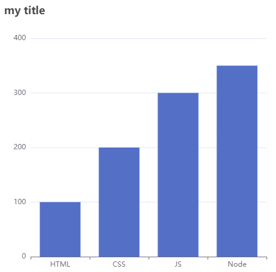

# Vue & Echarts 初体验

1. 创建 Echarts 容器，需要设置宽高

```html
<div id="app">
    <!-- 创建 Echarts 的容器 （需要设置宽高） -->
    <div ref="myChart" class="myChart"></div>
</div>
```

```css
.myChart {
    width: 500px;
    height: 500px;
}
```

2. 在 Vue 挂载完后，创建、并配置 Echarts 实例

```js
new Vue({
    el: '#app',
    data() {
        return {
            // 将 Echarts 实例的配置数据存放在 data 中
            option: {
                title: { text: 'my title' }, // Echarts 的标题
                yAxis: {}, // Y 轴
                xAxis: {
                    // X 轴
                    data: ['HTML', 'CSS', 'JS', 'Node'], // 各个数据的标题
                },
                series: {
                    // 系列
                    name: '编程大全', // 数据的标题
                    type: 'bar', // 柱状图
                    data: [100, 200, 300, 350], // 各个数据值
                },
            },
        };
    },
    mounted() {
        // 创建 Echarts 实例
        let myEcharts = echarts.init(this.$refs.myChart);
        // 配置 Echarts 实例
        myEcharts.setOption(this.option);
    },
});
```



## echarts.init

-   创建 Echarts 实例 echartsInstance，不能在单个容器上初始化多个 Echarts 实例

```js
let myChart = echarts.init(document.getElementById('main'));
```

1. 接收参数 dom：作为实例容器，一般是一个具有宽高的 DIV 元素
2. 接收参数 theme：为颜色主题，默认是白色，可设置为 `"dark"`

## echartsInstance.setOption

-   配置图表实例，所有参数和数据的修改都可以通过 setOption 完成，ECharts 会合并新的参数和数据，然后刷新图表
-   如果开启动画的话，ECharts 找到两组数据之间的差异然后通过合适的动画去表现数据的变化

```js
myChart.setOption(option);
```

## 配合 Vue 使用

```html
<div id="app">
    <div id="main"></div>
    <button @click="changeOption">点击修改 changeOption</button>
</div>
```

1. 将配置对象存放到 data 中
2. 通过钩子函数 mounted，在元素挂载完之后，创建、并配置 Echarts 实例
3. 可通过事件函数更新 option 数据
4. 通过侦听器 watch 监听数据 option 的变化，从而更新 Echarts 图表

```js
let vm = new Vue({
    el: '#app',
    data() {
        return {
            // Echarts 的配置对象
            option: {
                title: { text: 'Superman Echarts' }, // 标题
                tooltip: {}, // 提示框
                legend: { data: ['人数'] }, // 小标题
                xAxis: {
                    // X 轴
                    data: ['vue', 'react', 'angular'],
                },
                yAxis: {}, // Y 轴
                series: [
                    {
                        // 显示数据
                        name: '人数',
                        type: 'bar',
                        data: [2000, 1500, 500],
                    },
                ],
            },
        };
    },
    methods: {
        changeOption() {
            /* 修改对象数据（方法1）：通过 JSON 转换完成深拷贝 */
            // let coOption = JSON.parse(JSON.stringify(this.option));
            // coOption.series[0].data[1] = 1000;
            // this.option = coOption;

            /* 修改对象数据（方法2）：通过 Vue 内置 API 修改数据 */
            this.$set(this.option.series[0].data, 1, 1000);
        },
    },
    // Vue 挂载完成之后
    mounted() {
        // 基于准备好的dom，初始化 echarts 实例
        let myChart = echarts.init(document.getElementById('main'));
        // 配置 Echarts 实例
        myChart.setOption(this.option);
    },
    watch: {
        option: {
            handler() {
                // 基于准备好的dom，初始化 echarts 实例
                let myChart = echarts.init(document.getElementById('main'));
                // 配置 Echarts 实例
                myChart.setOption(this.option);
            },
            deep: true,
        },
    },
});
```

# title

## 配置标题

> #### 标题组件，包含主标题和副标题

1. `title.show`：是否显示标题组件
2. `title.text`：主标题文本，支持 `\n` 换行
3. `title.link`：主标题超链接
4. `title.target`：超链接的打开方式；`"self"`、`"blank"`

## 标题的位置

1. `title.top`：标题离容器上侧的距离

    `top` 的值可以是具体像素值 `20`，也可以对于容器高宽的百分比 `'20%'`，也可以是 `'top'`、`'middle'`、`'bottom'`

2. `title.left`：离容器左侧的距离

    `left` 的值可以是具体像素值 `20`，也可以是相对于容器高宽的百分比 `'20%'`，也可以是 `'left'`、`'center'`、`'right'`

3. `title.right`：离容器右侧的距离；可以是 [具体像素值 `20`] / [相对于容器高宽的百分比 `'20%'`]

4. `title.bottom`：离容器下侧的距离；可以是 [具体像素值 `20`] / [相对于容器高宽的百分比 `'20%'`]

## 标题的样式

1. `title.backgroundColor`：标题背景色，默认为 `'transparent'`；颜色可以使用 RGB / RGBA，也可以使用十六进制格式
2. `title.padding`：内边距，单位 px；默认为 `5`；

```js
// 设置内边距为 5
padding: 5;
// 上下为 5，左右为 10
padding: [5, 10];
// 分别设置四个方向：上、右、下、左
padding: [5, 10, 5, 10];
```

## 标题的边框样式

1. `title.borderWidth`：边框线宽
2. `title.borderColor`：边框颜色
3. `title.borderRadius`：边框圆角半径，单位 px

```js
borderRadius: 5, // 统一设置 4 个角的圆角大小
borderRadius: [5, 5, 0, 0] // 顺时针：左上、右上、右下、左下
```

## 标题的阴影样式

1. `title.shadowBlur`：阴影的模糊大小；需配合 `shadowColor`、`shadowOffsetX`、`shadowOffsetY` 一起使用
2. `title.shadowColor`：阴影颜色
3. `title.shadowOffsetX`：水平方向上的阴影偏移距离
4. `title.shadowOffsetY`：垂直方向上的阴影偏移距离

```js
shadowBlur: 15,
shadowColor: "red",
shadowOffsetX: 5,
shadowOffsetY: 5
```

使用前提是 `show: true`

## 标题的文字样式

### title.textStyle: { }

1. `title.textStyle.color`：文字颜色
2. `title.textStyle.fontStyle`：字体风格；`'normal'`、`'italic'`、`'oblique'`
3. `title.textStyle.fontWeight`：字体粗细；`'normal'`、`'bold'`、`'bolder'`、`'lighter'`、`100 | 200 | 300 | 400`
4. `title.textStyle.fontFamily`：字体系列；`'serif'`、`'monospace'`、`'Arial'`、`'Courier New'`、`'Microsoft YaHei'`
5. `title.textStyle.fontSize`：字体大小
6. `title.textStyle.lineHeight`：行高
7. `title.textStyle.width`：文本显示宽度
8. `title.textStyle.height`：文本显示高度

### 标题的文字换行

1. `title.textStyle.overflow`：文字超出宽度是否截断或者换行（配置 `width` 时有效）

    `'truncate'`-截断，并在末尾显示 ellipsis 配置的文本，默认为 `...`

    `'break'`-换行

    `'breakAll'`-换行，会强制单词内换行

2. `title.textStyle.ellipsis`：在 `overflow` 配置为 `'truncate'` 的时候，可通过该属性配置末尾显示的文本

3. `title.textStyle.richObject`：在 rich 里面，可以自定义富文本样式

### 标题的文字边框

1. `title.textStyle.textBorderColor`：文字的描边颜色

2. `title.textStyle.textBorderWidth`：文字的描边宽度

3. `title.textStyle.textBorderType`：文字的描边类型；`'solid'`、`'dashed'`、`'dotted'`

    也可以是 number / number 数组，用以指定线条的 dash array，配合 `textBorderDashOffset` 可实现更灵活的虚线效果

```js
textBorderType: [5, 10],
textBorderDashOffset: 5
```

12. `title.textStyle.textBorderDashOffset`：设置虚线的偏移量

    可搭配 textBorderType 指定 dash array 实现灵活的虚线效果

### 标题的文字阴影

1. `title.textStyle.textShadowColor`：文字的阴影颜色
2. `title.textStyle.textShadowBlur`：文字的阴影长度
3. `title.textStyle.textShadowOffsetX`：文字的阴影 X 偏移
4. `title.textStyle.textShadowOffsetY`：文字的阴影 Y 偏移

### 标题的文字对齐

1. `title.textAlign`：水平对齐；`'auto'`、`'left'`、`'right'`、`'center'`
2. `title.textVerticalAlign`：垂直对齐；`'auto'`、`'top'`、`'bottom'`、`'middle'`

## 设置副标题

1. `title.subtext`：设置副标题文本，支持使用 `\n`
2. `title.sublink`：副标题文本超链接
3. `title.subtarget`：超链接打开方式；`'self'` / `'blank'`
4. `title.itemGap`：主副标题之间的间距，默认为 `10`

## 副标题特有的文字样式

> #### `title.subtextStyle: { }`

1. `title.subtextStyle.align`：文字水平对齐方式；`'left'`、`'center'`、`'right'`
2. `title.subtextStyle.verticalAlign`：文字垂直对齐方式；`'top'`、`'middle'`、`'bottom'`

-   其余的参考标题的文字样式

## 其他

1. `title.triggerEvent`：是否触发事件

2. `title.zlevelnumber`：图形的 `zlevel` 值

    - zlevel 用于 Canvas 分层，Canvas 分层是一种常见的优化手段
    - 我们可以把一些图形变化频繁的组件设置成一个单独的 zlevel
    - zlevel 大的 Canvas 会放在 zlevel 小的 Canvas 的上面
    - 过多的 Canvas 会引起内存开销的增大，在手机端上需要谨慎使用以防崩溃

3. `title.z`：图形的 z 值，控制图形的前后顺序；z 值小的图形会被 z 值大的图形覆盖

    z 相比 zlevel 优先级更低，而且不会创建新的 Canvas

# tooltip

## 提示框组件

1. `tooltip.trigger`：触发类型

    1. `item`：鼠标落在图形上触发（默认）
    2. `axis`：鼠标落在指定坐标轴范围内触发
    3. `none`：不触发

2. `tooltip.showContent`：是否显示提示框浮层，默认显示

    只需 `tooltip` 触发事件 / 显示 `axisPointer` 而不需要显示内容时可配置该项为 `false`

3. `tooltip.triggerOn`：提示框触发的条件；`mousemove`-鼠标移动时触发、`click`-鼠标点击时触发

    `mousemove|click`-鼠标移动/点击时触发（默认）

    `none`-通过 `action.tooltip.showTip` 和 `action.tooltip.hideTip` 来手动触发和隐藏

## 坐标轴指示器

> #### `tooltip.axisPointer`

-   `tooltip.axisPointer` 是配置坐标轴指示器的快捷方式

    实际上，坐标轴指示器的全部功能，都可通过轴上的 `axisPointer` 配置项完成（eg：`xAxis.axisPointer` / `angleAxis.axisPointer`

    在简单场景下，使用 `tooltip.axisPointer` 会更方便一些

-   注意： `tooltip.axisPointer` 中的配置优先级会低于轴上的 `axisPointer` 的配置

1. `tooltip.axisPointer.type`：指示器类型；**仅在 `tooltip.trigger: "axis"` 时有效**；默认为 `none`-无指示器

    `line`-直线指示器、`shadow`-阴影指示器、`cross`-十字准星指示器，表示启用两个正交的轴的 `axisPointer`

2. `tooltip.axisPointer.axis`：指示器的坐标轴；默认取类目轴 / 者时间轴；`x`、`y`、`radius`、`angle`

## 提示框样式

1. `tooltip.backgroundColor`：背景颜色
2. `tooltip.borderColor`：边框颜色
3. `tooltip.borderWidth`：边框宽度
4. `tooltip.padding`：内边距；默认 5px

```js
// 设置内边距为 5
padding: 5;
// 上下内边距为 5，左右内边距为 10
padding: [5, 10];
// 分别设置上右下左
padding: [5, 10, 5, 10];
```

## 文本样式

> #### `tooltip.textStyle`

### 字体样式

1. `tooltip.textStyle.color`：文本颜色
2. `tooltip.textStyle.fontStyle`：字体风格；`normal`、`italic`、`oblique`
3. `tooltip.textStyle.fontWeight`：字体粗细；`normal`、`bold`、`bolder`、`lighter`、`100 | 200 | 300...`
4. `tooltip.textStyle.fontFamily`：字体系列；`sans-serif`、`serif`、`monospace`、`Arial`、`Microsoft YaHei`
5. `tooltip.textStyle.fontSize`：字体大小
6. `tooltip.textStyle.lineHeight`：行高
7. `tooltip.textStyle.width`：文本显示宽度
8. `tooltip.textStyle.height`：文本显示高度

### 字体描边

1. `tooltip.textStyle.textBorderColor`：描边颜色

2. `tooltip.textStyle.textBorderWidth`：描边宽度

3. `tooltip.textStyle.textBorderType`：描边类型；`solid`、`dashed`、`dotted`

    也可以是 number / number 数组，用以指定线条的 dash array，配合 `textBorderDashOffset` 可实现更灵活的虚线效果

```js
textBorderType: [5, 10],
textBorderDashOffset: 5
```

4. `tooltip.textStyle.textBorderDashOffset`：虚线的偏移量，可搭配 `textBorderType` 指定 dash array 实现灵活的虚线效果

### 字体阴影

1. `tooltip.textStyle.textShadowColor`：文字的阴影颜色；默认为 `transparent`
2. `tooltip.textStyle.textShadowBlur`：文字的阴影长度
3. `tooltip.textStyle.textShadowOffsetX`：文字阴影的 X 偏移
4. `tooltip.textStyle.textShadowOffsetY`：文字阴影的 Y 偏移

### 字体超出处理

1. `tooltip.textStyle.overflow`：文字超出宽度是否截断或者换行；配置 `width` 时有效

    `truncate`-截断，并在末尾显示 ellipsis 配置的文本，默认为 ...

    `break`-换行、`breakAll`-强制单词内换行

2. `tooltip.textStyle.ellipsis`：在 `overflow` 配置为 `truncate` 时，可通过该属性配置末尾显示的文本

## 提示内容的显示

> #### `tooltip.formatter`：提示框浮层内容格式器，支持 [字符串模板]、[回调函数] 两种形式

1. #### 字符串模板

-   折线(区域)图、柱状(条形)图、K 线图：`{a}`-系列名、`{b}`-类目值、`{c}`-数值
-   散点图(气泡)图：`{a}`-系列名、`{b}`-数据名、`{c}`-数值数组
-   地图：`{a}`-系列名、`{b}`-区域名、`{c}`-合并数值
-   饼图、仪表盘、漏斗图：`{a}`-系列名、`{b}`-数据项名称、`{c}`-数值、`{d}`-百分比

在 `trigger` 为 `axis` 的时候，会有多个系列的数据，此时可以通过 `{a0}`、`{a1}`、`{a2}` 方式表示系列的索引

```js
formatter: '{a}-{b}-{c}';
```

2. #### 回调函数：支持返回 [HTML 字符串] / [创建的 DOM 实例]

-   第 1 个参数 `params` 是 `formatter` 需要的数据集

```js
{
    componentType: 'series',
    seriesType: string, // 系列类型
    seriesIndex: number, // 系列在传入的 option.series 中的 index
    seriesName: string, // 系列名称
    name: string, // 数据名 / 类目名
    dataIndex: number, // 数据在传入的 data 数组中的 index
    data: Object, // 传入的原始数据项
    // 传入的数据值。在多数系列下它和 data 相同。在一些系列下是 data 中的分量（如 map、radar 中）
    value: number | Array | Object,
    // encode 坐标轴的映射信息：
    // - key 为坐标轴（如 'x' 'y' 'radius' 'angle' 等）
    // - value 必然为数组，不会为 null/undefied，表示 dimension index 。
    // 其内容如：
    // {
    //     x: [2] // dimension index 为 2 的数据映射到 x 轴
    //     y: [0] // dimension index 为 0 的数据映射到 y 轴
    // }
    encode: Object,
    dimensionNames: Array<String>, // 维度名列表
    dimensionIndex: number, // 数据的维度 index，如 0 / 1 / 2  (仅在雷达图中使用)
    color: string, // 数据图形的颜色
    percent: number // 饼图，漏斗图的百分比
}
```

```js
formatter: ([p]) => `${p.name}-${p.data}`;
```

# legend

## 图例排版

图例组件；图例组件展现了不同系列的标记(symbol)、颜色、名字。可以通过点击图例控制哪些系列不显示

1. `legend.itemGap`：图例之间的间隔；横向布局时为水平间隔，纵向布局时为纵向间隔；默认为 `10px`

2. `legend.orient`：图例列表的布局朝向；`horizontal`、`vertical`

3. `legend.align`：图例标记和文本的对齐；`auto`、`left`、`right`

    默认自动，根据组件的位置和 `orient` 决定，当 [组件的 `left` 值为 `right`] & [纵向布局 `orient` 为 `vertical`] 时右对齐

## 图例样式

1. `legend.backgroundColor`：背景色；默认透明
2. `legend.borderColor`：边框颜色
3. `legend.borderWidth`：边框线宽
4. `legend.borderRadius`：圆角半径

```
borderRadius: 5, // 统一设置四个角的圆角大小
borderRadius: [5, 5, 0, 0] //（顺时针左上，右上，右下，左下）
```

5. `legend.shadowBlur`：图形阴影的模糊大小

    该属性配合 `shadowColor`、`shadowOffsetX`、`shadowOffsetY` 一起设置图形的阴影效果

6. `legend.shadowColor`：阴影颜色

7. `legend.shadowOffsetX`：水平方向上的阴影偏移距离

8. `legend.shadowOffsetY`：垂直方向上的阴影偏移距离

## 位置

1. `legend.left`：图例组件离容器左侧的距离；可以是像素值、相对于容器**高度**的百分比、`left`、`center`、`right`

    如果为 `left`、`center`、`right`，组件会根据相应的位置自动对齐

2. `legend.top`：图例组件离容器上侧的距离；可以是像素值、相对于容器**高度**的百分比、`top`、`middle`、`bottom`

    如果为 `top`、`middle`、`bottom`，组件会根据相应的位置自动对齐

3. `legend.right`：图例组件离容器右侧的距离；可以是像素值、相对于容器**高度**的百分比

4. `legend.bottom`：图例组件离容器下侧的距离；可以是像素值、相对于容器**高度**的百分比

## 图例图形

1. `legend.icon`：图例项的 icon；`circle`、`rect`、`roundRect`、`triangle`、`diamond`、`pin`、`arrow`、`none`

    可以通过 `image://url` 设置为图片，其中 url 为 [图片的链接] / [dataURI]

    可以通过 'path://' 将图标设置为矢量路径。这样，便不用担心因为缩放而产生锯齿/模糊，而且可以设置为任意颜色

2. `legend.itemWidth`：图例图形的宽度

3. `legend.itemHeight`：图例图形的高度

4. `legend.itemStyleObject`：图例的图形样式

```
{ color , borderColor , borderWidth , borderType , borderDashOffset , borderCap , borderJoin , borderMiterLimit , shadowBlur , shadowColor , shadowOffsetX , shadowOffsetY , opacity , decal }
```

## 图例文本

> #### `legend.textStyle`：文本样式

```
{ color , fontStyle , fontWeight , fontFamily , fontSize , lineHeight , backgroundColor , borderColor , borderWidth , borderType , borderDashOffset , borderRadius , padding , shadowColor , shadowBlur , shadowOffsetX , shadowOffsetY , width , height , textBorderColor , textBorderWidth , textBorderType , textBorderDashOffset , textShadowColor , textShadowBlur , textShadowOffsetX , textShadowOffsetY , overflow , ellipsis , rich }
```

## 多个图例

> #### `legend.data`：图例的数据数组

1. 数组项通常为一个 String，每一项代表一个系列的 `name`（如果是饼图，也可以是饼图单个数据的 name）

2. 图例组件会自动根据对应系列的图形标记(symbol) 来绘制自己的颜色和标记

3. 特殊字符串 `''`(空字符串) / `'\n'`(换行字符串) 用于图例的换行

4. 如果 data 没有被指定，会自动从当前系列中获取

    多数系列会取自 `series.name` / `series.encode` 的 `seriesName` 所指定的维度

5. 如果要设置单独一项的样式，也可以把该项写成配置项对象

```js
data: [
    {
        name: '系列1',
        icon: 'circle', // 强制设置图形为圆
        textStyle: {
            // 设置文本为红色
            color: 'red',
        },
    },
];
```

所有属性：

```
{ name , icon , itemStyle , lineStyle , symbolRotate , textStyle }
```

# grid

-   直角坐标系内绘图网格，单个 grid 内最多可以放置上下两个 X 轴，左右两个 Y 轴
-   可以在网格上绘制折线图，柱状图，散点图

1. `grid.width`：组件的宽度；默认自适应
2. `grid.height`：组件的高度；默认自适应

## 位置

1. `grid.left`：组件离容器左侧的距离；可以是具体的像素值、相对于容器高度的百分比、`left`、`center`、`right`

    如果 `grid.left` 的值为 `left`、`center`、`right`，组件会根据相应的位置自动对齐

2. `grid.top`：组件离容器上侧的距离；可以是具体的像素值、相对于容器高度的百分比、`top`、`middle`、`bottom`

    如果 `grid.top` 的值为 `top`、`middle`、`bottom`，组件会根据相应的位置自动对齐

3. `grid.right`：组件离容器右侧的距离；可以是具体的像素值、相对于容器高度的百分比

4. `grid.bottom`：组件离容器下侧的距离；可以是具体的像素值、相对于容器高度的百分比

## 刻度标签

1. `grid.containLabel`：是否包含坐标轴的刻度标签

containLabel 为 `false` 的时候：
`grid.left`、`grid.right`、`grid.top`、`grid.bottom`、`grid.width`、`grid.height` 决定的是由坐标轴形成的矩形的尺寸和位置
这比较适用于多个 grid 进行对齐的场景，因为往往多个 grid 对齐的时候，是依据坐标轴来对齐的

containLabel 为 `true` 的时候：
`grid.left`、`grid.right`、`grid.top`、`grid.bottom`、`grid.width`、`grid.height` 决定的是包括了坐标轴标签在内的所有内容所形成的矩形的位置
这常用于『防止标签溢出』的场景，标签溢出指的是，标签长度动态变化时，可能会溢出容器或者覆盖其他组件

# xAxis

-   x 轴，一般情况下单个 grid 组件最多只能放上下两个 x 轴
-   多于两个 x 轴需要通过配置 offset 属性防止同个位置多个 x 轴的重叠

1. `xAxis.name`：坐标轴名

## 坐标样式

1. `xAxis.type`：坐标轴类型

    1. `value`-数值轴，适用于连续数据

    2. `category`-类目轴，适用于离散的类目数据

        为该类型时类目数据可自动从 series.data 或 dataset.source 中取，或者可通过 xAxis.data 设置类目数据

    3. `time`-时间轴，适用于连续的时序数据；与数值轴相比时间轴带有时间的格式化

        在刻度计算上也有所不同，例如会根据跨度的范围来决定使用月，星期，日还是小时范围的刻度

    4. `log`-对数轴。适用于对数数据

2. `xAxis.boundaryGap`：坐标轴两边留白策略；类目轴 & 非类目轴的设置和表现不一样

    类目轴中 boundaryGap 可以配置为 `true` 和 `false`；默认为 true，此时刻度只是作为分隔线；标签和数据点都会在两个刻度之间的带(band)中间

    非类目轴，包括时间，数值，对数轴，boundaryGap 是一个两个值的数组，分别表示数据最小值和最大值的延伸范围，可以直接设置数值或者相对的百分比，在设置 min 和 max 后无效

```js
boundaryGap: ['20%', '20%'];
```

## 类目数据

> #### `xAxis.data`：类目数据，在类目轴（`type: 'category'`）中有效

-   如果没有设置 `type`，但是设置了 `axis.data`，则认为 `type` 是 `'category'`
-   如果设置了 `type` 是 `'category'`，但没有设置 `axis.data`，则 `axis.data` 的内容会自动从 `series.data` 中获取
-   注意，`axis.data` 指明的是 `'category'` 轴的取值范围。如果不指定而是从 `series.data` 中获取，那么只能获取到 `series.data` 中出现的值。比如说，假如 `series.data` 为空时，就什么也获取不到

```js
// 所有类目名称列表
data: ['周一', '周二', '周三', '周四', '周五', '周六', '周日'];
// 每一项也可以是具体的配置项，此时取配置项中的 `value` 为类目名
data: [
    {
        value: '周一',
        // 突出周一
        textStyle: {
            fontSize: 20,
            color: 'red',
        },
    },
    '周二',
    '周三',
    '周四',
    '周五',
    '周六',
    '周日',
];
```

1. `xAxis.data.value`：单个类目名称
2. `xAxis.data.textStyle`：类目标签的文字样式

```
{ color , fontStyle , fontWeight , fontFamily , fontSize , align , verticalAlign , lineHeight , backgroundColor , borderColor , borderWidth , borderType , borderDashOffset , borderRadius , padding , shadowColor , shadowBlur , shadowOffsetX , shadowOffsetY , width , height , textBorderColor , textBorderWidth , textBorderType , textBorderDashOffset , textShadowColor , textShadowBlur , textShadowOffsetX , textShadowOffsetY , overflow , ellipsis , rich }
```

# dataZoom

内置型数据区域缩放组件；所谓『内置』，即内置在坐标系中

1. `dataZoom.type = "inside"`
2. `dataZoom.type = "slider"`

-   平移：在坐标系中滑动拖拽进行数据区域平移
-   缩放：PC 端-鼠标在坐标系范围内滚轮滚动、移动端-支持两指滑动缩放

```js
dataZoom: [{ type: 'inside', start: 0, end: 5 }, { type: 'slider' }];
```

## 窗口的起始位置

1. `dataZoom.start`：数据窗口范围的起始百分比；0 ~ 100

2. `dataZoom.end`：数据窗口范围的结束百分比

3. `dataZoom.startValue`：数据窗口范围的起始数值

    如果设置了 `dataZoom.start` 则 `startValue` 失效

    如果轴的类型为 category，则 startValue 既可以设置为 axis.data 数组的 index，也可以设置为数组值本身
    但是如果设置为数组值本身，会在内部自动转化为数组的 index

4. `dataZoom.endValue`：数据窗口范围的结束数值

    如果设置了 `dataZoom.end` 则 `endValue` 失效

    如果轴的类型为 category，则 endValue 即可以设置为 axis.data 数组的 index，也可以设置为数组值本身
    如果设置为数组值本身，会在内部自动转化为数组的 index

## 窗口的大小

1. `dataZoom.minSpan`：用于限制窗口大小的最小值（百分比值），取值范围是 0 ~ 100

    如果设置了 dataZoom.minValueSpan 则 minSpan 失效

2. `dataZoom.maxSpan`：用于限制窗口大小的最大值（百分比值），取值范围是 0 ~ 100

    如果设置了 dataZoom.maxValueSpan 则 maxSpan 失效

3. `dataZoom.minValue`：用于限制窗口大小的最小值（实际数值）

    在时间轴上设置 `3600 * 24 * 1000 * 5` 表示 5 天；在类目轴上设置 `5` 表示 5 个类目

4. `dataZoom.maxValue`：用于限制窗口大小的最大值（实际数值）

    在时间轴上设置 `3600 * 24 * 1000 * 5` 表示 5 天；在类目轴上设置 `5` 表示 5 个类目

## slider 的位置

1. `dataZoom-slider.left`：组件离容器左侧的距离

    可以是像素值 `20`、相对于容器高度的百分比 `20%`、`left`、`center`、`right`

2. `dataZoom-slider.top`：组件离容器上侧的距离

    可以是像素值 `20`、相对于容器高度的百分比 `20%`、`top`、`middle`、`bottom`

3. `dataZoom-slider.right`：组件离容器右侧的距离；可以是像素值 `20`、相对于容器高度的百分比 `20%`

4. `dataZoom-slider.bottom`：组件离容器右侧的距离；可以是像素值 `20`、相对于容器高度的百分比 `20%`

## slider 的大小

1. `dataZoom-slider.width`：组件的宽度；竖直布局默认 `30`、水平布局默认自适应；比 `left` 和 `right` 优先级高
2. `dataZoom-slider.height`：组件的高度；水平布局默认 `30`，竖直布局默认自适应；比 `top` 和 `bottom` 优先级高

# toolbox

1. `toolbox.itemGap`：每项 icon 之间的间隔

1. `toolbox.feature.saveAsImageObject`：保存为图片
1. `toolbox.feature.restore`：配置项还原
1. `toolbox.feature.dataView`：数据视图工具，可以展现当前图表所用的数据，编辑后可以动态更新
    1. `toolbox.feature.dataView.readOnly`：是否只读；默认为 `false`，即 可修改
1. `toolbox.feature.magicType`：动态类型切换

```js
feature: {
    saveAsImage: {},
    restore: {},
    dataView: {},
    magicType: { type: ['line', 'bar', "stack"] },
},
```
