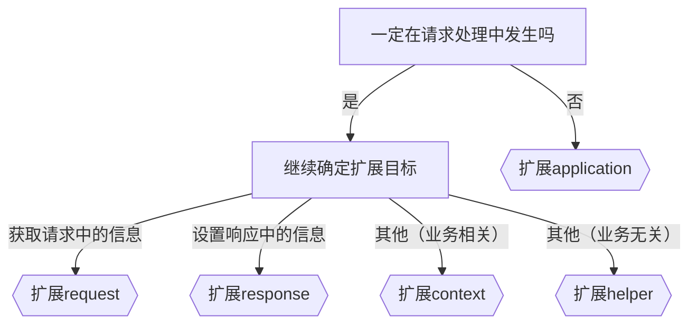

# 启动流程


-   生成配置：egg 会在启动时读取 config 文件夹中的配置，以及 app/router.js 中的路由信息，然后将最终的配置生成到 run 文件夹中
-   启动 egg：egg 会在内部创建 koa 实例，并作出适当的初始化工作，然后监听 7001 (默认) 端口
-   匹配路由：egg 在内部使用了 @koa/router 库，会根据路由表中请求的路径和方法，把请求交给指定的 action 进行处理
-   请求处理：egg 遵循 MVC 模式，**请求始终是交给 Controller 中的 Action 进行处理**
    -   Controller 表现为一个类，继承自 egg 中的 Controller
    -   Action 表现为一个 Controller 中的实例方法，用于处理请求

<br><br>

# 使用脚手架创建项目

```bash
$ mkdir egg-example && cd egg-example
$ npm init egg --type=simple
$ npm i
$ npm run dev
$ open http://localhost:7001
```

脚手架的名字叫 egg-init，create-egg 是他的别名。起别名的目的是方便大家使用脚手架创建项目。

-   使用 egg-init 创建项目，需要先安装 egg-init，然后创建项目。
-   使用 create-egg 创建项目，只需 `npm init egg` 即可，执行这行代码会临时安装 egg-init，然后创建项目，创建完成后 egg-init 会被自动卸载。

<br><br>

# 扩展决策树



<br>
