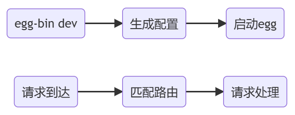

# 启动流程

-   生成配置：egg 会在启动时读取 config 文件夹中的配置，以及 app/router.js 中的路由信息，然后将最终的配置生成到 run 文件夹中
-   启动 egg：egg 会在内部创建 koa 实例，并作出适当的初始化工作，然后监听 7001 (默认) 端口
-   匹配路由：egg 在内部使用了 @koa/router 库，会根据路由表中请求的路径和方法，把请求交给指定的 action 进行处理
-   请求处理：egg 遵循 MVC 模式，**请求始终是交给 Controller 中的 Action 进行处理**
    -   Controller 表现为一个类，继承自 egg 中的 Controller
    -   Action 表现为一个 Controller 中的实例方法，用于处理请求

  
