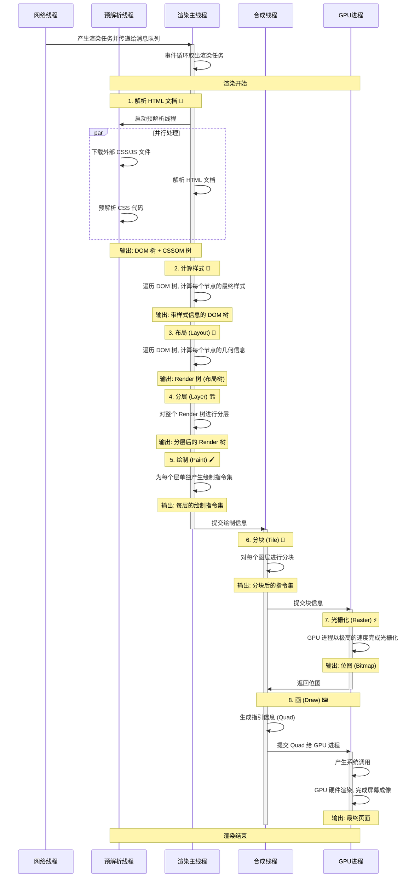

# 浏览器是如何渲染页面的

当浏览器的网络线程收到 HTML 文档后, 会产生一个渲染任务, 并将其传递给渲染主线程的消息队列.

在事件循环机制的作用下, 渲染主线程取出消息队列中的渲染任务, 开启渲染流程.

整个渲染流程分为多个阶段: 1-解析 HTML 文档, 2-计算样式, 3-布局, 4-分层, 5-绘制, 6-分块, 7-光栅化, 8-画.

每个阶段都有明确的输入输出, 上一个阶段的输出会成为下一个阶段的输入.

<br>

## 1-解析 HTML 文档

**解析 HTML 文档**: 输出 DOM 树和 CSSOM 树

为了提高解析效率, 浏览器在开始解析前, 会启动一个预解析线程, 率先下载 HTML 中的外部 CSS 文件和外部 JS 文件, 并预解析 CSS 代码.

如果主线程解析到 `link` 位置, 此时外部的 CSS 文件还没有下载并解析好, 主线程不会等待, 继续解析后续的 HTML. 这是因为下载和解析 CSS 的工作是在预解析线程中进行的. 这就是 CSS 不会阻塞 HTML 解析的根本原因.

如果主线程解析到 `script` 位置, 会停止解析 HTML, 转而等待 JS 文件下载好, 并将 JS 代码解析执行完成后, 才能继续解析 HTML. 这是因为 JS 代码的执行过程可能会修改当前的 DOM 树, 所以 DOM 树的生成必须暂停. 这就是 JS 会阻塞 HTML 解析的根本原因.

第一步完成后, 会得到 DOM (Document Object Model) 树和 CSSOM (CSS Object Model) 树, 浏览器的默认样式,内部样式,外部样式,行内样式均会包含在 CSSOM 树中.

<br>

## 2-计算样式

**计算样式**: 输出带有样式信息的 DOM 树

主线程会遍历 DOM 树, 依次为树中的每个节点计算出它最终的样式, 称之为 Computed Style.

在这一过程中, 很多预设值会变成绝对值, 比如 `red` 会变成 `rgb(255, 0, 0)`; 相对单位会变成绝对单位, 比如 `em` 会变成 `px`.

这一步完成后, 会得到一棵带有样式的 DOM 树.

<br>

## 3-布局

**布局**: 输出 Render 树 (比较耗时)

布局阶段会依次遍历 DOM 树的每一个节点, 计算每个节点的几何信息. 例如节点的宽高,相对包含块的位置...

大部分时候, DOM 树和 Render 树并非一一对应. 比如 `display: none` 的节点没有几何信息, 因此不会生成到 Render 树; 又比如使用了伪元素选择器, 虽然 DOM 树中不存在这些伪元素节点, 但它们拥有几何信息, 所以会生成到 Render 树中. 还有匿名行盒,匿名块盒等等都会导致 DOM 树和 Render 树无法一一对应.

<br>

## 4-分层

**分层**: 输出分层后的 Render 树

主线程会使用一套复杂的策略对整个 Render 树进行分层.

分层的好处在于, 将来某一个层改变后, 仅会对该层进行后续处理, 从而提升效率.

滚动条,堆叠上下文,`transform`,`opacity` 等样式都会或多或少的影响分层结果, 也可以通过 `will-change` 属性更大程度的影响分层结果.

<br>

## 5-绘制

**绘制**: 输出每层的绘制指令集

主线程会为每个层单独产生绘制指令集, 用于描述这一层的内容该如何画出来.

完成绘制后, 主线程将每个图层的绘制信息提交给合成线程, 剩余工作将由合成线程完成.

> 渲染主线程和合成线程都属于渲染进程.

<br>

## 6-分块

**分块**: 输出每层被分块后的指令集

合成线程会对每个图层进行分块, 将其划分为更多的小区域.

合成线程会从线程池中拿取多个线程来完成分块工作.

<br>

## 7-光栅化

**光栅化**: 输出一块块的位图

合成线程会将块信息交给 GPU 进程, 以极高的速度完成光栅化.

GPU 进程会开启多个线程来完成光栅化, 并且优先处理靠近视口区域的块.

光栅化的结果, 就是一块一块的位图.

> 这里之所以把工作交给 GPU 进程完成, 是因为 GPU 进程专门用于完成一些渲染工作, 执行效率会比 CPU 高.

<br>

## 8-画

**画**: 输出画好的页面

合成线程拿到每个层,每个块的位图后, 生成一个个「指引 (Quad)」信息.

指引会标识出每个位图应该画到屏幕的哪个位置, 以及会考虑到旋转,缩放等变形.

变形发生在合成线程, 与渲染主线程无关, 这就是 `transform` 效率高的本质原因.

合成线程会把 Quad 提交给 GPU 进程, 由 GPU 进程产生系统调用, 提交给 GPU 硬件, 完成最终的屏幕成像.

> 这里之所以把工作交给 GPU 进程完成, 主要是因为渲染进程放置在沙盒内, 无法直接与操作系统直接交互, 需要通过 GPU 进程中转, 以完成与操作系统的交互.

<br>

## 泳道图



<br><br>

# 什么是 reflow (回流,重排)

reflow 的本质就是重新计算布局树. 当进行了会影响布局树的操作后, 浏览器会重新执行 "3. 布局 (Layout)" - "8. 画 (Draw)".

为了避免连续的多次操作导致布局树反复计算, 浏览器会合并这些操作, 在 JS 代码全部完成后再进行统一计算. 所以, 改动属性造成的 reflow 是异步完成的.

也正因如此, 使用 JS 获取布局属性时, 有可能无法获取到最新的布局信息.

浏览器在反复权衡下, 最终决定: **在获取布局属性时 立即 reflow**.

```js
const div = document.querySelector(".demo");

const addWidth = () => {
    let width = +getComputedStyle(div).width.slice(0, -2);
    console.log(width);

    div.style.width = width + 10 + "px"; // 异步回流

    width = +getComputedStyle(div).width.slice(0, -2); // 获取布局属性, 立即回流
    console.log(width);
};

const addBtn = document.querySelector(".add-btn");
addBtn.addEventListener("click", addWidth);
```

<br><br>

# 什么是 repaint (重绘)

repaint 的本质就是重新根据分层信息计算绘制指令集,  浏览器会重新执行 "5. 绘制 (Paint)" - "8. 画 (Draw)".

当改动了可见样式后, 就会引发 repaint.

由于元素的布局信息也属于可见样式, 所以 reflow 一定会引起 repaint.

<br><br>

# 为什么 transform 的效率高

因为 `transform` 既不会影响 "3. 布局 (Layout)" 也不会影响 "5. 绘制 (Paint)", 它影响的只有 "8. 画 (Draw)"

由于 "8. 画 (Draw)" 在合成线程中, 所以 `transform` 的变化几乎不会影响渲染主线程. 反之, 渲染主线程无论如何忙碌, 也不会影响 `transform` 的变化.

```css
.ball {
    width: 100px;
    height: 100px;
    background: #f40;
    border-radius: 50%;
    margin: 30px;
}
.ball1 {
    animation: move1 1s alternate infinite ease-in-out;
}
.ball2 {
    position: fixed;
    left: 0;
    animation: move2 1s alternate infinite ease-in-out;
}
@keyframes move1 {
    to {
        transform: translate(100px);
    }
}
@keyframes move2 {
    to {
        left: 100px;
    }
}
```

```html
<button id="btn">死循环</button>
<div class="ball ball1"></div>
<div class="ball ball2"></div>
```

```js
function delay(duration) {
    var start = Date.now();
    while (Date.now() - start < duration) {}
}
btn.onclick = function () {
    delay(5000);
};
```

可以发现, 点击 "死循环" 后, 使用 `left` 实现的动画卡死了, 但使用 `transform` 实现的动画还在运行.

<br>
