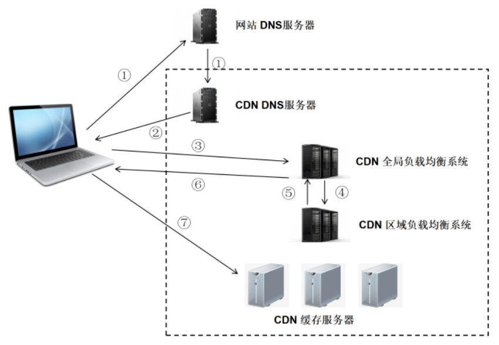
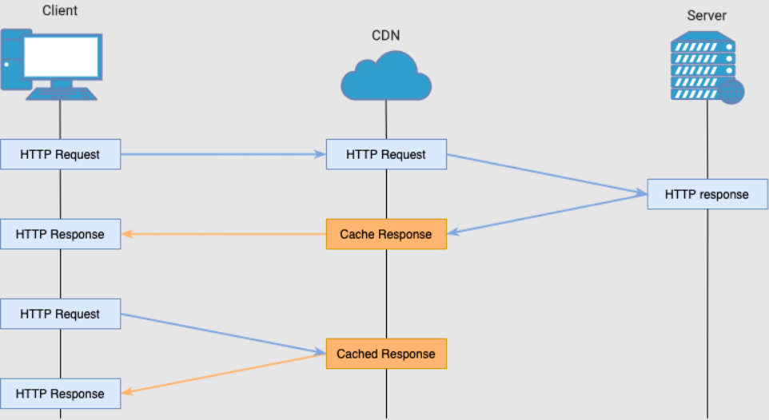
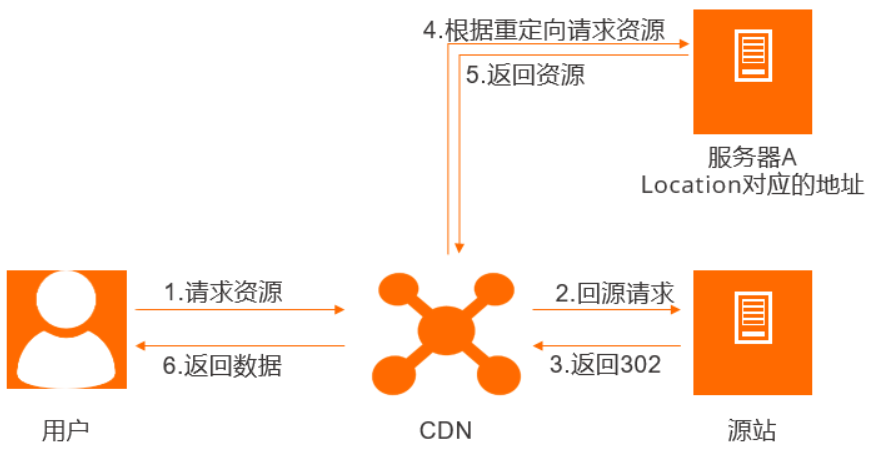

# CDN

CDN（Content Delivery Network，内容分发网络），将应用的资源缓存到离用户更近的服务器上，从而加快资源的传输速度。

CDN 有以下几个主要的好处：

-   提高网站的加载速度 - 将内容分发到靠近用户的 CDN 服务器（以及其他优化），进入缩短页面的加载时间。
-   降低带宽成本 - 网站托管的带宽消耗成本是网站的主要支出之一。通过缓存和其他优化，CDN 能够减少源服务器必须提供的数据量，从而降低网站所有者的托管成本。
-   增加内容的可用性和冗余性 - 大量的流量或硬件故障可能会中断正常的网站功能。由于其分布式的特性，CDN 可以比许多源服务器更好地处理流量和抵抗硬件故障。
-   提高网站的安全性 - CDN 可以通过提供 DDoS 攻击防御、安全证书改进和其他优化来提高安全性。

 

## 数据分发

**对于静态资源**

源服务器会把静态内容提前分发给 CDN，用户在需要使用时，CDN 即可把静态内容发送给用户，不用每次都劳烦源服务器。

如果 CDN 中没有备份，则需要向源服务器请求，然后再进行备份。之后的用户再获取该静态资源，即可直接在 CDN 获取。

 

**对于动态资源**

有些 CDN 会提供可以运行在 CDN 上的接口，让源服务器使用 CDN 的接口，而不是服务器自己的代码。

这样，用户即可直接在 CDN 上获取动态数据。

 

## 安全性 & 可靠性

如果有服务器超载了，就会把请求分发到没有超载的服务器上，即 "负载均衡" 。

这里是采用 "任播" 技术，采用任播后，服务器对外拥有一样的 IP 地址。如果这个 IP 地址收到了用户的请求，请求就会由最靠近用户的服务器来响应。

除此之外，CDN 还会采用 TLS / SSL 证书来保护网站

  

# CDN 的原理

CDN 和 DNS 有着密不可分的联系，在没有使用 CDN 时，使用域名访问站点的解析过程为：

1.  浏览器通过 DNS 对域名进行解析，得到此域名对应的 IP 地址

2.  根据 IP 地址，向域名的服务主机发送数据请求

3.  服务器得到请求数据并回复

使用 CDN 后，DNS 返回的不再是 IP 地址，而是一个 CNAME (Canonical Name，别名) 记录，指向 CDN 的全局负载均衡，这是 CDN 实现的关键。

 

## 负载均衡

由于没有返回 IP 地址，于是本地 DNS 会向负载均衡系统再发送请求，进入到 CDN 的全局负载均衡系统进行智能调度：

1.  CDN 的全局负载均衡设备根据用户的 IP 地址，选择一台离用户最近的区域负载均衡设备

2.  区域负载均衡设备根据负载情况、服务能力等因素，选择一台合适的缓存服务器来提供服务，将该缓存服务器的 IP 地址返回给全局负载均衡设备

3.  全局负载均衡设备将服务器的 IP 地址返回给用户

4.  用户向服务器发送请求，服务器响应用户请求，将用户所需的内容传送到用户终端

整体流程如下图：

 

## 缓存系统

缓存系统是 CDN 的另一个关键组成部分，缓存系统负责直接响应最终用户的访问请求，把缓存在本地的内容快速地提供给用户。同时还负责与源站点进行内容同步，把更新的内容以及本地没有的内容从源站点获取并保存在本地。

缓存和回源是 CDN 的两个核心功能。所谓 "缓存" 就是将资源备份到 CDN 服务器上的过程；而 "回源" 则是 CDN 发现自己不存在该资源或者资源过期了，需要向上级服务器获取资源的过程。

  

# CDN 的应用场景

CDN 往往被用来加速静态资源。静态资源本身具有访问频率高、承接流量大的特点，因此静态资源加载速度始终是前端性能的一个非常关键的指标。

大部分 JS、CSS、图片等资源，都可以使用 CDN 的方式。除此之外，CDN 还可应用于大文件下载和音视频点播等业务的加速。

 

# CDN 刷新

CDN 刷新是一种清除 CDN 节点上缓存内容的功能，它可以让用户访问到源站上最新的资源。CDN 刷新有两种方式：URL 刷新和目录刷新。

-   URL 刷新是指提交单个或多个 URL，让 CDN 节点删除对应资源的缓存，当用户再次请求这些 URL 时，CDN 节点会回源站获取最新的资源，并重新缓存。
-   目录刷新是指提交一个或多个目录，让 CDN 节点删除该目录下所有资源的缓存，当用户再次请求这些目录下的资源时，CDN 节点会回源站获取最新的资源，并重新缓存。

CDN 刷新的好处是可以保证用户访问到最新的内容，避免因为缓存过期时间设置不合理而导致的内容不一致问题。CDN 刷新的缺点是会降低缓存命中率，增加回源请求，给源站带来更大的压力。

如果你想使用 CDN 刷新功能，你可以登录 CDN 控制台，在左侧导航栏单击刷新预热，在刷新缓存/预热缓存页签，提交刷新任务。你也可以通过 API 接口或 SDK 来调用 CDN 刷新功能。

  

# CDN 预热

CDN 预热是一种将源站的内容主动推送到 CDN 节点的功能，目的是在用户访问之前就将资源缓存到离用户最近的节点，从而提高资源的访问速度和效率。CDN 预热有以下几个特点：

-   CDN 预热只支持 URL 预热，不支持目录预热，也就是说，只能指定具体的文件地址进行预热，不能指定一个文件夹下的所有文件进行预热。
-   CDN 预热只能将资源推送到 CDN 的二级节点，也就是 L2 节点，而不是一级节点，也就是 L1 节点。L2 节点是位于 L1 节点和源站之间的缓存层，可以缓解源站的压力。L1 节点是位于用户和 L2 节点之间的缓存层，可以提供最快的响应时间。
-   CDN 预热需要通过 CDN 服务提供商提供的 API 接口或控制台来进行操作，不能直接通过浏览器或其他工具来进行。不同的 CDN 服务提供商可能有不同的预热接口和限制条件，例如每天最多可提交的 URL 数量、每次请求最多可提交的 URL 数量、每秒最多可提交的请求次数等。

 
