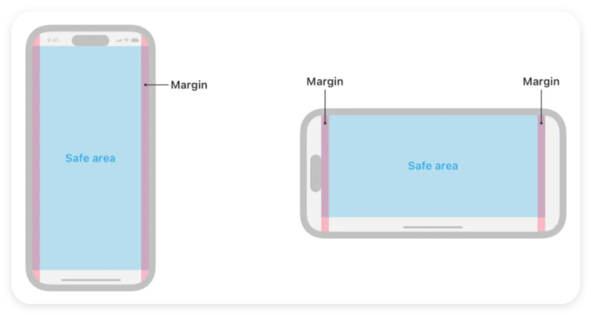

# HTML 简介

HTML 是 Hyper Text Markup Language (超文本标记语言) 的缩写.

使用 VSCode 快捷键生成 HTML 文件的基础模版: ① `!` + tab / 回车、 ② `html:5` + tab / 回车.

```html
<!DOCTYPE html>
<html lang="en">
    <head>
        <meta charset="UTF-8" />
        <meta name="viewport" content="width=device-width, initial-scale=1.0" />
        <title>Document</title>
    </head>
    <body></body>
</html>
```

`<!DOCTYPE html>` 是 HTML5 的文档类型声明, 它告诉浏览器当前文档遵循 HTML5 规范.
文档类型声明通常位于 HTML 文档的顶部, 作为文档的第一行.

<br><br>

# html 标签

```html
<html lang="en"></html>
```

-   html 标签为根标签, 它有 2 个子标签: `head`、`body`.
-   `lang` 属性用于指定当前 HTML 文档的语言. `en` 表示英文、`zh` 表示中文.

<br><br>

# head 标签

head 标签用于定义文档的元数据和其他描述性信息.

<br>

在 `<head>` 标签中, 可以包含以下常见元素:

1.  `title`: 定义文档的标题；能提高搜索权重；是 head 标签中**唯一必需**的元素.
2.  `meta`: 用于设置文档的元数据, 如字符编码、关键词、描述等.
3.  `link`: 用于引入外部资源, 如 CSS 样式表和图标.
4.  `style`: 用于在文档中定义内部 CSS 样式.
5.  `script`: 用于引入外部 JS 文件或在文档中定义内部 JS.

<br><br>

# meta 标签

1.  `charset`: 指定文档的字符编码, 如 `UTF-8`

```html
<meta charset="UTF-8" />
```

<br>

2.  `name` & `content`: 定义元数据

```html
<!-- 指定文档的关键词 -->
<meta name="keywords" content="HTML, CSS, JavaScript" />
```

```html
<!-- 指定文档的简介 -->
<meta name="description" content="不超过 150 个字符" />
```

```html
<!-- 指定文档的视口, 用于响应式布局和移动设备适配 -->
<meta
    name="viewport"
    content="width=device-width, initial-scale=1.0, maximum-scale=1.0, minimum=1.0, user-scalable=no"
/>
```

`<meta name="viewport">` 标签的 `content` 属性可以包含多个设置, 常用的有以下几种:

-   `width`: 设置视口的宽度, 可以是具体的像素值（如 `width=600`）, 也可以是特殊值 `device-width`, 表示设备的宽度
-   `height`: 设置视口的高度, 类似于 `width` 属性
-   `initial-scale`: 设置页面初始加载时的缩放比例. 例如, `initial-scale=1` 表示页面按原始大小显示
-   `minimum-scale`: 允许用户缩放到的最小比例. 例如, `minimum-scale=1` 禁止用户缩小页面
-   `maximum-scale`: 允许用户缩放到的最大比例. 例如, `maximum-scale=1` 禁止用户放大页面
-   `user-scalable`: 控制用户是否可以手动缩放页面. 值可以是 `yes` 或 `no`
-   `viewport-fit`: 控制网页内容如何适应设备的**安全区域**. 值可以是 `contain` 或 `cover`

**安全区域**定义为视图中未被导航栏、选项卡栏、工具栏或视图控制器可能提供的其他视图覆盖的区域.



如上图所示, 安全区域为中间蓝色部分, 也就是说我们在页面布局时应该保证页面内容在蓝色安全区域内.

假设你在开发一个全屏的移动网页应用, 并希望内容能够覆盖整个屏幕, 包括刘海和圆角区域. 你可以这样设置:

```html
<meta name="viewport" content="width=device-width, initial-scale=1, viewport-fit=cover" />
```

然后在 CSS 中, 你可能需要使用一些安全区域相关的环境变量来确保内容不会被遮挡:

```css
body {
    /* env() 是 CSS 中的一个函数, 用于获取环境变量的值 */
    /* 环境变量 safe-area-inset-top... 的值会根据设备的物理特性自动调整, 以确保内容不会被遮挡 */
    padding: env(safe-area-inset-top) env(safe-area-inset-right) env(safe-area-inset-bottom) env(safe-area-inset-left);
}
```

<br>

3.  `http-equiv` & `content`: 指定一些与 HTTP 协议相关的元信息, 影响浏览器对页面的处理.

```html
<!-- 在 Chrome 和 IE 浏览器中始终使用最新的渲染模式 -->
<meta http-equiv="X-UA-Compatible" content="IE=edge, chrome=1" />
```

```html
<!-- 在 5 秒后自动重定向到 `http://example.com/` -->
<meta http-equiv="refresh" content="5; url=http://example.com" />
```

```html
<!-- 使用 UTF-8 编码 -->
<meta http-equiv="content-type" content="text/html; charset=UTF-8" />
```

```html
<!-- 禁止浏览器缓存页面 -->
<meta http-equiv="cache-control" content="no-cache" />
```

<br>
