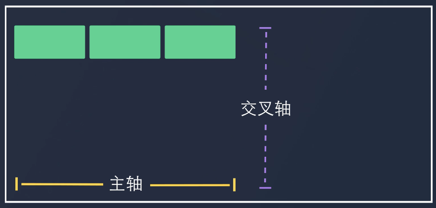
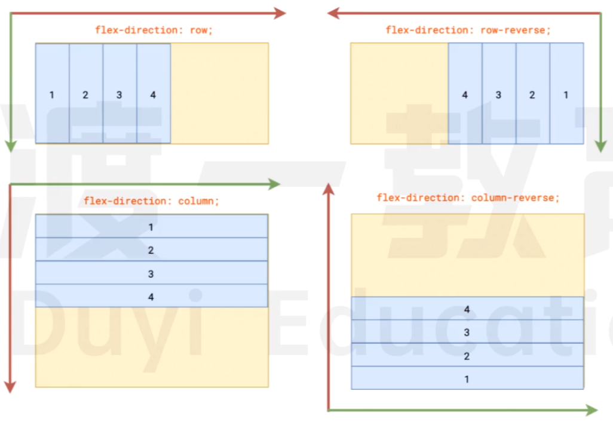
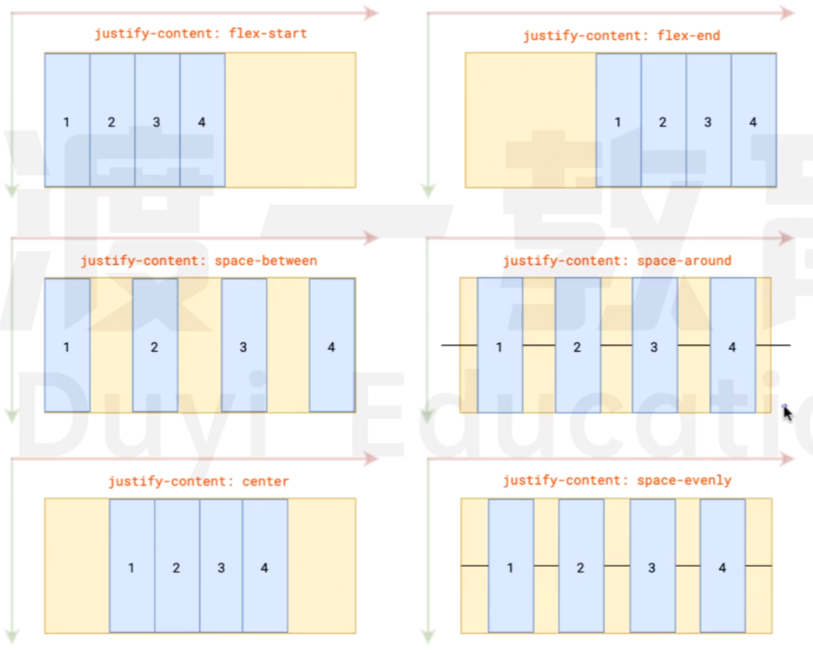
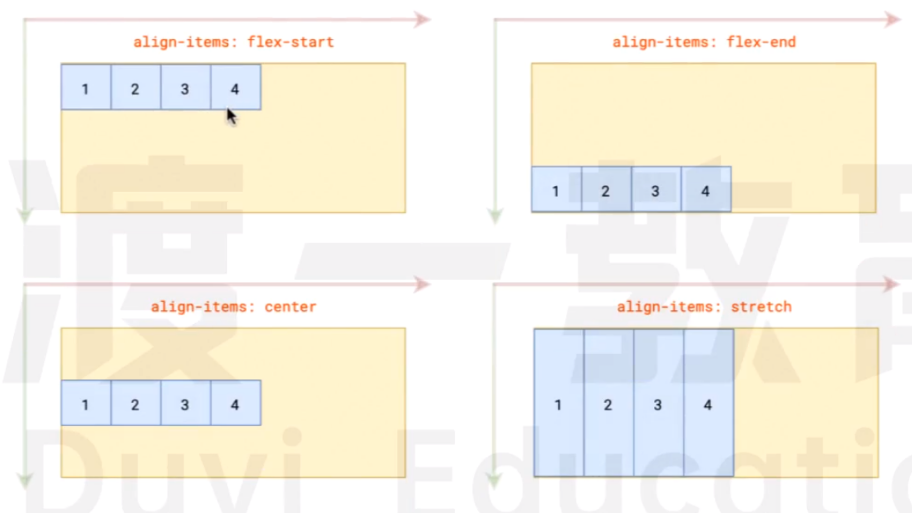

# 弹性盒布局

-   开启弹性盒布局: 给容器元素设置 `display: flex`.
-   开启弹性盒布局后, 容器元素的 display 为 block.
-   我们将设置了 `display: flex` 的元素称为容器 (flex container); 容器的子元素称为项目 (flex item).
-   默认情况下:
    -   有一条 👉 方向的**主轴**, 和 👇 方向的**交叉轴**
    -   所有项目会沿着主轴排列
    -   项目的 `height` 为容器的高度
    -   项目的 `width` 由项目的内容撑开
-   项目不能使用绝对定位, 因为绝对定位会脱离文档流. 脱离文档流后, 项目就不受 flex 布局控制了.

  

# 容器属性

## flex-direction

用于设置主轴的方向: `flex-direction: row`

1. `row` (默认值): 👉
2. `row-reverse`: 👈
3. `column`: 👇
4. `column-reverse`: 👆

改变主轴的方向后, 交叉轴的方向也会变.

 

## flex-wrap

用于设置排列的方式: `flex-wrap: nowrap`

1. `nowrap` (默认): 不换行排列;
   当项目的总 `width` / `height` > 容器的 `width` / `height` 时, 会压缩项目的 `width` / `height`.
2. `wrap`: 沿着交叉轴换行排列
3. `wrap-reverse`: 逆着交叉轴换行排列

 

## flex-flow (复合)

复合写法: 主轴的方向 & 排列的方式: `flex-wrap: row nowrap`

 

## justify-content

用于设置项目沿着主轴的排列方式: `justify-content: flex-start`

1. `flex-start` (默认): 沿着主轴排列
2. `flex-end`: 逆着主轴排列
3. `center`: 居中
4. `space-between`: 两端对齐, 子元素之间自动留有空隙
5. `space-around`: 父子元素之间也有空隙, 为子元素之间的空隙的一半
6. `space-evenly`: 父子元素之间的空隙 = 子元素之间的空隙

 

## align-items

用于设置项目沿着侧轴的排列方式 (单行 item 时使用): `align-items: stretch`

1. `flex-start`: 沿着侧轴排列
2. `flex-end`: 逆着侧轴排列
3. `center`: 居中
4. `stretch` (默认): 拉伸, 占满父级侧轴上的空间;
   如果项目设置了 `height` 则不会拉伸, 此时 item 会排在上方（与 `flex-start` 等效）.

 

## align-content

用于设置项目沿着侧轴的排列方式 (多行 item 时使用): `align-content: stretch`

设置了 `flex-wrap` 后（换行后）, 需要使用 `align-content` 设置项目在侧轴上的排列

1. `flex-start`: 沿着侧轴排列
2. `flex-end`: 逆着侧轴排列
3. `center`: 居中
4. `space-between`: 两端对齐, 子元素之间自动留有空隙
5. `space-around`: 父子元素之间也有空隙, 为子元素之间的空隙的一半
6. `space-evenly`: 父子元素之间的空隙 = 子元素之间的空隙
7. `stretch`: 拉伸, 占满父级侧轴上的空间;
   如果项目设置了 `height` 则不会拉伸, item 会排在每行的上方.

  

# 项目属性

## flex-grow

用于分配容器剩余的空间: `flex-grow: 0`

-   条件: 项目的总 `width` / `height` < 父级 `width` / `height`, 即有剩余空间的情况下使用
-   属性值 n 的取值范围为 `[0, +∞)`, 表示当前项目瓜分的空间为其他项目瓜分的空间的 n 倍
-   默认为 `0` - 不瓜分

 

## flex-shrink

用于压缩项目空间, 以适应容器空间: `flex-shrink: 1`

-   条件: 项目的总 `width` / `height` > 父级 `width` / `height`, 即不够空间的情况下使用
-   属性值 n 的取值范围为 `[0, +∞)`, 表示当前项目的压缩空间为其他项目的压缩空间的 n 倍
-   默认为 `1` - 所有项目等比压缩、 `0` - 不压缩

一行元素中, 如果某项目设置了 `flex-shrink > 1`, 会缩小该项目的空间, 其他项目会平分其缩小的空间

 

## flex-basis

用于设置项目在主轴方向上的尺寸: `flex-basis: 100px`

-   默认为 `auto`, 即为 `width` / `height` 属性值（具体看主轴方向）
-   设置了 `flex-basis` 属性后, 会覆盖 `width` / `height` 属性

 

## flex (复合)

复合写法: 分配剩余空间 & 压缩项目空间 & 项目在主轴方向上的尺寸: `flex: 0 1 auto`

1. `auto` - - - `1 1 auto` - - - 等比放大缩小
2. `none` - - - `0 0 auto` - - - 宽高定死

 

## align-self

用于控制<u>当前行中的</u>单个项目在交叉轴上的排列方式:

1. `flex-start`: 沿着侧轴排列
2. `flex-end`: 逆着侧轴排列
3. `center`: 居中
4. `stretch`: 元素被拉伸以适应容器; 设置了 `height` 的项目不会被拉伸.

 

## order

用于控制项目的排列顺序: `order: 0`

-   属性值可正可负, 默认为 `0`
-   越小越前, 越大越后

 
