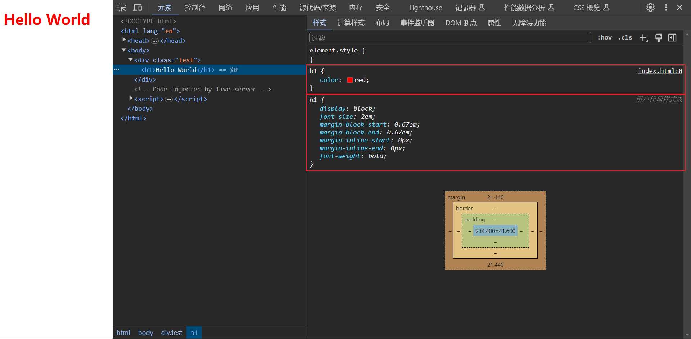

# 标签的 CSS 样式

我们先来了解一下浏览器处理文件的标准流程. 需要知道的是, 下面的步骤是浏览器加载网页的简化版本:

1.  浏览器载入 HTML 文件 (比如从网络上获取).

2.  解析 HTML 文件, 拉取该 HTML 相关的资源, 比如 CSS 样式.

3.  根据 HTML 文件, 构建 DOM 树; 根据 CSS 文件, 构建 CSSOM 树.

4.  合并 DOM 树和 CSSOM 树, 构建 Render 树.

5.  根据 Render 树, 计算每个节点的几何信息 (位置, 大小等), 并将节点绘制到屏幕上.


<br>

经过上述步骤, **我们编写的任何一个 HTML 元素, 都应用了一整套所有的 CSS 样式**.

编写如下 HTML 代码, 并在浏览器中打开:

```html
<div class="test">
    <h1>Hello World</h1>
</div>
```

我们可以打开浏览器的开发者面板, 选择 [元素] - [计算样式] - 勾选 [全部显示], 就能看到浏览器为 h1 设置的所有 CSS 属性. 这里展示的属性值都是计算后的具体值, 颜色值都是 rgb 的格式,长度值都以 px 为单位.


那么, 上例所展示的 CSS 属性值是如何被一步步计算出来的呢？

<br><br>

# 样式的计算过程

总的来讲, CSS 属性值的计算有如下 4 个步骤:

1.  确定声明值

2.  解决层叠冲突

3.  继承属性值

4.  使用默认值

<br>

## 确定声明值

浏览器会从各种来源的样式表中找到所有的 CSS 声明, 并确定声明值. 有 2 种源:

1.  用户代理样式表: 浏览器内置的样式表.
2.  作者样式表: 开发者编写的样式表.

> 网上有种说法: 有 "用户代理样式表","用户样式表","作者样式表" 共 3 种源.
>
> 用户自定义主题时会使用到用户样式表, 一般可以通过插件 (比如 Stylus) 实现.
>
> 这里我个人认为 "用户样式表" 其实就是 "作者样式表" 的一种实现, 所以不单独讨论.

"用户代理" 指的是浏览器. "用户" 指的是网站访问者. "作者" 指的是开发者.

<br>

编写如下 CSS 代码, 并在浏览器中打开:

```css
h1 {
    color: red;
}
```

现在浏览器即可从 "作者样式表" 确定 color 属性, 从 "用户代理样式表" 确定 display, font-size 等属性.



<br>

## 解决层叠冲突

在确定声明值时, 可能出现 "声明的样式发生冲突" 的情况, 此时就会进入解决层叠冲突的流程.

解决层叠冲突有如下 3 个步骤:

1.  比较源的重要性

2.  比较样式的权重

3.  比较编写的位置

<br>

第一步: 比较**源的重要性**.

"作者样式表" > "用户代理样式表".

> 根据网上的说法, "作者样式表" > "用户样式表" > "用户代理样式表". 但是经过尝试, 也会有 "用户样式表" > "作者样式表" 的情况.
>
> 如果硬要给 3 个源排个序, 应该是 "作者样式表","用户样式表" > "用户代理样式表". "作者样式表" 和 "用户样式表" 无法直接比较, 具体看插件的实现方式以及浏览器的拦截方式.

```css
h1 {
    font-weight: 400;
}
```

使用上述样式, 可以看到页面上的 h1 最终应用了 `font-weight: 400` 这个属性值.


<br>

第二步: 比较**样式的权重**.

```css
.test h1 {
    color: blue;
}

h1 {
    color: red;
}
```

上面的样式同属于 "作者样式表", 即源的重要性相同, 此时就会比较样式的权重.

样式的权重有 4 个等级, 由 4 个位的数值 (千位,百位,十位,个位) 来表示:

1.  行内样式: 对应的权重位是千位 `(1, 0, 0, 0)`
2.  ID 选择器: 对应的权重位是百位 `(0, 1, 0, 0)`
3.  类选择器,属性选择器,伪类选择器: 对应的权重位是十位 `(0, 0, 1, 0)`
4.  元素选择器,伪元素选择器: 对应的权重位是个位 `(0, 0, 0, 1)`

> 使用 `!important` 修饰的样式的权重值为 `infinity`, 即无穷大.

上例 `.test h1 { ... }` 的权重为 `(0, 0, 1, 1)`, 而 `h1 { ... }` 的权重为 `(0, 0, 0, 1)`, 因此最终会应用 `color: blue` 这个属性值.


这里需要注意: **权值不能跃迁**. 就是说, 无论有多少个元素选择器指定的样式, 都不能覆盖一个的类选择器指定的样式.

> 也有说法是: 最开始权重的计算是 256 进制的 (`(0, 0, 0, 255)  +  (0, 0, 0, 1)  =  (0, 0, 1, 0)`) . 后随着计算机的发展 这个进制在不断增大.
>
> 不管怎样, 我们就当作权值不能跃迁就好了. 毕竟再怎么样写代码也不可能写出几百上千个选择器吧.

<br>

第三步: 比较**编写的位置**.

位置靠后的样式 > 位置靠前的样式.

```css
h1 {
    color: red;
}

h1 {
    color: blue;
}
```

以上样式具有相同的源重要性和样式权重, 此时位于下面的样式会覆盖掉上面的样式, 最终会应用 `color: blue` 这个属性值.


<br>

## 继承属性值

对于可继承属性, 如果经过 "确定声明值","解决层叠冲突" 后, 属性仍没有值, 则会尝试继承最近的父元素身上的属性值.

```css
div {
    color: red;
}
```

上例给 div 设置了 color 属性, 由于 color 是可以继承的, 因此 h1 从最近的父元素 div 身上继承了 color 属性.


<br>

大致上, 与文本相关的属性都是可继承的, 而与布局相关的属性都是不可继承的.

以下是一些常用的可继承 CSS 属性:

-   字体系列属性: font,font-family,font-weight,font-size,font-style 等.

-   文本系列属性: color,line-height,word-spacing,letter-spacing,text-transform,text-indent,text-align 等.

-   列表系列属性: list-style,list-style-type,list-style-position 等.

-   表格系列属性: border-collapse,border-spacing 等.

-   其他属性: visibility,cursor,direction 等.

以下是一些常用的不可继承的 CSS 属性:

-   盒模型系列属性: margin,padding,border,width,height 等.

-   定位系列属性: position,top,right,bottom,left 等.

-   背景系列属性: background,background-color,background-image 等.

-   显示系列属性: display,overflow 等.

-   其他属性: vertical-align,z-index 等.

<br>

## 使用默认值

经过 "确定声明值","解决层叠冲突","继承属性值" 后, 如果属性仍没有值, 才会使用默认值.

浏览器中没有高亮显示的属性, 就是使用了默认值.


<br><br>

# DEMO

```html
<div>
    <a href="#">Hello World</a>
    <h1>Hello World</h1>
</div>
```

```css
div {
    color: red;
}
```

问: a 元素是什么颜色？ h1 元素又是什么颜色？

答: a 元素为蓝色, h1 元素为红色.


<br>

解析: 因为 a 元素的 "用户代理样式表" 设置了 color 属性, 因此会应用此声明值. 而在 h1 元素中, 无论是 "作者样式表" 还是 "用户代理样式表", 都没有对此属性进行声明, color 又是可继承属性, 因此 h1 元素会继承父元素 div 的 color 属性.


> 如果希望 a 元素可以继承 div 的 color, 可以显式地设置 `color: inherit`.
>
> 除了 inherit 这个特殊值, 还有 initial, 可以通过 `color: initial` 显式地设置 color 属性值为默认值.

<br>

这里可以留意到, 用户作者样式表里面没有直接给 `a` 标签设置样式, 而是给 `a:-webkit-any-link` 设置了样式. 就是说, 只有满足 `:-webkit-any-link` 这个伪类的 `a` 标签才能使用. `:-webkit-any-link` 对应着 `a` 标签的 `href` 属性.

```html
<div>
    <a>Hello World</a>
    <h1>Hello World</h1>
</div>
```


<br>
