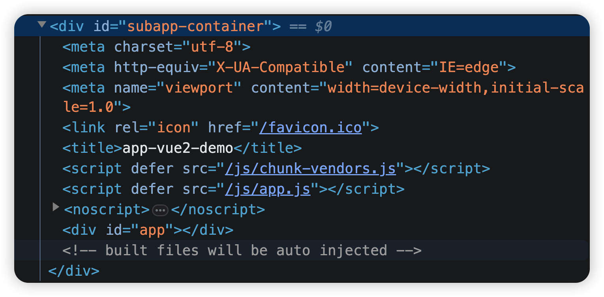
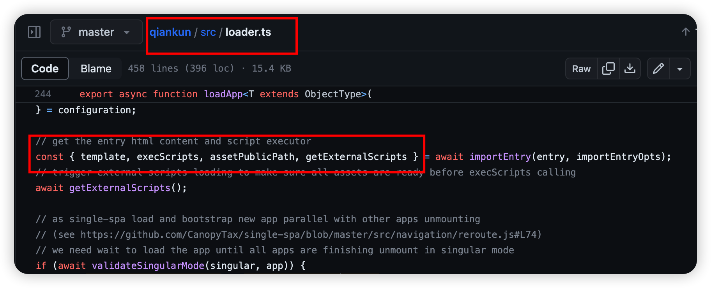
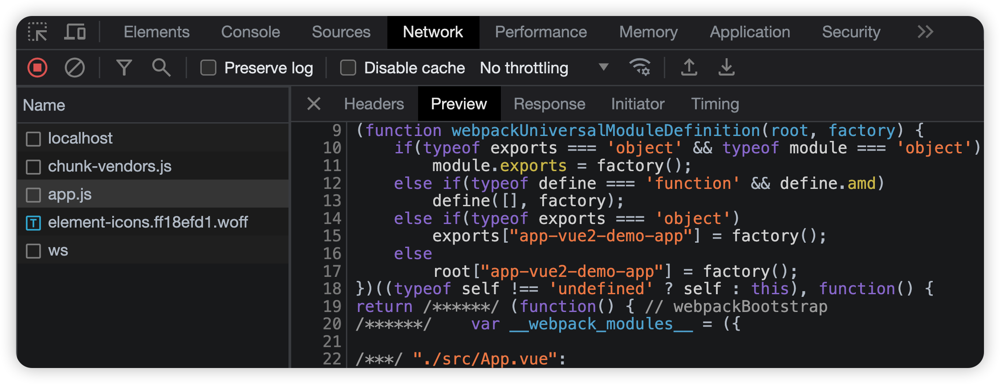

# registerMicroApps & start

根据我们前面总结的 qiankun 启动的步骤, 无非也就两步:

1. registerMicroApps 注册子应用

2. start 读取配置, 拉取子应用并完成渲染

<br>

创建 src/micro/index.js 并配置:

```js
let _apps = [];

// 设置一个工厂函数, 用于获取子应用数组
export const getApps = () => _apps;

// apps 为传递过来的子应用数组
export const registerMicroApps = (apps) => {
    _apps = apps;
};

export const start = () => {};
```

<br><br>

# 完成渲染

## 监听路由变化

创建 src/micro/rewrite-history.js 并配置:

```js
export const rewriteHistory = () => {
    window.addEventListener("popstate", () => {
        console.log("[popstate]:", window.location.pathname);
    });

    // 重写 pushState 方法
    const rawPushState = window.history.pushState;
    window.history.pushState = function pushState(...args) {
        rawPushState.apply(window.history, args);
        console.log("[pushState]:", window.location.pathname);
    };

    // 重写 replaceState 方法
    const rawReplaceState = window.history.replaceState;
    window.history.replaceState = function replaceState(...args) {
        rawReplaceState.apply(window.history, args);
        console.log("[replaceState]:", window.location.pathname);
    };
};
```

配置 src/micro/index.js:

```js
import { rewriteHistory } from "./rewrite-history";

let _apps = [];

export const getApps = () => _apps;

export const registerMicroApps = (apps) => {
    _apps = apps;
};

export const start = () => {
    rewriteHistory(); // 监听路由变化
};
```

<br>

## 获取子应用资源 index.html

创建 src/micro/handle-router.js 并配置:

```js
// 远程获取静态资源
export function fetchSource(url) {
    return fetch(url).then((res) => res.text());
}
```

创建 src/micro/handle-router.js 并配置:

```js
import { getApps } from "./index";
import { fetchSource } from "./utils";

export const handleRouter = async () => {
    const apps = getApps();

    // 找到需要激活的子应用配置
    const app = apps.find((item) => window.location.pathname.startsWith(item.activeRule));
    if (!app) return;

    try {
        // 加载子应用资源 index.html
        const html = await fetchSource(app.entry);
        const container = document.querySelector(app.container);
        container.innerHTML = html;
    } catch (err) {
        console.error("handle-router err", err);
    }
};
```

配置 src/micro/rewrite-history.js:

```js
import { handleRouter } from "./handle-router";

export const rewriteHistory = () => {
    window.addEventListener("popstate", () => {
        console.log("[popstate]:", window.location.pathname);
        handleRouter(); // 激活对应的子应用
    });

    const rawPushState = window.history.pushState;
    window.history.pushState = function pushState(...args) {
        rawPushState.apply(window.history, args);
        console.log("[pushState]:", window.location.pathname);
        handleRouter(); // 激活对应的子应用
    };

    const rawReplaceState = window.history.replaceState;
    window.history.replaceState = function replaceState(...args) {
        rawReplaceState.apply(window.history, args);
        console.log("[replaceState]:", window.location.pathname);
        handleRouter(); // 激活对应的子应用
    };
};
```

配置 src/micro/index.js:

```js
import { rewriteHistory } from "./rewrite-history";
import { handleRouter } from "./handle-router";

let _apps = [];

export const getApps = () => _apps;

export const registerMicroApps = (apps) => {
    _apps = apps;
};

export const start = () => {
    console.log(getApps());

    rewriteHistory();

    handleRouter(); // 激活对应的子应用
};
```

现在, 只要路由匹配, 内容就会被加载到主应用的容器中了.



<br>

## 解析 script 标签

qiankun 使用了 import-html-entry 库去解析 html 资源, 并且导出了几个函数.



-   `template` - 将脚本文件内容注释后的 html 模板文件

-   `assetPublicPath` - 资源地址根路径, 可用于加载子应用资源

-   `getExternalScripts` 方法 - 用于获取外部引入的脚本文件

-   `getExternalStyleSheets` 方法 - 用于获取外部引入的样式表文件

-   `execScripts` 方法 - 用于执行该模板文件中所有的 JS 脚本文件, 并且可以指定脚本的作用域

<br>

下面我们手撸一下~ 实现 template,getExternalScripts,execScripts:

创建 import-entry.js 并配置:

```js
import { fetchSource } from "./utils";

const getTemplate = (name) => {
    let template = document.querySelector(`div[data-name=${name}]`);
    // 如果没有 template, 则创建一个
    if (!template) {
        template = document.createElement("div");
        template.dataset.name = name;
    }
    return template;
};

const getSource = (template) => {
    // 初始化缓存
    const source = { scripts: new Map() };
    // 获取所有的 script 标签
    const scripts = Array.from(template.children).filter((item) => item.tagName === "SCRIPT");
    // 遍历 script 标签
    scripts.forEach((dom) => {
        const src = dom.getAttribute("src");
        if (src) {
            // 外链 js 的映射: src => { code, isExternal }
            source.scripts.set(src, {
                code: "", // 外链 js, 需要远程获取 js 代码
                isExternal: true, // 是否为外链 js
            });
        } else {
            // 内链 js, 随机生成一个键名
            const randomName = Math.random().toString(36).substring(2, 15);
            // 内链 js 的映射: randomName => { code, isExternal }
            source.scripts.set(randomName, {
                code: dom.textContent,
                isExternal: false,
            });
        }
    });
    return source;
};

export const importEntry = async (entry, options) => {
    if (entry.endsWith("/")) {
        entry = entry.substring(0, entry.length - 1);
    }

    // 远程获取模板的 html 资源
    const html = await fetchSource(entry);
    // 获取模板
    const template = getTemplate(options.name);
    // 将 html 资源放入模板中
    template.innerHTML = html;

    // 获取缓存
    const source = getSource(template);

    // 获取缓存中存放的脚本
    const getExternalScripts = () => {
        const scriptEntries = Array.from(source.scripts.entries());
        const fetchScriptPromise = [];
        for (let [url, info] of scriptEntries) {
            // 这里的 url 可能是以 `/` 开头的本地的绝对地址, 也可能是以 http 开头的远程的地址
            // 如果是本地的绝对地址, 则需要拼接上子应用的地址; 因为 `/` 开头的话, 在基座应用中, 默认加上的是基座应用的地址
            if (!url.includes("http") && info.isExternal) {
                url = `${entry}${url}`;
            }
            // 如果 info.code 有内容, 说明是内链 js
            fetchScriptPromise.push(info.code ? Promise.resolve(info.code) : fetchSource(url));
        }
        return Promise.all(fetchScriptPromise);
    };

    // 执行缓存中存放的脚本
    const execScripts = async () => {
        const scripts = await getExternalScripts();
        scripts.forEach((code) => {
            eval(code);
        });
    };

    return {
        template,
        getExternalScripts,
        execScripts,
    };
};
```

配置 handle-router.js:

```js
import { getApps } from "./index";
import { importEntry } from "./import-entry";

export const handleRouter = async () => {
    const apps = getApps();
    const app = apps.find((item) => window.location.pathname.startsWith(item.activeRule));

    if (!app) return;

    try {
        let { template, execScripts } = await importEntry(app.entry, app);
        const container = document.querySelector(app.container);
        container.appendChild(template); // 将 template 插入到容器中

        // 在 window 上挂载全局变量 __POWERED_BY_QIANKUN__ 和 __INJECTED_PUBLIC_PATH_BY_QIANKUN__
        window.__POWERED_BY_QIANKUN__ = true;
        window.__INJECTED_PUBLIC_PATH_BY_QIANKUN__ = `${app.entry}/`;

        execScripts(); // 执行脚本
    } catch (e) {
        console.log(e);
    }
};
```

<br>

获取子应用导出的模块:

因为 qiankun 会通过以下逻辑导出子应用模块, 所以我们可以手动定义 exports 和 module 对象, 以获取子应用模块.



配置 import-entry.js:

```js
// ...

const execScripts = async () => {
    const scripts = await getExternalScripts();

    // 手动定义 module 和 exports 对象
    const module = { exports: {} };
    const exports = module.exports;

    scripts.forEach((code) => {
        eval(code);
    });

    return exports; // eval 执行完后, module.exports 就是子应用暴露出来的模块
};

// ...
```

<br>

完成子应用的 bootstrap & mount:

配置 handle-router.js:

```js
import { getApps } from "./index";
import { importEntry } from "./import-entry";

export const handleRouter = async () => {
    const apps = getApps();
    const app = apps.find((item) => window.location.pathname.startsWith(item.activeRule));

    if (!app) return;

    try {
        let { template, execScripts } = await importEntry(app.entry, app);
        const container = document.querySelector(app.container);
        container.appendChild(template);

        window.__POWERED_BY_QIANKUN__ = true;
        window.__INJECTED_PUBLIC_PATH_BY_QIANKUN__ = `${app.entry}/`;

        const appExports = execScripts(); // 执行脚本, 获取子应用模块

        // 将子应用模块导出的生命周期函数挂载到 app 上
        app.bootstrap = appExports.bootstrap;
        app.mount = appExports.mount;
        app.unmount = appExports.unmount;

        // 执行主应用的生命周期函数
        await bootstrap(app);
        await mount(app);
    } catch (e) {
        console.log(e);
    }
};

// 以下是主应用的生命周期函数
async function bootstrap(app) {
    app.bootstrap && (await app.bootstrap());
}
async function mount(app) {
    app.mount &&
        (await app.mount({
            container: document.querySelector(app.container),
            ...app.props,
        }));
}
async function unmount(app) {
    app.unmount &&
        (await app.unmount({
            container: document.querySelector(app.container),
            ...app.props,
        }));
}
```

<br>

完成子应用的 unmount:

配置 rewrite-history.js:

```js
import { handleRouter } from "./handle-router";

let prevRouter = "";
let nextRouter = window.location.pathname;

export const getPrevRouter = () => prevRouter;
export const getNextRouter = () => nextRouter;

export const rewriteHistory = () => {
    window.addEventListener("popstate", () => {
        prevRouter = nextRouter; // 保存上一个路径
        nextRouter = window.location.pathname; // 保存当前路径
        handleRouter();
    });

    const rawPushState = window.history.pushState;
    window.history.pushState = function pushState(...args) {
        prevRouter = window.location.pathname; // 保存上一个路径
        rawPushState.apply(window.history, args);
        nextRouter = window.location.pathname; // 保存当前路径
        handleRouter();
    };

    const rawReplaceState = window.history.replaceState;
    window.history.replaceState = function replaceState(...args) {
        prevRouter = window.location.pathname; // 保存上一个路径
        rawReplaceState.apply(window.history, args);
        nextRouter = window.location.pathname; // 保存当前路径
        handleRouter();
    };
};
```

配置 handle-router.js:

```js
// ...

import { getPrevRouter, getNextRouter } from "./rewrite-history";

export const handleRouter = async () => {
    const apps = getApps();
    const app = apps.find((item) => getNextRouter().startsWith(item.activeRule));

    // 获取上一个 active-sub-app
    const prevApp = apps.find((item) => getPrevRouter().startsWith(item.activeRule));
    // 如果上一个 active-sub-app 存在 且和当前 active-sub-app 不相同, 则卸载上一个 active-sub-app
    if (prevApp && prevApp !== app) {
        await unmount(prevApp);
        // 删除上一个 active-sub-app 的 DOM
        document.querySelector(prevApp.container).innerHTML = "";
    }

    // ...
};

// ...
```

<br>

这里有个问题, react 应用在配置路由前缀时, 会使用 replaceState 方法. 而我们封装了 replaceState 和 pushState 方法, 并在里面添加了一些副作用. 当我们从其他子应用进入 react 子应用时, 会调用 pushState 方法, 加上 react 配置路由前缀时调用 replaceState 方法, 这些副作用就会被触发两次.

由于我们这里没有使用到 replaceState 方法, 所以可以简单粗暴地选择不重写 replaceState 方法来规避这个问题.

<br>
