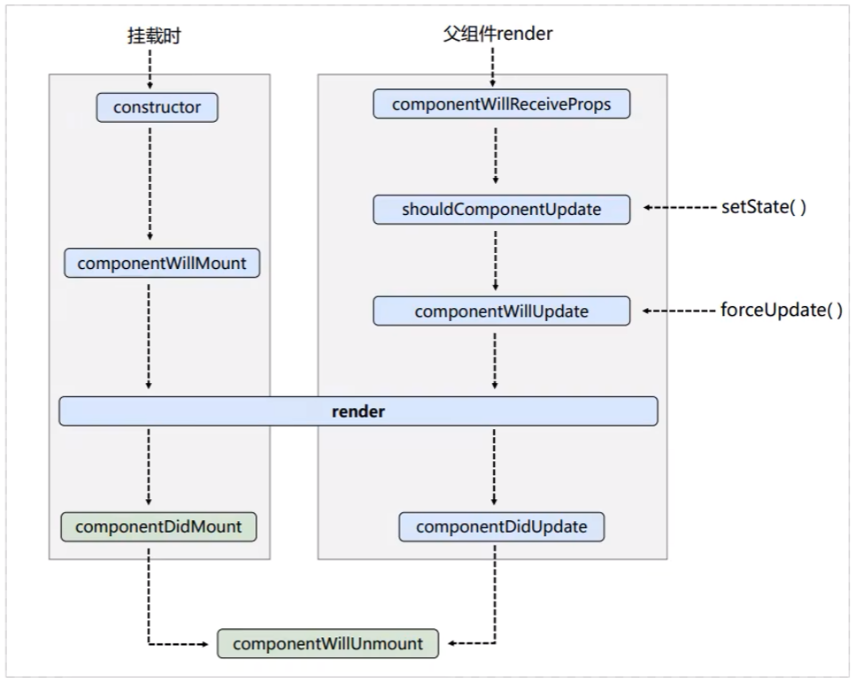
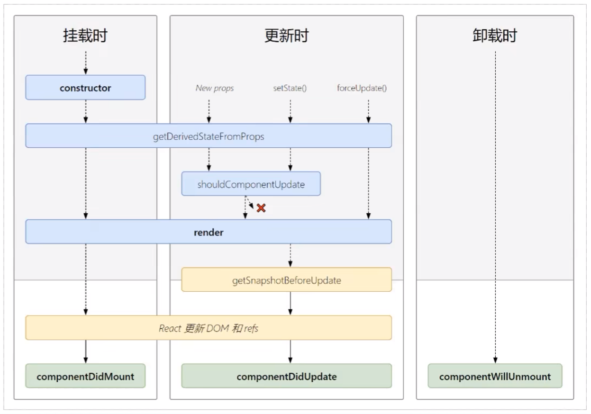

# React 生命周期

```jsx
class MyApp extends React.Component {
    state = { opacity: 0.5 };

    handleClick = (e) => {
        root.unmount();
    };

    // 组件挂载完成后执行
    componentDidMount() {
        this.timer = setInterval(() => {
            let { opacity } = this.state;
            opacity -= 0.1;
            if (opacity <= 0) {
                opacity = 1;
            }
            this.setState({ opacity });
        }, 200);
    }

    // 组件卸载前执行
    componentWillUnmount() {
        clearInterval(this.timer);
    }

    // 初次渲染和更新渲染都会执行
    render() {
        return (
            <div>
                <h2 style={{ opacity: this.state.opacity }}> Hello React </h2>
                <button onClick={this.handleClick}>unmount</button>
            </div>
        );
    }
}

const container = document.getElementById("root");
const root = ReactDOM.createRoot(container);

root.render(<MyApp />);
```

<br><br>

# 生命周期流程图 (旧)



<br>

## 挂载时

会触发 4 个钩子:

1.  `constructor(props)`
2.  `componentWillMount()`
3.  `render()`
4.  `componentDidMount()` (常用)

```jsx
class MyApp extends React.Component {
    // 构造方法 (造人)
    constructor(props) {
        console.log("constructor");
        super(props);
    }

    // 组件挂载前调用 (怀孕)
    componentWillMount() {
        console.log("componentWillMount");
    }

    // 组件初次渲染和更新时调用 (生产)
    render() {
        console.log("render");
        return <h2>Sum</h2>;
    }

    // 组件挂载完成后调用 (出生)
    componentDidMount() {
        console.log("componentDidMount");
    }
}
```

<br>

## 通过 setState 更新时

会触发 4 个钩子:

1.  `shouldComponentUpdate(nextProps, nextState, nextContext)`
2.  `componentWillUpdate(nextProps, nextState)`
3.  `render()`
4.  `componentDidUpdate(prevProps, prevState, snapshot?)`

```jsx
class MyApp extends React.Component {
    state = { count: 0 };

    handleClick = () => {
        this.setState({ count: this.state.count + 1 });
    };

    // 组件更新前调用; 返回值决定是否更新组件
    shouldComponentUpdate(nextProps, nextState) {
        console.log("shouldComponentUpdate", nextProps, nextState);
        return true; // 可以返回 false 阻止组件更新
    }

    // 组件更新前调用
    componentWillUpdate(nextProps, nextState) {
        console.log("componentWillUpdate", nextProps, nextState);
    }

    // 组件初次渲染和更新时调用
    render() {
        console.log("render");
        const { count } = this.state;
        return (
            <div>
                <h1>MyApp: {count}</h1>
                <button onClick={this.handleClick}>+1</button>
            </div>
        );
    }

    // 组件更新后调用
    componentDidUpdate(prevProps, prevState) {
        console.log("componentDidUpdate", prevProps, prevState);
    }
}
```

<br>

## 使用 forceUpdate 强制更新

会触发 3 个钩子:

1.  `componentWillUpdate(nextProps, nextState)`
2.  `render()`
3.  `componentDidUpdate(prevProps, prevState, snapshot?)`

```jsx
class MyApp extends React.Component {
    // 强制更新
    forceUpdating = () => {
        this.forceUpdate();
    };

    // 组件更新前调用
    componentWillUpdate(nextProps, nextState) {
        console.log("componentWillUpdate", nextProps, nextState);
    }

    // 组件初次渲染和更新时调用
    render() {
        console.log("render");
        return <button onClick={this.forceUpdating}>强制更新</button>;
    }

    // 组件更新后调用
    componentDidUpdate(nextProps, nextState) {
        console.log("componentDidUpdate", nextProps, nextState);
    }
}
```

<br>

## 父组件重新渲染时

会触发 5 个钩子:

1.  `componentWillReceiveProps(nextProps)`
2.  `shouldComponentUpdate(nextProps, nextState, nextContext)`
3.  `componentWillUpdate(nextProps, nextState)`
4.  `render()`
5.  `componentDidUpdate(prevProps, prevState, snapshot?)`

```jsx
class MyApp extends React.Component {
    state = { count: 0 };

    handleClick = () => {
        this.setState({ count: this.state.count + 1 });
    };

    render() {
        const { count } = this.state;
        return (
            <div>
                <h1>MyApp</h1>
                <button onClick={this.handleClick}>+1</button>
                <Son count={count} />
            </div>
        );
    }
}

class Son extends React.Component {
    state = { name: "Son" };

    // 组件即将接收新的 props 时调用
    componentWillReceiveProps(nextProps) {
        console.log("Son componentWillReceiveProps", nextProps);
    }

    // 组件即将更新时调用; 返回 false 可以阻止组件更新
    shouldComponentUpdate(nextProps, nextState) {
        console.log("Son shouldComponentUpdate", nextProps, nextState);
        return true;
    }

    // 组件即将更新时调用
    componentWillUpdate(nextProps, nextState) {
        console.log("Son componentWillUpdate", nextProps, nextState);
    }

    // 组件初次渲染和后续渲染都会调用
    render() {
        console.log("Son render");
        const { name } = this.state;
        const { count } = this.props;
        return (
            <h2>
                {name}: {count}
            </h2>
        );
    }

    // 组件更新完成时调用
    componentDidUpdate(prevProps, prevState) {
        console.log("Son componentDidUpdate", prevProps, prevState);
    }
}
```

<br>

## 卸载时

出触发 1 个钩子:

1.  `componentWillUnmount()` (常用)

```jsx
class MyApp extends React.Component {
    // 组件卸载时调用
    componentWillUnmount() {
        console.log("componentWillUnMount");
    }

    unmount = () => {
        root.unmount();
    };

    render() {
        return <button onClick={this.unmount}>卸载组件</button>;
    }
}
```

<br><br>

# 生命周期流程图 (新)

新版本的 React 中, `componentWillMount`、`componentWillReceiveProps`、`componentWillUpdate` 都被重命名了, 需要添加前缀 `UNSAFE_` 才能正常使用, 否则会抛出警告. （可以发现都是带 `will` 的钩子）

如果新旧 API 一起使用的话, 会先调用旧的 API.

但其实新版本的 React 不再推荐使用上述三个钩子.



<br>

## 挂载时

会触发 4 个钩子:

1.  `constructor(props)`
2.  `static getDerivedStateFromProps(props, state)` 一般用在 state 完全取决于 props 时
3.  `render()`
4.  `componentDidMount()` (常用)

```jsx
class MyApp extends React.Component {
    constructor(props) {
        console.log("constructor");
        super(props);

        // 因为使用了 getDerivedStateFromProps, 所以必须要初始化 state
        this.state = { name: "myApp" };
    }

    // 该方法用于返回一个对象, 该对象会与 state 合并
    static getDerivedStateFromProps(props, state) {
        console.log("getDerivedStateFromProps", props, state);
        return null; // 返回 null 表示不需要更新 state
    }

    render() {
        console.log("render");
        return <h1>MyApp</h1>;
    }

    componentDidMount() {
        console.log("componentDidMount");
    }
}
```

<br>

## setState & 父组件重新渲染

会触发 5 个钩子:

1.  `static getDerivedStateFromProps(props, state)`
2.  `shouldComponentUpdate(nextProps, nextState, nextContext)`
3.  `render()`
4.  `getSnapshotBeforeUpdate(prevProps, prevState)`
5.  `componentDidUpdate(prevProps, prevState, snapshot?)`

```jsx
class MyApp extends React.Component {
    handleClick = () => {
        const { name } = this.state;
        this.setState({ name: name + "!" });
    };

    // 因为使用了 getDerivedStateFromProps, 所以必须初始化 state
    state = { name: "myApp" };

    // 该方法用于返回一个对象, 该对象会与 state 合并
    static getDerivedStateFromProps(props, state) {
        console.log("getDerivedStateFromProps", props, state);
        return null; // 返回 null 表示不需要更新 state
    }

    // 该方法用于判断是否需要更新组件, 返回 true 表示需要更新, 返回 false 表示不需要更新
    shouldComponentUpdate(nextProps, nextState) {
        console.log("shouldComponentUpdate", nextProps, nextState);
        return true;
    }

    render() {
        const { name } = this.state;
        console.log("render");
        return (
            <>
                <h1> {name} </h1>
                <button onClick={this.handleClick}> update </button>
            </>
        );
    }

    // 该方法用于获取更新前的快照, 该快照会传递给 componentDidUpdate
    getSnapshotBeforeUpdate(prevProps, prevState) {
        console.log("getSnapshotBeforeUpdate", prevProps, prevState);
        return null; // 返回值会传递给 componentDidUpdate 的第 3 个参数
    }

    // 该方法用于更新后的操作
    componentDidUpdate(prevProps, prevState, snapshot) {
        console.log("componentDidUpdate", prevProps, prevState, snapshot);
    }
}
```

<br>

## 使用 forceUpdate 强制更新

会触发 4 个钩子:

1.  `static getDerivedStateFromProps(props, state)`
2.  `render()`
3.  `getSnapshotBeforeUpdate(prevProps, prevState)`
4.  `componentDidUpdate(prevProps, prevState, snapshot?)`

<br>

## 卸载时

出触发 1 个钩子:

1.  `componentWillUnmount()` (常用)

```jsx
class MyApp extends React.Component {
    // 组件卸载时调用
    componentWillUnmount() {
        console.log("componentWillUnMount");
    }

    unmount = () => {
        root.unmount();
    };

    render() {
        return <button onClick={this.unmount}>卸载组件</button>;
    }
}
```

<br>
