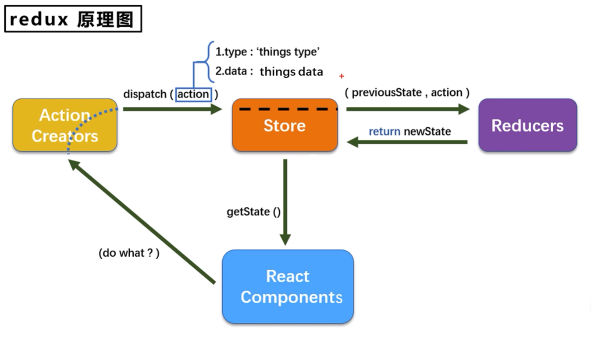

# Redux

Redux 是一个专门用于做状态管理的 JS 库, 可以在 React、Vue 等项目中使用



<br>

## 配置 Redux

1.  **安装依赖**: `npm install redux`

<br>

2.  **配置 Action**

Action 是一个表示动作的对象 `{ type: String, data?: * }`, eg: `{ type: 'ADD_USER', data: { name: 'superman' } }`

```js
// src/redux/actionType.js
export const ADD = "ADD_USER";
export const DELETE = "DELETE_USER";
```

```js
// src/redux/action.js
import { ADD, DELETE } from "./actionType";

/**
 * @param {Object} payload - eg: { name: 'superman' } 里头的 'superman'
 */
export function addActionCreator(payload) {
    return { type: ADD, payload };
}

/**
 * @param {Object} payload - eg: { id: 1 } 里头的 1
 */
export function delActionCreator(payload) {
    return { type: DELETE, payload };
}
```

<br>

3.  **配置 Reducer**

Reducer 用于初始化、加工状态.

Reducer 接收 2 个参数: 旧的状态 `previousState`、动作对象 `action`. 加工状态时, 会根据旧的 state 和 action 来计算并返回新的 state. 初始化状态时, 传入的参数 `previousState` 为 `undefined`.

Reducer 为**纯函数**, 只能接收参数 并根据参数返回指定值.

```js
// src/redux/reducers.js
import { ADD, DELETE } from "./actionType";

const initialState = { list: [{ id: 1, name: "superman" }] };

export default function rootReducer(state = initialState, action) {
    // 初始化时, 被传入的参数 previousState 为 undefined, 这里设置了默认值为 initState
    switch (action.type) {
        case ADD:
            const newItem = { id: state.list.length + 1, ...action.payload };
            const newList = [...state.list, newItem];
            return { ...state, list: newList };
        case DELETE:
            const newList = state.list.filter((item) => item.id !== action.payload.id);
            return { ...state, list: newList };
        default:
            // 初始化时会执行这里, 此时需要返回一个初始值
            return state;
    }
}
```

记住, Reducer 只完成最基础的动作, 其他逻辑处理不应放在 reducer 函数内.

Reducer 会对返回值进行比较, 如果返回值和原值一样的话, 则不会重新渲染页面. 所以, 如果更新的值为数组等引用类型数据时, 需要创建新的引用类型数据并返回, 而不能直接使用 `unshift` 等方法修改原数据并返回. 如果使用 `unshift` 方法修改原数据并返回, 则返回值和原值一样 (因为引用类型数据比较的是存储地址), 页面不会重新渲染.

<br>

4.  **配置 Store**

Store 是一个将 State、Action、Reducer 联系在一起的对象.

整个应用只有一个 Store 对象:

```javascript
// src/redux/store.js
import { createStore } from "redux";
import rootReducer from "./reducers";

const store = createStore(rootReducer);

export default store;
```

当有多个 Reducer 时, 需要使用 `combineReducers` 合并 Reducer 并注册 Store:

```javascript
import { createStore, combineReducers } from "redux";
import person from "./reducers/person";
import card from "./reducers/card";

const reducer = combineReducers({ person, card });
const store = createStore(reducer);

export default store;
```

<br>

## 使用 Redux

1.  **导入、使用 Store**:
    -   获取数据: `store.getState()`
    -   修改数据: `store.dispatch(addActionCreator('monster'))` / `store.dispatch(delActionCreator(1))`
2.  **导入、监听 Store**: 修改 Redux 中存放的数据后, 页面不会自动重新渲染. 需要使用 `store.subscribe(() => { ... })` 监听 Store 数据的变化, 然后重新渲染页面.

我们可以在组件中配合生命周期方法使用:

```javascript
// 组件挂载完成后
componentDidMount() {
    // 监听 store 的变化
    store.subscribe(() => {
        this.setState({}); // 什么数据都不改, 单纯重新渲染页面
    });
}
```

也可以在入口文件中配置:

```jsx
// 监听 store 的变化, 一旦 store 发生变化, 就重新渲染根组件
store.subscribe(() => {
    root.render(
        <React.StrictMode>
            <BrowserRouter>
                <App />
            </BrowserRouter>
        </React.StrictMode>
    );
});
```

<br>

## 异步 Action

如果 Action 的值为一个**对象**, 则为**同步** Action；如果 Action 的值为一个**函数**, 则为**异步** Action

如果我们想延迟更新 State 中的数据, 可以在组件方法中使用定时器:

```javascript
const increment = () => {
    setTimeout(() => {
        store.dispatch(addActionCreator(1));
    }, 500);
};
```

也可以使用异步 Action, 把异步操作放到 Action 中:

```javascript
const increment = () => {
    store.dispatch(addSyncActionCreator(1, 500));
};
```

```javascript
import { ADD, SUB } from "./constants";

export const addActionCreator = (data) => ({ type: ADD, data });

// 异步 action creator
export const addSyncActionCreator = (data, delay) => {
    // store.dispatch 会作为参数传入
    return (dispatch) => {
        setTimeout(() => {
            dispatch(addActionCreator(data));
        }, delay);
    };
};
```

使用异步 Action 时, 需要插件 redux-thunk 的支持:

```javascript
import { createStore, applyMiddleware } from "redux";
import thunk from "redux-thunk";
import reducer from "./reducer";

// applyMiddleware(thunk) 用于支持异步 action
const store = createStore(reducer, applyMiddleware(thunk));

export default store;
```

<br><br>

# React-Redux + Redux-Toolkit

React 官方在 Redux 基础上推出了 React-Redux, 内置了诸如 useSelector、useDispatch、useStore 等 Hooks. 同时 Redux 官方推出了 Redux-Toolkit 来简化 Redux 的使用. 现在的 React 项目多用 React-Redux + Redux-Toolkit 实现状态管理.

<br>

## 配置 RR + RT

1.  **安装依赖**: `npm install @reduxjs/toolkit react-redux`
2.  **配置 Action & Reducer**, 创建 src/redux/aboutSlice.js:

```js
import { createSlice } from "@reduxjs/toolkit";

export const aboutSlice = createSlice({
    name: "about",
    initialState: { value: 0 },
    reducers: {
        increment: (state) => {
            state.value += 1;
        },
        decrement: (state) => {
            state.value -= 1;
        },
        incrementByAmount: (state, action) => {
            state.value += action.payload;
        },
    },
});

export const { increment, decrement, incrementByAmount } = aboutSlice.actions;

export default aboutSlice.reducer;
```

3.  **配置 Store**, 创建 src/redux/store.js:

```js
import { configureStore } from "@reduxjs/toolkit";
import aboutReducer from "./aboutSlice";

export default configureStore({
    reducer: {
        about: aboutReducer,
    },
});
```

<br>

## 使用 RR + RT

1.  **集成 Store: **

```jsx
import ReactDOM from "react-dom/client";
import App from "./App";
import { BrowserRouter } from "react-router-dom";

import store from "./redux/store";
import { Provider } from "react-redux";

const root = ReactDOM.createRoot(document.getElementById("root"));

root.render(
    <Provider store={store}>
        <BrowserRouter>
            <App />
        </BrowserRouter>
    </Provider>
);
```

2.  **使用 Store: **

```jsx
import { useSelector, useDispatch } from "react-redux";
import { decrement, increment, incrementByAmount } from "../redux/aboutSlice";

export default function Counter() {
    const count = useSelector((state) => state.about.value);
    const dispatch = useDispatch();

    return (
        <>
            <span>{count}</span>
            <button onClick={() => dispatch(increment())}>Increment</button>
            <button onClick={() => dispatch(decrement())}>Decrement</button>
            <button onClick={() => dispatch(incrementByAmount(5))}>IncrementByAmount</button>
        </>
    );
}
```

<br>

## 异步 Action

1. **修改 src/redux/aboutSlice.js: **

```js
import { createSlice } from "@reduxjs/toolkit";

// 使用 createAsyncThunk 创建异步 action
export const fetchUserById = createAsyncThunk("about/fetchUserById", async (id) => {
    const response = await fetch(`https://jsonplaceholder.typicode.com/users/${id}`);
    return response.json();
});

export const aboutSlice = createSlice({
    name: "about",
    initialState: { user: {}, loading: "idle" },
    // 配置 extraReducers 处理异步 action (可选)
    extraReducers: (builder) => {
        builder
            .addCase(fetchUserById.pending, (state) => {
                state.loading = "loading";
            })
            .addCase(fetchUserById.fulfilled, (state, action) => {
                state.loading = "success";
                state.user = action.payload;
            })
            .addCase(fetchUserById.rejected, (state) => {
                state.loading = "error";
                state.user = {};
            });
    },
});

export default aboutSlice.reducer;
```

`createAsyncThunk` 接受三个参数: `action` 字符串、`payloadCreator` 回调函数、`options` 对象.

-   `action` 字符串用于生成额外的 Redux action type 以表示异步请求的生命周期. eg: `"about/fetchUserById"` 会生成 `about/fetchUserById/pending`、`about/fetchUserById/fulfilled`、`about/fetchUserById/rejected` 3 个 action type.

-   `payloadCreator` 回调函数用于处理异步操作. 它接受 2 个参数: `action.payload` 和 `thunkAPI`. `action.payload` 为调用 `fetchUserById` 时传入的参数, `thunkAPI` 为一个对象, 包含了一些方法, 如 `thunkAPI.dispatch`、`thunkAPI.getState`、`thunkAPI.rejectWithValue` 等.

`createAsyncThunk` 会返回一个标准的 Redux thunk action creator 函数. 这个函数会有 `pending`、`fulfilled`、`rejected` 3 个方法, 分别对应异步请求的 3 个生命周期.

<br>

2. **使用异步 Action: **

```jsx
import { useEffect } from "react";
import { useDispatch, useSelector } from "react-redux";
import { fetchUserById } from "../redux/aboutSlice";

export default function User() {
    const { user, loading } = useSelector((state) => state.about);
    const dispatch = useDispatch();

    useEffect(() => {
        dispatch(fetchUserById(1));
    }, []);

    return (
        <>
            <div>{loading}</div>
            <div>{user.name}</div>
        </>
    );
}
```

`extraReducers` 字段用于处理异步操作的生命周期. 它接受一个回调函数, 这个回调函数接受一个 `builder` 对象, `builder` 对象包含了 3 个方法: `addCase`、`addMatcher`、`addDefaultCase`.

-   `addCase` 方法用于处理特定的 action type. 它接受 2 个参数: `actionCreator` 和 `reducer`. `actionCreator` 为一个 Redux action creator 函数, `reducer` 为一个回调函数, 用于处理 actionCreator 返回的 action.

-   `addMatcher` 方法用于处理特定的 action type. 它接受 2 个参数: `matcher` 和 `reducer`. `matcher` 为一个函数, 用于匹配 action type, `reducer` 为一个回调函数, 用于处理 action.

-   `addDefaultCase` 方法用于处理所有未匹配的 action type. 它接受一个回调函数, 用于处理未匹配的 action.

<br>

**如果出现错误, 回调函数 `payloadCreator` 可以: **

1. 返回一个包含 Error 实例或描述性错误消息的 rejected promise
2. 返回一个由 `thunkAPI.rejectWithValue(XXX)` 返回的 resolved promise

以 thunkAPI 为例, 改写 src/redux/aboutSlice.js:

```js
import { createSlice, createAsyncThunk } from "@reduxjs/toolkit";

export const fetchUserById = createAsyncThunk("about/fetchUserById", async (id, thunkAPI) => {
    try {
        const response = await fetch(`https://jsonplaceholder.typicode.com/users/${id}`);
        return response.json();
    } catch (error) {
        return thunkAPI.rejectWithValue({ message: error.message });
    }
});

export const aboutSlice = createSlice({
    name: "about",
    initialState: { user: {}, loading: "idle" },
    extraReducers: (builder) => {
        builder
            .addCase(fetchUserById.pending, (state) => {
                state.loading = "loading";
            })
            .addCase(fetchUserById.fulfilled, (state, action) => {
                state.loading = "success";
                state.user = action.payload;
            })
            .addCase(fetchUserById.rejected, (state, action) => {
                state.loading = "error";
                state.user = {};
            });
    },
});

export default aboutSlice.reducer;
```

```jsx
import { useEffect } from "react";
import { useDispatch, useSelector } from "react-redux";
import { fetchUserById } from "../redux/aboutSlice";

export default function User() {
    const { user, loading } = useSelector((state) => state.about);
    const dispatch = useDispatch();

    useEffect(() => {
        dispatch(fetchUserById(1)).then((action) => {
            if (action.payload) {
                console.log(action.payload);
            } else {
                console.log(action.error.message);
            }
        });
    }, []);

    return (
        <>
            <div>{loading}</div>
            <div>{user.name}</div>
        </>
    );
}
```

<br>
