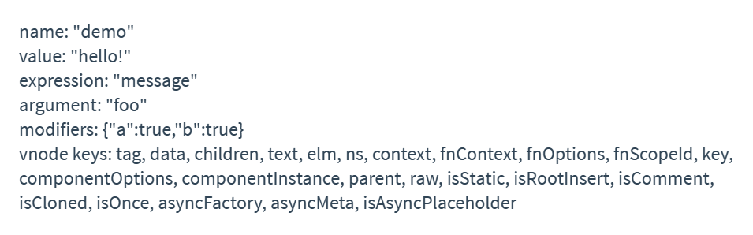

# 自定义指令

举个聚焦输入框的例子, 如下:

```js
// 注册一个全局自定义指令 `v-focus`
Vue.directive("focus", {
    // 当被绑定的元素插入到 DOM 中时……
    inserted: function (el) {
        // 聚焦元素
        el.focus();
    },
});
```

如果想注册局部指令, 组件中也接受一个 directives 的选项:

```js
new Vue({
    // ...
    directives: {
        // 定义指令
        focus: {
            inserted: function (el) {
                el.focus();
            },
        },
    },
});
```

然后你可以在模板中任何元素上使用新的 v-focus property, 如下:

```html
<input v-focus />
```

<br><br>

# 钩子函数

1.  `bind`: 只调用一次, 指令第一次绑定到元素时调用. 在这里可以进行一次性的初始化设置.

2.  `inserted`: 被绑定元素插入父节点时调用 (仅保证父节点存在, 但不一定已被插入文档中).

3.  `update`: 所在组件的 VNode 更新时调用, 但是可能发生在其子 VNode 更新之前. 指令的值可能发生了改变, 也可能没有. 但是你可以通过比较更新前后的值来忽略不必要的模板更新.

4.  `componentUpdated`: 指令所在组件的 VNode 及其子 VNode 全部更新后调用.

5.  `unbind`: 只调用一次, 指令与元素解绑时调用.

<br><br>

# 钩子函数参数

1.  `el`: 指令所绑定的元素, 可以用来直接操作 DOM.

2.  `binding`: 一个对象, 包含以下 property:

    1.  `name`: 指令名, 不包括 `v-` 前缀.
    2.  `value`: 指令的绑定值, eg `v-my-directive="1 + 1"` 中, 绑定值为 `2`.
    3.  `oldValue`: 指令绑定的前一个值. 无论值是否改变都可用. (仅在 `update` 和 `componentUpdated` 钩子中可用)
    4.  `expression`: 字符串形式的指令表达式. eg `v-my-directive="1 + 1"` 中, 表达式为 `"1 + 1"`.
    5.  `arg`: 传给指令的参数, 可选. eg `v-my-directive:foo` 中, 参数为 `"foo"`.
    6.  `modifiers`: 一个包含修饰符的对象. eg `v-my-directive.foo.bar` 中, 修饰符对象为 `{ foo: true, bar: true }`.

3.  `vnode`: Vue 编译生成的虚拟节点. 移步 VNode API 来了解更多详情.

4.  `oldVnode`: 上一个虚拟节点. (仅在 `update` 和 `componentUpdated` 钩子中可用)

除了 `el` 之外, 其它参数都应该是只读的, 切勿进行修改. 如果需要在钩子之间共享数据, 建议通过元素的 `dataset` 来进行.

```html
<div id="hook-arguments-example" v-demo:foo.a.b="message"></div>
```

```js
Vue.directive("demo", {
    bind: function (el, binding, vnode) {
        var s = JSON.stringify;
        el.innerHTML = `
            name: ${s(binding.name)}
            value: ${s(binding.value)}
            expression: ${s(binding.expression)}
            argument: ${s(binding.arg)}
            modifiers: ${s(binding.modifiers)}
            vnode keys: ${Object.keys(vnode).join(", ")}
        `;
    },
});

new Vue({
    el: "#hook-arguments-example",
    data: {
        message: "hello!",
    },
});
```



<br>

**动态指令参数**

指令的参数可以是动态的. 例如, 在 `v-my-directive:[argument]="value"` 中, `argument` 参数可以根据组件实例数据进行更新！

例如你想要创建一个自定义指令, 用来通过固定布局将元素固定在页面上. 我们可以像这样创建一个通过指令值来更新竖直位置像素值的自定义指令:

```html
<div id="base-example">
    <p>Scroll down the page</p>
    <p v-pin="200">Stick me 200px from the top of the page</p>
</div>
```

```js
Vue.directive("pin", {
    bind: function (el, binding, vnode) {
        el.style.position = "fixed";
        el.style.top = binding.value + "px";
    },
});

new Vue({
    el: "#base-example",
});
```

这会把该元素固定在距离页面顶部 200 像素的位置. 但如果场景是我们需要把元素固定在左侧而不是顶部又该怎么办呢？这时使用动态参数就可以非常方便地根据每个组件实例来进行更新.

```html
<div id="dynamic-example">
    <h3>Scroll down inside this section ↓</h3>
    <p v-pin:[direction]="200">I am pinned onto the page at 200px to the left.</p>
</div>
```

```js
Vue.directive("pin", {
    bind: function (el, binding, vnode) {
        el.style.position = "fixed";
        var s = binding.arg == "left" ? "left" : "top";
        el.style[s] = binding.value + "px";
    },
});

new Vue({
    el: "#dynamic-example",
    data() {
        return {
            direction: "left",
        };
    },
});
```

<br>

**对象字面量**

如果指令需要多个值, 可以传入一个 JS 对象字面量. 记住, 指令函数能够接受所有合法的 JS 表达式.

```html
<div v-demo="{ color: 'white', text: 'hello!' }"></div>
```

```js
Vue.directive("demo", function (el, binding) {
    console.log(binding.value.color); // => "white"
    console.log(binding.value.text); // => "hello!"
});
```

<br><br>

# 函数简写

在很多时候, 你可能想在 `bind` 和 `update` 时触发相同行为, 而不关心其它的钩子. 比如这样写:

```js
Vue.directive("color-swatch", function (el, binding) {
    el.style.backgroundColor = binding.value;
});
```

<br><br>

# demo: v-loading

1.  编写 src/directives/loading.js, 配置自定义指令:

```js
import imgUrl from "@/assets/loading.gif";
import styles from "./loading.module.scss";

const createImg = () => {
    // 创建 img 元素
    const img = document.createElement("img");
    // 设置 src
    img.src = imgUrl;
    // 通过设置 class 来设置 style
    img.className = styles.loading;
    // 返回 img
    return img;
};

export default (el, binding) => {
    if (binding.value) {
        if (el._isLoading) return;

        // 创建 img 元素
        const img = createImg();
        // 插入到 el 元素中
        el.appendChild(img);
        // 更新 el._isLoading
        el._isLoading = true;
    } else {
        // 销毁 img 元素
        el._isLoading && el.removeChild(el._loadingImg);
        // 更新 el._isLoading
        el._isLoading = false;
    }
};
```

2.  在 main.js 中全局注册自定义指令:

```js
import vLoading from "@/directives/loading";
Vue.directive("loading", vLoading);
```

3.  在组件中使用自定义指令:

```vue
<template>
    <div v-loading="isLoading">{{ isLoading }}</div>
</template>

<script>
export default {
    data() {
        return {
            isLoading: false,
        };
    },
};
</script>
```

<br>
