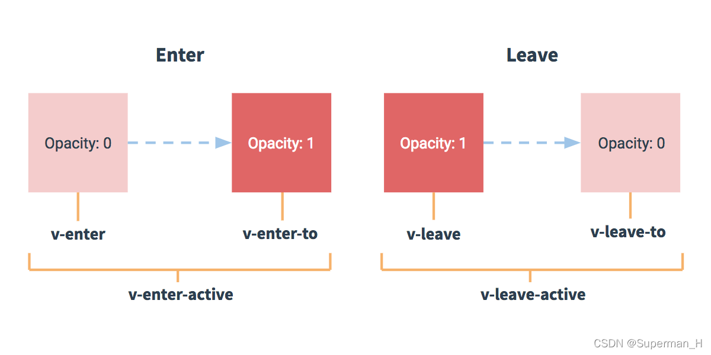

# transition 标签

-   transition 标签: Vue 内置的动画标签
-   作用: 在 [插入] / [更新] / [移除] DOM 元素时, 在合适的时候给元素添加样式类名（配合 CSS 样式使用, 实现动画效果）

<br>

**注意事项: **

-   transition 标签只能包含 **1 个** 元素; 如果里面写了多个元素, 则只生效第一个
-   transition 包裹的标签需要设置 `v-show` / `v-if` 属性控制元素的显示

<br>

**动画 CSS 样式对应的类名: **

1. 进入: `.v-enter` 始状态、`.v-enter-to` 末状态、`.v-enter-active` 进入动画（Vue2）
2. 离开: `.v-leave` 始状态、`.v-leave-to` 末状态、`.v-leave-active` 离开动画（Vue2）
3. 进入: `.v-enter-from` 始状态、`.v-enter-to` 末状态、`.v-enter-active` 进入动画（Vue3）
4. 离开: `.v-leave-from` 始状态、`.v-leave-to` 末状态、`.v-leave-active` 离开动画（Vue3）



<br>

## 配合 animation

```vue
<template>
    <div>
        <button @click="bol = !bol">隐藏/显示</button>
        <!-- Vue 的内置动画标签 transition -->
        <transition>
            <!-- 只能包含 1 个元素 -->
            <h1 v-show="bol">组件动画效果</h1>
            <!-- 需要设置 v-show / v-if 属性控制元素的显示 -->
        </transition>
    </div>
</template>

<script>
export default {
    name: "App",
    data() {
        return { bol: true };
    },
};
</script>

<style>
/* 进入动画 */
.v-enter-active {
    animation: move 1s;
}

/* 离开动画 */
.v-leave-active {
    animation: move 1s reverse;
}

@keyframes move {
    from {
        transform: translateX(-100%);
    }
    to {
        transform: translate(0);
    }
}
</style>
```

<br>

**transition 标签的属性: **

1. `name` 属性: 用于自动生成 CSS 动画类名. 如果 `transition` 标签元素没有设置 `name` 属性, 则对应的动画类名为 `v-XXX`; 如果设置了 `name` 属性, 则对应的动画类名为 `属性值-XXX`.

2. `appear` 属性: 一开始就生效显示动画

```vue
<template>
    <div>
        <button @click="bol = !bol">隐藏/显示</button>
        <!-- transition 标签元素设置了 name、appear 属性 -->
        <transition name="moveCartoon" appear>
            <!-- 动画会在一开始便生效 -->
            <h1 v-show="bol">组件动画效果</h1>
        </transition>
    </div>
</template>

<script>
export default {
    name: "App",
    data() {
        return { bol: true };
    },
};
</script>

<style>
/* 类名要对应回 name 的属性值 */
.moveCartoon-enter-active {
    animation: move 1s;
}
.moveCartoon-leave-active {
    animation: move 1s reverse;
}

@keyframes move {
    from {
        transform: translateX(-100%);
    }
    to {
        transform: translate(0);
    }
}
</style>
```

-   当存在多个 transition 标签时, 我们可以通过 `name` 属性给各个 transition 标签指定不同的 CSS 动画效果

<br>

## 配合 transition

```vue
<template>
    <div id="app">
        <button @click="bol = !bol">隐藏/显示</button>
        <transition appear>
            <h1 v-show="bol">组件动画</h1>
        </transition>
    </div>
</template>

<script>
export default {
    name: "App",
    data() {
        return { bol: true };
    },
};
</script>

<style>
/* 进入: 始状态 */
.v-enter {
    transform: translateX(-100%);
}
/* 进入: 末状态 */
.v-enter-to {
    transform: translateX(0);
}
/* 进入动画 */
.v-enter-active {
    transition: 1s;
}

/* 离开: 始状态 */
.v-leave {
    transform: translateX(0);
}
/* 离开: 末状态 */
.v-leave-to {
    transform: translateX(-100%);
}
/* 离开动画 */
.v-leave-active {
    transition: 1s;
}
</style>
```

-   也可以将 `transition: 1s` 设置到标签上, 就不用写 `v-leave-active`、`v-enter-active` 对应的样式了

```css
h1 {
    transition: 1s;
}

/* 进入: 始位置 */
.v-enter {
    transform: translateX(-100%);
}
/* 进入: 末位置 */
.v-enter-to {
    transform: translateX(0);
}

/* 离开: 始位置 */
.v-leave {
    transform: translateX(0);
}
/* 离开: 末位置 */
.v-leave-to {
    transform: translateX(-100%);
}
```

<br><br>

# transition-group 标签

-   transition 标签只能包含 1 个元素、 transition-group 标签可以包含多个元素
-   transition-group 标签里面的元素需要设置 `key` 属性, 作为当前元素的唯一标识
-   除此之外, 其他用法都和 transition 标签一样

```vue
<template>
    <div id="app">
        <button @click="isEditing = !isEditing">切换</button>
        <transition-group appear>
            <h1 v-if="isEditing" key="save">Save</h1>
            <h1 v-if="!isEditing" key="edit">Edit</h1>
        </transition-group>
    </div>
</template>

<script>
export default {
    name: "App",
    data() {
        return { isEditing: true };
    },
};
</script>

<style>
h1 {
    transition: 0.5s;
    position: absolute;
}
.v-leave {
    opacity: 1;
}
.v-leave-to {
    opacity: 0;
}
.v-enter {
    opacity: 0;
}
.v-enter-to {
    opacity: 1;
}
</style>
```

-   如果只有两个元素, 也可以给一个元素的 `key` 设置不同的状态来代替 `v-if` 和 `v-else`, 上面的例子可以重写为:

```vue
<template>
    <div id="app">
        <!--  ... -->
        <transition>
            <h1 :key="isEditing">{{ isEditing ? "Save" : "Edit" }}</h1>
        </transition>
    </div>
</template>
```

<br><br>

# 动画库 animate.css

1. 下载依赖: `npm i animate.css`
2. 引入样式库: `import "animate.css"`
3. 给指定的 transition 标签添加 `name` 属性 `animate_animate`、`animate__bounce`
4. 配置 `enter-active-class` 属性, 指定进入动画: 在样式库中挑一个进入的样式值, 作为 `enter-active-class` 属性值
5. 配置 `leave-active-class` 属性, 指定退出动画: 在样式库中挑一个退出的样式值, 作为 `leave-active-class` 属性值

```vue
<template>
    <div>
        <button @click="bol = !bol">隐藏 / 显示</button>
        <transition
            name="animate__animated animate__bounce"
            enter-active-class="animate__bounceIn"
            leave-active-class="animate__bounceOut"
        >
            <h1 v-show="bol">动画库的使用</h1>
        </transition>
    </div>
</template>

<script>
import "animate.css"; // 引入样式库
export default {
    name: "App",
    data() {
        return { bol: true };
    },
};
</script>
```

<br>
