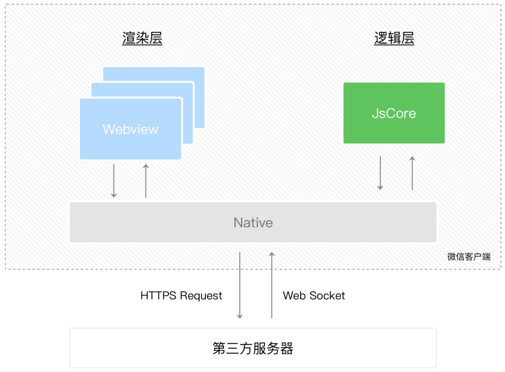

# WXML 模板

> #### WXML & HTML

1. 标签名字不一样, WXML 标签更语义化一些
   eg: `<image src="/images/1.png"></image>`、`<navigator url="/pages/logs/logs">logs</navigator>`
    - 图片建议创建 images 文件夹存放
    - 项目的根目录可以直接用 `/` 表示
2. WXML 标签混入了一些类似 Vue.js 的语法, eg: `wx:if`、`<text>{{msg}}</text>`

# WXSS 样式

提供了全局样式 app.wxss & 局部样式 XXX.wxss:

-   app.wxss 内的是全局样式, 会作用于当前小程序的所有页面; XXX.wxss 内的是局部样式, 仅对当前页面生效
-   全局样式与局部样式冲突时, 权重较大的样式生效
-   权重一样时, 局部样式的优先级较高, 局部样式先生效

> #### 尺寸单位

-   `rpx` (responsive pixel): 可以根据屏幕宽度进行自适应, 规定屏幕宽为 `750rpx`
-   由于换算采用的浮点数运算, 所以运算结果会和预期结果有一点点偏差
-   开发微信小程序时可以用 iPhone6 作为视觉稿的标准

> #### 样式导入

使用 `@import` 语句可以导入外联样式表, `@import` 后跟需要导入的外联样式表的相对路径, 用 `;` 表示语句结束

```css
@import "/common/common.wxss";
```

（一般我们会创建 common 文件夹, 存放文件 common.wxss, 在里面设置一些公共样式）

> #### CSS 选择器

WXSS 仅支持部分 CSS 选择器: ① `.class`、② `#id`、③ `element`、④ `element, element`、⑤ `::after`、⑥ `::before`

# JS 逻辑交互

小程序的主要开发语言是 JS, 可以在 JS 中调用小程序提供的 API, 利用这些 API 可以很方便地调起微信提供的能力, 例如获取用户信息、本地存储、微信支付...

> #### 小程序 & 网页

网页开发中, 渲染线程和脚本线程是互斥的; 而在小程序中, 二者是分开的, 分别运行在不同的线程中

网页开发者可以使用浏览器暴露出来的 DOM API, 进行 DOM 操作. 而如上文所述, 小程序的逻辑层和渲染层是分开的, 逻辑层运行在 JSCore 中, 并没有一个完整浏览器对象, 因而缺少相关的 DOM API 和 BOM API. 这一区别导致了前端开发非常熟悉的一些库, 例如 jQuery、 Zepto 等, 在小程序中无法运行. 同时 JSCore 环境同 NodeJS 环境也是不一样的, 所以一些 NPM 包在小程序中也无法运行

# API 接口

小程序提供了很多 API 给开发者去使用

要获取用户的地理位置, 调用 `getLocation` :

```js
wx.getLocation({
    type: "wgs84",
    success: (res) => {
        var latitude = res.latitude; // 纬度
        var longitude = res.longitude; // 经度
    },
});
```

使用微信扫一扫能力, 调用 `scanCode` :

```js
wx.scanCode({
    success: (res) => {
        console.log(res);
    },
});
```

需要注意的是: 多数 API 的回调都是异步, 你需要处理好代码逻辑的异步问题

# 组件

小程序提供了丰富的基础组件

在小程序中, 只需在 WXML 写上对应的组件标签即可把该组件显示到界面上, eg: 显示地图, 只需写 map 标签:

```html
<map></map>
```

使用组件时, 还可以通过属性传值给组件, 使组件能以不同的状态去展现, eg: 默认地图中心的经纬度是广州, 则可声明地图的 `longitude`(中心经度) & `latitude`(中心纬度) 两个属性:

```html
<map longitude="广州经度" latitude="广州纬度"></map>
```

组件的行为也能通过事件的形式配置, eg: 点击了地图上的某个标记, 可以在 JS 编写 `markertap` 函数来处理:

```html
<map bindmarkertap="markertap" longitude="广州经度" latitude="广州纬度"></map>
```

当然也可以通过 `style` / `class` 来控制组件的样式

# JSON

-   JSON 文件: 文件内容是一个对象, 通过 key-value 的方式来获取数据
-   JSON 的 Key 必须包裹在一个双引号 `""` 中
-   JSON 文件中不能使用注释, 否则会出错
-   JSON 的值只能是以下几种数据格式: 其他格式都会出错, eg: JS 中的 `undefined`
    1. 数字: 浮点数 + 整数
    2. 字符串: 需包裹在双引号中
    3. Bool 值: `true` / `false`
    4. 数组: 需包裹在方括号 `[]` 中
    5. 对象, 需包裹在大括号 `{}` 中
    6. `Null`

# 框架

整个小程序框架系统分为两部分: **逻辑层**(App Service) & **视图层**(View)

小程序提供了自己的视图层描述语言 WXML 和 WXSS, 以及基于 JS 的逻辑层框架, 并在视图层与逻辑层间提供了数据传输和事件系统, 让开发者能够专注于数据与逻辑

框架的核心是一个响应的数据绑定系统, 可以让数据与视图非常简单地保持同步. 更新数据时, 只需在逻辑层修改数据, 视图层就会做相应的更新

> #### 渲染层 & 逻辑层

微信客户端给小程序所提供的环境为**宿主环境**

小程序的运行环境分成渲染层和逻辑层, 其中 [WXML 模板] 和 [WXSS 样式] 工作在渲染层, [JS 脚本] 工作在逻辑层

渲染层和逻辑层分别由 2 个线程管理: 渲染层的界面使用 WebView 进行渲染; 逻辑层采用 JsCore 线程运行 JS 脚本

一个小程序存在多个界面, 所以渲染层有多个 WebView 线程, 这两个线程的通信会经由微信客户端 Native 做中转, 逻辑层发送网络请求也经由 Native 转发:



# 程序与页面

1. 微信客户端在打开小程序之前, 会把整个小程序的代码包下载到本地
2. 紧接着通过 app.json 的 `pages` 属性获取当前小程序的所有页面路径
3. 微信客户端就把首页的代码装载进来, 通过小程序底层的一些机制, 渲染出这个首页
4. 小程序启动之后, 在 app.js 定义的 [`App` 实例的 `onLaunch` 回调] 会被执行

-   每个小程序都需要在 app.js 中调用 `App` 方法注册小程序实例, 绑定生命周期回调函数、错误监听和页面不存在监听函数...

-   一个小程序只有一个 `App` 实例, 是全部页面共享的

    开发者可以通过 `getApp` 方法获取到全局唯一的 `App` 实例, 使用 `App` 上的数据 / 函数

> #### 小程序的页面渲染顺序:

可以看到 pages / index 下有 4 种文件:

1. [.json]: 微信客户端会先根据 index.json 配置生成一个界面, 顶部的颜色和文字你都可以在这个 json 文件里边定义好

2. [.wxml .wxss]: 紧接着客户端会装载这个页面的 [WXML 结构] & [WXSS 样式]

3. [.js]: 最后客户端会装载 index.js, 可以看到 index.js 的大体内容就是:

    `Page` 是一个页面构造器, 这个构造器就生成了一个页面
    在生成页面的时候, 小程序框架会把 `data` 数据和 `index.wxml` 一起渲染出最终的结构

-   在渲染完界面之后, 页面实例就会收到一个 `onLoad` 的回调, 我们可以在这个回调中处理逻辑
