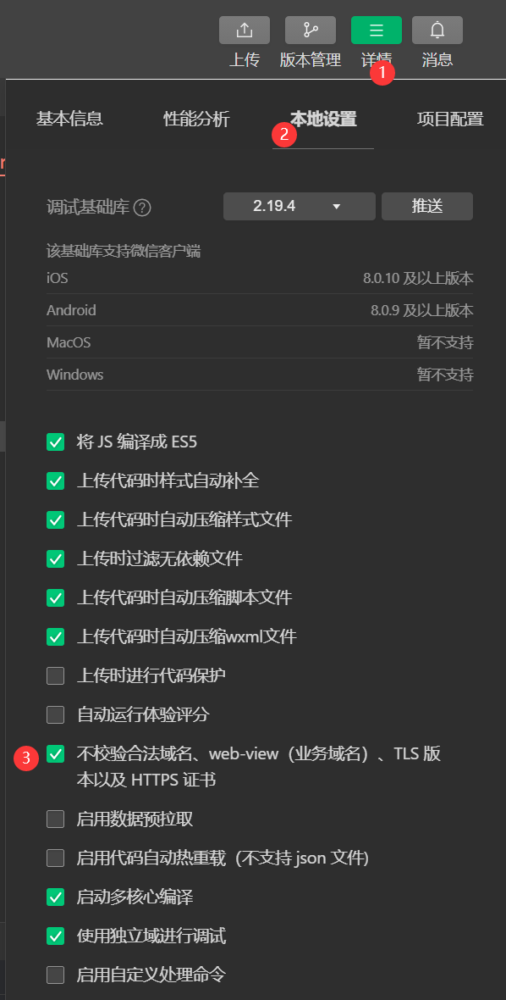

# 服务器域名配置

-   每个微信小程序需要事先设置通讯域名, 小程序只可以跟指定的域名进行网络通信, 包括:
    普通 HTTPS 请求 `wx.request`,上传文件 `wx.uploadFile`,下载文件 `wx.downloadFile`,WebSocket 通信 `wx.connectSocket`
-   从基础库 2.4.0 开始, 网络接口允许与局域网 IP 通信, 但要不允许与本机 IP 通信
-   从 2.7.0 开始, 提供了 UDP 通信 `wx.createUDPSocket`
-   从 2.18.0 开始, 提供了 TCP 连接 `wx.createTCPSocket`, 只允许与同个局域网内的非本机 IP 以及配置过的服务器域名通信
-   如使用微信云托管作为后端服务, 则可无需配置通讯域名
    在小程序内通过 `callContainer` & `connectContainer`, 向云托管服务发起 HTTPS 调用和 WebSocket 通信

## 配置规则

服务器域名可在 「小程序后台 - 开发管理 - 开发设置 - 服务器域名」 中进行配置

1. 域名只支持 https `wx.request`,`wx.uploadFile`,`wx.downloadFile` & wss `wx.connectSocket` 协议
2. 域名不能使用 IP 地址 / localhost (小程序的局域网 IP 除外)
3. 可以配置端口, 但是配置后只能向该端口发起请求, 其他端口的请求会失败
4. 如果不配置端口, 那么请求的 URL 中也不能包含端口, 否则请求会失败
5. 域名必须经过 ICP 备案
6. 出于安全考虑, api.weixin.qq.com 不能被配置为服务器域名, 相关 API 也不能在小程序内调用
   开发者应将 AppSecret 保存到后台服务器中, 通过服务器使用 `getAccessToken` 接口获取 `access_token`, 并调用相关 API
7. 不支持配置父域名, 使用子域名

## 关闭域名检查



该操作仅在开发,测试阶段有效, 上线后还是会检测域名

# 发起请求

-   小程序里面没有 Ajax, 只能叫 [网络请求]
-   小程序没有跨域问题. 跨域问题是指: 浏览器遵循同源策略, 阻止非同源请求
    小程序中, 只需将请求的域名添加到信任列表即可

## `wx.request(obj)`

-   #### 发起 HTTPS 网络请求

-   返回: 网络请求任务对象 RequestTask

> #### 参数属性:

1. `url`: 服务器接口地址
2. `data`: 请求的参数; 接收 String,Object,ArrayBuffer 类型的数据
3. `method`: `GET`(默认),`POST`...
4. `timeout`: 超时时间, 单位为毫秒. 默认值为 `60000`
5. `dataType`: 返回的数据格式; 默认为 `json`
6. `responseType`: 响应的数据类型; 默认为 `text`, 还能为 `arraybuffer`

> #### 回调函数:

1. `success`: 接口调用成功的回调函数
2. `fail`: 接口调用失败的回调函数
3. `complete`: 接口调用结束的回调函数 (调用成功,失败都会执行)

-   注意: 回调函数写成箭头函数时, `this` 指向当前 [页面对象]; 否则指向当前 [请求对象]

> #### success 的 res 参数

1. `data`: 服务器返回的数据. 接受 string,Object,Arraybuffer 类型的数据
2. `statusCode`: 服务器返回的 HTTP 状态码
3. `header`: 开发者服务器返回的 HTTP Response Header
4. `cookies`: 开发者服务器返回的 cookies, 格式为字符串数组

```html
<button bindtap="getData">点击获取数据</button>
```

```js
Page({
    getData() {
        const res = wx.request({
            url: "https://www.fastmock.site/mock/9d7b87b976f0f703686764ab8a74d066/program/list",
            method: "GET",
            success({ data }) {
                console.log("data", data);
            },
        });
        console.log("res", res);
    },
});
```

## miniprogram-api-promise

在小程序中, 是通过回调函数处理异步操作, 我们可以使用 miniprogram-api-promise 将其 Promise 化

1. 安装: `npm install --save miniprogram-api-promise`
   安装指定版本: `npm install --save miniprogram-api-promise@1.0.4`
2. 重新构建 npm: 把原来的 miniprogram_npm 删除, 选择 "工具" → "构建 npm"
3. 在入口文件 app.js 引入 miniprogram-api-promise:

```js
import { promisifyAll } from "miniprogram-api-promise";

// 创建变量 wxp, 以及微信自定义属性 wx.p
// 将 wxp 和 wx.p 指向一个空对象
// 因为对象是引用类型的数据, 所以 wxp 和 wx.p 指向同一个内存空间
const wxp = (wx.p = {});

// 将 wx 的方法挂载到 wxp 这个对象中
promisifyAll(wx, wxp);
```

`promisifyAll(wx, wxp)` 会遍历 wx 里面的属性, 将有需要的属性 Promise 化

```js
Page({
    getData() {
        const res = wx.p.request({
            url: "https://www.fastmock.site/mock/9d7b87b976f0f703686764ab8a74d066/program/list",
            method: "GET",
            success({ data }) {
                console.log("data", data);
            },
        });
        console.log("res", res);
    },
});
```

为什么是空对象 `{}` 呢？
因为网络请求是异步操作, 而赋值和输出是同步操作, 所以打印的时候数据尚未获取到, 所以会打印空对象 `{}`

我们可以配合 `async` & `await` 使用, 就可以打印出网络请求获取到的数据啦 ~

```js
Page({
    async getData() {
        const res = await wx.p.request({
            url: "https://www.fastmock.site/mock/9d7b87b976f0f703686764ab8a74d066/program/list",
            method: "GET",
            success({ data }) {
                console.log("data", data);
            },
        });
        console.log("res", res);
    },
});
```
