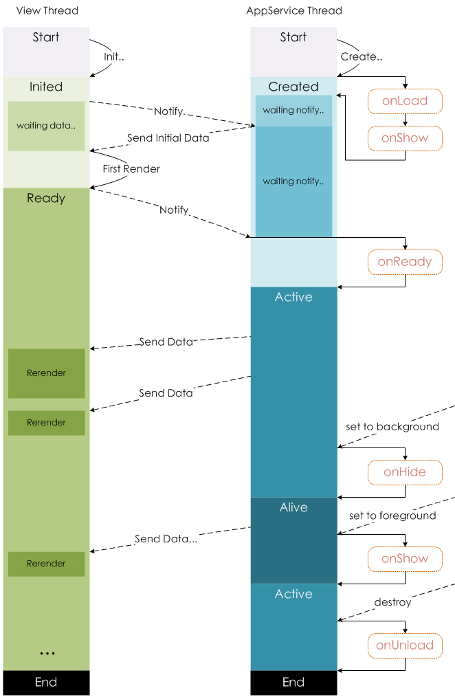

# `App(obj)`

- 每个小程序都需要在 app.js 中调用 `App` 方法注册小程序实例
- `App()` 必须在 app.js 中调用，必须调用且只能调用 1 次
- 整个小程序只有一个 App 实例，是全部页面共享的
  开发者可以通过 `getApp` 方法获取到全局唯一的 App 实例，获取 App 上的数据 / 调用开发者注册在 `App` 上的函数
- 接受一个 `Object` 参数，其指定小程序的生命周期回调等

```js
App({
    // 小程序初始化
    onLaunch() {
        console.log("onLaunch");
    },
    // 小程序从后台进入前台
    onShow() {
        console.log("onShow");
    },
    // 小程序从前台进入后台
    onHide() {
        console.log("onHide");
    },
    // 定义全局数据
	globalData: 'I am global data'
});
```

```js
// xxx.js
const appInstance = getApp(); // 获取 App 实例
console.log(appInstance.globalData) // I am global data
```

## `onLaunch(obj)`

- 小程序初始化完成时触发
- 全局只触发一次
- 可以使用 `wx.getLaunchOptionsSync` 获取小程序启动时的参数

```js
onLaunch(obj1) {
    console.log("obj1", obj1);
    let obj2 = wx.getLaunchOptionsSync();
    console.log("obj2", obj2);
},
```

> #### 参数：

1. `path`：启动小程序的路径
2. `scene`：启动小程序的场景值
3. `query`：启动小程序的 query 参数

## `onShow(obj)`

- 小程序启动 / 从后台进入前台显示时触发
- 也可以使用 `wx.onAppShow` 绑定监听

> #### 参数：

1. `path`：启动小程序的路径
2. `scene`：启动小程序的场景值
3. `query`：启动小程序的 query 参数

## `onHide()`

- 小程序从前台进入后台时触发
- 也可以使用 `wx.onAppHide` 绑定监听

# `page(obj)`

简单的页面可以使用 `Page()` 进行构造

```js
Page({
    // 监听页面加载
    onLoad: function () {
        console.log("onLoad");
    },
    // 监听页面初次渲染完成
    onReady: function () {
        console.log("onReady");
    },
    // 监听页面显示（可有多次）
    onShow: function () {
        console.log("onShow");
    },
    // 监听页面隐藏（可有多次）
    onHide: function () {
        console.log("onHide");
    },
    // 监听页面卸载
    onUnload: function () {
        console.log("onUnload");
    },
});
```

## `onLoad(Object query)`

- 页面加载时触发
- 一个页面只会调用一次
- 可以在 `onLoad` 的参数中获取打开当前页面路径中的参数

## `onReady()`

- 页面初次渲染完成时触发
- 一个页面只会调用一次，代表页面已经准备妥当，可以和视图层进行交互

**注意**：对界面内容进行设置的 API 如 `wx.setNavigationBarTitle`，请在 `onReady` 之后进行

## `onShow()`

- 页面显示 / 切入前台时触发

## `onHide()`

- 页面隐藏 / 切入后台时触发

  如 `wx.navigateTo` / 底部 `tab` 切换到其他页面，小程序切入后台等

## `onUnload()`

- 页面卸载时触发

  如 `wx.redirectTo` / `wx.navigateBack` 到其他页面时

