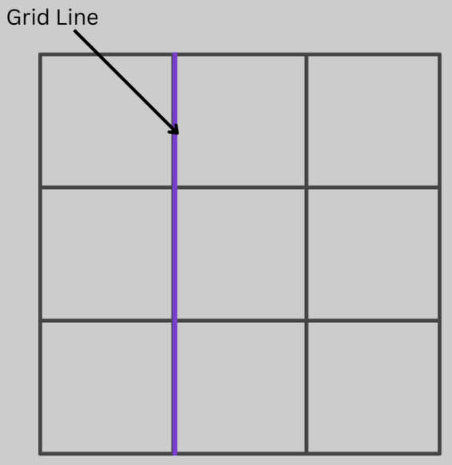
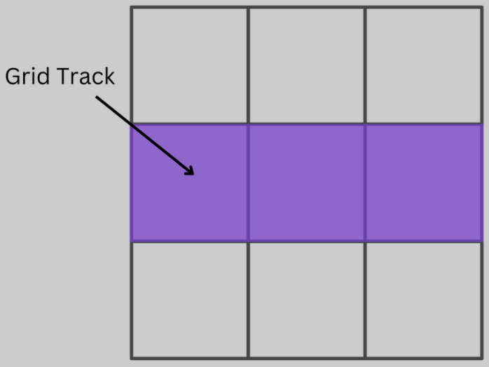
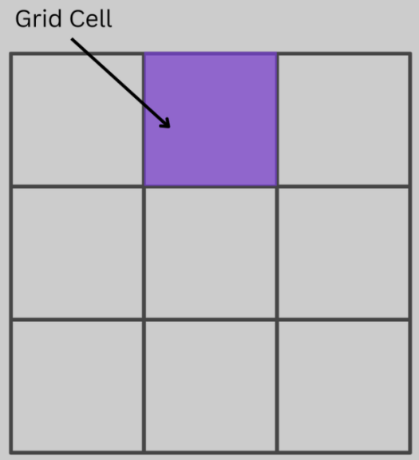
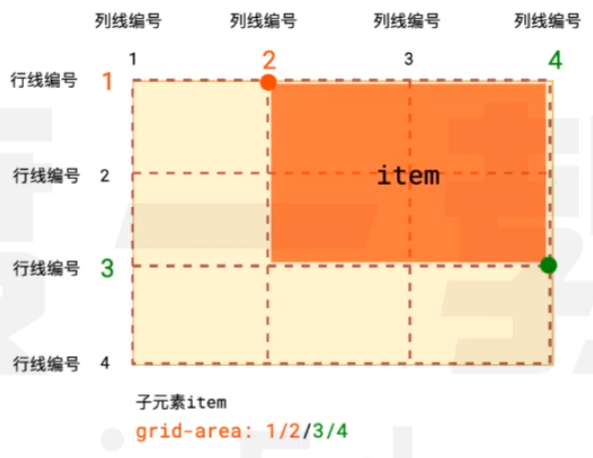

# 网格布局

1. 网格容器：设置了 `display: grid` 的元素
2. 网格项：网格容器的子元素

```html
<style>
    .container {
        display: grid;
    }
</style>

<div class="container">
    <div class="item">网格项 1</div>
    <div class="item">网格项 2</div>
    <div class="item">网格项 3</div>
    <div class="item">网格项 4</div>
</div>
```

3. 网格线：构成网格结构的水平/垂直分割线；eg: 下图中有 4 条行网格线和 4 条列网格线



4. 网格轨道：两条相邻的网格线之间的区域



5. 网格单元：两条相邻的列网格线和两条相邻的行网格线围起来的区域



<br>

默认情况下：

1.  网格项的宽度为网格容器的 100%
2.  若网格容器未设置高度，则由网格项的内容撑开；
    若网格容器设置了高度，则网格项会平分网格容器的高度。
3.  给网格容器设置 `display: grid` 后，网格项会转换为 `block`。
4.  `float`、`column`、`clear`、`vertical-align` 等设置都对网格项失效

<br><br>

# 行高 & 列宽

## grid-template-columns

`grid-template-columns` 用于设置网格容器中所需的列数及每列的宽度

<br>

**设置定值：**

-   接收 1 ~ n 个非负 CSS 长度值，这些值的个数就是网格容器的列数，每个值表示每列的宽度
-   宽度之间用空格分开
-   单位可以为 `px` / `%`

```css
grid-template-columns: 100px 100px 100px;
grid-template-columns: 80% 20%;
```

<br>

**`repeat` 函数：**

```css
grid-template-columns: repeat(列数, 每列的长度);
```

```css
grid-template-columns: repeat(重复的次数, 第1列宽度 第2列宽度);
```

<br>

**`auto-fill` 关键字：**

```css
grid-template-columns: repeat(auto-fill, 每列的宽度); /* 自动排满父级的宽度 */
```

<br>

**`fr` 关键字：**

fr 会按比例瓜分剩余的空间，可以与绝对长度结合使用。

```css
grid-template-columns: 1fr 2fr;
```

```css
grid-template-columns: 150px 1fr 2fr; /* 第一列为 150px, 剩余宽度按比例划分 */
```

<br>

**`auto` 关键字：**

```css
grid-template-columns: 100px auto 100px; /* 第二列自适应 */
```

<br>

**`minmax` 方法：**

```css
grid-template-columns: 1fr 1fr minmax(100px, 1fr); /* 将第三列的宽度控制在 100px ~ 1fr 之间 */
```

```css
grid-template-columns: 1fr 1fr minmax(100px, auto); /* 设置第三列的宽度 >= 100px */
```

<br>

**指定网格线的名称：**

该属性可以使用方括号来指定每一条网格线的名字，方便引用。

```css
grid-template-columns: [名称1] 第一列宽度 [名称2] 第二列宽度;
```

<br>

**布局实例：**

```css
grid-template-columns: 70% 30%;
```

```css
grid-template-columns: repeat(12, 1fr);
```

```css
/* 自适应排列数量 */
grid-template-columns: repeat(auto-fit, minmax(100px, 1fr));
```

<br>

## grid-template-rows

`grid-template-rows` 用于设置网格容器中每行的高度

-   与 `grid-template-columns` 不同的是，`grid-template-rows` 可以不用指定网格容器的行数
-   `grid-template-rows` 可用的属性值与 `grid-template-columns` 一样

```css
grid-template-rows: repeat(2, 5px 30px);
```

上例设置了前 4 行的高度。若网格容器中的网格项有很多，超过了 4 行，则从第 5 行开始，行高为网格项默认高度。

<br><br>

# 网格项之间的间隙

可以为网格容器设置网格线的宽度，以控制单元格之间的间隙

<br>

## row-gap

`row-gap` - 行网格线的宽度 - 行间隙：

```css
.container {
    display: grid;
    row-gap: 20px;
}
```

<br>

## column-gap

`column-gap` 列网格线的宽度 - 列间隙：

```css
.container {
    display: grid;
    column-gap: 20px;
}
```

<br>

## gap (复合)

`gap` - 复合写法：

```css
gap: 20px 10px; /* 行间隙为 20px; 列间隙为 10px */
gap: 15px; /* 行间隙和列间隙都为 15px */
```

<br><br>

# 项目的对齐方式

当**网格项的总宽高 < 网格容器的宽高**时，可以通过以下属性设置网格项的对齐方式

<br>

## justify-content -

`justify-content` 用于设置网格项在**水平方向**上的对齐方式

1. `start`：从左往右
2. `end`：从右往左
3. `center`：居中
4. `stretch`(默认)：拉伸占据整个网格容器；
   如果设置了 `width`，则与 `start` 等效。
5. `space-between`：两端对齐，子元素之间自动留有空隙
6. `space-around`：父子元素之间也有空隙，为子元素之间的空隙的一半
7. `space-evenly`：父子元素之间的空隙 = 子元素之间的空隙

<br>

## align-content -

`align-content` 用于设置网格项在**垂直方向**上的对齐方式

1. `start`：从上往下
2. `end`：从下往上
3. `center`：居中
4. `stretch`(默认)：拉伸占据整个网格容器；
   如果设置了 `height`，则与 `start` 等效。
5. `space-between`：两端对齐，子元素之间自动留有空隙
6. `space-around`：父子元素之间也有空隙，为子元素之间的空隙的一半
7. `space-evenly`：父子元素之间的空隙 = 子元素之间的空隙

<br>

## place-content (复合)

`place-content` 为 `justify-content` & `align-content` 的复合写法：

```css
place-content: <align-content> <justify-content>;
```

<br><br>

# 项目内容的对齐方式

## justify-items

用于设置项目内容在水平方向上的对其方式：

```css
justify-items: stretch; /* 默认拉伸，占满单元格的宽度 */
```

设置以下属性后，网格项的内容的宽度由内容撑开

1. `start`：对齐单元格的起始边缘
2. `end`：对齐单元格的结束边缘
3. `center`：单元格内部居中

<br>

## align-items -

用于设置项目内容在垂直向上的对其方式：

```css
align-items: stretch; /* 默认拉伸，占满单元格的宽度 */
```

设置以下属性后，项目内容的高度会被压缩至 content 的高度

1. `start`：对齐单元格的起始边缘
2. `end`：对齐单元格的结束边缘
3. `center`：单元格内部居中

<br>

## place-items (复合)

`justify-items` & `align-items` 的复合写法：

```css
place-items: <align-items> <justify-items>;
```

<br><br>

# 单个项目的内容的对齐方式 \*

以下属性需要**设置在指定的网格项中**

<br>

## justify-self

`justify-self` 用于设置当前网格项的内容在**水平方向上**的对齐方式：

1. `start`
2. `end`
3. `center`
4. `stretch` (默认)

<br>

## align-self

`align-self` 用于设置当前网格项的内容在**垂直方向上**的对齐方式：

1. `start`
2. `end`
3. `center`
4. `stretch` (默认)

<br>

## place-self (复合)

`place-self` 为 `justify-self` & `align-self` 的复合写法：

```css
place-self: <align-self> <justify-self>;
```

<br><br>

# 项目的位置 & 合并 \*

以下属性需要**设置在指定网格项上**，控制项目的位置以及大小

<br>

## grid-column

`grid-column` 用于合并列：

```css
grid-column-start: 网格线的序数 / 网格线的名字; /* 左边框所在的垂直网格线 */
grid-column-end: 网格线的序数 / 网格线的名字; /* 右边框所在的垂直网格线 */
grid-column: <start-line> / <end-line>; /* 合并写法; 第一个数: 左边序号, 第二个数: 右边序号 */
```

<br>

## grid-row

`grid-row` 用于合并行：

```css
grid-row-start: 网格线的序数 / 网格线的名字; /* 上边框所在的水平网格线 */
grid-row-end: 网格线的序数 / 网格线的名字; /* 下边框所在的水平网格线 */
grid-row: <start-line> / <end-line>; /* 合并写法 */
```

<br>

## grid-area (复合)

`grid-area` 为 `grid-column` & `grid-row` 的复合写法：

```css
grid-area: grid-row-start / grid-column-start / grid-row-end / grid-column-end;
```

demo - 1：

```css
grid-column: 1 / 3;
grid-row: 1 / 2;
/* 等同于 */
grid-column: 1 / span 2; /* span n 表示跨过 n 格 */
grid-row-start: 1;
grid-row-end: 2;
/* 等同于 */
grid-column: 1 / span 2;
grid-row: 1;
```

demo - 2：

```css
grid-area: 1 / 2 / 3 / 4;
```



<br><br>

# 定义网格模板

## grid-template-areas

该属性需要给网格容器设置，用于定义网格的整体布局

```css
display: grid;
grid-template-columns: 100px 100px 100px;
grid-template-rows: 100px 100px 100px;
grid-template-areas:
    'header header header'
    'sidebar content content'
    'footer footer footer';
```

如果某些区域不需要利用，则使用 `.` 表示，表示没有用到该单元格，或者该单元格不属于任何区域

```css
grid-template-areas:
    'header . header'
    'sidebar . content'
    'footer . footer';
```

区域的命名会影响到网格线：每个区域的起始网格线，会自动命名为 `区域名-start`，终止网格线自动命名为 `区域名-end`

<br>

## grid-area \*

-   该属性需要**给网格项设置**，用于定义该网格项的名称
-   设置了相应名称的网格项会移到网格布局中对应的位置上

```css
grid-area: sidebar;
```

<br><br>

# grid-auto-flow

该属性用于定义网格的排列顺序

1. `row` (默认)：先行后列
2. `column`：先列后行
3. `row dense`：先行后列，并且尽可能紧密填满，尽量不出现空格
4. `column dense`：先列后行，并且尽可能紧密填满，尽量不出现空格

```css
grid-auto-flow: row;
```

<br><br>

# 隐式网格轨道

-   当我们设置的网格不足以放下所有的网格项时，就会自动出现一些网格轨道
-   这些网格轨道的高度默认是 auto 的，可以使用 `grid-auto-columns` `grid-auto-rows` 来指定网格轨道的大小

```css
.container {
    display: grid;
    grid-auto-columns: 100px;
    grid-auto-rows: 80px;
}
```

上例就指定了网格轨道的宽度为 100px，高度为 80px

<br>

> 标题后面带 `*` 号的，表示该属性需要给网格项设置

<br>
