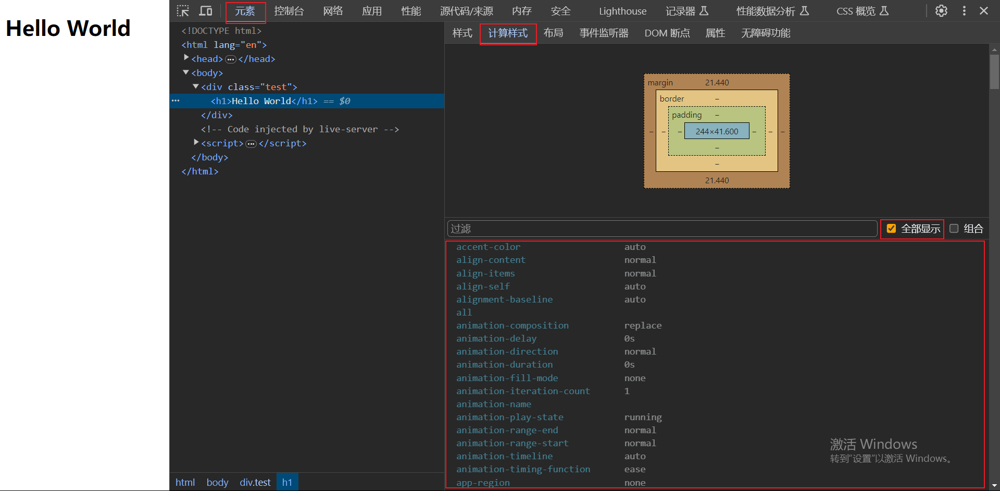
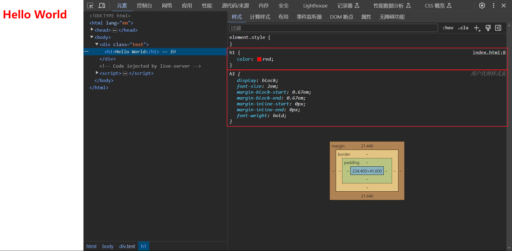
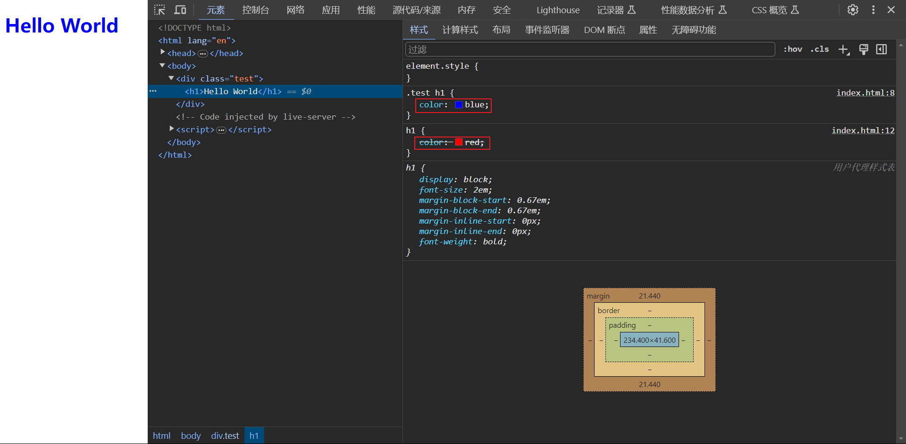
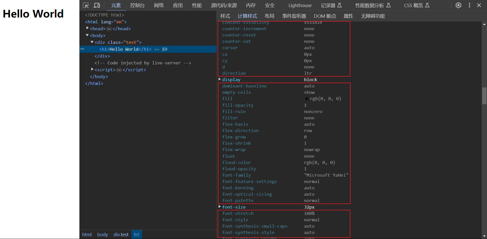
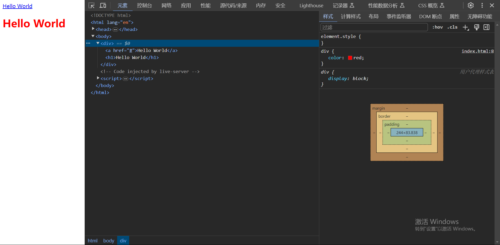
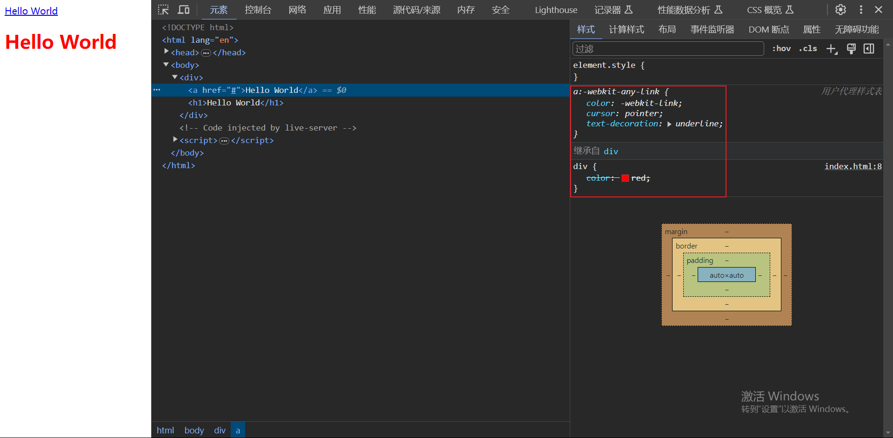
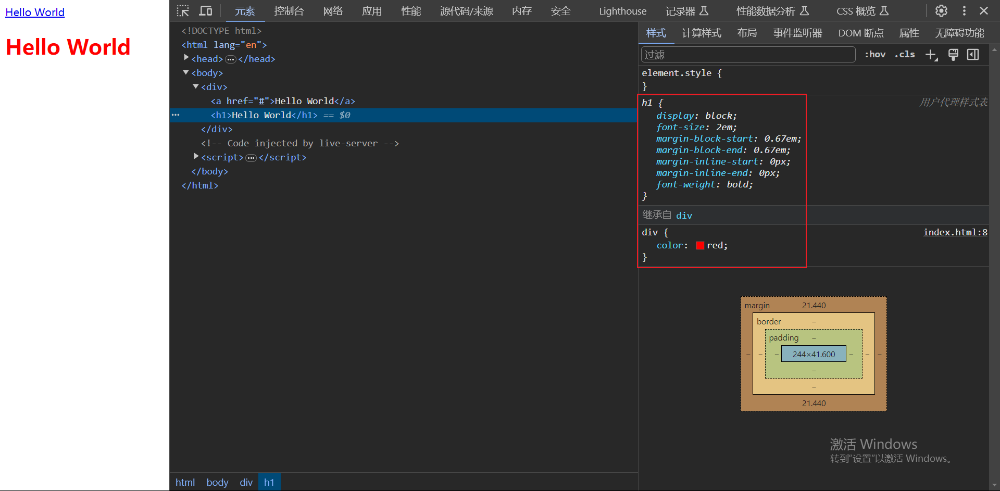

# 标签的 CSS 样式

我们先来了解一下浏览器处理文件的标准流程。需要知道的是，下面的步骤是浏览器加载网页的简化版本：

1.  浏览器载入 HTML 文件（比如从网络上获取）。

2.  解析 HTML 文件，拉取该 HTML 相关的资源，比如 CSS 样式。

3.  根据 HTML 文件，构建 DOM 树、根据 CSS 文件，构建 CSSOM 树。

4.  合并 DOM 树和 CSSOM 树，构建渲染树。

5.  根据渲染树，计算每个节点的几何信息（位置、大小等），并将节点绘制到屏幕上。


<br>

经过上述步骤，**我们编写的任何一个 HTML 元素，都应用了一整套所有的 CSS 样式**。

编写如下 HTML 代码，并在浏览器中打开：

```html
<div class="test">
    <h1>Hello World</h1>
</div>
```

我们可以打开浏览器的开发者面板，选择 [元素] - [计算样式] - 勾选 [全部显示]，就能看到浏览器为 h1 设置的所有 CSS 属性。这里展示的属性值都是计算后的具体值，颜色值都是 rgb 的格式、长度值都以 px 为单位。



那么，上例所展示的 CSS 属性值是如何被一步步计算出来的呢？

<br><br>

# 样式的计算过程

总的来讲，CSS 属性值的计算有如下 4 个步骤：

1.  确定声明值

2.  解决层叠冲突

3.  继承属性值

4.  使用默认值

<br>

## 确定声明值

浏览器会从各种来源的样式表中找到所有的 CSS 声明，并确定声明值。有 3 种源：

1.  用户代理样式表：浏览器内置的样式表。

2.  用户样式表：用户自定义主题时使用的样式表，一般可以通过插件（比如 Stylus）实现。

3.  作者样式表：开发者编写的样式表。

"用户代理" 指的是浏览器。"用户" 指的是网站访问者。"作者" 指的是开发者。

<br>

编写如下 CSS 代码，并在浏览器中打开：

```css
h1 {
    color: red;
}
```

现在浏览器即可从 "作者样式表" 确定 color 属性，从 "用户代理样式表" 确定 display、font-size 等属性。



<br>

## 解决层叠冲突

在确定声明值时，可能出现 "声明的样式发生冲突" 的情况，此时就会进入解决层叠冲突的流程。

解决层叠冲突有如下 3 个步骤：

1.  比较源的重要性

2.  比较样式的权重

3.  比较编写的位置

<br>

第一步：比较**源的重要性**。

"作者样式表" > "用户代理样式表"。

"用户样式表" 的情况比较复杂，根据 MDN 的说法，"作者样式表" > "用户样式表" > "用户代理样式表"。但是经过尝试，也会有 "用户样式表" > "作者样式表" 的情况。具体看插件的实现方式以及浏览器的拦截方式。

```css
h1 {
    font-weight: 400;
}
```

使用上述样式，可以看到页面上的 h1 最终应用了 `font-weight: 400` 这个属性值。


<br>

第二步：比较**样式的权重**。

```css
.test h1 {
    color: blue;
}

h1 {
    color: red;
}
```

上面的样式同属于 "作者样式表"，即源的重要性相同，此时就会比较样式的权重。

样式的权重有 4 个等级，由 4 个位的数值 (千位、百位、十位、个位) 来表示：

1.  行内样式：对应的权重位是千位 `(1, 0, 0, 0)`
2.  ID 选择器：对应的权重位是百位 `(0, 1, 0, 0)`
3.  类选择器、属性选择器、伪类选择器：对应的权重位是十位 `(0, 0, 1, 0)`
4.  元素选择器、伪元素选择器：对应的权重位是个位 `(0, 0, 0, 1)`

> 使用 `!important` 修饰的样式的权重值为 `infinity`，即无穷大。

上例 `.test h1 { ... }` 的权重为 `(0, 0, 1, 1)`，而 `h1 { ... }` 的权重为 `(0, 0, 0, 1)`，因此最终会应用 `color: blue` 这个属性值。



这里需要注意：**权值不能跃迁**。就是说，无论有多少个元素选择器指定的样式，都不能覆盖一个的类选择器指定的样式。

> 也有说法是：最开始权重的计算是 256 进制的（`(0, 0, 0, 255)  +  (0, 0, 0, 1)  =  (0, 0, 1, 0)`）。后随着计算机的发展 这个进制在不断增大。
>
> 不管怎样，我们就当作权值不能跃迁就好了。毕竟再怎么样写代码也不可能写出几百上千个选择器吧。

<br>

第三步：比较**编写的位置**。

位置靠后的样式 > 位置靠前的样式。

```css
h1 {
    color: red;
}

h1 {
    color: blue;
}
```

以上样式具有相同的源重要性和样式权重，此时位于下面的样式会覆盖掉上面的样式，最终会应用 `color: blue` 这个属性值。


<br>

## 继承属性值

对于可继承属性，如果经过 "确定声明值"、"解决层叠冲突" 后，属性仍没有值，则会尝试继承最近的父元素身上的属性值。

```css
div {
    color: red;
}
```

上例给 div 设置了 color 属性，由于 color 是可以继承的，因此 h1 从最近的父元素 div 身上继承了 color 属性。


<br>

大致上，与文本相关的属性都是可继承的，而与布局相关的属性都是不可继承的。

以下是一些常用的可继承 CSS 属性：

-   字体系列属性：font、font-family、font-weight、font-size、font-style 等。

-   文本系列属性：color、line-height、word-spacing、letter-spacing、text-transform、text-indent、text-align 等。

-   列表系列属性：list-style、list-style-type、list-style-position 等。

-   表格系列属性：border-collapse、border-spacing 等。

-   其他属性：visibility、cursor、direction 等。

以下是一些不可继承的 CSS 属性：

-   盒模型系列属性：margin、padding、border、width、height 等。

-   定位系列属性：position、top、right、bottom、left 等。

-   背景系列属性：background、background-color、background-./picture/image 等。

-   显示系列属性：display、overflow 等。

-   其他属性：vertical-align、z-index 等。

<br>

## 使用默认值

经过 "确定声明值"、"解决层叠冲突"、"继承属性值" 后，如果属性仍没有值，才会使用默认值。

浏览器中没有高亮显示的属性，就是使用了默认值。



<br><br>

# DEMO

```html
<div>
    <a href="#">Hello World</a>
    <h1>Hello World</h1>
</div>
```

```css
div {
    color: red;
}
```

问：a 元素是什么颜色？ h1 元素又是什么颜色？

答：a 元素为蓝色，h1 元素为红色。



<br>

解析：因为 a 元素的 "用户代理样式表" 设置了 color 属性，因此会应用此声明值。而在 h1 元素中，无论是 "作者样式表" 还是 "用户代理样式表"，都没有对此属性进行声明，color 又是可继承属性，因此 h1 元素会继承父元素 div 的 color 属性。





> 如果希望 a 元素可以继承 div 的 color，可以显式地设置 `color: inherit`。
>
> 除了 inherit 这个特殊值，还有 initial，可以通过 `color: initial` 显式地设置 color 属性值为默认值。

<br>
