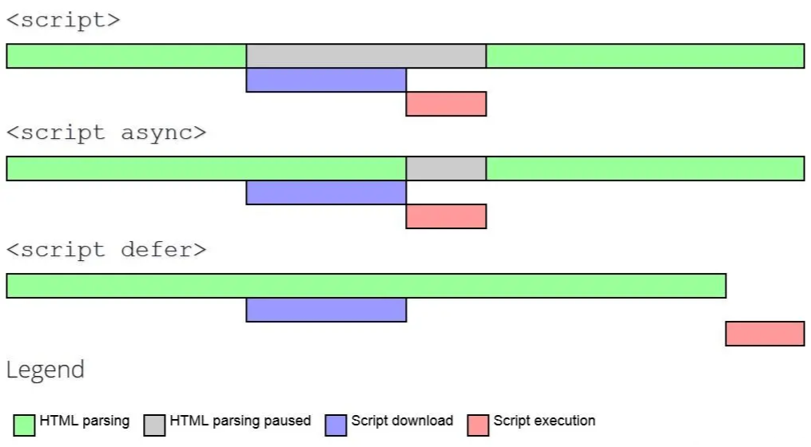

# script 标签

script 标签之间共享顶层对象.

```html
<script>
    var a = 1;
</script>

<script>
    console.log(a); // 1
</script>
```

但是全局变量作用域的提升机制在这些边界中不适用:

```html
<script>
    foo();
</script>

<script>
    function foo() {
        console.log("foo");
    }
</script>
```

但是下面的两段代码则没问题:

```html
<script>
    foo();
    function foo() {
        console.log("foo");
    }
</script>
```

```html
<script>
    function foo() {
        console.log("foo");
    }
</script>

<script>
    foo();
</script>
```

如果 script 中的代码 (无论是内联代码还是外部代码) 发生错误, 它会像独立的 JS 程序那样停止, 但是后续的 script 中的代码依然会接着运行, 不会受影响.

<br>

内联代码和外部文件中的代码之间有一个区别, 即在内联代码中不可以出现 `</script>` 字符串, 一旦出现即被视为代码块结束. 因此对于下面这样的代码需要非常小心:

```html
<script>
    var code = "<script>alert('Hello World')</script>";
</script>
```

上述代码看似没什么问题, 但是字符串常量中的 `</script>` 将会被当作结束标签来处理, 因此会导致错误.

常用的变通方法是:

```js
"</" + "script>";
```

使用转义字符 `\` 也可:

```html
<script>
    function sayScript() {
        console.log("<\/script>"); // 使用转义字符
    }
</script>
```

<br>

另外需要注意的一点是, 我们是根据代码文件的字符集属性来解析外部文件中的代码, 而内联代码则使用其所在页面文件的字符集.

> 内联代码的 script 标签没有 charset 属性.

<br><br>

# script 标签的属性

1.  `src`: 可选. 指定外部脚本文件.
2.  `async`: 可选. 表示异步加载脚本, 加载完成后立即执行. 只对外部脚本文件有效.
3.  `defer`: 可选. 表示异步加载脚本, 等到文档完全被解析和显示之后再执行. 只对外部脚本文件有效.
4.  `crossorigin`: 可选. 配置相关请求的 CORS (跨源资源共享) 设置. 默认不使用 CORS. `crossorigin="anonymous"` 表示文件请求不会设置凭据标志. `crossorigin="use-credentials"` 表示文件请求会设置凭据标志, 意味着出站请求会包含凭据.
5.  `integrity`: 可选. 允许比对接收到的资源和指定的加密签名以验证子资源完整性 (SRI, Subresource Integrity) . 如果接收到的资源的签名与这个属性指定的签名不匹配, 则页面会报错, 脚本不会执行. 这个属性可以用于确保内容分发网络 (CDN, Content Delivery Network) 不会提供恶意内容.



<br><br>

# script 标签的使用

使用了 `src` 属性的 `<script>` 元素不应该再在 `<script>` 和 `</script>` 标签中包含其他 JS 代码. 如果两者都提供的话, 则浏览器只会下载并执行外部脚本文件, 从而忽略行内代码.

<br>

跟 `` 元素很像, `<script>` 元素的 `src` 属性可以是一个完整的 URL, 而且这个 URL 指向的资源可以跟包含它的 HTML 页面不在同一个域中.

浏览器在解析这个资源时, 会向 src 属性指定的路径发送一个 GET 请求, 以取得相应资源, 假定是一个 JS 文件. 这个初始的请求不受浏览器同源策略限制, 但返回并被执行的 JS 则受限制. 当然, 这个请求仍然受父页面 HTTP/HTTPS 协议的限制.

来自外部域的代码会被当成加载它的页面的一部分来加载和解释. 这个能力可以让我们通过不同的域分发 JS. 不过, 引用了放在别人服务器上的 JS 文件时要格外小心, 因为恶意的程序员随时可能替换这个文件. 在包含外部域的 JS 文件时, 要确保该域是自己所有的, 或者该域是一个可信的来源. `<script>` 标签的 `integrity` 属性是防范这种问题的一个武器.

<br>

不管包含的是什么代码, 浏览器都会按照 `<script>` 在页面中出现的顺序依次解释它们, 前提是它们没有使用 `defer` 和 `async` 属性. 第二个 `<script>` 元素的代码必须在第一个 `<script>` 元素的代码解释完毕才能开始解释, 第三个则必须等第二个解释完, 以此类推.

<br><br>

# script 标签位置

script 标签会阻塞 HTML 的解析, 所以尽量放在 HTML 的底部, 以免影响页面的首屏渲染.

当浏览器遇到 script 标签时, 它会暂停解析 HTML 文档, 先去执行 script 标签中的 JS 代码, 因为 JS 代码可能会修改 HTML 的结构或内容. 这样就会导致页面的渲染被延迟, 用户看到的是一个空白的页面, 直到 script 标签执行完毕, 浏览器才会继续解析 HTML 文档, 并渲染页面. 所以, 为了提高用户体验, 我们应该尽量把 script 标签放在 HTML 的底部, 这样就可以让浏览器先解析和渲染页面的首屏内容, 再去执行 script 标签中的 JS 代码.

假设我们有一个内联的 JS 代码, 它会在页面加载时执行一些耗时的逻辑, 我们把它放在 head 标签内, 比如:

```html
<html>
    <head>
        <!-- 内联 JS 放在 head 标签内, 会阻塞 HTML 的解析和页面的渲染 -->
        <script>
            // 一些耗时的逻辑
            for (var i = 0; i < 1000000000; i++) {}
        </script>
    </head>
    <body>
        <!-- 页面内容 -->
        <h1>Hello World</h1>
    </body>
</html>
```

这样的话, 用户打开这个页面时, 会看到一个空白的页面, 直到内联 JS 执行完毕, 才会看到 "Hello World".

如果我们把内联 JS 放在 body 标签的底部, 比如:

```html
<html>
    <head> </head>
    <body>
        <!-- 页面内容 -->
        <h1>Hello World</h1>

        <!-- 内联 JS 放在 body 标签的底部, 不会阻塞 HTML 的解析和页面的渲染 -->
        <script>
            // 一些耗时的逻辑
            for (var i = 0; i < 1000000000; i++) {}
        </script>
    </body>
</html>
```

这样的话, 用户打开这个页面时, 会先看到 "Hello World", 然后再等待内联 JS 执行完毕. 这样就可以提高用户体验.

<br><br>

# 推迟执行脚本

在 `<script>` 元素上设置 `defer` 属性, 相当于告诉浏览器**立即下载, 但延迟执行**. `defer` 属性表示脚本会被延迟到整个页面都解析完毕后再运行.

```html
<!DOCTYPE html>
<html>
    <head>
        <title>Example HTML Page</title>
        <script defer src="example1.js"></script>
        <script defer src="example2.js"></script>
    </head>
    <body>
        <!-- 这里是页面内容 -->
    </body>
</html>
```

虽然这个例子中的 `<script>` 元素包含在页面的 `<head>` 中, 但它们会在浏览器解析到结束的 `</html>` 标签后才会执行. HTML5 规范要求脚本应该按照它们出现的顺序执行, 因此第一个推迟的脚本会在第二个推迟的脚本之前执行, 而且两者都会在 DOMContentLoaded 事件之前执行. 不过在实际当中, 推迟执行的脚本不一定总会按顺序执行或者在 DOMContentLoaded 事件之前执行, 因此最好只包含一个这样的脚本.

如前所述, `defer` 属性只对外部脚本文件才有效.

<br><br>

# 异步执行脚本

在 `<script>` 元素上设置 `async` 属性, 会告诉浏览器**立即开始下载**. 不过, 与 `defer` 不同的是, 标记为 `async` 的脚本并不保证能按照它们出现的次序执行, 比如:

```html
<!DOCTYPE html>
<html>
    <head>
        <title>Example HTML Page</title>
        <script async src="example1.js"></script>
        <script async src="example2.js"></script>
    </head>
    <body>
        <!-- 这里是页面内容 -->
    </body>
</html>
```

在这个例子中, 第二个脚本可能先于第一个脚本执行. 因此, 重点在于它们之间没有依赖关系. 给脚本添加 `async` 属性的目的是告诉浏览器, 不必等脚本下载和执行完后再加载页面, 同样也不必等到该异步脚本下载和执行后再加载其他脚本. 正因为如此, 异步脚本不应该在加载期间修改 DOM.

异步脚本保证会在页面的 load 事件前执行, 但可能会在 DOMContentLoaded 之前或之后.

<br><br>

# 动态加载脚本

```js
const script = document.createElement("script");
script.src = "gibberish.js";
document.head.appendChild(script);
```

在把 HTMLElement 元素添加到 DOM 且执行到这段代码之前不会发送请求.

默认情况下, 动态创建的 `<script>` 元素是以异步方式加载的, 相当于添加了 `async` 属性. 如果要统一动态脚本的加载行为, 可以明确将其设置为同步加载:

```js
const script = document.createElement("script");
script.src = "gibberish.js";
script.async = false;
document.head.appendChild(script);
```

以这种方式获取的资源对浏览器预加载器是不可见的. 这会严重影响它们在资源获取队列中的优先级. 根据应用程序的工作方式以及怎么使用, 这种方式可能会严重影响性能. 要想让预加载器知道这些动态请求文件的存在, 可以在文档头部显式声明它们:

```html
<link rel="preload" href="gibberish.js" />
```

<br>
