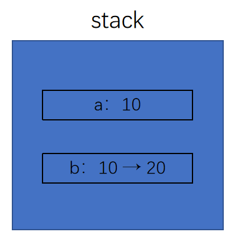
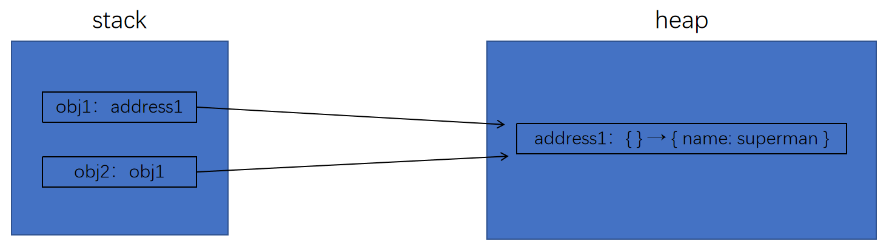

# 数据类型

ECMAScript 有 6 种简单数据类型（也称为原始类型）：Undefined、Null、Boolean、Number、String 和 Symbol。

Symbol（符号）是 ECMAScript 6 新增的。

<br><br>

# 变量的类型

JS 的变量具有**动态数据类型** → 变量的类型由变量值决定。

<br>

可以使用 `typeof` 操作符查看变量的数据类型，会返回下列**字符串**之一：

1. `"undefined"` 表示值未定义
1. `"boolean"` 表示值为布尔值
1. `"string"` 表示值为字符串
1. `"number"` 表示值为数值
1. `"object"` 表示值为对象（而不是函数）或 `null`
1. `"function"` 表示值为函数
1. `"symbol"` 表示值为符号

```js
let a = 123;
console.log(typeof a); // 用法 1

a = 'asd';
console.log(typeof a); // 用法 2
```

因为 `typeof` 是一个操作符而不是函数，所以不需要参数（但可以使用参数）。

注意 `typeof` 在某些情况下返回的结果可能会让人费解，但技术上讲还是正确的。比如，调用 `typeof null` 返回的是 `"object"`。这是因为特殊值 `null` 被认为是一个对空对象的引用。

> 严格来讲，函数在 ECMAScript 中被认为是对象，并不代表一种数据类型。可是，函数也有自己特殊的属性。为此，就有必要通过 `typeof` 操作符来区分函数和其他对象。

<br>

可以使用 Object 的原型对象上挂载的 toString 方法查看变量的类型：(需要改变该方法的 this 指向)

```javascript
const typeOf = function (obj) {
    console.log(Object.prototype.toString.call(obj).slice(8, -1).toLowerCase());
};

typeOf('superman'); // string
typeOf([]); // array
typeOf(new Date()); // date
typeOf(null); // null
typeOf(true); // boolean
typeOf(() => {}); // function
```

<br><br>

# 基本数据类型

基本类型的数据，保存在**栈内存**中。

<br>

## Number 类型

```js
console.log(typeof NaN); // number
```

<br>

## String 类型

字符串可以使用双引号、单引号或反引号标示。

```js
let str1 = '1';
let str2 = `1`;
console.log(typeof ''); // string
```

要注意的是，以某种引号作为字符串开头，必须仍然以该种引号作为字符串结尾。

<br>

## Boolean 类型

Boolean（布尔值）类型有两个字面值：`true` 和 `false`。

```js
console.log(typeof true); // boolean
```

<br>

## Undefined 类型

Undefined 类型只有一个值，就是特殊值 `undefined`。当使用 `var` 或 `let` 声明了变量但没有初始化时，就相当于给变量赋予了 `undefined` 值：

```js
let message;
console.log(message == undefined); // true
```

> 一般来说，永远不用显式地给某个变量设置 `undefined` 值。字面值 `undefined` 主要用于比较，而且在 ECMA-262 第 3 版之前是不存在的。增加这个特殊值的目的就是为了正式明确空对象指针（`null`）和未初始化变量的区别。

<br>

在对未初始化的变量调用 `typeof` 时，返回的结果是 `"undefined"`，但对未声明的变量调用它时，返回的结果还是 `"undefined"`，这就有点让人看不懂了。比如下面的例子：

```js
let message; // 这个变量被声明了，只是值为 undefined
// let age // 确保没有声明过这个变量

console.log(typeofmessage); // "undefined"
console.log(typeofage); // "undefined"
```

> 即使未初始化的变量会被自动赋予 `undefined` 值，但我们仍然建议在声明变量的同时进行初始化。这样，当 `typeof` 返回 `"undefined"` 时，你就会知道那是因为给定的变量尚未声明，而不是声明了但未初始化。

<br>

## Null 类型

Null 类型同样只有一个值，即特殊值 `null`。逻辑上讲，`null` 值表示一个空对象指针，这也是给 `typeof` 传一个 `null` 会返回 `"object"` 的原因：

```js
let car = null;
console.log(typeof car); // "object"
```

在定义将来要保存对象值的变量时，建议使用 `null` 来初始化，不要使用其他值。这样，只要检查这个变量的值是不是 `null` 就可以知道这个变量是否在后来被重新赋予了一个对象的引用，比如：

```js
if (car != null) {
    // car 是一个对象的引用
}
```

<br>

`undefined` 由 `null` 派生而来，表面上它们是相等的：

```js
console.log(undefined == null); // true
console.log(undefined === null); // false
```

<br><br>

# 引用数据类型

-   引用类型数据：对象 `Object`、函数 `function`、数组 `Array` ... 保存在**堆内存**中。

```js
typeof [10, 10]; // object
```

-   `Object` 是派生其他对象的基类
-   因为 `Object` 是基类，所以 `Object` 类型的所有属性和方法在派生的对象上都可用：
    ① `hasOwnProperty("propertyName")`：用于判断当前实例上是否存在给定的属性。<br>
    ② `isPrototypeof(object)`：用于判断当前对象是否为另一个对象的原型。<br>
    ③ `propertyIsEnumerable("propertyName")`：用于判断给定的属性是否可以使用 `for-in` 语句枚举。<br>
    ④ `toString()`：返回对象的字符串表示。<br>
    ⑤ `valueOf()`：返回对象对应的字符串、数值或布尔值表示。通常与 `tostring()` 的返回值相同。

```js
console.log([10, 10].toLocaleString()); // 10,10
console.log([10, 10].toString()); // 10,10
console.log([10, 10].valueOf()); // [ 10, 10 ]
```

<br><br>

# 对数据的操作

## 基本类型数据

-   基本类型数据存储在**栈 (stack)** 中。
-   内存由系统自动分配，分配的内存大小是固定的。
-   内存空间一般较小，运行效率相对较高。

```js
const a = 10; // 申请 stack 内存, 存放 [基本类型数据 10]
let b = a; // JS 操作的是 stack 内存中存放的 [基本类型数据 10]
b += 10;
console.log(a); // 10
console.log(b); // 20
```



<br>

## 引用类型数据

-   引用类型数据存储在**堆 (heap)** 中。
-   内存由代码指定分配，分配的大小不定，可动态调整。
-   内存空间一般较大，运行效率相对较低。

```js
const obj1 = {}; // 申请 heap 内存, 存放引用类型数据 {}; 申请 stack 内存, 存放 [引用类型数据 {} 对应的 heap 内存的地址]
const obj2 = obj1; // JS 操作的是 stack 内存中存放的 [引用类型数据 {} 对应的 heap 内存的地址]

obj2.name = 'superman';

console.log(obj1.name); // superman
console.log(obj2.name); // superman
```

可以看到，修改 `obj1` 的属性值，`obj2` 的属性值也会变。



<br>

注意：引用类型数据里面的基本类型数据，也是存储在栈中：

```js
const obj = { name: 'superman' };
```

对象 `obj` 中 `name` 的属性值 `"superman"` 也是存储在 stack 内存中的。

<br>

## 深拷贝 & 浅拷贝

> #### 数组的浅拷贝

1. `arr.concat()`：用于合并数组，不会改变原数组

```js
const arr = [1, 2, 3];
const copyArr = [].concat(arr);

console.log('arr', arr); // arr [1, 2, 3]
console.log('copyArr', copyArr); // copyArr [1, 2, 3]

copyArr.push(4, 5); // 对拷贝的数组添加数据

console.log('arr', arr); // arr [1, 2, 3]
console.log('copyArr', copyArr); // copyArr [1, 2, 3, 4, 5]
```

2. `arr.slice()`：用于切取指定数组元素，不会改变原数组

```js
const arr = [1, 2, 3];
const copyArr = arr.slice();
```

3. `Array.from(arr)`：用于把类数组对象转成数组

```js
const arr = [1, 2, 3];
const copyArr = Array.from(arr);
```

4. 扩展运算符 & 解构赋值

```js
const arr = [1, 2, 3];
const copyArr = [...arr];
```

<br>

> #### 对象的浅拷贝

1. `Object.assign()` 用于合并对象

```js
let obj = { name: 'superman' };
let copyObj = Object.assign({}, obj);

copyObj.name = 'monster';

console.log('obj', obj); // obj {name: 'superman'}
console.log('copyObj', copyObj); // copyObj {name: 'monster'}
```

2. 扩展运算符 & 解构赋值

```js
let obj = { name: 'superman' };
let copyObj = { ...obj };
```

-   这两个方法 都会覆盖对象前面的同名属性值

<br>

> #### 对象 & 数组的深拷贝

1.  使用 JSON 的 `parse` 和 `stringify` 方法：

```js
let arr = [{ name: 'superman' }];
let copyArr = JSON.parse(JSON.stringify(arr));

copyArr[0].name = 'super';

console.log('arr', arr); // arr [ {name: 'superman'} ]
console.log('copyArr', copyArr); // copyArr [ {name: 'super'} ]
```

2.  使用 `structuredClone` 方法（注意：`structuredClone` 无法拷贝函数）：

```js
const obj = { name: '张三', age: { real: 21, fake: 18 } };
const cloneObj = structuredClone(obj);

cloneObj.age.real = 40;

console.log('cloneObj', cloneObj); // { name: '张三', age: { real: 40, fake: 18 } }
console.log('obj', obj); // { name: '张三', age: { real: 21, fake: 18 } }
```

<br>
