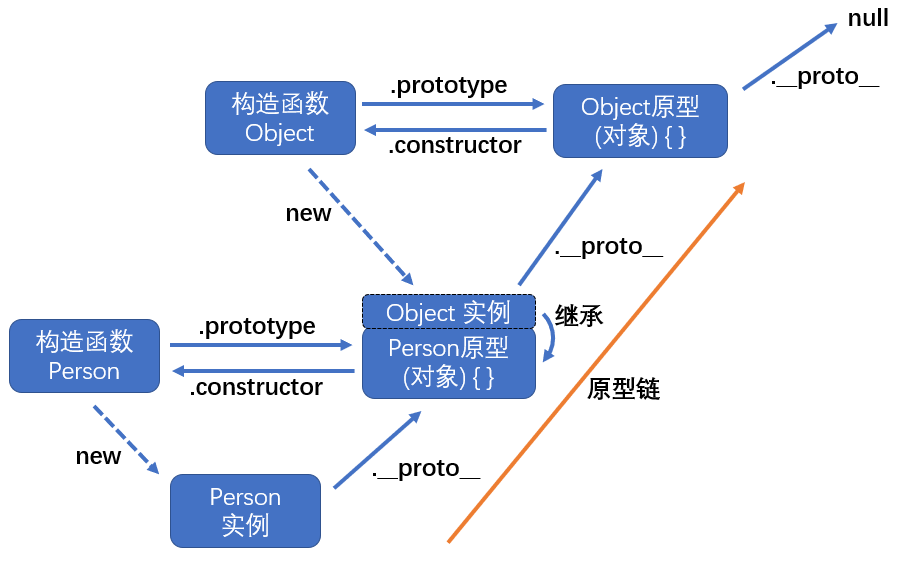
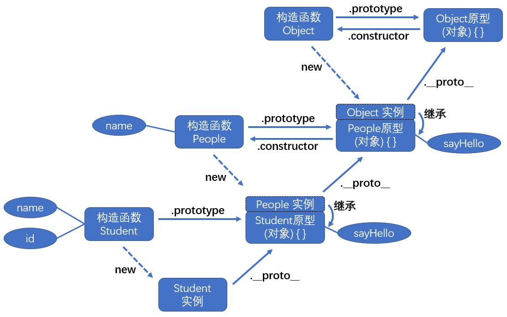
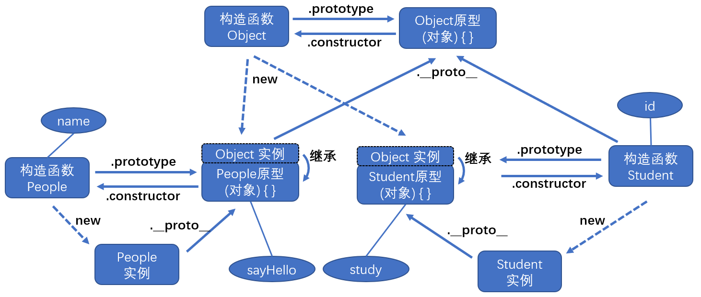
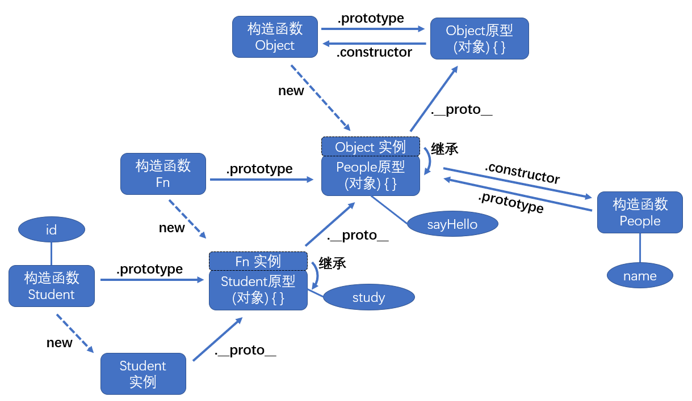
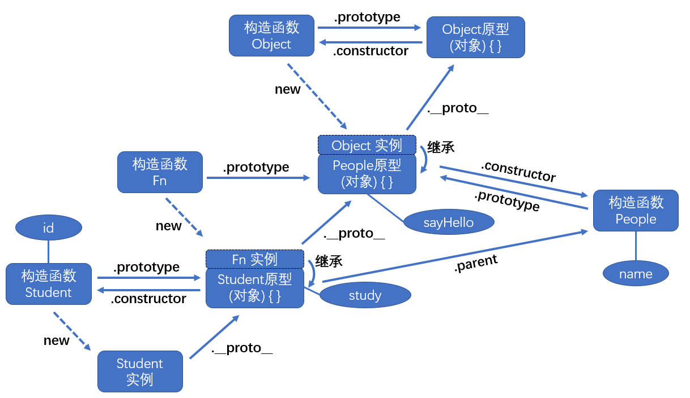

# 原型链

-   构造函数中，[给 this 设置的属性] 是各个实例自己的属性
-   [构造函数的原型的属性] 是所有实例共享的属性



-   实例的原型对象 (`__proto__`)，就是其构造函数的原型 (`prototype`)
-   `Object.protptype` 是最顶层的原型(对象)，其原型对象为 `null`
-   只有 `Object.protptype` 没有原型对象（为 `null`）；除此之外的对象，都能通过 `__proto__` 找到其原型对象

## 构造函数

-   引用类型：有内置的构造函数：`Object()`、`Array()`、`Function()`、`RegExp()`、`Date()`...

-   基本类型：① 有内置的包装类：`Number()`、`String()`、`Boolean()`；② 无包装类：`null`、`undefined`

-   一般情况下，构造函数的原型，是 `Object` 的实例

    即：构造函数的原型的原型对象，是 `Object.prototype`

## 原型链查找逻辑

访问实例的属性时，先查看该实例自己的属性；若没有，则查看其原型对象的属性；若还是没有，则查看其原型对象的原型对象的属性；以此类推... 直至找到 `Object.prototype`

-   所以，所有对象都能使用 `Object.prototype` 的属性 ，eg：`toString()`

    如果我们给 `Object.prototype` 添加属性，则所有的实例对象都能使用该属性

-   如果我们给实例重写了一些的同名属性，会覆盖其原型对象的属性，eg：`Number(1).toString() = 1`

> #### 检测数据类型

使用 `Object.prototype.toString.call()`，可以判断数据类型

```js
Object.prototype.toString(); // "[object Object]"
Object.prototype.toString.call({}); // "[object Object]"
Object.prototype.toString.call(function () {}); // "[object Function]"
Object.prototype.toString.call([]); // "[object Array]"

Object.prototype.toString.call(123); // "[object Number]"
Object.prototype.toString.call('123'); // "[object String]"
Object.prototype.toString.call(true); // "[object Boolean]"
Object.prototype.toString.call(undefined); // "[object Undefined]"
Object.prototype.toString.call(null); // "[object Null]"
```

必须通过 `Object.prototype` 调用 `toString()`，因为子类可能重写了该方法（eg：`Number(1).toString() = 1`)

> #### 封装一个函数来检测数据类型：

```js
function type(data) {
    let toStr = Object.prototype.toString;

    let obj = {
        '[object Array]': 'Array',
        '[object Object]': 'Object',
        '[object RegExp]': 'RegExp',
        '[object Number]': 'Number',
        '[object String]': 'String',
        '[object Boolean]': 'Boolean',
        '[object Undefined]': 'Undefined',
        '[object Null]': 'Null',
    };

    return obj[toStr.call(data)];
}
```

# 继承

## 原型链继承

思路：因为实例可以获取原型链上的数据，这样我们可以把父类的实例作为子类的构造函数的原型

```js
function People(name) {
    this.name = name; // 设置 People 的实例自己的属性
}

// 给构造函数 People 的原型添加方法
// 构造函数 People 创建的所有实例都可调用
People.prototype.sayHello = function () {
    console.log('名字：' + this.name);
};

function Student(name, id) {
    this.name = name; // 给 Student 的实例添加自己的属性
    this.id = id;
}

// 继承：Student 的原型 = People 的实例
Student.prototype = new People('大明'); // 创建父类的实例，造成父类实例的属性数据冗余

// 给构造函数 Student 的原型添加方法，Student 创建的所有实例都可调用
// 同时也是实例 '大明' 自己的方法，会优先被调用
Student.prototype.sayHello = function () {
    console.log('姓名：' + this.name, '学号：' + this.id);
};

let Hong = new Student('小红', 1001); // 创建子类的实例

Hong.sayHello(); // 姓名：小红 学号：1001

console.log(Hong.__proto__); // People {name: "大明", sayHello: ƒ} -- 得到 People 的实例 '大明'
Hong.__proto__.sayHello(); // 姓名：大明 学号：undefined -- 调用 '大明' 自己的方法

console.log(Hong.__proto__.__proto__); // {sayHello: ƒ, constructor: ƒ} -- 得到 People 的原型
Hong.__proto__.__proto__.sayHello(); // 名字：undefined -- 调用 People 的原型的方法
```



> #### 引用值共享问题：

-   如果父类实例的属性值为引用类型数据：会有 "引用值共享问题"

```js
function People() {
    this.name = ['superman']; // 实例的属性值是数组
}

function Student() {}

Student.prototype = new People(); // 原型链继承

let Hong = new Student();
let Ming = new Student();

console.log(Hong.name); // ['superman']
console.log(Ming.name); // ['superman']

// 修改原型对象上的属性值
Hong.name.push('hong');
Ming.name.push('ming');

console.log(Hong.name); // ['superman', 'hong', 'ming']
console.log(Ming.name); // ['superman', 'hong', 'ming']
console.log(Object.getPrototypeOf(Ming).name); // ['superman', 'hong', 'ming']
```

## 构造函数继承

思路：复制父类实例的属性给子类实例，解决原型链继承中的 "引用值共享问题"

-   属性(方法)都在父类的构造函数中定义，**只能继承父类实例的属性(方法)**
    继承不涉及父类的原型链，不能继承父类的原型链上的属性
-   在子类里面调用父类的构造函数，需要修改父类构造函数的 `this` 指向子类实例
    否则父类构造函数默认指向 `window`

```js
function People(name) {
    this.name = name;
}

People.prototype.sayHello = function () {
    console.log('你好我是' + this.name);
};

function Student(name, id) {
    // 构造函数继承：调用父类函数
    // 注意：这里要使用 call 绑定 this 指向!!!
    People.call(this, name);
    this.id = id;
}

Student.prototype.study = function () {
    console.log('好好学习，天天向上');
};

let hong = new Student('小红', 1001);
console.log(hong.name, hong.id); // 小红 1001
hong.study(); // 好好学习，天天向上
// hong.sayHello() // 会报错，因为无法访问父类原型上的数据
```



## 组合继承 (伪经典继承)

思路：**原型链继承**和**构造函数继承**组合在一起：
通过构造函数继承，继承父类的属性，并解决 "引用值共享问题"
通过原型链继承，继承父类的原型链的属性

-   但是，这会使父类构造函数被执行了两次，影响性能

```js
function People(name) {
    this.name = name;
    this.arr = [1, 2, 3, 4];
}

People.prototype.sayHello = function () {
    console.log('People 名字：' + this.name);
};

function Student(name, id) {
    People.call(this, name); // 构造函数继承：执行父类的构造函数
    this.id = id;
}

// 原型链继承：执行父类的构造函数
Student.prototype = new People('大明');

Student.prototype.showName = function () {
    console.log('Student 名字：' + this.name);
};

let hong = new Student('小红', 1);
let ming = new Student('小明', 2);

// 可以获取原型链上的数据
hong.showName(); // Student 名字：小红
hong.sayHello(); // People 名字：小红

// 解决了 "引用值共享问题"
hong.arr.push(5);
console.log(hong.arr); // [1, 2, 3, 4, 5]
console.log(ming.arr); // [1, 2, 3, 4]
```

## 寄生组合继承 (经典继承)

思路：定义一个空的构造函数，将其插入到原型链中，再对其做原型链继承
但是这样会破坏掉原来的原型链结构，导致原型链的属性丢失

```js
function People(name) {
    this.name = name;
}

People.prototype.sayHello = function () {
    console.log('你好我是' + this.name);
};

function Student(name, id) {
    People.call(this, name); // 构造函数继承
    this.id = id;
}

/* 核心语句 */
function Fn() {} // 定义空的构造函数，没有任何属性
Fn.prototype = People.prototype; // 插入到父类的原型链中
Student.prototype = new Fn(); // 原型链继承
/* 核心语句 */

Student.prototype.study = function () {
    console.log('好好学习，天天向上');
};

let hong = new Student('小红', 1001);
hong.sayHello(); // 你好我是小红
```



> #### `Object.create()`

上例的核心语句块，可以用 `子类的原型 = Object.create(父类的原型)` 代劳，等效

```js
Student.prototype = Object.create(People.prototype);
```

若浏览器不支持 `Object.create()`，可以这样处理：

```js
Object.create =
    Object.create ||
    function (proto) {
        var newObj = function () {};
        newObj.prototype = proto;
        return new newObj();
    };
```

## 圣杯模式

-   思路：修补好被破坏的原型链，并将 `寄生组合继承` 封装成函数

```js
function People(name = 'superman') {
    this.name = name;
}

// 构造函数继承属性
function Student(name, id = 1) {
    People.call(this, name);
    this.id = id;
}

// 圣杯模式继承方法
function inherit(People, Student) {
    Student.prototype = Object.create(People.prototype); // 寄生组合继承
    Student.prototype.constructor = Student; // 修补原型链
    Student.prototype.parent = People; // 添加'父类'属性
}

inherit(People, Student);

let stu1 = new Student();
console.log(stu1); // Student {name: "superman", id: 1}
```


