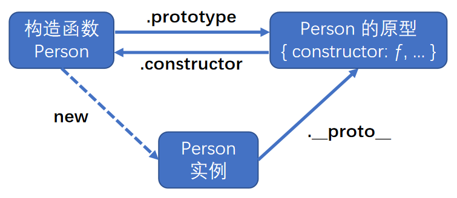
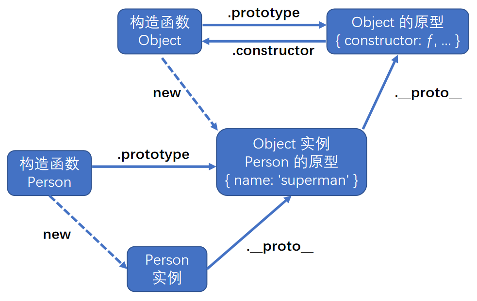

# 原型 `prototype`

-   原型 `prototype` 是**函数**的一个属性，属性值是一个对象。
-   原型 `prototype` 又有一个属性 `constructor`，属性值是函数本身。
-   箭头函数没有原型 `prototype`。


```js
function Person() {}
console.dir(Person); // ƒ Person() { prototype: { constructor: ƒ } }
console.log(Person.prototype.constructor); // ƒ Person() { prototype: { constructor: ƒ } }
console.log(Person.prototype.constructor === Person); // true
```

<br><br>

# 隐式原型 `__proto__`

-   隐式原型 `__proto__` 是实例的一个属性，属性值为其构造函数的原型 `prototype`。



```js
function Person() {}
const person = new Person();

console.dir(person); // Person {}
console.log(person.__proto__); // { constructor: ƒ }
console.log(person.__proto__ === Person.prototype); // true
console.log(person.__proto__.constructor); // ƒ Person() {}
```

不推荐实例直接访问其隐式原型 `__proto__`，ES6 中有专门供实例访问其隐式原型的方法：**`Object.getPrototypeOf(实例对象)`**。

```js
console.log(person.__proto__ === Object.getPrototypeOf(person)); // true
```

<br>

更新实例的隐式原型的方法：`Object.setPrototypeOf(obj, XXX)`；<br>
`obj` - 要更新其隐式原型的实例、 `XXX` - 该实例的新隐式原型，只能为 `对象` / `null`，否则报错。

<br><br>

# (隐式)原型与实例

我们可以把每个实例都有的属性 / 方法，设置在其隐式原型 `__proto__` 身上，即其构造函数的原型 `prototype` 身上。

实例可以直接获取其隐式原型 `__proto__` 身上的属性 / 方法。

```js
function Person(id) {
    this.id = id; // 设置实例自己的属性
}

// 给构造函数 Person 的原型 prototype 添加属性 / 方法
// 构造函数 Person 创建的所有实例都可以访问其属性 / 方法
Person.prototype.name = 'superman';
Person.prototype.showName = function () {
    console.log('i am ' + this.name);
};

const person = new Person(1); // 创建实例 person

console.log(person.id); // 1 - 访问实例自己的属性
console.log(person.name); // superman -- 访问实例的隐式原型 __proto__ 的属性
person.showName(); // i am superman -- 调用实例的隐式原型 __proto__ 的方法
```

<br>

**原型链查找逻辑：**

1. 当我们访问实例的属性时，会先查找实例本身的属性，若有该属性，则直接使用；
2. 若无该属性，则查找其隐式原型 `__proto__` 的属性，若有，则使用该属性值；
3. 若无该属性，再查找其隐式原型的隐式原型... 以此类推 ...

```js
function Person(id) {
    this.id = id; // 设置实例自己的属性
}

// 重写构造函数 Person 的原型 prototype
Person.prototype = { name: 'superman' };

const person = new Person(1); // 创建实例 person

console.log(person.id); // 1 - 访问实例自己的属性
console.log(person.name); // superman - 访问实例的隐式原型 __proto__ 的属性
console.log(person.constructor); // ƒ Object() { [native code] } - 访问实例的隐式原型的隐式原型的属性
```



<br><br>

# 创建对象的模式

## 工厂模式

直接调用函数创建实例。

-   优点：工厂模式解决了多个相似对象的创建问题。
-   缺点：无法准确识别对象、重复数据冗余。

```js
function createPerson(name, age, family) {
    const o = new Object();
    o.name = name;
    o.age = age;
    o.family = family;
    return o;
}

const person1 = createPerson('lisa', 21, ['linda', 'lier', 'jerry']);
const person2 = createPerson('jerry', 18, ['linda', 'lier', 'lisa']);

// instanceof 无法判断它是谁的实例，只能判断出它是对象
console.log(person1 instanceof createPerson); // false
console.log(person1 instanceof Object); // true
```

<br>

## 构造函数模式

通过 `new` 关键字，调用构造函数创建实例。

-   改进：可以通过 `instanceof` 看出对象是 Person 的实例，解决了对象识别的问题。
-   仍存在的缺点：相同的属性 / 方法仍会保存在每个实例中，仍存在数据冗余的问题。

```js
function Person(name, age, family) {
    this.name = name;
    this.age = age;
    this.family = family;
}

const person1 = new Person('lisa', 21, ['linda', 'lier', 'jerry']);
const person2 = new Person('jerry', 18, ['linda', 'lier', 'lisa']);

console.log(person1 instanceof Object); // true
console.log(person1 instanceof Person); // true

console.log(person2 instanceof Object); // true
console.log(person2 instanceof Person); // true

console.log(person1.constructor); // 等价于 person1.__proto__.constructor
```

<br>

## 原型模式

将实例的 [方法] & [共享的属性] 设置在其隐式原型中，这样就不必在构造函数中重复定义了。

```js
function Person() {}

// 给构造函数 Person 的原型添加属性
Person.prototype.name = 'lisi';
Person.prototype.age = 21;
Person.prototype.family = ['lida', 'lier', 'wangwu'];

const person1 = new Person(); // 创建实例 person1

console.log(person1); // Person {}
console.log(person1.name); // lisi → 获取隐式原型的属性

const person2 = new Person(); // 创建实例 person2

// 给实例添加属性，会被优先获取
person2.name = 'wangwu';
person2.family = ['lida', 'lier', 'lisi'];

console.log(person2); // Person {name: "wangwu", family: Array[3]}
console.log(person2.name); // wangwu → 获取实例的属性
console.log(person2.__proto__.name); // lisi → 获取隐式原型的属性
```

<br>

## 混合模式

混合模式 = 构造函数模式 + 原型模式

-   通过**构造函数模式**定义实例属性。
-   通过**原型模式**定义 [方法] & [共享的属性]。

```js
function Person(name, age, family) {
    this.name = name; // 给实例自己添加属性
    this.age = age;
    this.family = family;
}

Person.prototype = {
    constructor: Person,
    type: 'person', // 给 Person 的原型添加属性
    say: function () {
        console.log(this.type, this.name, this.age, this.family);
    },
};

const person1 = new Person('super', 19, ['1', '2', '3']);
person1.say(); // person super 19 ["1", "2", "3"]

const person2 = new Person('man', 21, ['3', '2', '1']);
person2.say(); // person man 21 ["3", "2", "1"]
```

<br>
