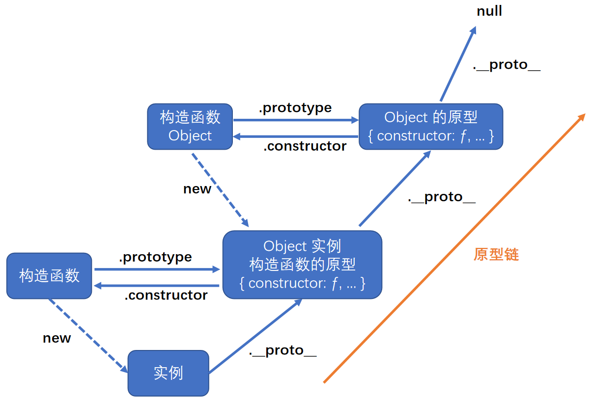
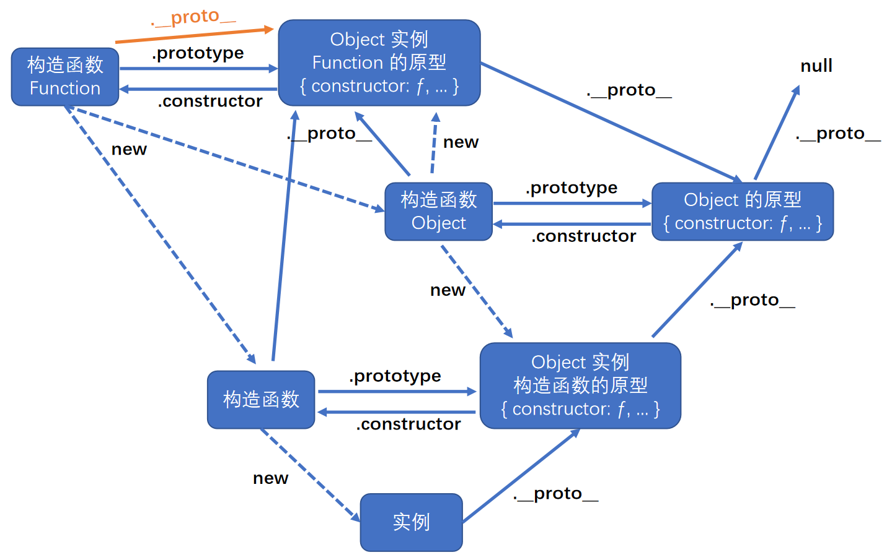
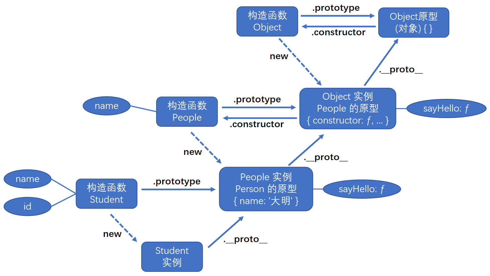
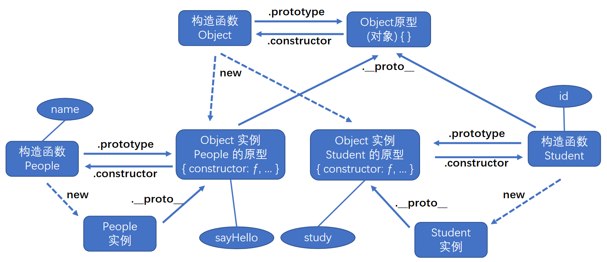
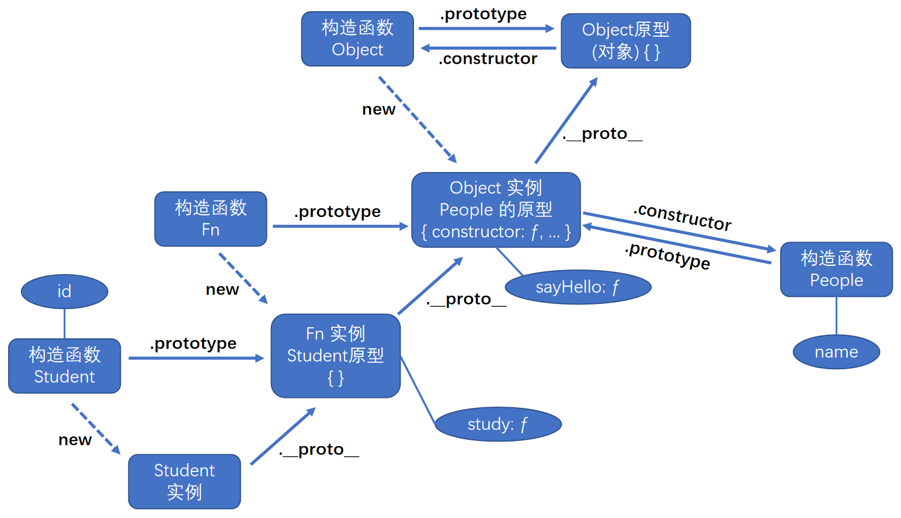
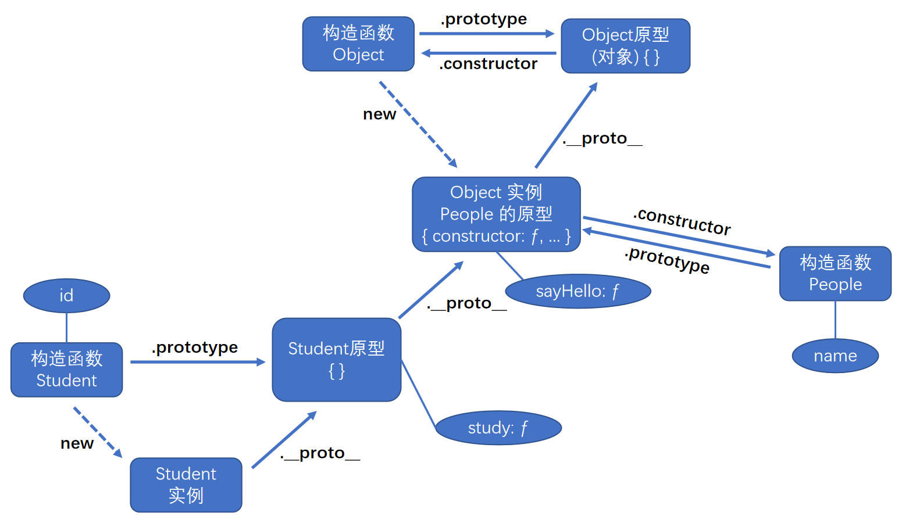
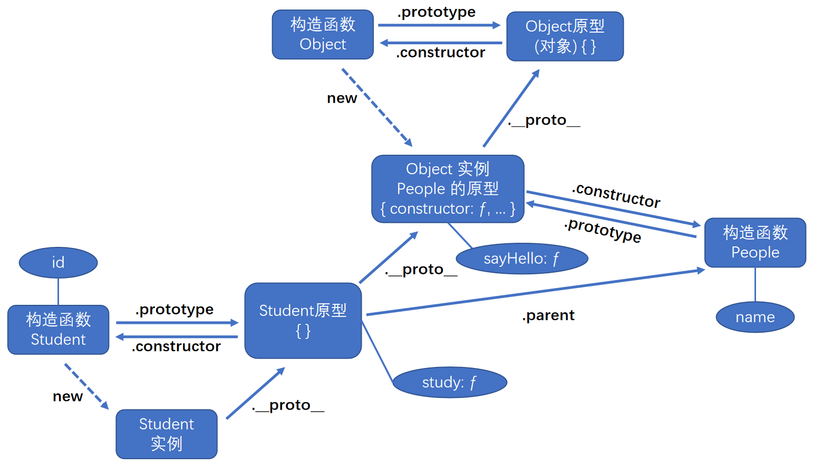

# 原型链



可以发现：

-   `Object.protptype` 是最顶层的隐式原型，其隐式原型为 `null`。
-   在 JS 中，Object 是其他构造函数的父类，就是说 其他构造函数的原型为 Object 的实例。<br>
    因为 `Object` 是其他构造函数的父类，所以其他构造函数的实例都可以访问 `Object.prototype` 身上的属性/方法：<br>
    ① `hasOwnProperty("propertyName")`：用于判断当前实例上是否存在给定的属性。<br>
    ② `isPrototypeof(object)`：用于判断当前对象是否为另一个对象的原型。<br>
    ③ `propertyIsEnumerable("propertyName")`：用于判断给定的属性是否可以使用 `for-in` 语句枚举。<br>
    ④ `toString()`：返回对象的字符串表示。<br>
    ⑤ `valueOf()`：返回对象对应的字符串、数值或布尔值表示。通常与 `toString()` 的返回值相同。

```js
console.log([10, 10].toLocaleString()); // 10,10
console.log([10, 10].toString()); // 10,10
console.log([10, 10].valueOf()); // [ 10, 10 ]
```

<br>

因为构造函数是 Function 创建出来的实例，所以完整的原型链图：



可以发现 Function 非常特别，它具有隐式原型 `__proto__`，并且它的隐式原型 `__proto__` === 它的原型 `prototype`。

<br><br>

# 实例属性的查找逻辑

访问实例的属性时，先查看该实例自己的属性；若没有，则查看其原型对象的属性；若还是没有，则查看其原型对象的原型对象的属性；以此类推... 直至找到 `Object.prototype` 为止。

-   如果我们给 `Object.prototype` 添加属性，则所有的实例对象都能使用该属性。<br>
    eg：`new Object().toString() === '[object Object]'`

-   如果我们给实例重写了一些的同名属性，会覆盖其原型对象的属性。<br>
    eg：`new Number().toString() === '0'`

可以发现，只要我们更新原型链上的某一节点，就会影响该节点以下的所有实例。

<br>

**查看数据类型**：可以使用 `Object.prototype.toString.call(XX)`。

```js
Object.prototype.toString(); // "[object Object]"
Object.prototype.toString.call({}); // "[object Object]"
Object.prototype.toString.call(function () {}); // "[object Function]"
Object.prototype.toString.call([]); // "[object Array]"

Object.prototype.toString.call(123); // "[object Number]"
Object.prototype.toString.call('123'); // "[object String]"
Object.prototype.toString.call(true); // "[object Boolean]"
Object.prototype.toString.call(undefined); // "[object Undefined]"
Object.prototype.toString.call(null); // "[object Null]"
```

必须通过 `Object.prototype` 调用 `toString()`，因为子类可能重写了该方法。

<br><br>

# 继承

## 原型链继承

思路：因为实例可以获取原型链上的数据，这样我们可以把父类的实例作为子类的构造函数的原型

```js
function People(name) {
    this.name = name; // 设置 People 的实例自己的属性
}

// 给构造函数 People 的原型添加方法, People 创建的所有实例都可调用
People.prototype.sayHello = function () {
    console.log('名字：' + this.name);
};

function Student(name, id) {
    this.name = name; // 给 Student 的实例添加自己的属性
    this.id = id;
}

// 继承：Student 的原型 = People 的实例
Student.prototype = new People('大明'); // 创建父类的实例, 造成父类实例的属性数据冗余

// 给构造函数 Student 的原型添加方法, Student 创建的所有实例都可调用
// 同时也是实例 '大明' 自己的方法, 会优先被调用
Student.prototype.sayHello = function () {
    console.log('姓名：' + this.name, '学号：' + this.id);
};

const Hong = new Student('小红', 1001); // 创建子类的实例

Hong.sayHello(); // 姓名：小红 学号：1001

console.log(Hong.__proto__); // People {name: "大明", sayHello: ƒ} -- 得到 People 的实例 '大明'
Hong.__proto__.sayHello(); // 姓名：大明 学号：undefined -- 调用 '大明' 自己的方法

console.log(Hong.__proto__.__proto__); // {sayHello: ƒ, constructor: ƒ} -- 得到 People 的原型
Hong.__proto__.__proto__.sayHello(); // 名字：undefined -- 调用 People 的原型的方法
```



<br>

如果父类实例的属性值为引用类型数据，会有 "引用值共享问题"：

```js
function People() {
    this.name = ['superman']; // 实例的属性值是数组
}

function Student() {}

Student.prototype = new People(); // 原型链继承

const Hong = new Student();
const Ming = new Student();

console.log(Hong.name); // ['superman']
console.log(Ming.name); // ['superman']

// 修改原型对象上的属性值
Hong.name.push('hong');
Ming.name.push('ming');

console.log(Hong.name); // ['superman', 'hong', 'ming']
console.log(Ming.name); // ['superman', 'hong', 'ming']
console.log(Object.getPrototypeOf(Ming).name); // ['superman', 'hong', 'ming']
```

<br><br>

## 构造函数继承

思路：复制父类实例的属性给子类实例，解决原型链继承中的 "引用值共享问题"。

-   属性(方法)都在父类的构造函数中定义，**只能继承父类实例的属性(方法)**。<br>
    继承不涉及父类的原型链，不能继承父类的原型链上的属性。
-   在子类里面调用父类的构造函数，需要修改父类构造函数的 `this` 指向子类实例。<br>
    否则父类构造函数默认指向 `window`。

```js
function People(name) {
    this.name = name;
}

People.prototype.sayHello = function () {
    console.log('你好我是' + this.name);
};

function Student(name, id) {
    // 构造函数继承: 调用父类函数
    // 注意: 这里要使用 call 绑定 this 指向 !!!
    People.call(this, name);
    this.id = id;
}

Student.prototype.study = function () {
    console.log('好好学习，天天向上');
};

const hong = new Student('小红', 1001);
console.log(hong.name, hong.id); // 小红 1001
hong.study(); // 好好学习，天天向上
// hong.sayHello() // 会报错, 因为无法访问父类原型上的数据
```



<br>

## 组合继承 (伪经典继承)

思路：**原型链继承**和**构造函数继承**组合在一起：<br>
通过构造函数继承，继承父类的属性，并解决 "引用值共享问题"。<br>
通过原型链继承，继承父类的原型链的属性。

但是，这会使父类构造函数被执行了两次，影响性能。

```js
function People(name) {
    this.name = name;
    this.arr = [1, 2, 3, 4];
}

People.prototype.sayHello = function () {
    console.log('People 名字：' + this.name);
};

function Student(name, id) {
    People.call(this, name); // 构造函数继承: 执行父类的构造函数
    this.id = id;
}

// 原型链继承: 执行父类的构造函数
Student.prototype = new People('大明');

Student.prototype.showName = function () {
    console.log('Student 名字：' + this.name);
};

const hong = new Student('小红', 1);
const ming = new Student('小明', 2);

// 可以获取原型链上的数据
hong.showName(); // Student 名字：小红
hong.sayHello(); // People 名字：小红

// 解决了 "引用值共享问题"
hong.arr.push(5);
console.log(hong.arr); // [1, 2, 3, 4, 5]
console.log(ming.arr); // [1, 2, 3, 4]
```

<br>

## 寄生组合继承 (经典继承)

思路：定义一个空的构造函数，将其插入到原型链中，再对其做原型链继承。

但是这样会破坏掉原来的原型链结构，导致原型链的属性丢失。

```js
function People(name) {
    this.name = name;
}

People.prototype.sayHello = function () {
    console.log('你好我是' + this.name);
};

function Student(name, id) {
    People.call(this, name); // 构造函数继承
    this.id = id;
}

/* 核心语句 */
function Fn() {} // 定义空的构造函数，没有任何属性
Fn.prototype = People.prototype; // 插入到父类的原型链中
Student.prototype = new Fn(); // 原型链继承

Student.prototype.study = function () {
    console.log('好好学习，天天向上');
};

const hong = new Student('小红', 1001);
hong.sayHello(); // 你好我是小红
```



<br>

上例的核心语句块，可以用 `Student.prototype = Object.create(People.prototype)` 代劳，等效于：



`Object.create(XXX)` 会创建一个以 `XXX` 为隐式原型的实例；`XXX` 只能为 `对象` / `null`，否则报错。

<br>

## 圣杯模式

思路：修补好被破坏的原型链，并将 `寄生组合继承` 封装成函数。

```js
function People(name = 'superman') {
    this.name = name;
}

// 构造函数继承属性
function Student(name, id = 1) {
    People.call(this, name);
    this.id = id;
}

// 圣杯模式继承方法
function inherit(People, Student) {
    Student.prototype = Object.create(People.prototype); // 寄生组合继承
    Student.prototype.constructor = Student; // 修补原型链
    Student.prototype.parent = People; // 添加'父类'属性
}

inherit(People, Student);

const stu1 = new Student();
console.log(stu1); // Student {name: "superman", id: 1}
```



<br>

上例的 `inherit` 方法还能这样实现：

```js
function inherit(People, Student) {
    Object.setPrototypeOf(Student.prototype, People.prototype);
    Student.prototype.parent = People;
}
```

<br>
