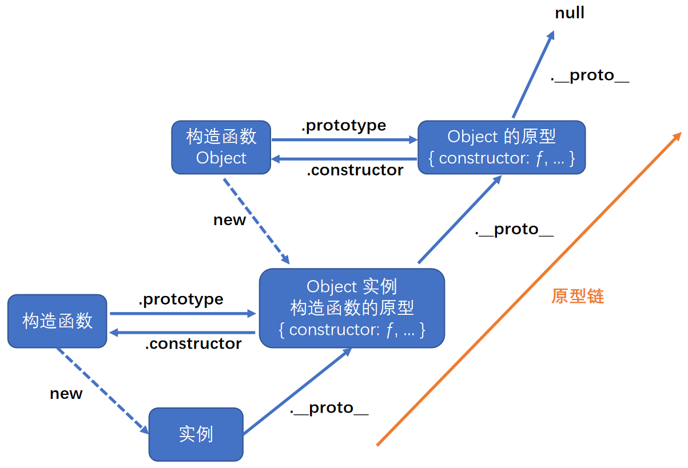
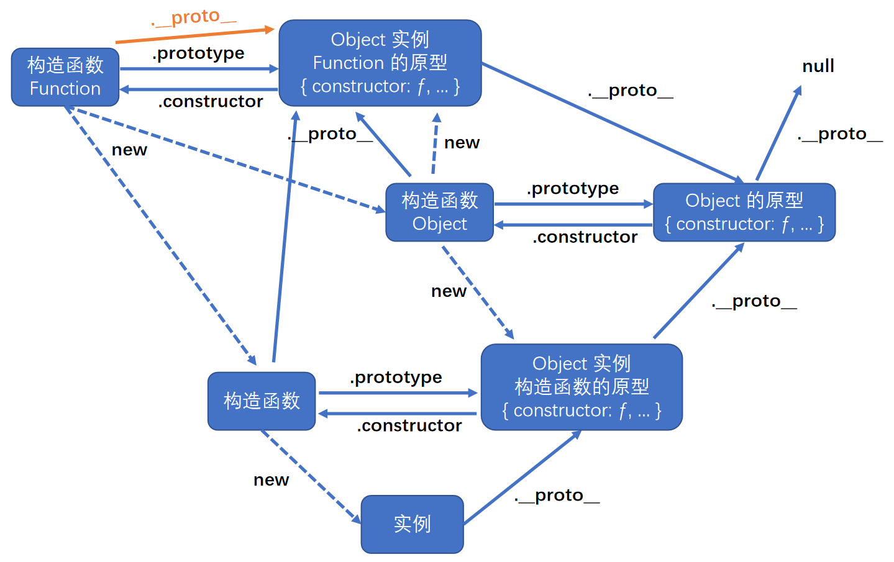

# 原型 `prototype`

-   原型 `prototype` 是**函数**的一个属性, 属性值是一个对象.
-   原型 `prototype` 又有一个属性 `constructor`, 属性值是函数本身.
-   箭头函数没有原型 `prototype`.


```js
function Person() {}
console.log(Person); // ƒ Person() {}
console.log(Person.prototype); // { constructor: ƒ }
console.log(Person.prototype.constructor === Person); // true
```

<br><br>

# 隐式原型 `__proto__`

-   隐式原型 `__proto__` 是实例的一个属性, 属性值为其构造函数的原型 `prototype`.


```js
function Person() {}
const person = new Person();
console.log(person.__proto__ === Person.prototype); // true
```

<br>

不推荐使用 `__proto__` 访问实例的隐式原型, 推荐使用 **`Object.getPrototypeOf(实例)`** 访问.

```js
console.log(person.__proto__ === Object.getPrototypeOf(person)); // true
```

<br>

可使用 `Object.setPrototypeOf(obj, XXX)` 更新实例的隐式原型.
`obj` - 要更新其隐式原型的实例, `XXX` - 该实例的新隐式原型, 只能为 `对象` / `null`, 否则报错.

```js
function Person() {}
const person = new Person();

console.log(Object.getPrototypeOf(person)); // { constructor: ƒ }
console.log(Person.prototype); // { constructor: ƒ }

Object.setPrototypeOf(person, null); // 更新实例的隐式原型

console.log(Object.getPrototypeOf(person)); // null
console.log(Person.prototype); // { constructor: ƒ }
```

可以发现, Object.setPrototypeOf 只是更新了实例的隐式原型, 而没有更新其构造函数的原型.

<br><br>

# (隐式)原型与实例

实例可以直接获取其隐式原型 `__proto__` 身上的属性 / 方法. 所以, 我们可以把每个实例都需要的属性 / 方法, 设置在其隐式原型 `__proto__` 身上, 即其构造函数的原型 `prototype` 身上.

```js
function Person(id) {
    this.id = id; // 设置实例自己的属性
}

// 给构造函数 Person 的原型 prototype 添加属性 / 方法
Person.prototype.name = "superman";
Person.prototype.showName = function () {
    console.log("i am " + this.name);
};

const person = new Person(1); // 创建实例 person

console.log(person.id); // 1 - 访问实例自己的属性
console.log(person.name); // superman -- 访问实例的隐式原型 __proto__ 身上的属性
person.showName(); // i am superman -- 调用实例的隐式原型 __proto__ 身上的方法
```

<br>

## 原型链查找逻辑

访问实例的属性时, 先查看该实例自己的属性; 若没有, 则查看该实例的隐式原型的属性; 若还是没有, 则查看该实例的隐式原型的隐式原型的属性... 以此类推... 直至找到 `Object.prototype`.

```js
function Person(id) {
    this.id = id; // 设置实例自己的属性
}

// 重写构造函数 Person 的原型 prototype
Person.prototype = { name: "superman" };

const person = new Person(1); // 创建实例 person

console.log(person.id); // 1 - 访问实例自己的属性
console.log(person.name); // superman - 访问实例的隐式原型 __proto__ 的属性
console.log(person.constructor); // ƒ Object() { [native code] } - 访问实例的隐式原型的隐式原型的属性
```


<br>

-   如果我们给 `Object.prototype` 添加属性, 则所有的实例对象都能使用该属性. <br>
    eg: `new Object().toString() === '[object Object]'`

-   如果我们给实例重写了一些的同名属性, 会覆盖其原型对象的属性. <br>
    eg: `new Number().toString() === '0'`

-   可以发现, 只要我们更新原型链上的某一节点, 就会影响该节点以下的所有实例.

**查看数据类型**: 可以使用 `Object.prototype.toString.call(XX)`.

```js
Object.prototype.toString(); // "[object Object]"
Object.prototype.toString.call({}); // "[object Object]"
Object.prototype.toString.call(function () {}); // "[object Function]"
Object.prototype.toString.call([]); // "[object Array]"

Object.prototype.toString.call(123); // "[object Number]"
Object.prototype.toString.call("123"); // "[object String]"
Object.prototype.toString.call(true); // "[object Boolean]"
Object.prototype.toString.call(undefined); // "[object Undefined]"
Object.prototype.toString.call(null); // "[object Null]"
```

这里必须通过 `Object.prototype` 调用 `toString()`, 因为子类可能重写了该方法.

<br>

## 添加属性的情况

我们分析一下如果 foo 不直接存在于 myObject 中而是存在于原型链上层时 `myObject.foo = "bar"` 会出现的 3 种情况:

1. 如果在 `[[Prototype]]` 链上层存在名为 foo 的普通数据访问属性并且没有被标记为只读（writable: false）, 那就会直接在 myObject 中添加一个名为 foo 的新属性, 它是屏蔽属性.
2. 如果在 `[[Prototype]]` 链上层存在 foo, 但是它被标记为只读（writable: false）, 那么无法修改已有属性或者在 myObject 上创建屏蔽属性. 如果运行在严格模式下, 代码会抛出一个错误. 否则, 这条赋值语句会被忽略.
3. 如果在 `[[Prototype]]` 链上层存在 foo 并且它是一个 setter, 那就一定会调用这个 setter. foo 不会被添加到 myObject, 也不会重新定义 foo 这个 setter.

第 2 种情况可能是最令人意外的, 只读属性会阻止 `[[Prototype]]` 链下层隐式创建同名属性. 这样做主要是为了模拟类属性的继承. 这看起来有点奇怪, myObject 对象竟然会因为其他对象中有一个只读 foo 就不能包含 foo 属性. 更奇怪的是, 这个限制只存在于 `=` 赋值中, 使用 `Object.defineProperty(..)` 并不会受到影响.

有些情况下会隐式产生屏蔽, 一定要当心. 思考下面的代码:

```js
const anotherObject = { a: 2 };
const myObject = Object.create(anotherObject);

console.log(anotherObject.a); // 2
console.log(myObject.a); // 2

console.log(anotherObject.hasOwnProperty("a")); // true
console.log(myObject.hasOwnProperty("a")); // false

myObject.a++; // 隐式屏蔽！

console.log(anotherObject.a); // 2
console.log(myObject.a); // 3

console.log(myObject.hasOwnProperty("a")); // true
```

尽管 `myObject.a++` 看起来应该查找并增加 `anotherObject.a` 属性, 但是别忘了 `++` 操作相当于 `myObject.a = myObject.a + 1`. 因此 `++` 操作首先会通过 `[[Prototype]]` 查找属性 `a` 并从 `anotherObject.a` 获取当前属性值 `2`, 接着用 `[[Put]]` 将值 `2 + 1` 赋给 `myObject` 中新建的屏蔽属性 `a`, 天呐！

修改委托属性时一定要小心. 如果想让 `anotherObject.a` 的值增加, 唯一的办法是 `anotherObject.a++`.

<br>

## 委托设计模式

当你给开发者设计软件时, 假设要调用 `myObject.cool()`, 如果 `myObject` 中不存在 `cool()` 时这条语句也可以正常工作的话, 那你的 API 设计就会变得很 "神奇", 对于未来维护你软件的开发者来说这可能不太好理解.

但是你可以让你的 API 设计不那么 "神奇", 同时仍然能发挥 `[[Prototype]]` 关联的威力:

```js
const anotherObject = {
    cool: function () {
        console.log("cool!");
    },
};

const myObject = Object.create(anotherObject);

myObject.doCool = function () {
    this.cool(); // 内部委托！
};

myObject.doCool(); // "cool!"
```

这里我们调用的 `myObject.doCool()` 是实际存在于 `myObject` 中的, 这可以让我们的 API 设计更加清晰. 从内部来说, 我们的实现遵循的是委托设计模式, 通过 `[[Prototype]]` 委托到 `anotherObject.cool()`.

<br><br>

# 原型链



可以发现: `Object.prototype` 是最顶层的隐式原型, `Object.prototype` 的隐式原型为 `null`.

<br>

在 ECMAScript 中, Object 默认是其他构造函数的父类, 就是说 其他构造函数的原型为 Object 的实例.

因为 `Object` 是其他构造函数的父类, 所以其他构造函数的实例都可以访问 `Object.prototype` 身上的属性/方法:

1. `obj.hasOwnProperty(property)`: 用于判断当前实例身上是否存在给定的属性.
2. `obj.isPrototypeOf(object)`: 用于检查 `obj` 是否存在于 `object` 的原型链中.
3. `obj.propertyIsEnumerable(property)`: 用于判断给定的属性是否直接存在于对象中, 且可枚举.
4. `obj.toString()`: 返回对象的字符串表示.
5. `obj.valueOf()`: 返回对象对应的字符串,数值或布尔值表示. 通常与 toString 的返回值相同.

-   `property` 必需是字符串/符号.

```js
console.log([10, 10].toLocaleString()); // 10,10
console.log([10, 10].toString()); // 10,10
console.log([10, 10].valueOf()); // [ 10, 10 ]
```

有的对象可能没有连接到 Object.prototype（通过 `Object.create(null)` 来创建）. 在这种情况下, 形如 `obj.hasOwnProperty(property)` 就会失败. 这时可以使用一种更加强硬的方法来进行判断: `Object.prototype.hasOwnProperty.call(obj, property)`, 它借用基础的 hasOwnProperty 方法并把它显式绑定到 obj 上.

注意: 严格来讲, ECMA-262 中对象的行为不一定适合 JS 中的其他对象. 比如浏览器环境中的 BOM 和 DOM 对象, 都是由宿主环境定义和提供的宿主对象. 而宿主对象不受 ECMA-262 约束, 所以它们可能不会继承 Object.

<br>

因为构造函数是 Function 创建出来的实例, 所以完整的原型链图:



可以发现 Function 非常特别, 它具有隐式原型 `__proto__`, 并且它的隐式原型 `__proto__` === 它的原型 `prototype`.

<br>
