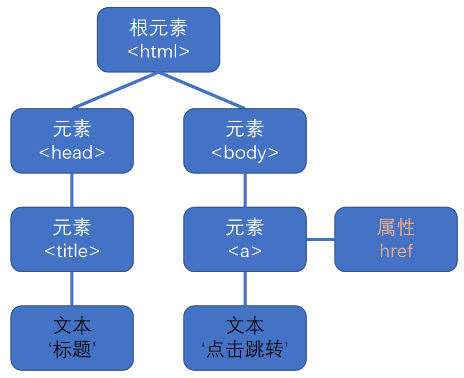

# DOM 简介

-   DOM（Document Object Model，文档对象模型）提供和页面相关的 API。
-   DOM 将整个页面抽象为一组分层节点：



<br><br>

# DOM 节点

## 常用的 DOM 节点

不同的节点有不同的 `nodeType` 值：

-   元素节点 → 1
-   属性节点 → 2
-   文本节点 → 3
-   注释节点 → 8
-   文档节点 ( document ) → 9
-   文档片段节点 ( DocumentFragment ) → 11

## DOM 节点的属性

1. **`nodeType`**：节点的类型，用于区分节点（只读 不可改）
2. `nodeName`：元素节点的标签名，为大写字母（只读 不可改）
3. `nodeValue`：文本节点 / 注释节点的内容（可读 可改）（元素节点的 `nodeValue` 为 `null`）
4. `attributes`：元素节点的属性集合（只能修改属性值），返回键值对组成的**类数组**

```html
<ul id="box">
    content
</ul>
<script>
    console.log(box.nodeType); // 1
    console.log(box.nodeName); // UL
    console.log(box.nodeValue); // null
    console.log(box.attributes); // NamedNodeMap {0: id, id: id, length: 1}
</script>
```

# 获取 DOM 元素

## 直接获取

1. **`document`**：获取 document 对象，它表示整个页面
2. **`document.documentElement`**：获取 html 标签
3. **`document.head`**：获取 head 标签
4. **`document.title`**：获取 title 标签
5. **`document.body`**：获取 body 标签

## 通过 get 获取

1. **`document.getElementById()`**：通过 `id` 获取元素
    - 只能通过 `document` 调用
    - 返回指定元素，如果页面上没有匹配的 `id` 则返回 `null`

```html
<div id="su"></div>
<script>
    let ele = document.getElementById('su'); // 传入字符串参数
    console.log(ele); // <div id="su"></div>
</script>
```

注意：**可以直接使用元素节点的 `id`**

```html
<div id="su"></div>
<script>
    console.log(su); // <div id="su"></div>
</script>
```

2. **`document.getElementsByName()`**：通过 `name` 属性获取元素
    - 只能通过 `document` 调用
    - 返回元素组成的**类数组** ( 以下标作为属性名，有 `length` 属性的对象 )

```html
<form action="/">
    <input type="text" name="userName" />
    <input type="text" name="userName" />
</form>
<script>
    let ele = document.getElementsByName('userName');
    console.log(ele); // NodeList(2) [input, input]
</script>
```

-   `name` 和 `id` 不要重名，IE8 及以下的版本，可通过 `id` 获取同名 `name` 的元素

3. **`element.getElementsByClassName()`**：通过 `class` 获取元素
    - 可通过元素调用该方法，实现在该元素内的查找
    - 返回元素组成的类数组

```html
<div class="name">
    <p class="name"></p>
</div>
<script>
    let ele1 = document.getElementsByClassName('name');
    console.log(ele1); // HTMLCollection(2) [div.name, p.name]
    let ele2 = ele1[0].getElementsByClassName('name');
    console.log(ele2); // HTMLCollection [p.name]
</script>
```

4. **`element.getElementsByTagName()`**：通过标签名获取元素
    - 可通过元素调用该方法，实现在该元素内的查找
    - 返回元素组成的类数组

```html
<div class="name1">
    <div class="name2"></div>
</div>
<script>
    let ele1 = document.getElementsByTagName('div');
    console.log(ele1); // HTMLCollection(2) [div.name1, div.name2]
    let ele2 = ele1[0].getElementsByTagName('div');
    console.log(ele2); // HTMLCollection [div.name2]
</script>
```

## 通过 query 获取

1. **`element.querySelector()`**：获取 **CSS 选择器** 选中的第 1 个元素
    - 可通过元素调用该方法，实现在该元素内的查找
    - 返回指定元素
2. **`element.querySelectorAll()`**：获取 **CSS 选择器** 选中的所有元素
    - 可通过元素调用该方法，实现在该元素内的查找
    - 返回元素组成的类数组

```html
<ul class="box">
    <li class="content"></li>
    <li class="content"></li>
    <li class="content"></li>
</ul>
<script>
    let ele1 = document.querySelector('.box li'); // 传入字符串参数
    console.log(ele1); // <li class="content"></li>
    let ele2 = document.querySelectorAll('.box li');
    console.log(ele2); // NodeList(3) [li.content, li.content, li.content]
</script>
```

## get & query

> ##### get 是动态获取，每次使用时都会重新获取
>
> ##### query 是静态获取，第 1 次获取后，不会再更新

```html
<ul id="box">
    <li id="con1"></li>
    <li id="con2"></li>
    <li id="con3"></li>
</ul>
<script>
    let a = document.getElementById('box');
    console.log(a);
    // <ul id="box">
    //     <li id="con1"></li>
    //     <li id="con2"></li>
    //     <li id="con3"></li>
    // </ul>
    box.removeChild(con2); // 删除 <li id="con2"></li>
    console.log(a);
    // <ul id="box">
    //     <li id="con1"></li>   // 可以看到 a 的值改变了
    //     <li id="con3"></li>
    // </ul>
</script>
```

```html
<ul id="box">
    <li id="con1"></li>
    <li id="con2"></li>
    <li id="con3"></li>
</ul>
<script>
    var a = document.querySelectorAll('#box li');
    console.log(a); // NodeList(3) [li#con1, li#con2, li#con3]
    box.removeChild(con2); // 删除 <li id="con2"></li>
    console.log(a); // NodeList(3) [li#con1, li#con2, li#con3]  // 可以看到 a 的值没有改变
</script>
```
