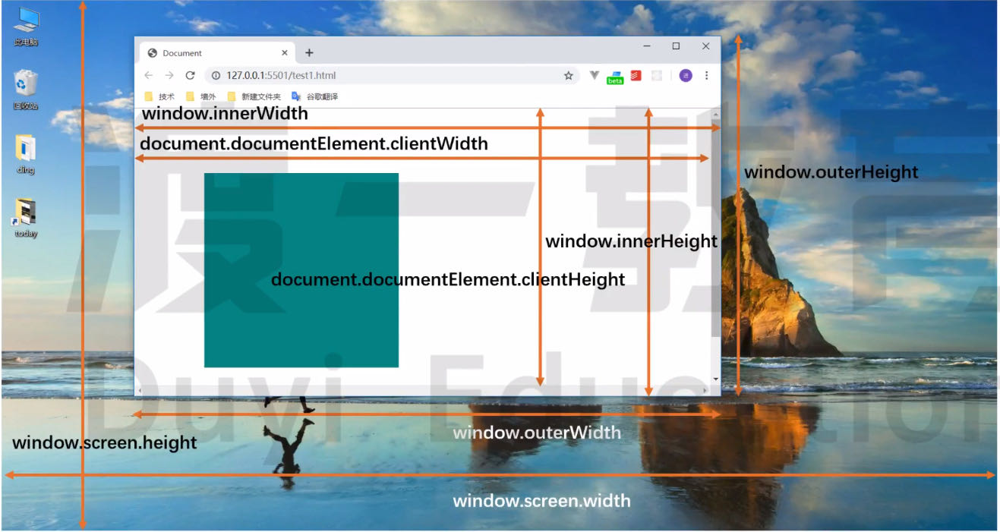

# 元素的滚动

## 获取宽高

当元素实际内容 <= 设置的宽高时：

1.  `el.scrollWidth` → 元素设置的 `width`
2.  `el.scrollHeight` → 元素设置的 `height`

当元素实际内容 > 设置的宽高时：

1.  `el.scrollWidth` → 元素实际内容的 `width`
2.  `el.scrollHeight` → 元素实际内容的 `height`


<br>

## 获取/设置滚动距离

滚动距离：在显示区域上方的距离

1.  `el.scrollTop` [获取] / [设置] 一个元素的内容垂直滚动的像素数
2.  `el.scrollLeft` [获取] / [设置] 一个元素的内容水平滚动的像素数


<br>

demo：

```html
<div id="box">
    Lorem ipsum dolor sit amet consectetur, adipisicing elit. Voluptates ex
    iusto cumque quibusdam rerum esse quo fugit magnam! Enim ab cum eius aliquam
    odit nobis temporibus est tempora dolorum sequi.
</div>
```

```css
#box {
    width: 100px;
    height: 100px;
    background-color: bisque;
    overflow: scroll;
}
```

```js
box.addEventListener('scroll', () => {
    console.log('========================================');
    console.log('scrollHeight', box.scrollHeight);
    console.log('scrollTop', box.scrollTop);
    console.log('height', parseInt(getComputedStyle(box).height));
    console.log(
        '距离元素底部距离',
        box.scrollHeight -
            box.scrollTop -
            parseInt(getComputedStyle(box).height)
    );
});
```

<br>

## 设置元素滚动

`el.scrollIntoView()`：滚动 el 的父容器，使 el 对用户可见

1.  `el.scrollIntoView(boolean)`
2.  `el.scrollIntoView(option)`
    `behavior`：定义动画过渡效果 - `auto`(默认)、 `smooth`
    `block`：定义垂直方向的对齐 - `start`(默认)、 `center`、 `end`、 `nearest`
    `inline`：定义水平方向的对齐 - `start`、 `center`、 `end`、 `nearest`(默认)

```js
el.scrollIntoView(); // 使 [el 的顶端] 与 [其父容器的顶端] 对齐
el.scrollIntoView(false); // [元素的底端] 与 [其所在滚动区域的可视区域的底端] 对齐
```

```javascript
el.scrollIntoView({
    block: 'end',
    behavior: 'smooth',
});
```

<br><br>

# 页面的滚动

## 获取页面宽高

1.  `window.innerWidth`、`window.innerHeight`（包括滚动条，不包括边框）
2.  `window.outerWidth`、`window.outerHeight`（包括滚动条，且包括边框）



<br>

## 获取页面的位置

1. `window.screenLeft`：浏览器窗口到屏幕左边缘的 CSS 像素距离数值
2. `window.screenTop`：浏览器窗口到屏幕上边缘的 CSS 像素距离数值

<br>

## 获取页面滚动距离

1.  `window.scrollX` / `window.pageXOffset`：水平方向上滚动的像素值
2.  `window.scrollY` / `window.pageYOffset`：垂直方向上滚动的像素值

<br>

## 设置页面/元素滚动

页面/元素滚动到指定位置：

1.  `window.scrollTo(x-coord, y-coord)` / `ele.scroll(x-coord, y-coord)`
2.  `window.scrollTo(options)` / `ele.scroll(options)`

```js
window.scrollTo(0, 100);
```

```javascript
window.scrollTo({
    top: 100,
    left: 100,
    behavior: 'smooth',
});
```

<br>

页面/元素滚动指定距离：

1.  `window.scrollBy(x-coord, y-coord)` / `ele.scrollBy(x-coord, y-coord)`
2.  `window.scrollBy(options)` / `ele.scrollBy(options)`

```js
window.scrollBy(0, 100);
```

```javascript
window.scrollBy({
    top: 100,
    left: 0,
    behavior: 'smooth',
});
```

<br><br>

# 滚动样式

## scroll-behavior

用于指定滚动行为：`auto` 表示滚动框立即滚动；`smooth` 表示滚动框平滑滚动。

```css
scroll-behavior: smooth;
```

<br>

## overscroll-behavior

用于控制浏览器过度滚动时的表现。

默认情况下，当触及页面 (或其他可滚动区域) 的顶部或者底部时，移动端浏览器倾向于提供一种 "触底" 效果，甚至进行页面刷新。可以发现，当对话框中含有可滚动内容时，一旦滚动至对话框的边界，对话框下方的页面内容也会开始滚动，这被称为 "滚动链"。

在某些情况下我们不想要这些表现，使用 `overscroll-behavior` 来去除不需要的滚动链，以及应用下拉刷新效果等。

<br>

1.  `auto` 默认值
2.  `contain` 默认的滚动边界行为不变 ("触底"效果或者刷新)，但临近的滚动区域不会被滚动链影响 (比如对话框后方的页面不会滚动)
3.  `none` 临近滚动区域不受到滚动链影响，而且默认的滚动到边界的表现也被阻止

<br>

可以使用两个关键字来指定 `overscroll-behavior` 分别在 x 和 y 轴的值。只用一个值的话，x 和 y 轴都被指定为该值：

```css
overscroll-behavior: auto contain;
```

<br>
